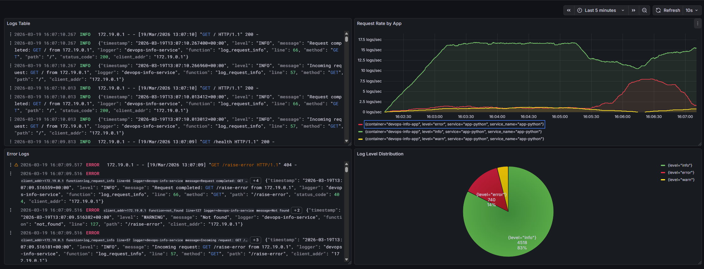

# LAB07 — Observability & Logging with Loki Stack

## Architecture

```
[Flask app :5000] --> [Promtail :9080] --> [Loki :3100]
        |                       |                  |     
        |                       |                  |
        └───────────────────────┴──────────────────┘
                                |
                                v
                    [Grafana 12.3 :3000]
```

---

## Setup Guide

### 1) Install docker
```bash
apt install -y docker-ce docker-ce-cli containerd.io docker-buildx-plugin docker-compose-plugin
```

### 2) Build and up container
```bash
cd monitoring
docker compose up -d
```

### 3) Verify containers
```bash
docker compose ps
```

Expected services:
```
CONTAINER ID   IMAGE                    COMMAND                  CREATED          STATUS                      PORTS                                         NAMES
c63587b27bb4   grafana/grafana:12.3.1   "/run.sh"                56 seconds ago   Up 56 seconds (healthy)   0.0.0.0:3000->3000/tcp, [::]:3000->3000/tcp   grafana
d934ce6907f3   grafana/promtail:3.0.0   "/usr/bin/promtail -…"   56 seconds ago   Up 56 seconds (healthy)   0.0.0.0:9080->9080/tcp, [::]:9080->9080/tcp   promtail
d2c87a5d1bdd   monitoring-app-python    "python -u app.py"       56 seconds ago   Up 56 seconds (healthy)   0.0.0.0:5000->5000/tcp, [::]:5000->5000/tcp   devops-info-app
046ed1c86443   grafana/loki:3.0.0       "/usr/bin/loki -conf…"   56 seconds ago   Up 56 seconds (healthy)   0.0.0.0:3100->3100/tcp, [::]:3100->3100/tcp   loki
```

## Configuration

### Loki (`monitoring/loki/config.yml`)

- **Storage**: filesystem TSDB
- **Schema**: `v13`
- **Retention**: 168 hours (7 days)
- **Compactor**: enabled (every 10 mins)

### Loki (`monitoring/promtail/config.yml`)

- **Docker discovery** `unix:///var/run/docker.sock` (every 5 secs)
- **Relabeling** Gets `container` from `__meta_docker_container_name`, `service` from `__meta_docker_container_label_com_docker_compose_service` and `app` from `__meta_docker_container_label_app`

---

## Application Logging

Class for format logs into json
```py
class JSONFormatter(logging.Formatter):
    def format(self, record):
        log_record = {
            'timestamp': datetime.fromtimestamp(
                record.created, tz=timezone.utc
            ).isoformat(),
            'level': record.levelname,
            'message': record.getMessage(),
            'logger': record.name,
            'function': record.funcName,
            'line': record.lineno
        }

        if hasattr(record, "method"):
            log_record["method"] = record.method
        if hasattr(record, "path"):
            log_record["path"] = record.path
        if hasattr(record, "status_code"):
            log_record["status_code"] = record.status_code
        if hasattr(record, "client_addr"):
            log_record["client_addr"] = record.client_addr
        if hasattr(record, "error"):
            log_record["error"] = record.error

        return json.dumps(log_record)
```

Create logger and configure it
```py
logger = logging.StreamHandler(sys.stdout)
logger.setFormatter(JSONFormatter())
```

Log requests before and after
```py
@app.before_request
def log_request_info():
    logger.info(f"Incoming request: {request.method} {request.path} from {request.remote_addr}", extra={
        "method": request.method,
        "path": request.path,
        "client_addr": request.remote_addr,
    })


@app.after_request
def log_request_info(response):
    logger.info(f"Request completed: {request.method} {request.path} from {request.remote_addr}", extra={
        "method": request.method,
        "path": request.path,
        "client_addr": request.remote_addr,
        "status_code": response.status_code
    })
    return response
```

---

## Dashboard 



### Panels explained (what is shown)

1. **Logs table** (top-left)
   - Shows raw log lines from the app.
   - Query used: `{container="devops-info-app"}`

2. **Request rate by app** (top-right)
   - Displays request volume over time.
   - Query used: `rate({container="devops-info-app"}[1m])`

3. **Error Logs** (bottom-left)
   - Shows only error-level entries for quick troubleshooting.
   - Query used: `{container="devops-info-app"} | json | level="error"`

4. **Log Level Distribution** (bottom-right)
   - Pie chart showing the ratio of `info` / `warn` / `error` logs.
   - Query used: `sum by (level) (count_over_time({container="devops-info-app"} | json [5m]))`

---

## Production Config

### Resources
Every service contains `deploy.resources`:
- **Loki**: 1 CPU, 1G memory
- **Grafana**: 1 CPU, 1G memory
- **Promtail**: 0.5 CPU, 512M memory
- **app-python**: 0.5 CPU, 512M memory

### Secure
- `GF_AUTH_ANONYMOUS_ENABLED=false` — No anonymous access
- `GF_SECURITY_ADMIN_PASSWORD` and `GF_SECURITY_ADMIN_USER` - admin password and user name via envirement

### Health Check
- **Grafana**: `GET http://localhost:3000/api/health`
- **Loki**: `GET http://localhost:3100/ready`
- **Promtail**: `GET http://localhost:9080/ready`
- **app-python**: `GET http://localhost:5000/health`

---

## Testing

Commands used to verify the stack:

```bash
cd monitoring

docker compose up -d
docker compose ps
curl http://localhost:3000/ready
curl http://localhost:3100/ready
curl http://localhost:5000/health
curl http://localhost:9080/targets
```

Example LogQL queries (Grafana Explore):
- `{container="devops-info-app"} `
- `{container="devops-info-app"} |= "ERROR"`
- `count_over_time({container="devops-info-app"}[1m])`

---

## Challenges

### Loki configuration error
Loki initially failed because `compactor.delete_request_store` was configured as a map instead of a string.
