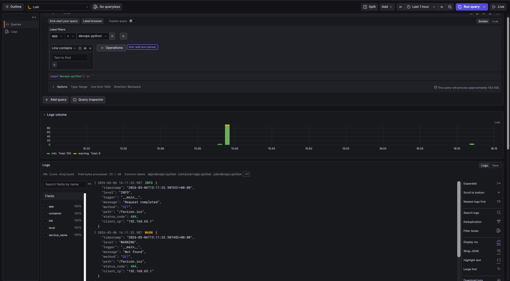
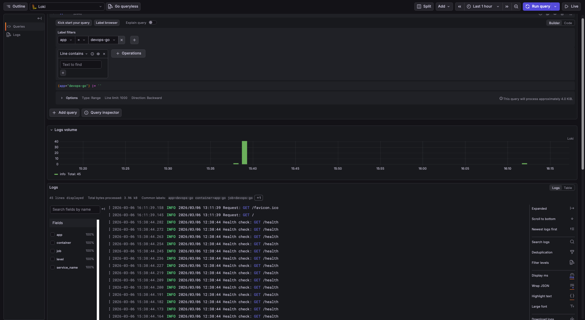
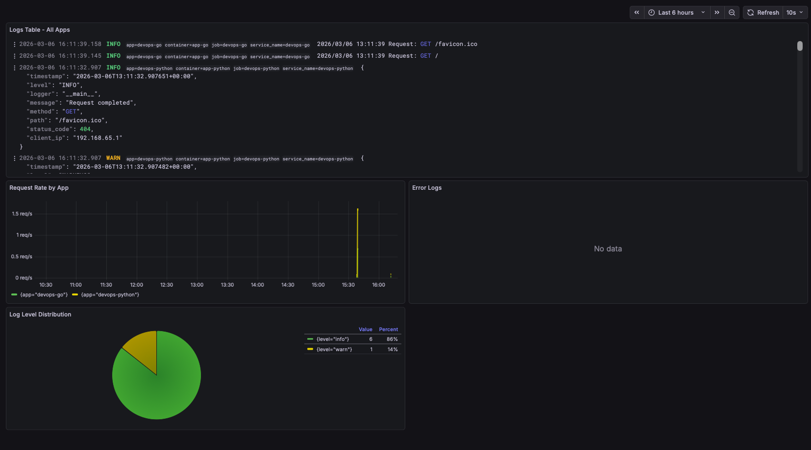

# Lab 7 — Observability & Logging with Loki Stack

## 1. Architecture

```
┌─────────────┐     ┌─────────────┐
│  app-python │     │   app-go    │
│  (Flask)    │     │  (net/http) │
│  :8000      │     │  :8001      │
└──────┬──────┘     └──────┬──────┘
       │  stdout/stderr    │  stdout/stderr
       ▼                   ▼
┌──────────────────────────────────┐
│           Promtail               │
│  Docker SD → scrape containers   │
│  with label logging=promtail     │
└──────────────┬───────────────────┘
               │ /loki/api/v1/push
               ▼
┌──────────────────────────────────┐
│             Loki 3.0             │
│  TSDB index + filesystem store   │
│  :3100                           │
└──────────────┬───────────────────┘
               │ LogQL queries
               ▼
┌──────────────────────────────────┐
│          Grafana 12.3            │
│  Dashboards & Explore            │
│  :3000                           │
└──────────────────────────────────┘
```

**Data flow:** Applications write logs to stdout → Docker captures them in JSON files → Promtail discovers containers via Docker socket and tails their log files → Promtail pushes log entries to Loki over HTTP → Grafana queries Loki using LogQL and renders dashboards.

All services communicate over a shared Docker bridge network `logging`.

---

## 2. Setup Guide

### Prerequisites

- Docker Engine 24+ with Compose v2
- Ports 3000, 3100, 8000, 8001 available

### Deployment

```bash
cd monitoring

# Create .env from the example template and set your password
cp .env.example .env
# Edit .env and set GF_SECURITY_ADMIN_PASSWORD

# Start the full stack (builds apps, pulls infrastructure images)
docker compose up -d --build

# Verify all services are running
docker compose ps
```

**Expected output:**

```
NAME         IMAGE                                COMMAND                  SERVICE      CREATED              STATUS                        PORTS
app-go       aezuraa/devops-info-service:go       "./devops-info-servi…"   app-go       About a minute ago   Up About a minute             0.0.0.0:8001->8080/tcp
app-python   aezuraa/devops-info-service:python   "python app.py"          app-python   About a minute ago   Up About a minute             0.0.0.0:8000->8080/tcp
grafana      grafana/grafana:12.3.1               "/run.sh"                grafana      About a minute ago   Up About a minute (healthy)   0.0.0.0:3000->3000/tcp
loki         grafana/loki:3.0.0                   "/usr/bin/loki -conf…"   loki         About a minute ago   Up About a minute (healthy)   0.0.0.0:3100->3100/tcp
promtail     grafana/promtail:3.0.0               "/usr/bin/promtail -…"   promtail     About a minute ago   Up About a minute
```

### Service verification

```bash
# Loki readiness
curl http://localhost:3100/ready
# → ready

# Grafana health
curl http://localhost:3000/api/health
# → {"database":"ok","version":"12.3.1",...}

# Python app
curl http://localhost:8000/health
# → {"status":"healthy",...}

# Go app
curl http://localhost:8001/health
# → {"status":"healthy",...}
```

---

## 3. Configuration

### 3.1 Loki Configuration (`loki/config.yml`)

```yaml
auth_enabled: false

server:
  http_listen_port: 3100

common:
  path_prefix: /loki
  replication_factor: 1
  ring:
    kvstore:
      store: inmemory

schema_config:
  configs:
    - from: "2024-01-01"
      store: tsdb
      object_store: filesystem
      schema: v13
      index:
        prefix: index_
        period: 24h
```

**Key decisions:**

- **TSDB index** (not boltdb-shipper) — Loki 3.0 recommended, up to 10x faster queries, lower memory
- **Schema v13** — latest schema version for Loki 3.0+
- **Filesystem storage** — suitable for single-instance deployment
- **Retention 168h (7 days)** — configured via `limits_config` with compactor enabled
- **`auth_enabled: false`** — single-tenant mode for development

### 3.2 Promtail Configuration (`promtail/config.yml`)

```yaml
scrape_configs:
  - job_name: docker
    docker_sd_configs:
      - host: unix:///var/run/docker.sock
        refresh_interval: 5s
        filters:
          - name: label
            values: ["logging=promtail"]
    relabel_configs:
      - source_labels: ['__meta_docker_container_name']
        regex: '/(.*)'
        target_label: 'container'
      - source_labels: ['__meta_docker_container_label_app']
        target_label: 'app'
```

**Key decisions:**

- **Docker SD** — discovers containers automatically via Docker socket
- **Label filtering** — only scrapes containers with `logging=promtail` label (opt-in model)
- **Relabeling** — extracts container name (strips leading `/`) and `app` label for LogQL querying
- **5s refresh** — balance between responsiveness and Docker API load

### 3.3 Docker Compose

The compose file defines 5 services on a shared `logging` network:

| Service | Image | Port | Role |
|---------|-------|------|------|
| loki | grafana/loki:3.0.0 | 3100 | Log storage & query engine |
| promtail | grafana/promtail:3.0.0 | 9080 (internal) | Log collector |
| grafana | grafana/grafana:12.3.1 | 3000 | Visualization |
| app-python | built from `../app_python` | 8000→8080 | Python Flask app |
| app-go | built from `../app_go` | 8001→8080 | Go app |

---

## 4. Application Logging

Logs from both applications are visible in Grafana Explore. Python app logs are in JSON format; Go app logs are plain-text — both collected by Promtail via Docker service discovery.

**Python app logs in Loki Explore:**



**Go app logs in Loki Explore:**



---

### JSON Structured Logging (Python)

The Python app uses a custom `JSONFormatter` that outputs each log line as a JSON object:

```python
class JSONFormatter(logging.Formatter):
    def format(self, record):
        log_data = {
            'timestamp': datetime.now(timezone.utc).isoformat(),
            'level': record.levelname,
            'logger': record.name,
            'message': record.getMessage(),
        }
        if hasattr(record, 'method'):
            log_data['method'] = record.method
        # ... additional context fields
        return json.dumps(log_data)
```

Flask hooks log every request and response:

- `@app.before_request` — logs incoming requests with method, path, client IP
- `@app.after_request` — logs completed requests with status code
- `@app.errorhandler(404)` — logs not-found warnings
- `@app.errorhandler(500)` — logs internal server errors

**Example JSON log output:**

```json
{"timestamp": "2026-03-06T12:38:42.354796+00:00", "level": "INFO", "logger": "__main__", "message": "Incoming request", "method": "GET", "path": "/", "client_ip": "192.168.65.1"}
{"timestamp": "2026-03-06T12:38:42.355255+00:00", "level": "INFO", "logger": "__main__", "message": "Request completed", "method": "GET", "path": "/", "status_code": 200, "client_ip": "192.168.65.1"}
{"timestamp": "2026-03-06T12:38:42.862278+00:00", "level": "WARNING", "logger": "__main__", "message": "Not found", "method": "GET", "path": "/nonexistent", "status_code": 404, "client_ip": "192.168.65.1"}
```

**Benefits of JSON logging:**

- Loki can parse fields with `| json` pipeline stage
- Enables filtering by any field: `{app="devops-python"} | json | status_code=404`
- No ambiguous text parsing needed

### Go App Logging

The Go app uses standard `log.Printf` with plain-text format. Promtail ingests these logs and applies the container/app labels.

---

## 5. Dashboard

The Grafana dashboard "Application Logs Dashboard" contains 4 panels. Screenshot showing all 4 panels with real data:




### Panel 1: Logs Table — All Apps

- **Type:** Logs visualization
- **Query:** `{app=~"devops-.*"}`
- **Purpose:** Shows all recent log entries from both applications with timestamps and labels

### Panel 2: Request Rate by App

- **Type:** Time series graph
- **Query:** `sum by (app) (rate({app=~"devops-.*"} [1m]))`
- **Purpose:** Visualizes logs per second, broken down by application. Useful for spotting traffic patterns and anomalies.

### Panel 3: Error Logs

- **Type:** Logs visualization
- **Query:** `{app=~"devops-.*"} | json | level="ERROR" or level="WARNING"`
- **Purpose:** Filters and displays only error/warning-level log entries for quick incident identification

### Panel 4: Log Level Distribution

- **Type:** Pie chart
- **Query:** `sum by (level) (count_over_time({app=~"devops-.*"} | json [5m]))`
- **Purpose:** Shows the proportion of log levels (INFO, WARNING, ERROR) over the last 5 minutes

### Additional LogQL Query Examples

```logql
# All logs from Python app
{app="devops-python"}

# Only error logs
{app="devops-python"} |= "ERROR"

# Parse JSON and filter by HTTP method
{app="devops-python"} | json | method="GET"

# Filter by HTTP status code
{app="devops-python"} | json | status_code=404

# Filter by path
{app="devops-python"} | json | path="/health"

# Logs per second by app
sum by (app) (rate({app=~"devops-.*"} [1m]))

# Count logs by level in last 5 minutes
sum by (level) (count_over_time({app=~"devops-.*"} | json [5m]))

# Regex match on container
{container=~"app-.*"}
```

---

## 6. Production Configuration

### 6.1 Resource Limits

All services have CPU/memory limits to prevent resource exhaustion:

| Service | CPU Limit | Memory Limit | CPU Reserved | Memory Reserved |
|---------|-----------|--------------|--------------|-----------------|
| Loki | 1.0 | 1G | 0.25 | 256M |
| Promtail | 0.5 | 512M | 0.1 | 128M |
| Grafana | 1.0 | 512M | 0.25 | 128M |
| app-python | 0.5 | 256M | 0.1 | 64M |
| app-go | 0.5 | 256M | 0.1 | 64M |

### 6.2 Security

- **Grafana anonymous access disabled:** `GF_AUTH_ANONYMOUS_ENABLED=false`
- **Admin credentials via `.env` file:** Password not hardcoded in `docker-compose.yml`
- **`.env` not committed to git** — listed in `.gitignore`; use `.env.example` as a template
- **Ansible Vault** — in the Ansible role, `grafana_admin_password` references `vault_grafana_admin_password` from the encrypted vault
- **Docker socket mounted read-only** for Promtail: `/var/run/docker.sock:ro`
- **Config files mounted read-only:** `:ro` flag on Loki and Promtail configs

Grafana login page (anonymous access is disabled — login required):


### 6.3 Health Checks

- **Loki:** `wget --spider http://localhost:3100/ready` (interval: 10s, retries: 5, start_period: 20s)
- **Grafana:** `wget --spider http://localhost:3000/api/health` (interval: 10s, retries: 5, start_period: 15s)
- **Dependency chain:** Promtail and Grafana depend on `loki: service_healthy`

### 6.4 Retention

- Log retention: 7 days (168h)
- Compactor runs every 10 minutes to clean expired data
- Old samples rejected after 168h

---

## 7. Testing

### Verify services

```bash
# All services running and healthy
docker compose ps

# Loki ready
curl http://localhost:3100/ready

# Grafana healthy
curl http://localhost:3000/api/health

# Loki labels populated
curl http://localhost:3100/loki/api/v1/labels
```

### Generate test traffic

```bash
# Python app — normal requests
for i in {1..20}; do curl -s http://localhost:8000/; done
for i in {1..20}; do curl -s http://localhost:8000/health; done

# Python app — 404 errors
for i in {1..5}; do curl -s http://localhost:8000/nonexistent; done

# Go app
for i in {1..20}; do curl -s http://localhost:8001/; done
for i in {1..20}; do curl -s http://localhost:8001/health; done
```

### Query logs via API

```bash
# Python app logs
curl -s 'http://localhost:3100/loki/api/v1/query?query={app="devops-python"}&limit=5'

# Go app logs
curl -s 'http://localhost:3100/loki/api/v1/query?query={app="devops-go"}&limit=5'

# JSON-parsed filter
curl -s 'http://localhost:3100/loki/api/v1/query?query={app="devops-python"}|json|method="GET"&limit=5'
```

### Verify in Grafana

1. Open http://localhost:3000 (login: admin / from .env)
2. Go to **Explore** → select **Loki** data source
3. Run query: `{app=~"devops-.*"}`
4. Open **Dashboards** → "Application Logs Dashboard"
5. Verify all 4 panels show data

### Tear down

```bash
docker compose down -v
```

---

## 8. Challenges & Solutions

### Challenge 1: Loki 3.0 TSDB Configuration

Loki 3.0 introduced TSDB as the default index type, replacing boltdb-shipper. The configuration structure changed significantly — `tsdb_shipper` requires `active_index_directory` and `cache_location` instead of the old boltdb paths.

**Solution:** Used the latest Loki 3.0 configuration docs with schema v13 and TSDB store type.

### Challenge 2: Promtail Docker Service Discovery Filtering

By default, Promtail would scrape all containers including infrastructure (loki, promtail, grafana). This creates noisy self-referential logging loops.

**Solution:** Used Docker label filtering (`logging=promtail`) in Promtail's `docker_sd_configs` so only explicitly labeled containers are scraped.

### Challenge 3: Flask Werkzeug Default Logger

Flask's built-in Werkzeug logger outputs its own access log lines in a non-JSON format, polluting the structured log stream.

**Solution:** Suppressed Werkzeug's default handler and set it to WARNING level, letting our custom `@app.before_request`/`@app.after_request` hooks handle structured request logging exclusively.

### Challenge 4: Grafana Data Source Provisioning

Manually configuring the Loki data source in Grafana UI is not reproducible.

**Solution:** Used Grafana's REST API (`POST /api/datasources`) to programmatically add the Loki data source. The Ansible role also automates this step.

---

## Bonus: Ansible Automation

### Role Structure

```
ansible/roles/monitoring/
├── defaults/main.yml       # Parameterized variables (versions, ports, limits)
├── tasks/
│   ├── main.yml            # Orchestration entry point
│   ├── setup.yml           # Create dirs, template configs
│   └── deploy.yml          # Docker compose deploy, health checks, datasource
├── templates/
│   ├── docker-compose.yml.j2
│   ├── loki-config.yml.j2
│   └── promtail-config.yml.j2
└── meta/main.yml           # Depends on: docker role
```

### Key Variables

```yaml
loki_version: "3.0.0"
promtail_version: "3.0.0"
grafana_version: "12.3.1"
loki_retention_period: "168h"
loki_schema_version: "v13"
grafana_admin_user: "admin"
grafana_admin_password: "{{ vault_grafana_admin_password }}"  # stored in Ansible Vault
```

Sensitive values (`vault_grafana_admin_password`) are stored in the encrypted vault file `inventory/group_vars/all.yml` and never committed in plaintext.

### Playbook Usage

```bash
# Deploy monitoring stack
ansible-playbook ansible/playbooks/deploy-monitoring.yml

# Idempotency test — second run shows no changes
ansible-playbook ansible/playbooks/deploy-monitoring.yml
```

The role is idempotent: templates only trigger redeployment when config content changes, and the Grafana datasource creation accepts 409 (already exists) as success.

### Playbook Execution Output

First run — 5 tasks changed (dirs created, configs templated, stack deployed):

```
PLAY [Deploy Monitoring Stack (Loki + Promtail + Grafana)] *********************

TASK [monitoring : Create monitoring directories] ******************************
changed: [lab04-vm] => (item=/opt/monitoring)
changed: [lab04-vm] => (item=/opt/monitoring/loki)
changed: [lab04-vm] => (item=/opt/monitoring/promtail)

TASK [monitoring : Template Loki configuration] ********************************
changed: [lab04-vm]

TASK [monitoring : Template Promtail configuration] ****************************
changed: [lab04-vm]

TASK [monitoring : Template Docker Compose file] *******************************
changed: [lab04-vm]

TASK [monitoring : Deploy monitoring stack] ************************************
changed: [lab04-vm]

TASK [monitoring : Wait for Loki to be ready] **********************************
ok: [lab04-vm]  # content: "ready"

TASK [monitoring : Wait for Grafana to be ready] *******************************
ok: [lab04-vm]  # {"database":"ok","version":"12.3.1"}

TASK [monitoring : Configure Loki data source in Grafana] **********************
ok: [lab04-vm]  # Datasource added: Loki → http://loki:3100

TASK [monitoring : Display deployment status] **********************************
ok: [lab04-vm] =>
  "msg": "Monitoring stack deployed successfully.
          Grafana: http://84.201.130.19:3000
          Loki:    http://84.201.130.19:3100"

PLAY RECAP *************************************************************
lab04-vm : ok=21  changed=5  unreachable=0  failed=0  skipped=0
```
