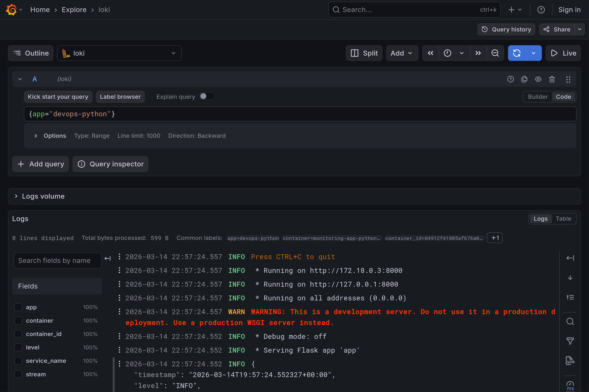
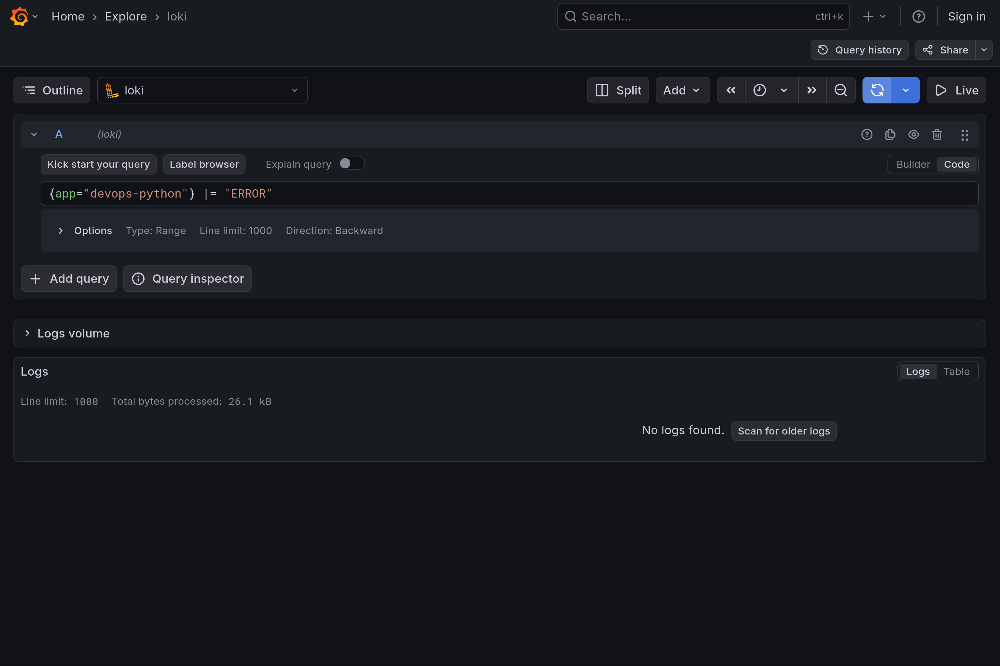
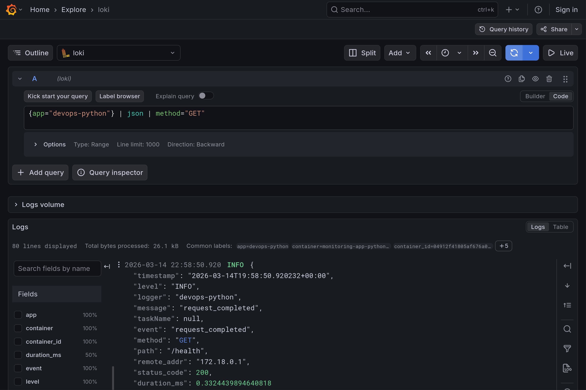
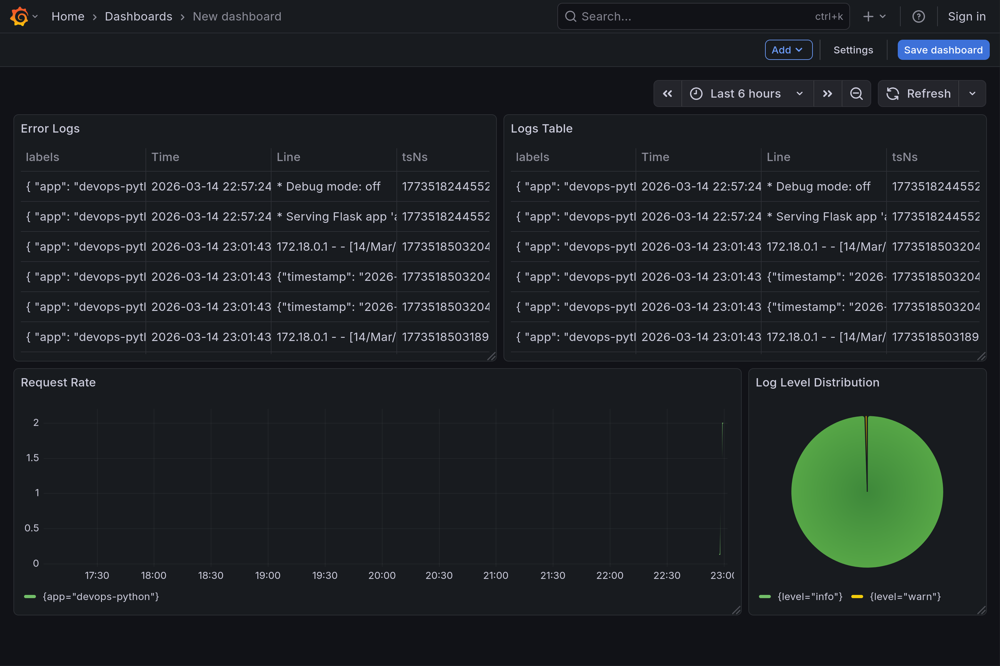

# LAB07.md

# Lab 7 — Observability & Logging with Loki Stack

## Architecture

This lab implements centralized logging using the **Loki Stack**, which includes:

- **Loki** – log storage and indexing
- **Promtail** – log collector that ships logs to Loki
- **Grafana** – visualization and log exploration interface
- **Application containers** – generate logs collected by Promtail

### Architecture Diagram

```

+----------------------+
|   Python Application |
|  (JSON logging)      |
+----------+-----------+
|
| Docker logs
v
+----------------------+
|      Promtail        |
| (Docker discovery)   |
+----------+-----------+
|
| Push logs
v
+----------------------+
|        Loki          |
|   Log storage TSDB   |
+----------+-----------+
|
| Query via LogQL
v
+----------------------+
|       Grafana        |
| Dashboards + Explore |
+----------------------+

```

Logs are collected from Docker containers using **Promtail Docker service discovery** and stored in **Loki using TSDB storage**. Grafana is used to query logs with **LogQL** and visualize them.

---

# Setup Guide

## 1. Project Structure

```

monitoring/
├── docker-compose.yml
├── loki/
│   └── config.yml
├── promtail/
│   └── config.yml
└── docs/
└── LAB07.md

````

---

## 2. Start the Stack

Navigate to the monitoring directory:

```bash
cd monitoring
docker compose up -d
````

Verify services:

```bash
docker compose ps
```

Check Loki readiness:

```bash
curl http://localhost:3100/ready
```

Promtail targets:

```bash
curl http://localhost:9080/targets
```

---

## 3. Access Grafana

Open:

```
http://localhost:3000
```

Add Loki data source:

```
Connections → Data Sources → Add → Loki
```

Set URL:

```
http://loki:3100
```

Then click **Save & Test**.

Logs can now be explored in:

```
Explore → Loki
```

Example query:

```
{job="docker"}
```

---

# Configuration

## Loki Configuration

The Loki configuration enables **TSDB storage** and **filesystem backend**, which is recommended for Loki 3.0.

Key configuration elements:

* **auth_enabled: false** (for development)
* **TSDB storage backend**
* **filesystem object store**
* **schema v13**
* **7-day log retention**

Example snippet:

```yaml
auth_enabled: false

server:
  http_listen_port: 3100

common:
  path_prefix: /loki
  storage:
    filesystem:
      chunks_directory: /loki/chunks
      rules_directory: /loki/rules

schema_config:
  configs:
    - from: 2024-01-01
      store: tsdb
      object_store: filesystem
      schema: v13
      index:
        prefix: index_
        period: 24h
```

TSDB provides:

* faster queries
* lower memory usage
* better compression

---

## Promtail Configuration

Promtail collects logs from Docker containers using **Docker service discovery**.

Key components:

* Docker socket connection
* Loki client endpoint
* container metadata labels

Example snippet:

```yaml
scrape_configs:
  - job_name: docker
    docker_sd_configs:
      - host: unix:///var/run/docker.sock
        refresh_interval: 5s
```

Logs are pushed to Loki using:

```
http://loki:3100/loki/api/v1/push
```

Promtail also extracts container metadata as labels for querying in LogQL.

---

# Application Logging

The Python application was updated to use **structured JSON logging**.

Structured logs make it easier to:

* parse logs
* filter fields
* build metrics from logs

---

# Dashboard

A Grafana dashboard was created to visualize logs from the applications.

## Panel 1 — Logs Table

Shows recent logs from all application containers.

Query:

```
{app=~"devops-.*"}
```

Visualization type:

```
Logs
```

Purpose:

* inspect recent application activity
* debug issues

---

## Panel 2 — Request Rate

Displays request rate over time per application.

Query:

```
sum by (app) (rate({app=~"devops-.*"} [1m]))
```

Visualization type:

```
Time Series
```

Purpose:

* monitor traffic load
* detect spikes

---

## Panel 3 — Error Logs

Shows only logs with error level.

Query:

```
{app=~"devops-.*"} | json | level="ERROR"
```

Visualization:

```
Logs
```

Purpose:

* quickly identify failures
* debug issues

---

## Panel 4 — Log Level Distribution

Shows number of logs grouped by level.

Query:

```
sum by (level) (
  count_over_time({app=~"devops-.*"} | json [5m])
)
```

Visualization:

```
Pie chart / Stat
```

Purpose:

* observe system health
* detect abnormal error ratios

---

# Production Configuration

The current stack is configured for **development only**.

---

# Testing

Logs were generated by sending HTTP requests to the application.

Example commands:

```bash
for i in {1..20}; do curl http://localhost:8000/; done
```

Health endpoint:

```bash
curl http://localhost:8000/health
```

Logs were verified in Grafana Explore using LogQL queries.

Example queries used:

```
{app="devops-python"}
```

```
{app="devops-python"} |= "ERROR"
```

```
{app="devops-python"} | json | method="GET"
```

These queries confirmed logs were correctly collected and parsed.






---

# Challenges

### Promtail Docker Permissions

Promtail requires access to:

```
/var/run/docker.sock
```

Without this mount, Docker service discovery does not work.

Solution:

```yaml
volumes:
  - /var/run/docker.sock:/var/run/docker.sock:ro
```

---

### JSON Parsing in LogQL

Logs must be parsed before filtering fields.

Incorrect:

```
{app="devops-python"} level="ERROR"
```

Correct:

```
{app="devops-python"} | json | level="ERROR"
```
