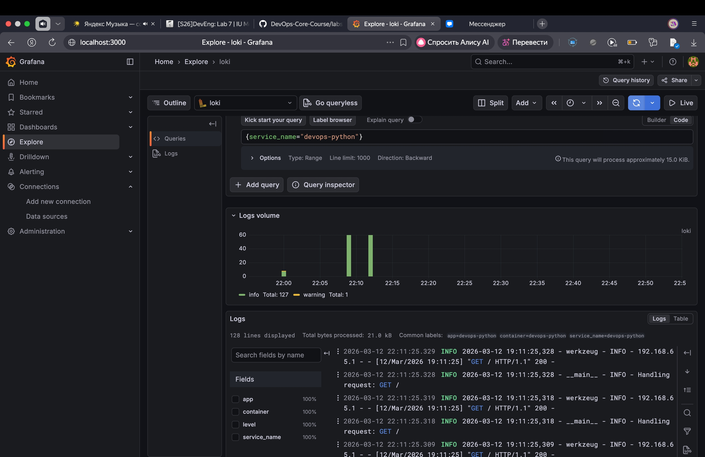
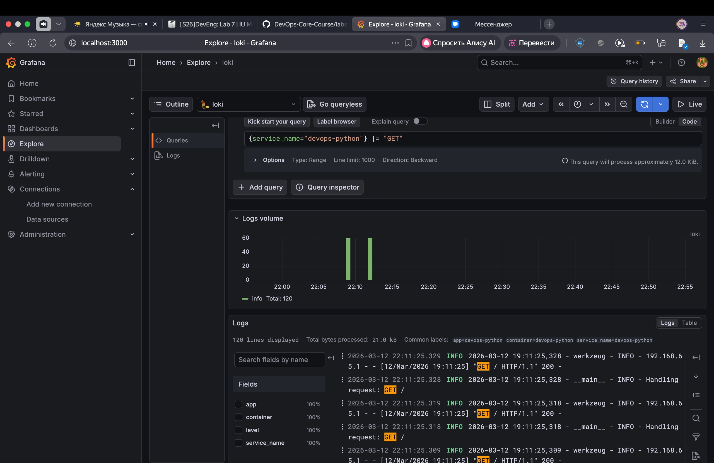

## Lab 7 — Observability & Logging with Loki Stack

### Architecture

- **Loki 3.0**: central log storage using TSDB + filesystem backend.
- **Promtail 3.0**: log agent that discovers Docker containers and ships logs to Loki.
- **Grafana 12.3**: UI for querying and visualising logs and metrics via LogQL.
- **Applications**: containers with labels `logging=promtail`, `app=...`; their Docker logs are scraped by Promtail and stored in Loki.

Log flow: container → Docker logs → Promtail (Docker SD + label filter) → Loki (TSDB with 7‑day retention) → Grafana (LogQL queries and dashboards).

### Setup Guide

1. Go to the `monitoring` directory:
   ```bash
   cd monitoring
   ```
2. Start the stack:
   ```bash
   docker compose up -d
   docker compose ps
   ```
3. Verify that all services are healthy:
   ```bash
   curl http://localhost:3100/ready       # Loki
   curl http://localhost:9080/targets     # Promtail targets
   curl http://localhost:3000/api/health  # Grafana
   ```
4. Open Grafana at `http://localhost:3000/`, log in as `admin` with the password from `.env` (`GF_SECURITY_ADMIN_PASSWORD`), add a Loki data source with URL `http://loki:3100` and click **Save & Test**.

### Loki Configuration (config.yml)

Key snippets:

```yaml
auth_enabled: false

server:
  http_listen_port: 3100

common:
  path_prefix: /loki
  storage:
    filesystem:
      chunks_directory: /loki/chunks
      rules_directory: /loki/rules

schema_config:
  configs:
    - from: 2024-01-01
      store: tsdb
      object_store: filesystem
      schema: v13
      index:
        prefix: index_
        period: 24h

limits_config:
  retention_period: 168h  # 7 days
```

- **TSDB + schema v13**: recommended Loki 3.0 schema with fast queries.
- **filesystem object_store**: simple backend for a single‑node setup.
- **7‑day retention**: logs are kept for 168 hours.
- **Compactor** (configured in `config.yml`) periodically removes data older than the retention period.

### Promtail Configuration (config.yml)

Key snippets:

```yaml
server:
  http_listen_port: 9080

clients:
  - url: http://loki:3100/loki/api/v1/push

scrape_configs:
  - job_name: docker
    docker_sd_configs:
      - host: unix:///var/run/docker.sock
        refresh_interval: 5s
        filters:
          - name: label
            values: ["logging=promtail"]
    relabel_configs:
      - source_labels: ["__meta_docker_container_name"]
        target_label: container
        regex: "/(.*)"
        replacement: "$1"
      - source_labels: ["__meta_docker_container_label_app"]
        target_label: app
```

- **Docker service discovery**: Promtail talks to the Docker API on `unix:///var/run/docker.sock`.
- **filters**: only containers with label `logging=promtail` are scraped.
- **relabel_configs**: `__meta_docker_container_name` and `__meta_docker_container_label_app` are converted into the `container` and `app` labels that are later used in LogQL.

### Application Logging (JSON)

The Python app uses the standard `logging` module, but emits **JSON‑encoded log lines** with rich context:

- Core fields: `timestamp`, `level`, `message` / `event`.
- HTTP context: `method`, `path`, `status_code`, `client_ip`, `user_agent`.
- Events: service `startup`, request handling for `/` and `/health`, 404 and 500 errors.

Example LogQL queries for these JSON logs:

- All logs from the Python app:
  ```logql
  {service_name="devops-python"}
  ```
- Only errors:
  ```logql
  {service_name="devops-python"} |= "ERROR"
  ```
- Parse JSON and filter by method:
  ```logql
  {service_name="devops-python"} | json | method="GET"
  ```

The screenshot below shows Loki Explore with logs from the `devops-python` container and other services, queried via:



### Dashboard & LogQL

The following LogQL patterns are used for the dashboard:

- Stream selection by service:
  ```logql
  {service_name="devops-python"}
  ```
- Text filter for errors:
  ```logql
  {service_name="devops-python"} |= "ERROR"
  ```
- Metrics from logs (request rate):
  ```logql
  sum by (service_name) (rate({service_name="devops-python"}[1m]))
  ```
- Log volume for the service:
  ```logql
  count_over_time({service_name="devops-python"}[5m])
  ```

The following screenshot shows Loki Explore with a text filter on HTTP method `GET` for the `devops-python` service:



Recommended dashboard panels:

1. **Application logs (devops-python)** — Logs panel, query:
   ```logql
   {service_name="devops-python"}
   ```
2. **Request rate** — Time series panel, query:
   ```logql
   sum by (service_name) (rate({service_name="devops-python"}[1m]))
   ```
3. **Error logs** — Logs panel, query:
   ```logql
   {service_name="devops-python"} |= "ERROR"
   ```
4. **Log volume** — Pie chart panel, query:
   ```logql
   count_over_time({service_name="devops-python"}[5m])
   ```
   The screenshot below shows the final Grafana dashboard with all four panels and real log data from the `devops-python` service:

   

### Production Config & Security

- **Resource limits** are configured for all services in `docker-compose.yml` via `deploy.resources.limits` and `deploy.resources.reservations`.
- **Grafana**:
  - `GF_AUTH_ANONYMOUS_ENABLED=false` disables anonymous access.
  - `GF_SECURITY_ADMIN_PASSWORD` is provided via `.env` and is not committed to git.
  - For local development anonymous access can be temporarily enabled, but this must be disabled in production.
- **Loki** uses a 7‑day retention period and the compactor removes old chunks accordingly.

### Testing & Verification

- Start the stack:
  ```bash
  cd monitoring
  docker compose up -d
  docker compose ps
  ```
- Generate application logs:
  ```bash
  for i in {1..20}; do curl http://localhost:8000/; done
  for i in {1..20}; do curl http://localhost:8000/health; done
  ```
- In Grafana (Explore, Loki data source), run:
  - `{service_name="devops-python"}`
  - `{service_name="devops-python"} |= "GET"`
  - `{service_name="devops-python"} |= "ERROR"`

### Research Answers

- **How is Loki different from Elasticsearch?**  
  Loki indexes only **labels** (metadata) instead of full log text and stores the raw log lines cheaply in object storage or filesystem. This makes it much more cost‑efficient and resource‑friendly for log workloads than Elasticsearch, which indexes the entire document body.

- **What are log labels and why do they matter?**  
  Labels are key–value metadata attached to log streams (for example `app`, `container`, `namespace`, `job`). Queries in LogQL select streams by labels and aggregate over them, so good label design enables fast, efficient queries and flexible dashboards.

- **How does Promtail discover containers?**  
  Promtail supports multiple discovery mechanisms such as Docker service discovery (`docker_sd_configs`) and Kubernetes API. In this lab it uses the Docker API on the Unix socket and applies a label filter so that only containers with `logging=promtail` are scraped.

### Challenges & Solutions

- **Loki 3.0 configuration errors**: the initial Loki config used deprecated `shared_store` fields and missed the required `compactor.delete_request_store`, which caused startup failures. The configuration was fixed by switching fully to TSDB settings and explicitly setting `delete_request_store: filesystem`.
- **Grafana admin password confusion**: the container started with the default `admin/admin` credentials, while the `.env` value was not yet applied. The issue was resolved by logging in with the default password, setting a new admin password that matches the `.env` value, and restarting the Grafana container.
- **Empty queries in Explore**: some LogQL queries initially returned no data because of wrong label names (`app` vs `service_name`) and an incorrect time range. Using the Label browser to discover real labels and increasing the time range to the last few hours fixed the problem and made the logs visible.


