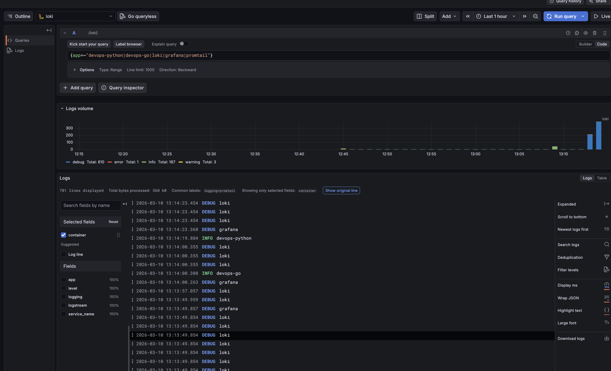
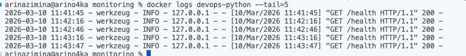
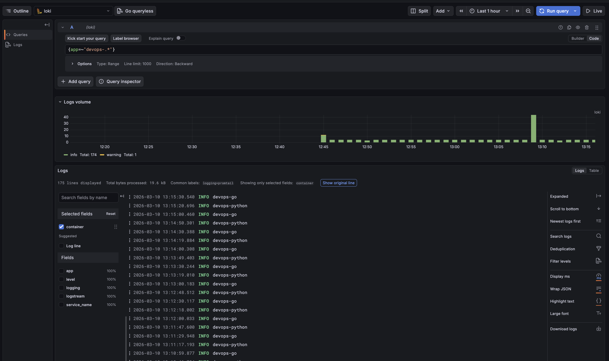
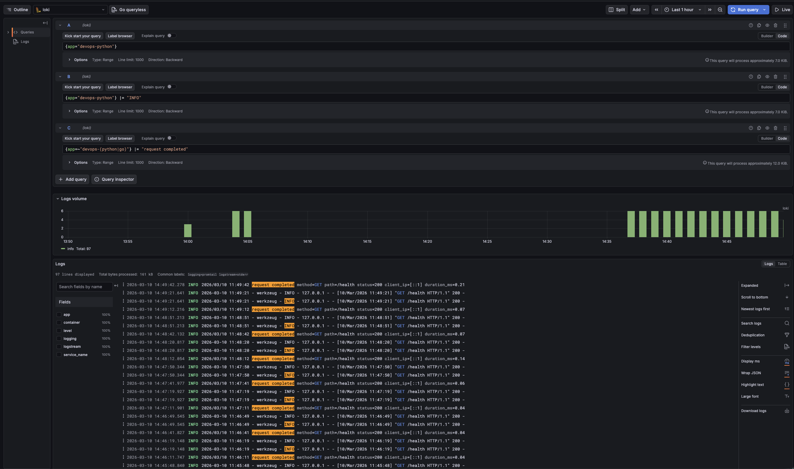
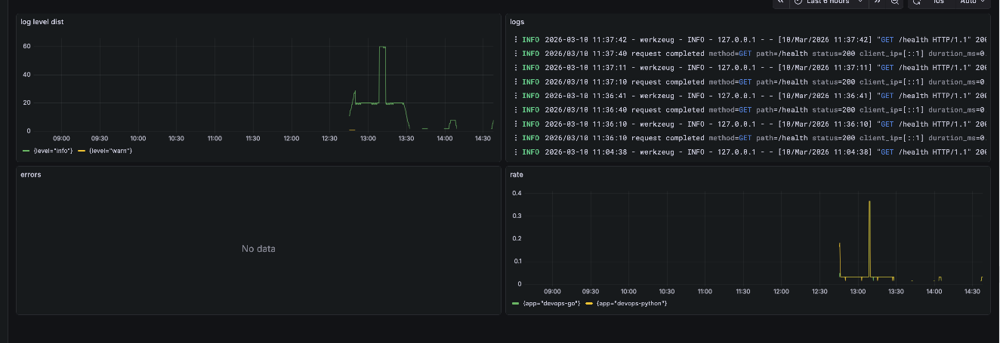
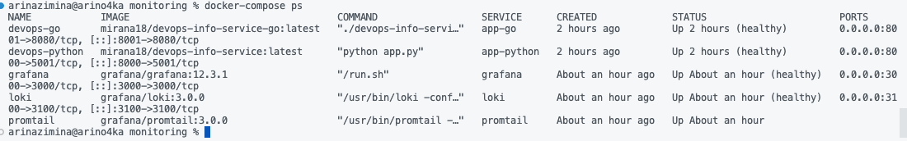
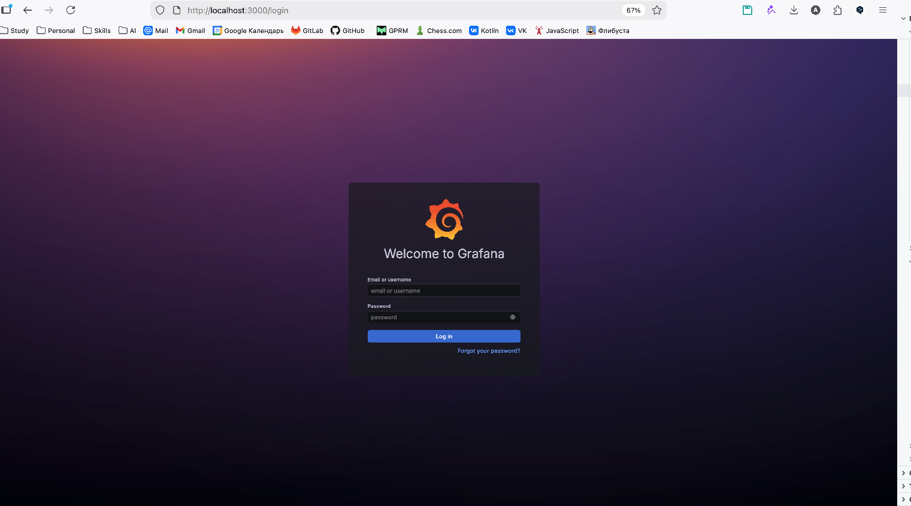
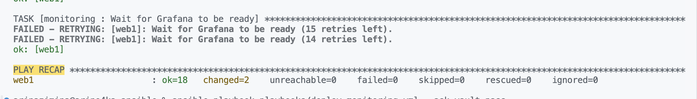
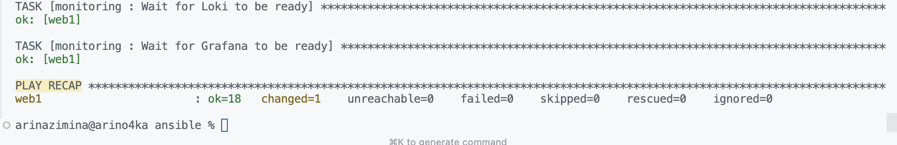
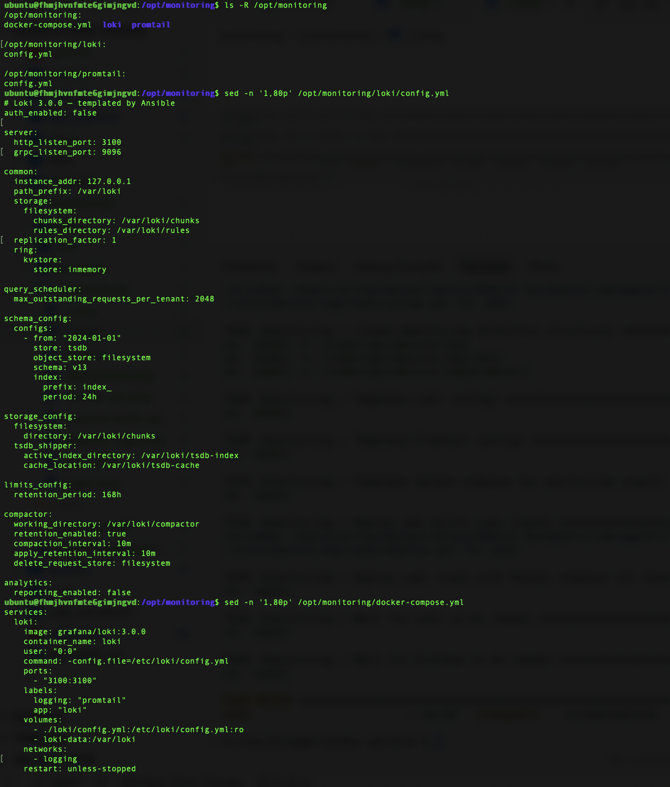

# Lab 7: Observability & Logging with Loki Stack

## 1. Architecture

```
                    ┌─────────────┐
                    │   Grafana   │ :3000
                    │  (UI/Explore)│
                    └──────┬──────┘
                           │ queries
                    ┌──────▼──────┐
                    │    Loki     │ :3100
                    │ (log store) │
                    └──────▲──────┘
                           │ push
                    ┌──────┴──────┐
                    │  Promtail   │ :9080
                    │ (collector) │
                    └──────▲──────┘
                           │ read container logs
         ┌─────────────────┼─────────────────┐
         │                 │                 │
   ┌─────▼─────┐    ┌──────▼──────┐   ┌──────▼──────┐
   │ app-python│    │   app-go    │   │ other       │
   │ :8000     │    │   :8001     │   │ containers  │
   └───────────┘    └─────────────┘   └─────────────┘
```

- **Loki** — stores logs (TSDB + filesystem), retention 7 days.
- **Promtail** — discovers Docker containers with label `logging=promtail`, reads logs, sends to Loki.
- **Grafana** — data source Loki, Explore and dashboards.

---

## 2. Setup Guide

```bash
cd monitoring
cp .env.example .env
# Edit .env: set DOCKERHUB_USERNAME and GF_SECURITY_ADMIN_PASSWORD

docker compose up -d
docker compose ps
```

**Verify:**

```bash
curl http://localhost:3100/ready   # Loki
curl http://localhost:9080/targets # Promtail targets
open http://localhost:3000         # Grafana (login: admin / password from .env)
```

**Add Loki data source in Grafana:** Connections → Data sources → Add data source → Loki → URL `http://loki:3100` → Save & Test.

---

## 3. Configuration

### Loki (`loki/config.yml`)

- **auth_enabled: false** — for lab; in production use auth.
- **server** — HTTP 3100, gRPC 9096.
- **schema_config** — v13, store tsdb, object_store filesystem (Loki 3.0).
- **storage_config** — filesystem for chunks, tsdb_shipper for index/cache.
- **limits_config** — **retention_period: 168h** (7 days).
- **compactor** — retention_enabled true, apply_retention_interval 10m.

### Promtail (`promtail/config.yml`)

- **clients** — push to `http://loki:3100/loki/api/v1/push`.
- **scrape_configs** — job `docker`, `docker_sd_configs` with filter `label=logging=promtail`.
- **relabel_configs** — `container` from container name, `app` from label `app`.

---

## 4. Application Logging

Python app (Lab 1) was updated for **JSON logging**:

- **Library:** `python-json-logger` (JsonFormatter).
- **Fields:** timestamp, level, name, message + extra (method, path, status_code, client_ip, duration_ms).
- **Hooks:** `@app.before_request` logs request start; `@app.after_request` logs completion with status and duration.
- **Events:** startup, each HTTP request/response, errors (logger.error with exc_info).

Example log line:

```json
{"timestamp": "2026-03-07 12:00:00,123", "level": "INFO", "message": "Request completed", "method": "GET", "path": "/health", "status_code": 200, "client_ip": "172.18.0.1", "duration_ms": 1.45}
```

---

## 5. Dashboard

Create a dashboard in Grafana with 4 panels:

| Panel              | Type       | LogQL |
|--------------------|------------|--------|
| Logs Table         | Logs       | `{app=~"devops-.*"}` |
| Request Rate       | Time series| `sum by (app) (rate({app=~"devops-.*"} [1m]))` |
| Error Logs         | Logs       | `{app=~"devops-.*"} \| json \| level="ERROR"` |
| Log Level Distribution | Stat/Pie | `sum by (level) (count_over_time({app=~"devops-.*"} \| json [5m]))` |

**Example LogQL:**

- All logs: `{app="devops-python"}`
- Only errors: `{app="devops-python"} |= "ERROR"`
- Parse JSON: `{app="devops-python"} | json | method="GET"`

---

## 6. Production Config

- **Resource limits** — in `docker-compose.yml` for loki, promtail, grafana, apps (deploy.resources.limits/reservations).
- **Grafana security** — GF_AUTH_ANONYMOUS_ENABLED=false, admin password via GF_SECURITY_ADMIN_PASSWORD in .env (do not commit .env).
- **Health checks** — Loki: `/ready`, Grafana: `/api/health` (interval 10s, start_period 10–15s).

---

## 7. Testing

```bash
# Generate traffic
for i in {1..20}; do curl -s http://localhost:8000/ > /dev/null; done
for i in {1..20}; do curl -s http://localhost:8000/health > /dev/null; done
for i in {1..10}; do curl -s http://localhost:8001/ > /dev/null; done

# In Grafana Explore: run queries above; confirm logs from devops-python and devops-go.
```

---

## 8. Challenges

- **Loki 3.0 config** — schema v13 and tsdb storage required; compactor retention_enabled must be true when retention_period is set.
- **Promtail filter** — only containers with label `logging=promtail` are scraped; apps in compose have this label.
- **Grafana auth** — anonymous access disabled; set admin password in .env for production.

---

## Bonus: Ansible Automation 

The Loki stack is automated with the Ansible role **monitoring** and playbook **deploy-monitoring.yml**. See `ansible/roles/monitoring/` and run:

```bash
cd ansible
ansible-playbook playbooks/deploy-monitoring.yml --ask-vault-pass
```

Templated configs (Loki, Promtail, docker-compose), idempotent deploy with `community.docker.docker_compose_v2`, dependency on role **docker**.

---

## Evidence: 

**1. Grafana Explore**



**2. JSON-log**



**3. Grafana Explore**



**4. Grafana Explore**



**5. Dashboard**



**6. docker compose ps**



**7. Grafana login**



**8. Ansible playbook execution output**



**9. Idempotency test**



**10. Templated configuration files**


