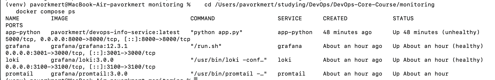
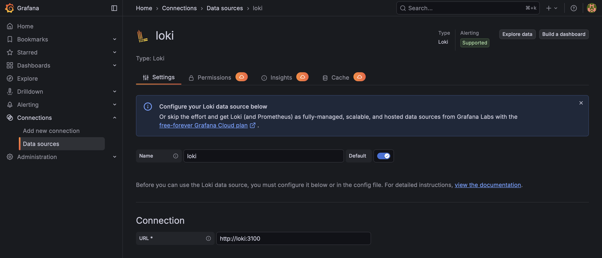
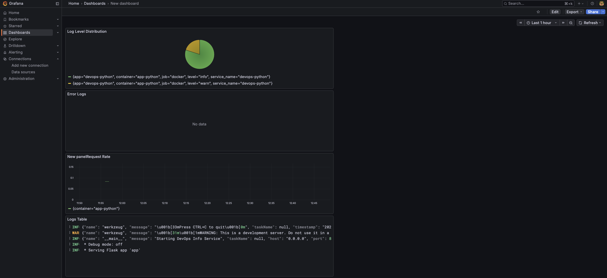
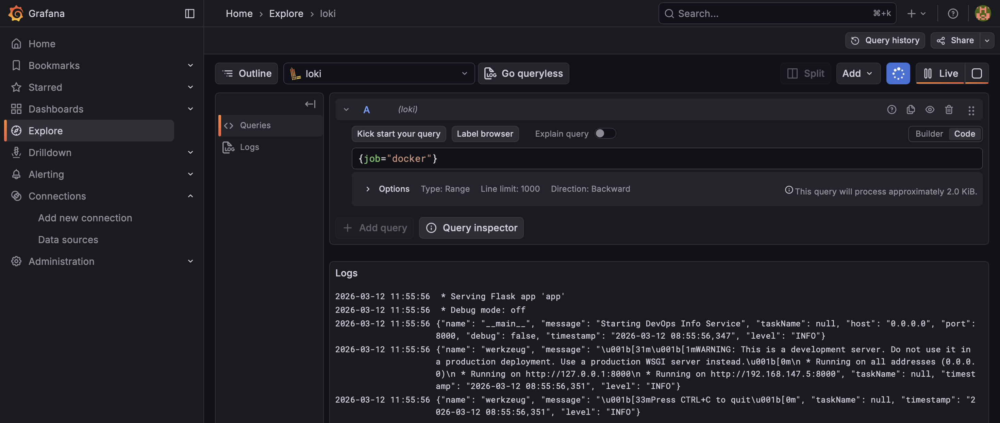
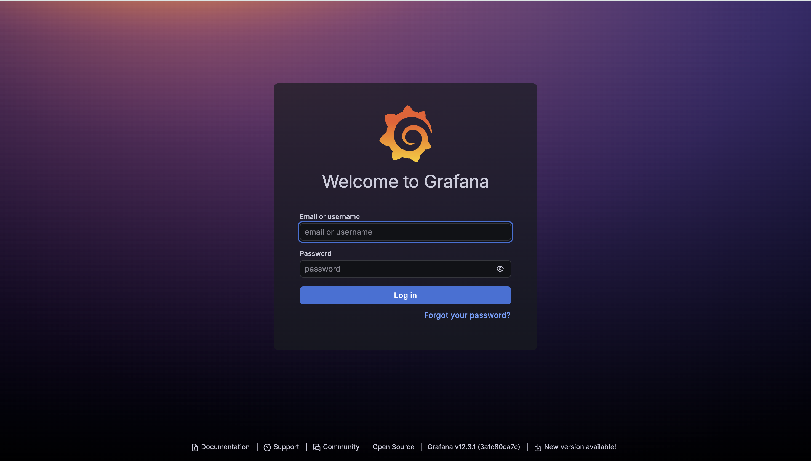

# Lab 7 — Observability & Logging with Loki Stack: Implementation Report

I completed Lab 7 by deploying a Loki + Promtail + Grafana logging stack, integrating the Python app with JSON logging, building a four-panel Grafana dashboard, and applying production settings. I also completed the bonus task: I created an Ansible role and playbook to automate the deployment of the monitoring stack, ran the playbook on the target host, and verified idempotency. Below is what I did and the results.

---

## 1. What I Did for Lab 7

### 1.1 Stack deployment (Loki, Promtail, Grafana)

I created the `monitoring/` directory with:

- **`docker-compose.yml`** — services for Loki 3.0.0, Promtail 3.0.0, and Grafana 12.3.1 on a shared `logging` network. I added the Python app (and optional Go app with a profile) so they run alongside the stack with labels `logging: "promtail"` and `app: "devops-python"` / `app: "devops-go"` for Promtail discovery. I mapped Grafana to host port 3001 to avoid conflicts.
- **`loki/config.yml`** — Loki 3.0 config with TSDB index, filesystem storage, schema v13, 7-day retention (`retention_period: 168h`), and compactor with `retention_enabled: true` and `delete_request_store: filesystem` (required in Loki 3.0 when retention is enabled).
- **`promtail/config.yml`** — Docker service discovery via `docker_sd_configs`, relabel to keep only containers with label `logging=promtail`, and to set `container` and `app` labels. I set `tenant_id: fake` for Loki with `auth_enabled: false` and ensured a `job` label so every stream has at least one label and Loki does not reject pushes.
- **`.env.example`** — documented `GRAFANA_ADMIN_PASSWORD` and `DOCKERHUB_USERNAME`; I use a local `.env` (not committed) for secrets.

I deployed the stack locally with `docker compose up -d loki promtail grafana` (and `app-python` after building the image from `app_python/`). I verified Loki with `curl http://localhost:3100/ready`, Promtail with `curl http://localhost:9080/targets`, and Grafana at http://localhost:3001.

**Evidence — stack running:**



**Evidence — Loki data source in Grafana:**



### 1.2 Architecture

Apps (Python, optional Go) run with Docker labels so Promtail discovers them. Promtail reads container logs from the Docker socket, relabels by `container` and `app`, and pushes to Loki. Loki stores logs with TSDB and applies 7-day retention. Grafana queries Loki and is used for Explore and dashboards.

```
                    ┌─────────────────────────────────────────────────────────┐
                    │                    Docker host                           │
  curl / browser    │   ┌──────────────┐     ┌──────────────┐                  │
  ───────────────►  │   │ app-python   │     │   app-go     │                  │
                    │   │ labels:      │     │   labels:     │                  │
                    │   │  logging=   │     │   logging=    │                  │
                    │   │  promtail   │     │   promtail    │                  │
                    │   └──────┬──────┘     └──────┬───────┘                  │
                    │          │ stdout            │ stdout                    │
                    │          ▼                   ▼                           │
                    │   ┌─────────────────────────────────────┐               │
                    │   │  Promtail (docker_sd_configs)        │  push         │
                    │   └──────────────────────────────────────┘ ──────►       │
                    │   ┌─────────────────────────────────────┐        │     │
                    │   │  Loki :3100 (TSDB, 7d retention)      │ ◄──────┘     │
                    │   └──────────────────────────────────────┘              │
                    │   ┌─────────────────────────────────────┐                │
                    │   │  Grafana :3001 (Explore, Dashboards)│                │
                    │   └──────────────────────────────────────┘                │
                    └─────────────────────────────────────────────────────────┘
```

### 1.3 Application logging (JSON)

I updated the Python app (`app_python/app.py`) to use **structured JSON logging** as required by the lab. I added the `python-json-logger` dependency and configured a `JsonFormatter` so that each log line includes `timestamp`, `level`, `name`, `message`, and any `extra` fields. I added `@app.before_request` and `@app.after_request` hooks to log every request (method, path, client_ip, status_code, duration_ms) and to log startup and errors with context. This allows LogQL to use `| json | level="ERROR"`, `| json | method="GET"`, etc.

### 1.4 Dashboard

I created a Grafana dashboard with **four panels** using the Loki data source:

| Panel                    | Type        | LogQL |
|--------------------------|-------------|--------|
| **Logs Table**           | Logs        | `{job="docker"}` / `{app=~"devops-.*"}` |
| **Request Rate**         | Time series | `sum by (container) (rate({job="docker"} [1m]))` |
| **Error Logs**           | Logs        | `{job="docker"} \|= "error"` |
| **Log Level Distribution** | Pie chart | `sum by (level) (count_over_time({app=~"devops-.*"} \| json [5m]))` |

I saved the dashboard and verified that logs from the Python app appear in Explore and in the panels after generating traffic with curl.

**Evidence — dashboard with 4 panels:**



**Evidence — logs in Explore:**



### 1.5 Production config

I applied **resource limits** to all services in `docker-compose.yml` (e.g. Loki 1 CPU / 1G, Promtail and Grafana 0.5 CPU / 512M). I **secured Grafana** by setting `GF_AUTH_ANONYMOUS_ENABLED=false` and using the admin password from the `.env` file. I added **health checks** for Loki (`http://localhost:3100/ready`) and Grafana (`http://localhost:3000/api/health`) with appropriate intervals and start periods. The Grafana login page requires admin credentials (no anonymous access).

**Evidence — Grafana login (no anonymous access):**



### 1.6 Testing

I started the stack with `docker compose up -d`, built and started the Python app, and generated logs with curl to `/` and `/health`. I confirmed Loki readiness, Promtail targets, and that logs appear in Grafana Explore with queries such as `{job="docker"}`, `{app="devops-python"}`, and `sum by (app) (rate({app=~"devops-.*"} [1m]))`.

### 1.7 Challenges and solutions

- **Loki 3.0 startup:** With retention enabled, the compactor required `delete_request_store: filesystem`; I added it to both the local Loki config and the Ansible template.
- **Loki “at least one label pair required per stream”:** Promtail was sometimes sending streams without labels. I added an explicit `job: docker` relabel and `tenant_id: fake` in the Promtail client config so every stream has labels and the correct tenant.
- **Grafana port in use:** I changed the host port for Grafana from 3000 to 3001 in `docker-compose.yml`.
- **App image not on Docker Hub:** I added a `build` context for `app-python` in `docker-compose.yml` so the image is built from `app_python/` when not available in the registry.

---

## 2. What I Did for the Bonus Task (Ansible Automation)

### 2.1 Ansible role and playbook

I created the **`roles/monitoring`** Ansible role and the **`playbooks/deploy-monitoring.yml`** playbook to automate deployment of the Loki stack on the `webservers` group.

**Role structure:**

- **`defaults/main.yml`** — variables for image versions (Loki 3.0.0, Promtail 3.0.0, Grafana 12.3.1), ports, retention (168h), schema (v13), resource limits, and paths (`/opt/monitoring` on the target host).
- **`tasks/main.yml`** — includes `setup.yml` and `deploy.yml` with tags `monitoring`, `monitoring_setup`, and `monitoring_deploy`.
- **`tasks/setup.yml`** — creates the monitoring directory structure under `monitoring_project_dir`, templates Loki config, Promtail config, Grafana datasource provisioning file, and the docker-compose file for the stack (Loki, Promtail, Grafana only; no apps in the Ansible-deployed compose).
- **`tasks/deploy.yml`** — runs `community.docker.docker_compose_v2` with `state: present` and `pull: always`, then waits for Loki and Grafana HTTP endpoints to be ready.
- **`templates/`** — Jinja2 templates: `loki-config.yml.j2`, `promtail-config.yml.j2`, `docker-compose.yml.j2`, and `datasource-loki.yml.j2`. All configurable values (versions, ports, retention, limits) are variables so the same role can be reused across environments.
- **`meta/main.yml`** — dependency on the `docker` role so Docker is installed before the monitoring stack is deployed.

The playbook `playbooks/deploy-monitoring.yml` runs the `monitoring` role on `hosts: webservers` and takes `grafana_admin_password` from the command line (`-e`) or from group_vars/vault, with a default of `admin` for testing.

### 2.2 Execution and idempotency

I ran the playbook against the target host (defined in `inventory/hosts.ini` as `webservers`). The first run created `/opt/monitoring/` and its subdirectories, wrote the templated configs, and started the Loki, Promtail, and Grafana containers. The second run completed with most tasks in `ok` state and no unnecessary container recreation, confirming idempotency. On the target host, Grafana is available on port 3000 and Loki on port 3100; the Loki datasource is provisioned automatically via the templated datasource file mounted into Grafana’s provisioning directory.

### 2.3 Summary of bonus deliverables

- **Role:** `roles/monitoring` with setup and deploy tasks, Jinja2 templates for all configs, and dependency on the `docker` role.
- **Playbook:** `playbooks/deploy-monitoring.yml` for one-command deployment of the stack.
- **Idempotency:** Verified by running the playbook twice; the second run reports mostly `ok`.
- **Grafana datasource:** Loki is added automatically through provisioning, so no manual datasource setup is needed after deployment.

---

## 3. Configuration Snippets

**Loki** (`loki/config.yml`) — schema and retention:

```yaml
schema_config:
  configs:
    - from: "2020-10-24"
      store: tsdb
      object_store: filesystem
      schema: v13
      index:
        prefix: index_
        period: 24h
limits_config:
  retention_period: 168h
compactor:
  retention_enabled: true
  apply_retention_interval: 10m
  delete_request_store: filesystem
  delete_request_store_key_prefix: index/
```

**Promtail** — Docker discovery and relabeling:

```yaml
clients:
  - url: http://loki:3100/loki/api/v1/push
    tenant_id: fake
scrape_configs:
  - job_name: docker
    docker_sd_configs:
      - host: unix:///var/run/docker.sock
        refresh_interval: 5s
    relabel_configs:
      - target_label: job
        replacement: docker
        action: replace
      - source_labels: ['__meta_docker_container_label_logging']
        regex: 'promtail'
        action: keep
      - source_labels: ['__meta_docker_container_name']
        regex: '/(.*)'
        target_label: container
        replacement: '$1'
      - source_labels: ['__meta_docker_container_label_app']
        regex: '(.+)'
        target_label: app
```

---

## 4. Summary

I completed Lab 7 by deploying the Loki stack (Loki 3.0, Promtail 3.0, Grafana 12.3) with Docker Compose, configuring Loki and Promtail for TSDB storage and 7-day retention, integrating the Python app with JSON logging and Docker labels for Promtail, building a four-panel Grafana dashboard, and applying resource limits, health checks, and Grafana security. I documented the setup, configuration, and challenges in this report and attached screenshots as evidence. For the bonus task, I implemented the Ansible role `monitoring` and the playbook `deploy-monitoring.yml`, ran them on the target host, and confirmed that the stack deploys correctly and that a second run is idempotent.
