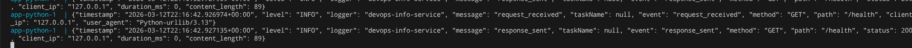
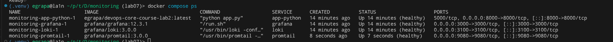
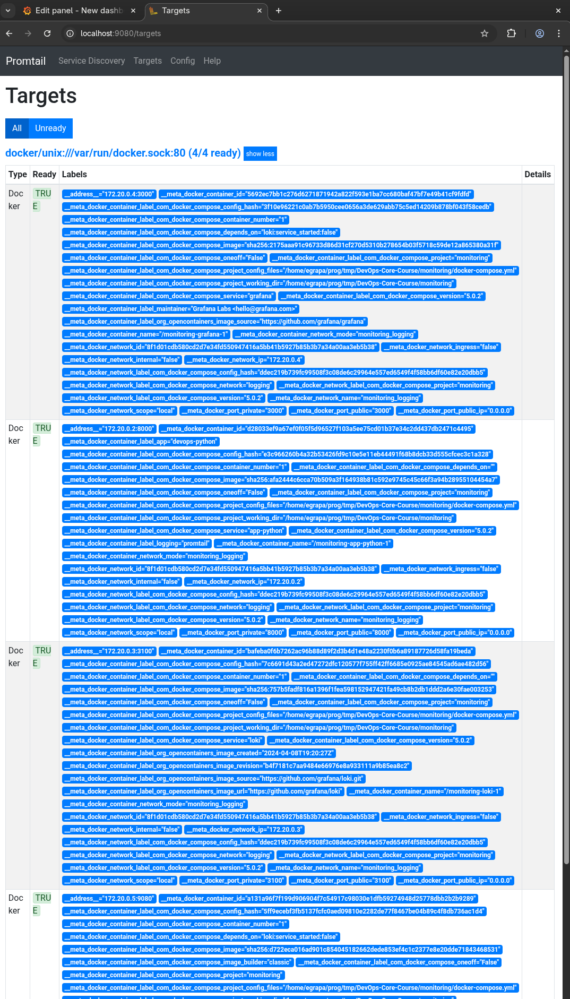
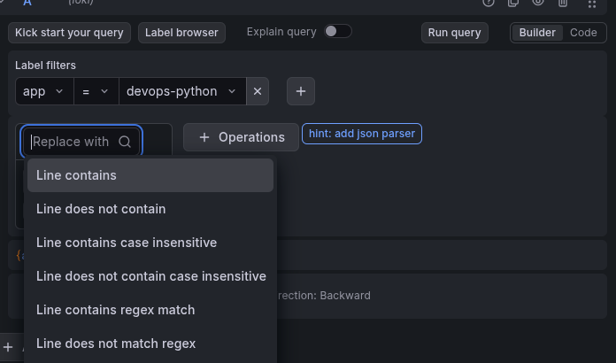
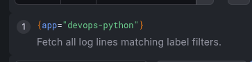

# Lab 7 — Observability & Logging with Loki Stack

**Name:** Egor Pustovoytenko  
**Date:** 2026-03-12

---

## Overview

I deployed a Loki + Promtail + Grafana stack with the Flask app feeding
structured JSON logs. The stack runs via Docker Compose on a dedicated
`logging` network with persisted volumes and health checks. Grafana
anonymous access is disabled; admin creds come from `.env`. Promtail is
built locally to include `curl` for the healthcheck probe.

---

## Architecture

```
[Flask app :8000] --stdout--> [Promtail 3.0] --push--> [Loki 3.0 TSDB]
                              labels (app,container)      |
                              docker_sd + relabeling      v
                                                [Grafana 12.3] -- dashboards
```

- Storage: Loki TSDB on filesystem (`loki-data`), Promtail positions
  (`promtail-positions`), Grafana state (`grafana-data`).
- Network: single bridge `logging`.


---

## Stack Implementation

### Compose (`monitoring/docker-compose.yml`)
- Services: `loki` (3100), `promtail` (9080), `grafana` (3000),
  `app-python` (8000).
- Mounted configs: `/etc/loki/config.yml`, `/etc/promtail/config.yml`.
- Promtail built from `monitoring/promtail/Dockerfile` (adds curl) and
  health-checked via `/ready` with `/-/ready` fallback.
- Health checks on Loki `/ready`, Grafana `/api/health`, app `/health`.
- Resource limits/reservations added to every service.
- Grafana env: anonymous disabled, admin user/pass from `.env`.

### Loki (`monitoring/loki/config.yml`)
- TSDB + filesystem object store, schema v13, `path_prefix: /loki`.
- Retention `168h` with compactor enabled; embedded cache for queries.
- Ring stored in-memory for single-node lab.

### Promtail (`monitoring/promtail/config.yml`)
- Discovers Docker containers via socket SD every 5s.
- Keeps only containers labeled `logging=promtail`; forwards `app` label.
- Keeps both `stdout` and `stderr` log streams (`__meta_docker_container_log_stream` relabel).
- Docker pipeline stage keeps JSON intact.
- Relabels container name into `container` and `job` for LogQL selectors.
- Custom image includes `curl` to support the healthcheck probe.

### Application Logging (`app_python/app.py`)
- Custom `JSONFormatter` pushes logs to stdout with fields:
  `timestamp`, `level`, `logger`, `message` + context.
- Events: `startup`, `request_received`, `response_sent`, `not_found`,
  `internal_error` (with stack trace).
- Promtail attaches `app="devops-python"` and `container="app-python"`.



---

## Validation

- Stack up: `cd monitoring && docker compose up -d --build promtail`.
- Status: `docker compose ps` → all services `Up (healthy)`.

- Loki ready: `curl -f http://localhost:3100/ready`.
- Promtail targets: `curl -s http://localhost:9080/targets`

- Grafana health: `curl -f http://localhost:3000/api/health`.
- Traffic generation:

```bash
for i in {1..20}; do curl -s http://localhost:8000/; done
for i in {1..20}; do curl -s http://localhost:8000/health; done
```

LogQL queries exercised in Explore:
 \
There is this smart interactive window, so no point in actaully understanding syntax? It even explains what is going on


## Production Notes

- Grafana anonymous auth off; creds via `.env` (example in
  `monitoring/.env.example`).
- Resource limits/reservations on every service.
- Loki retention 7 days with compactor cleanup.
- Health checks for all containers to fail fast and restart.

---

## Challenges & Decisions

- Avoided extra deps for JSON logging by writing a small formatter.
- Kept scrape scope tight with Docker label filtering to reduce noise.
- Promtail base image lacked curl/wget/nc; built a tiny derivative
  (removed broken `bullseye-backports`) so the `/ready` healthcheck
  works—was the main difficulty hit during setup.
- Balanced convenience/security: disabled anonymous Grafana and kept
  secrets out of VCS via `.env`.
