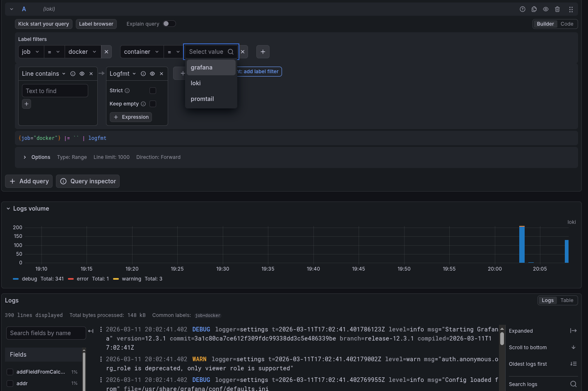
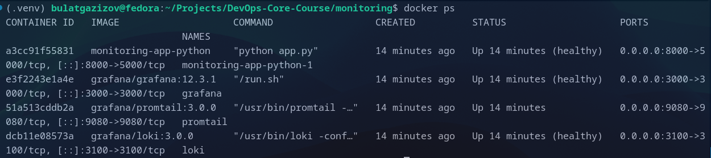

# Lab 07

## 1. Architecture

The monitoring stack follows a "Push" architecture where logs are collected at the source and shipped to a central aggregator.

* **FastAPI App**: Generates structured JSON logs.
* **Promtail**: Scrapes logs from the Docker socket, filters by labels, and pushes to Loki.
* **Loki 3.0**: Stores log chunks and indexes metadata using the TSDB engine.
* **Grafana**: Visualizes logs and converts log streams into metrics via LogQL.

## 2. Setup Guide

1. **Environment**: Create a `.env` file with `GRAFANA_ADMIN_PASSWORD`.
2. **Deployment**:

```bash
cd monitoring
docker compose up -d

```

**Verification**: Access Grafana at `http://localhost:3000` and login with the credentials from your `.env`.

## 3. Configuration

### Loki 3.0 (TSDB & Retention)

I utilized the new `common` block and `tsdb` shipping to optimize storage for Loki 3.0.

```yaml
schema_config:
  configs:
    - from: 2024-01-01
      store: tsdb
      object_store: filesystem
      schema: v13

```

* **Why**: TSDB is significantly faster than the older Boltdb-shipper and is the recommended engine for version 3.0.

### Promtail (Filtering)

Promtail is configured to only collect logs from containers with specific Docker labels.

```yaml
- source_labels: ['__meta_docker_container_label_logging']
  regex: 'promtail'
  action: keep

```

* **Why**: This prevents "log spam" from system containers and ensures I only monitor what I explicitly label.

## 4. Application Logging

I implemented structured logging using a custom `JsonFormatter` and FastAPI **Lifespan** events.

**Implementation Snippet:**

```python
class JsonFormatter(logging.Formatter):
    def format(self, record):
        log_record = {
            "timestamp": datetime.now(timezone.utc).isoformat(),
            "level": record.levelname,
            "message": record.getMessage(),
            "app": "devops-python",
            "logger": record.name
        }
        if hasattr(record, "extra_info"):
            log_record.update(record.extra_info)
        return json.dumps(log_record)

handler = logging.StreamHandler()
handler.setFormatter(JsonFormatter())
logger.addHandler(handler)

```

By outputting JSON directly to `stdout`, Promtail captures the entire object, allowing us to use the `| json` parser in LogQL.

## 5. Dashboard & LogQL

| Panel | Query | Explanation |
| --- | --- | --- |
| Logs Table | `{app=~"devops-.*"}` | Shows the raw log stream for all related apps. |
| **Request Rate** | `sum by (app) (rate({app=~"devops-.*"} [1m]))` | Converts log lines into a "Requests Per Second" metric. |
| **Error Logs** | `{app=~"devops-.*"} \| json \| level="ERROR"` | Filters JSON objects where the level key is specifically ERROR. |
| **Status Codes** | `sum by (status_code) (count_over_time({app=~"devops-.*"} \| json [5m]))` | A pie chart showing the distribution of HTTP response codes. |


## 6. Production Configuration

* **Security**: Anonymous access is disabled (`GF_AUTH_ANONYMOUS_ENABLED=false`).
* **Resources**:
* Loki: 1.0 CPU, 512MB RAM.
* Grafana/App: 0.5 CPU, 256MB RAM.

* **Health Checks**: Defined in `docker-compose.yml` using `/ready` (Loki) and `/api/health` (Grafana).

## 7. Testing

| Component | Command | Expected Result |
| --- | --- | --- |
| **Stack Status** | `docker compose ps` | All containers `(healthy)` |
| **Loki API** | `curl http://localhost:3100/ready` | `ready` |
| **Promtail UI** | `curl http://localhost:9080/targets` | List of active containers |

## 8. Evidence

### Task 1



### Task 2


### Task 3


### Task 4



