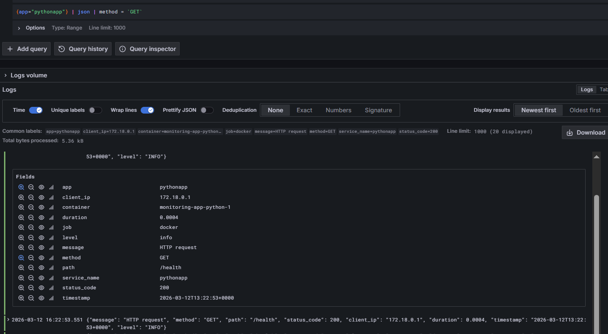
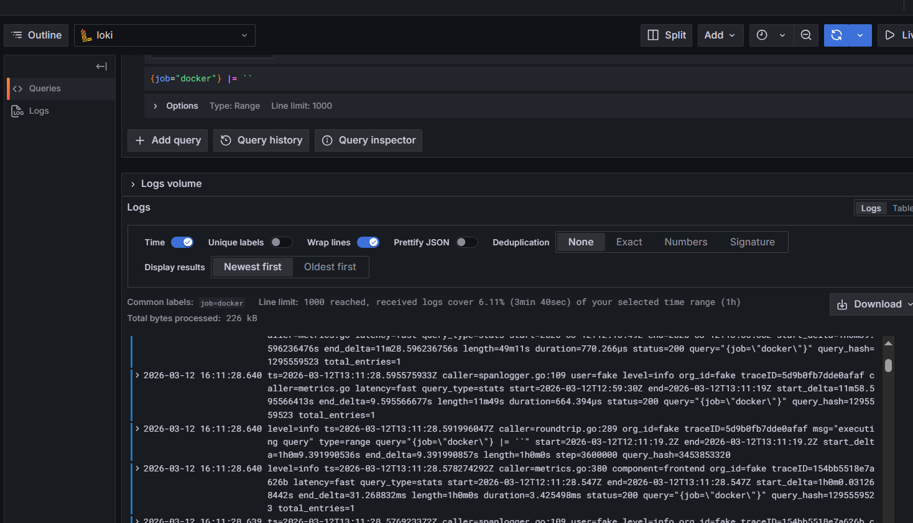
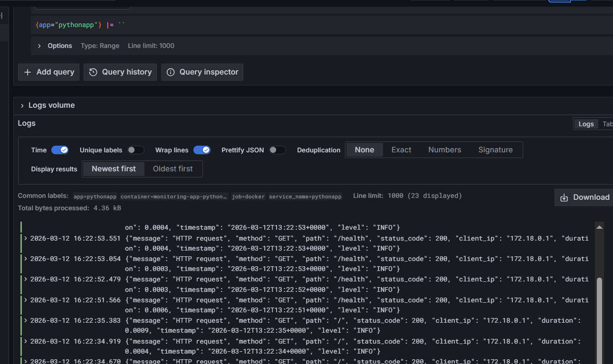
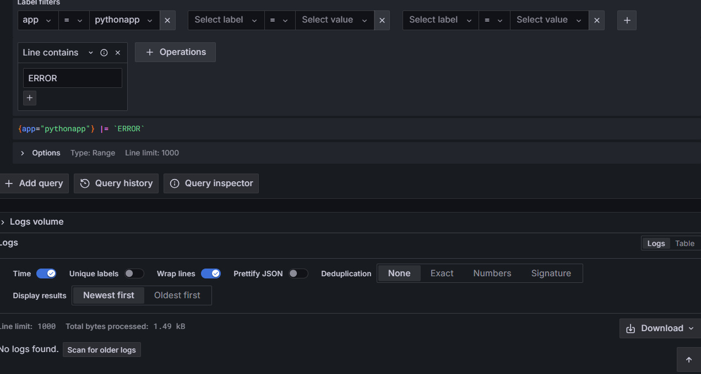
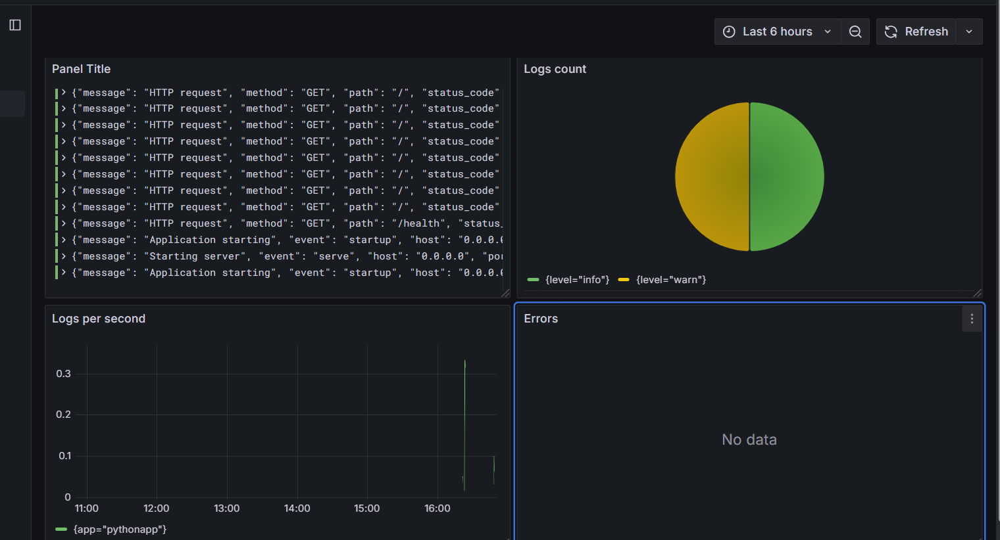
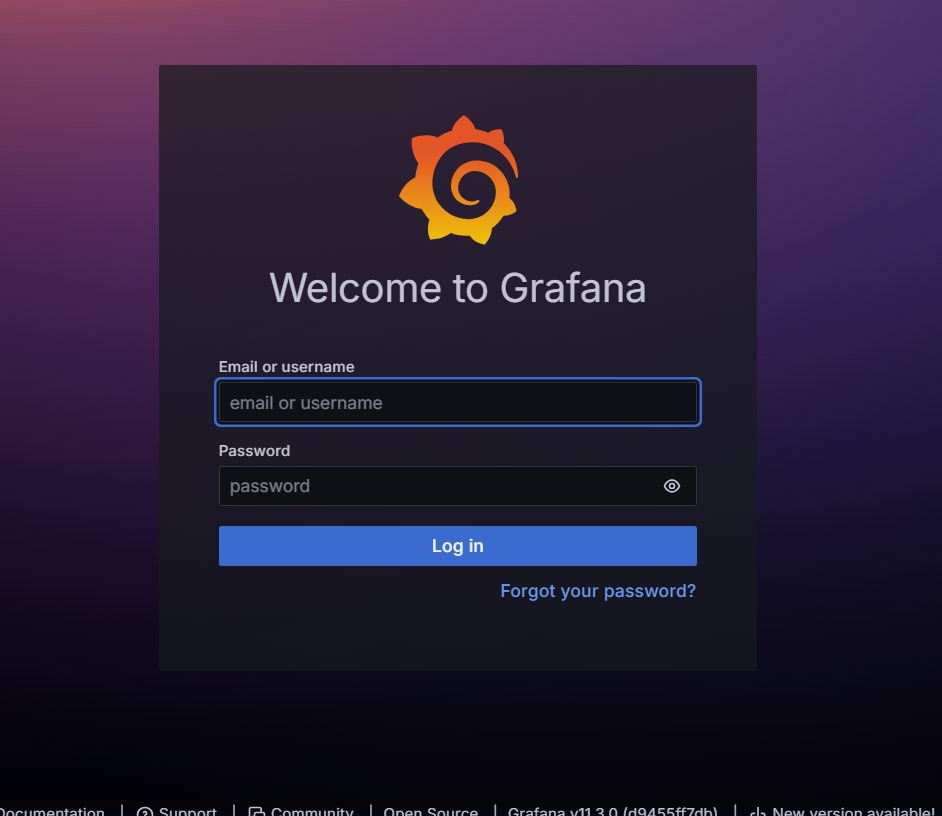

# Lab 07 - Observability & Logging with Loki Stack

## 1. Architecture

```mermaid
graph TD
    A[app-python (FastAPI)] -->|Logs via Docker Socket| B(Promtail)
    B -->|LogQL HTTP Push| D[(Loki - TSDB Storage)]
    E[Grafana] -->|LogQL Queries| D
```

- **Promtail** runs as an agent discovering Docker containers via the `/var/run/docker.sock`, scraping their logs and pushing them to Loki.
- **Loki** acts as the log aggregation system, indexing labels and storing raw log data efficiently using its TSDB backend.
- **Grafana** connects to Loki to visualize the logs and extract metrics.

## 2. Setup Guide

1. Navigate to the `monitoring` directory.
2. Initialize the `.env` file with Grafana admin password:
   ```env
   GF_AUTH_ANONYMOUS_ENABLED=false
   GF_SECURITY_ADMIN_PASSWORD=admin
   ```
3. Deploy the stack:
   ```bash
   docker compose up -d
   ```
4. Access Grafana at `http://localhost:3000`.

## 3. Configuration

### Loki
Configured to use **schema v13** with **tsdb** index type and local `filesystem` storage. We enabled `retention_period: 168h` (7 days) and proper cleanup via the compactor. The `delete_request_store` was also explicitly set to `filesystem` for compatibility with retention configuration in Loki 3.0+.

### Promtail
Configured to fetch logs directly from Docker containers via `docker_sd_configs` pointing to `unix:///var/run/docker.sock`. We added a relabeling rule to extract `__meta_docker_container_name` to define the target `container` label:

```yaml
    relabel_configs:
      - source_labels: ['__meta_docker_container_name']
        regex: '/(.*)'
        target_label: 'container'
```

## 4. Application Logging

The `app-python` application utilizes `python-json-logger` to format Python's standard logging straight into JSON:

```python
from pythonjsonlogger import jsonlogger


logHandler = logging.StreamHandler()
formatter = jsonlogger.JsonFormatter(
    fmt='%(asctime)s %(levelname)s %(message)s',
    datefmt='%Y-%m-%dT%H:%M:%S%z',
    rename_fields={
        'asctime': 'timestamp',
        'levelname': 'level'
    }
)
logHandler.setFormatter(formatter)
logging.basicConfig(level=logging.INFO, handlers=[logHandler])
logger = logging.getLogger(__name__)
```
This enables parsing `level` or `message` variables dynamically in LogQL queries

**JSON Log Output from App:**


## 5. Dashboard

The Grafana Dashboard features the following 4 panels:
1. **Panel Title**: `{app="pythonapp"}` showing a stream visualization of recent logs from the containers.
2. **Logs per second**: `sum by (app) (rate({app="pythonapp"}[1m]))` visualizing logs per second across apps.
3. **Errors**: `{app="pythonapp"} | json | level="ERROR"` or `|="ERROR"` showing specifically high-severity events in table format.
4. **Logs count**: `sum by (level) (count_over_time({app="pythonapp"} | json [5m]))` as a Pie Chart highlighting info vs errors.

**LogQL Query Evidence:**




**Dashboard Verification:**


## 6. Production Config

- **Resource Limits**: Applied `cpus` and `memory` limits to `loki`, `promtail`, `grafana` and both applications in `docker-compose.yml` using `deploy.resources.limits`.
- **Security**: Disabled anonymous authentication in Grafana (`GF_AUTH_ANONYMOUS_ENABLED=false`).
  
- **Healthchecks**: Configured the apps and Grafana/Loki to support proper startup periods via Docker's embedded `healthcheck:` mechanism leveraging `wget`.

## 7. Testing

Health check:
```bash
curl http://localhost:8000/health
{"status":"healthy","timestamp":"2026-03-12T14:12:42.136853","uptime_seconds":984}
```

```bash
docker compose ps

NAME                      IMAGE                                COMMAND                  SERVICE      CREATED
STATUS                    PORTS
monitoring-app-python-1   aidarsarvartdinov/pythonapp:latest   "python app.py"          app-python   14 minutes ago   
Up 14 minutes             0.0.0.0:8000->5000/tcp, [::]:8000->5000/tcp
monitoring-grafana-1      grafana/grafana:11.3.0               "/run.sh"                grafana      14 minutes ago   
Up 14 minutes (healthy)   0.0.0.0:3000->3000/tcp, [::]:3000->3000/tcp
monitoring-loki-1         grafana/loki:3.0.0                   "/usr/bin/loki -conf…"   loki         14 minutes ago   
Up 14 minutes (healthy)   0.0.0.0:3100->3100/tcp, [::]:3100->3100/tcp
monitoring-promtail-1     grafana/promtail:3.0.0               "/usr/bin/promtail -…"   promtail     14 minutes ago   
Up 14 minutes             0.0.0.0:9080->9080/tcp, [::]:9080->9080/tcp
```

Verify the Grafana and Loki availability:
```bash
curl http://localhost:3100/ready

ready
```

