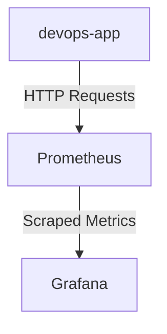

# Lab 8 Documentation Report

## Architecture



**Components:**
1. **devops-app**: Service that exposes metrics endpoints
2. **Prometheus**: Time series database and scraping server
3. **Grafana**: Visualization layer for metrics

## Application Instrumentation

### Metrics Implemented

1. **HTTP Request Metrics**:
   - `http_requests_total`: Counter for total HTTP requests
     - Labels: `method`, `endpoint`, `status_code`
   - `http_request_duration_seconds`: Histogram for request duration
     - Labels: `method`, `endpoint`

2. **Application-Specific Metrics**:
   - `app_processing_time_seconds`: Custom metric tracking internal processing time
   - `active_connections`: Gauge tracking current active connections

### Implementation Details

```java
// Example metrics endpoint implementation
@GetMapping("/metrics")
public String getMetrics() {
    return metricsRegistry.snapshot();
}

// Adding custom metrics
metricsRegistry.counter("app_processing_time_seconds", "time spent processing requests");
```

## Prometheus Configuration

### Config

**prometheus.yml**:
```yaml
global:
  scrape_interval: 15s
  evaluation_interval: 15s

scrape_configs:
    - job_name: "devops-app"
      static_configs:
          - targets: ["app:5000"]
      metrics_path: "/metrics"

    - job_name: "grafana"
      static_configs:
          - targets: ["grafana:3000"]
      metrics_path: "/metrics"
```

## Grafana Dashboard Walkthrough

### New 6 item Dashboard


### 7 Dashboard Panels present

1. **Request Rate** (Graph)
   - Query: `sum(rate(http_requests_total[5m])) by (endpoint)`
   - Shows requests/sec per endpoint

2. **Error Rate** (Graph)
   - Query: `sum(rate(http_requests_total{status=~"5.."}[5m]))`
   - Shows 5xx errors/sec

3. **Request Duration p95** (Graph)
   - Query: `histogram_quantile(0.95, rate(http_request_duration_seconds_bucket[5m]))`
   - Shows 95th percentile latency

4. **Request Duration Heatmap** (Heatmap)
   - Query: `rate(http_request_duration_seconds_bucket[5m])`
   - Visualizes latency distribution

5. **Active Requests** (Gauge)
   - Query: `http_requests_in_progress`
   - Shows concurrent requests

6. **Status Code Distribution** (Pie Chart)
   - Query: `sum by (status) (rate(http_requests_total[5m]))`
   - Shows 2xx vs 4xx vs 5xx

7. **Uptime** (Stat)
   - Query: `up{job="app"}`
   - Shows if service is up (1) or down (0)

## Production Setup

### Health Checks Configuration

All services except promtail now have healthchecks. Adding healthcheck to promtail would require extending the base image

### Resource Limits

**Prometheus Configuration**:
```yaml
resources:
  limits:
    memory: 1G
    cpus: 2
```

### Data Retention Policy

Prometheus data is located in prometheus-data persistent volume, so it won't disappear after restart

```bash
volumes:
    - ./prometheus.yml:/etc/prometheus/prometheus.yml:ro
    - prometheus-data:/prometheus
<...>
command:
    - "--config.file=/etc/prometheus/prometheus.yml"
    - "--storage.tsdb.retention.time=15d"
    - "--storage.tsdb.retention.size=10GB"
```

## Testing Results


## Challenges & Solutions

The only challenge was implementing promtail healthcheck, as base image doesn't has wget, curl, and doesn't direct tcp. I decided to leave no healthcheck, instead of extending base image (or making dummy healthcheck)
