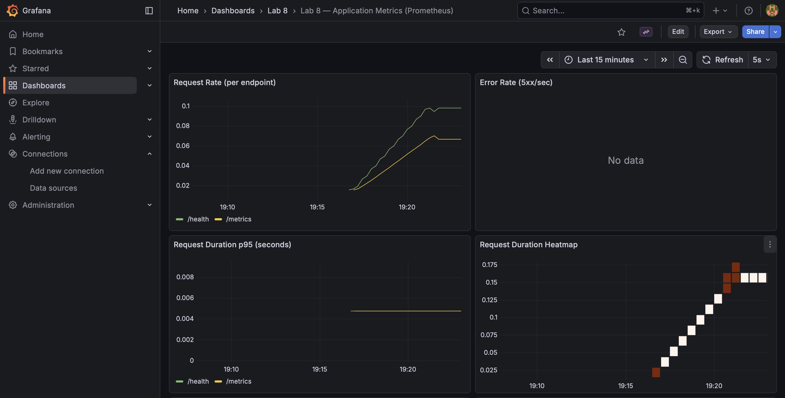
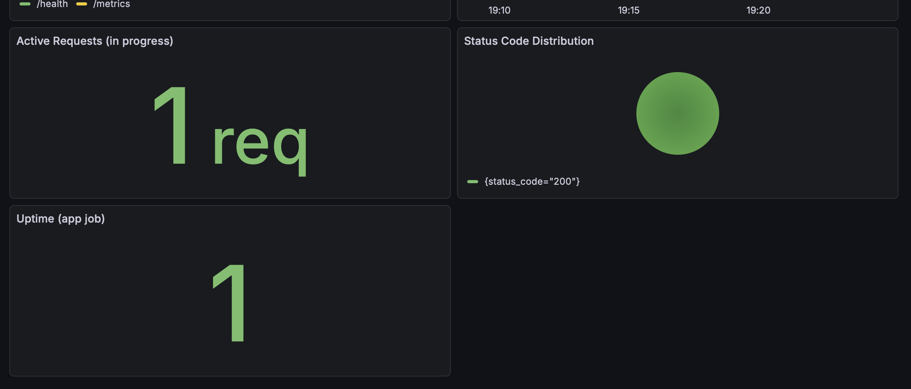
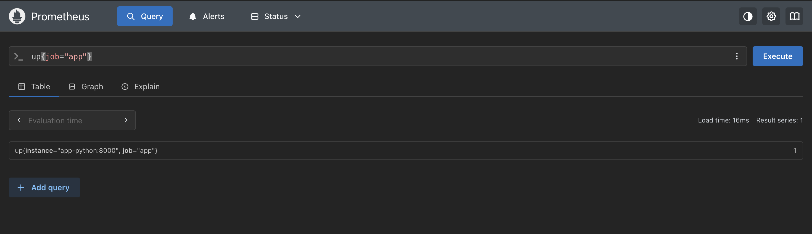
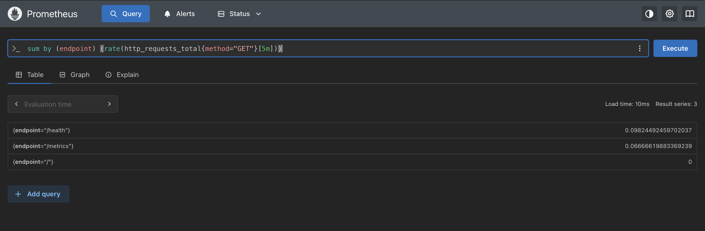
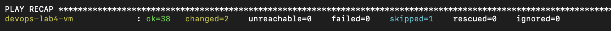
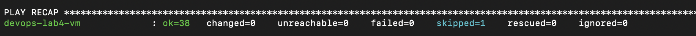
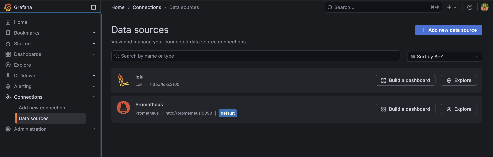
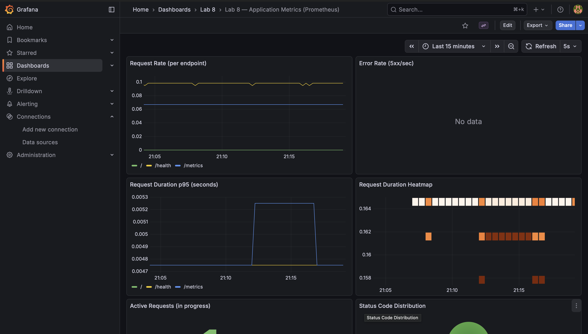

# Lab 8 — Metrics & Monitoring with Prometheus: Implementation Report

This report documents the complete implementation of Lab 8: application instrumentation with Prometheus metrics, deployment of a Prometheus + Grafana stack, creation of a metrics dashboard, and hardening via health checks, resource limits, retention, and persistent volumes.

---

## 1. Architecture

Metrics flow (pull model):

```
┌──────────────────────────────┐
│         Docker Host          │
│                              │
│  app-python (Flask)         │
│  - exposes /metrics          │
│     http_requests_total     │
│     http_request_duration… │
│     http_requests_in_progress
│                              │
│          ┌──────────────┐   │
│          │  Prometheus   │   │
│          │  scrape /15s  │◄──┼──── app-python:8000/metrics
│          │  stores TSDB │   │
│          └──────────────┘   │
│                  ▲            │
│                  │            │
│          ┌──────────────┐   │
│          │   Grafana     │   │
│          │  dashboard UI │   │
│          │  PromQL queries│  │
│          └──────────────┘   │
└──────────────────────────────┘
```

---

## 2. Application Instrumentation

Implemented Task 1 by instrumenting the Python Flask app with Prometheus metrics and adding the `/metrics` endpoint.

### 2.1 Added `/metrics` endpoint

File: `app_python/app.py`

- Implemented `/metrics` endpoint returning `generate_latest()` with `CONTENT_TYPE_LATEST`.

### 2.2 Metric definitions (HTTP RED)

File: `app_python/app.py`

- `http_requests_total` (Counter)
  - Labels: `method`, `endpoint`, `status_code`
  - Purpose: request counting + error counting.
- `http_request_duration_seconds` (Histogram)
  - Labels: `method`, `endpoint`
  - Purpose: latency distribution (p95 + heatmap).
- `http_requests_in_progress` (Gauge)
  - Purpose: number of concurrent in-flight requests.

Endpoint label normalization (cardinality control):

- `/` stays `/`
- `/health` stays `/health`
- everything else becomes `other`
- `/metrics` is included (to follow Lab 8 requirements)

### 2.3 Added application-specific metrics (Task 1.4)

- `devops_info_endpoint_calls_total` (Counter, label `endpoint`)
  - Tracks how often app endpoints are called (normalized).
- `devops_info_system_collection_seconds` (Histogram)
  - Measures time spent in `get_system_info()` to collect system data.

---

## 3. Prometheus Configuration

Implemented Task 2 by extending the Lab 7 Docker Compose stack with Prometheus and adding Prometheus configuration.

### 3.1 Docker Compose changes

File: `monitoring/docker-compose.yml`

Added:

- `prometheus`
  - Image: `prom/prometheus:v3.9.0`
  - Port mapping: `9090:9090`
  - Config mount: `./prometheus/prometheus.yml -> /etc/prometheus/prometheus.yml`
  - Retention via command flags:
    - `--storage.tsdb.retention.time=15d`
    - `--storage.tsdb.retention.size=10GB`
  - Persistent volume: `prometheus-data:/prometheus`

Health checks were added for:

- `loki` (`/ready`)
- `promtail` (`/ready`)
- `grafana` (`/api/health`)
- `prometheus` (`/-/healthy`)
- `app-python` (`/health`)
- `app-go` (`/health`, bonus profile)

### 3.2 Prometheus scrape config

File: `monitoring/prometheus/prometheus.yml`

- Global scrape interval:
  - `scrape_interval: 15s`
- Scrape jobs:
  - `prometheus` -> `localhost:9090`
  - `app` -> `app-python:8000/metrics`
  - `loki` -> `loki:3100` (default `/metrics`)
  - `grafana` -> `grafana:3000` (default `/metrics`)

---

## 4. Grafana Dashboards

Implemented Task 3 by provisioning:

- Prometheus datasource
- a custom dashboard containing 7 panels (6+ required)

Provisioning files:

- Datasource: `monitoring/grafana/provisioning/datasources/prometheus.yml`
- Dashboard: `monitoring/grafana/provisioning/dashboards/lab8-metrics-dashboard.json`
- Providers: `monitoring/grafana/provisioning/dashboards/dashboards.yml`

### 4.1 Dashboard panels & queries

Dashboard title:

- `Lab 8 — Application Metrics (Prometheus)` (`uid: lab8-metrics`)

Panels:

- `Request Rate (per endpoint)` (timeseries)
  - Query: `sum by (endpoint) (rate(http_requests_total{method="GET"}[5m]))`
- `Error Rate (5xx/sec)` (timeseries)
  - Query: `sum(rate(http_requests_total{method="GET",status_code=~"5.."}[5m]))`
- `Request Duration p95 (seconds)` (timeseries)
  - Query: `histogram_quantile(0.95, sum by (le, endpoint) (rate(http_request_duration_seconds_bucket{method="GET"}[5m])))`
- `Request Duration Heatmap` (heatmap)
  - Query: `sum by (le) (rate(http_request_duration_seconds_bucket{method="GET"}[5m]))`
- `Active Requests (in progress)` (stat)
  - Query: `http_requests_in_progress`
- `Status Code Distribution` (pie chart)
  - Query: `sum by (status_code) (rate(http_requests_total{method="GET"}[5m]))`
- `Uptime (app job)` (stat)
  - Query: `up{job="app"}`

---

## 5. PromQL Examples (RED Method)

The RED Method mapping:

- Rate (traffic): requests per second
- Errors (failure rate): 5xx responses
- Duration (latency): histogram p95 + distribution

Example queries used/derived for the dashboard:

1. Request rate (R)
   - `sum by (endpoint) (rate(http_requests_total{method="GET"}[5m]))`
   - Shows request throughput for each endpoint.
2. Error rate (E)
   - `sum(rate(http_requests_total{method="GET",status_code=~"5.."}[5m]))`
   - Shows 5xx per second (error traffic).
3. p95 latency (D)
   - `histogram_quantile(0.95, sum by (le, endpoint) (rate(http_request_duration_seconds_bucket{method="GET"}[5m])))`
   - Estimates the 95th percentile request duration.
4. In-progress concurrency (RED-adjacent)
   - `http_requests_in_progress`
   - Current number of requests being processed.
5. Latency distribution buckets (D)
   - `sum by (le) (rate(http_request_duration_seconds_bucket{method="GET"}[5m]))`
   - Bucket rates suitable for heatmaps.
6. Uptime (service health)
   - `up{job="app"}`
   - Helps validate the target is reachable by Prometheus.

---

## 6. Production Setup

Implemented Task 4.

### 6.1 Resource limits

File: `monitoring/docker-compose.yml`

Set the required limits on:

- Prometheus: `cpus: "1.0"`, `memory: 1G`
- Loki: `cpus: "1.0"`, `memory: 1G`
- Grafana: `cpus: "0.5"`, `memory: 512M`
- Apps: `cpus: "0.5"`, `memory: 256M`

### 6.2 Health checks

Added health checks for all critical services to make `depends_on`/readiness behavior reliable.

### 6.3 Data retention

Prometheus TSDB retention:

- time: `15d`
- size: `10GB`

### 6.4 Persistent volumes

File: `monitoring/docker-compose.yml`

- `prometheus-data` for Prometheus
- existing:
  - `loki-data`
  - `grafana-data`

---

## 7. Testing Results

Test procedure (commands to run locally on the Docker host):

1. Verify metrics endpoint:
   - `curl http://localhost:8000/metrics | head`
2. Verify Prometheus scrape targets:
   - Open `http://localhost:9090/targets`
   - Expected: all relevant targets are `UP`
3. Validate PromQL queries:
   - Query `up{job="app"}`
   - Query `rate(http_requests_total[5m])`
4. Verify Grafana provisioning:
   - Open `http://localhost:3001/`
   - Login with Grafana admin credentials
   - Dashboard `Lab 8 — Application Metrics (Prometheus)` should be present

Evidence:

- Grafana dashboard panels:
  
  
- Prometheus successful queries / validation:
  
  

---

## 8. Challenges & Solutions

1. Metric self-scrape noise
   - Solution: endpoint normalization keeps label cardinality low, and the Lab 8 requirement for counting `/metrics` was followed.
2. Label cardinality control
   - Solution: endpoint normalization (`/`, `/health`, `other`) to avoid unbounded label growth.
3. Histogram latency to p95
   - Solution: used `histogram_quantile(0.95, ...)` on `http_request_duration_seconds_bucket` rates.
4. Automatic dashboard availability
   - Solution: provisioned datasource + dashboard via Grafana provisioning files mounted into the Grafana container.

---

## Metrics vs Logs (Lab 7 comparison)

- Logs (Lab 7 with Loki): record detailed event context (what happened).
- Metrics (Lab 8 with Prometheus): provide aggregated, quantifiable behavior (how much / how often / how long).

Typical rule of thumb:

- Use metrics for alerting, SLO/SLA, capacity, and latency trends.
- Use logs for deep investigation when an alert fires.

---

## Bonus — Ansible Automation

Я расширил Ansible-роль `ansible/roles/monitoring/` так, чтобы она деплоилала полный стек наблюдаемости (Lab 7 + Prometheus из Lab 8) и автоматически провязывала данные в Grafana через provisioning.

Что сделано в бонусе:

- Добавлен Prometheus (с конфигом `prometheus.yml`) в templated `docker-compose.yml.j2`.
- Добавлена генерация Prometheus конфигурации через шаблон `templates/prometheus.yml.j2` и список `prometheus_targets` в `roles/monitoring/defaults/main.yml`.
- Добавлены provisioning-файлы Grafana:
  - datasource Prometheus: `templates/datasource-prometheus.yml.j2`
  - datasource Loki с фиксированным UID: `templates/datasource-loki.yml.j2`
- Реализовано provisioning dashboard’ов Grafana (metrics + logs):
  - файлы dashboard JSON в `roles/monitoring/files/`
  - провайдер `dashboards.yml` и копирование через `roles/monitoring/tasks/grafana.yml`
- Обновлён wait в `roles/monitoring/tasks/deploy.yml`, чтобы дополнительно дождаться Prometheus.

Запуск (на вашем VM из `ansible/inventory/hosts.ini`):
- `ansible-playbook playbooks/deploy-monitoring.yml`

Bonus evidence:

- Ansible run #1 (successful deployment):
  
- Ansible run #2 (idempotency check):
  
- Grafana data sources (Loki + Prometheus provisioned):
  
- Grafana metrics dashboard provisioned and working:
  

