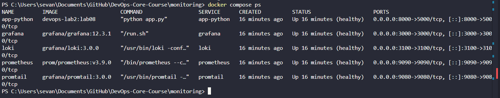
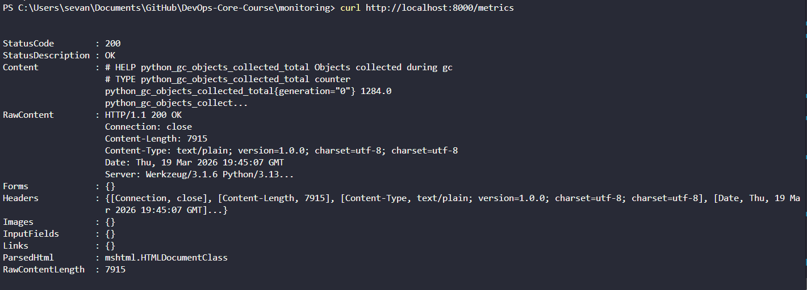
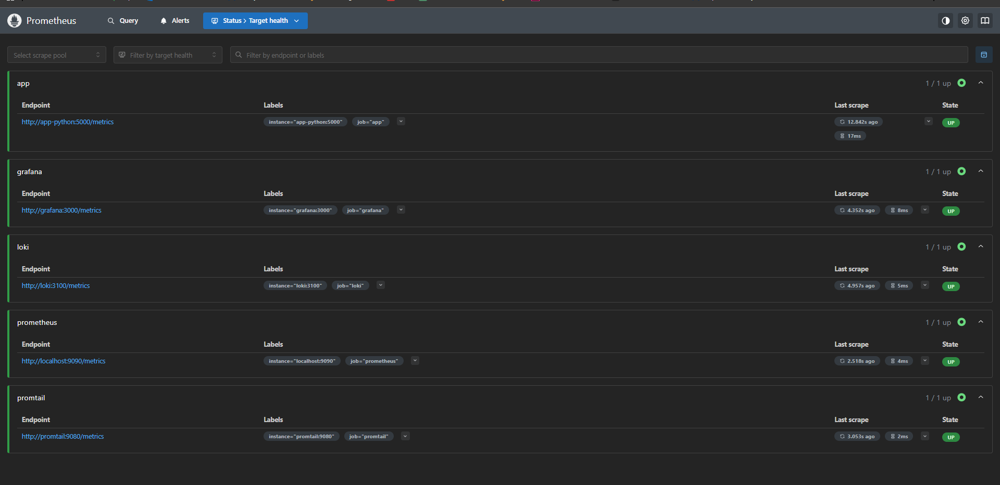
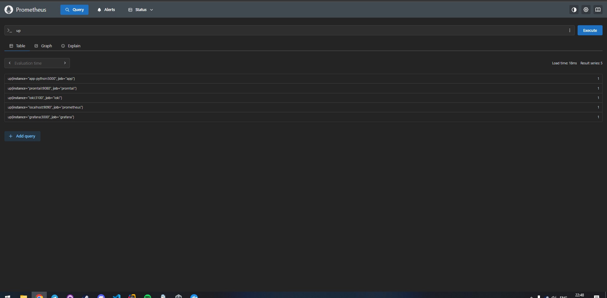
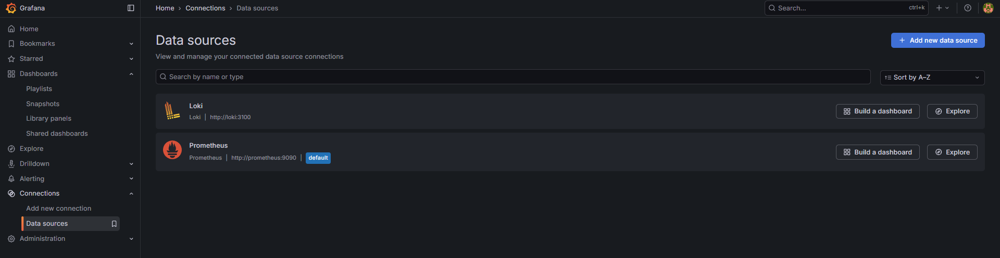
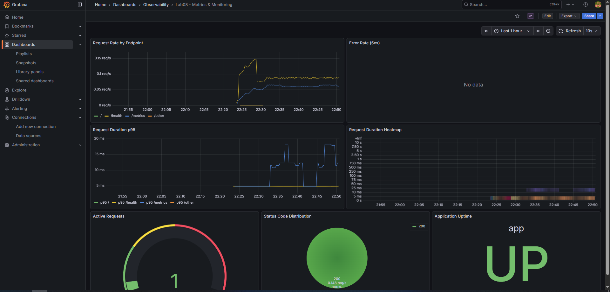
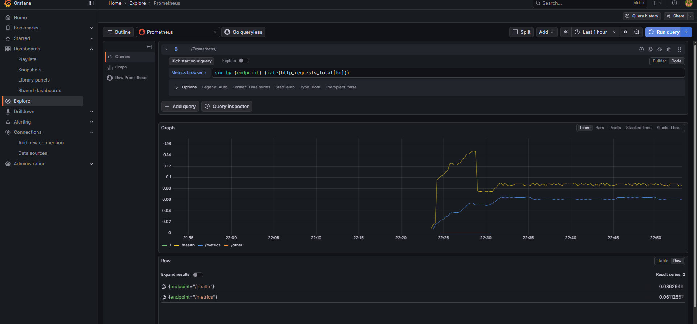
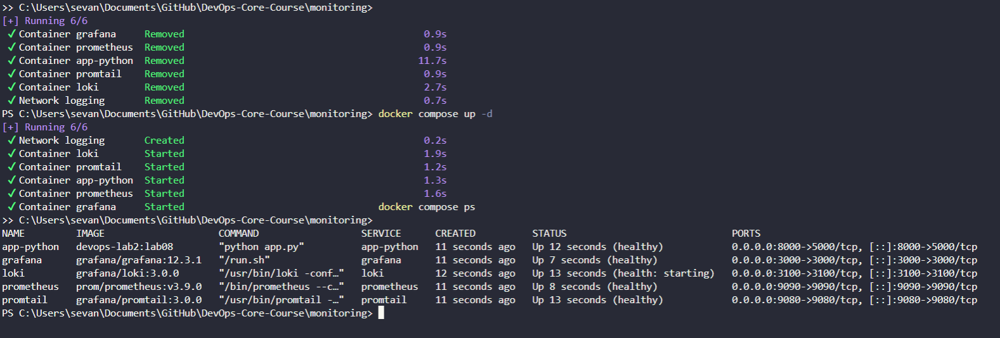

# LAB08 - Metrics and Monitoring with Prometheus

## 1. Scope

This lab adds a full metrics pipeline for the Python service:
- app instrumentation with `prometheus_client`
- `GET /metrics` endpoint
- Prometheus scraping and storage
- Grafana dashboards for metrics
- existing logs stack from LAB07 (Loki + Promtail + Grafana) kept active

## 2. Application Instrumentation

File: `Lab-1/app_python/app.py`

Implemented metrics:
- `http_requests_total{method,endpoint,status_code}` (Counter)
- `http_request_duration_seconds{method,endpoint}` (Histogram)
- `http_requests_in_progress{method,endpoint,status_code="in_progress"}` (Gauge)
- `devops_info_endpoint_calls_total{endpoint}` (Counter)
- `devops_info_system_collection_seconds` (Histogram)

Notes:
- Endpoint labels are normalized (`/`, `/health`, `/metrics`, `/swagger.json`, `/docs`, `/other`) to avoid high cardinality.
- RED method is covered:
  - Rate: `http_requests_total`
  - Errors: `http_requests_total{status_code=~"5.."}`
  - Duration: `http_request_duration_seconds`

## 3. Prometheus Setup

Files:
- `monitoring/prometheus/prometheus.yml`
- `monitoring/docker-compose.yml`

Key config:
- `scrape_interval: 15s`
- `evaluation_interval: 15s`
- retention:
  - `--storage.tsdb.retention.time=15d`
  - `--storage.tsdb.retention.size=10GB`

Scrape jobs:
- `prometheus` -> `localhost:9090`
- `app` -> `app-python:5000/metrics`
- `loki` -> `loki:3100/metrics`
- `grafana` -> `grafana:3000/metrics`
- `promtail` -> `promtail:9080/metrics`

## 4. Grafana Dashboard

File:
- `monitoring/grafana/dashboards/lab08-metrics-dashboard.json`

Panels:
1. Request Rate by Endpoint
2. Error Rate (5xx)
3. Request Duration p95
4. Request Duration Heatmap
5. Active Requests
6. Status Code Distribution
7. Application Uptime

## 5. PromQL Queries Used

```promql
sum by (endpoint) (rate(http_requests_total[5m]))
```

```promql
sum(rate(http_requests_total{status_code=~"5.."}[5m]))
```

```promql
histogram_quantile(0.95, sum by (le, endpoint) (rate(http_request_duration_seconds_bucket[5m])))
```

```promql
sum(http_requests_in_progress)
```

```promql
up
```

## 6. Validation Summary

Validated on 2026-03-19:
- `docker compose ps` shows the stack running.
- `curl http://localhost:8000/metrics` returns custom and runtime metrics.
- `curl http://localhost:9090/-/healthy` returns healthy status.
- `up` query in Prometheus reports `app/prometheus/loki/grafana/promtail`.
- Grafana has both data sources: `Loki` and `Prometheus`.
- Dashboard `lab08-metrics` is available and displays live data.
- After `docker compose down && docker compose up -d`, dashboards remain (persistent volumes).

## 7. Screenshots










## 8. Issues and Fixes

- PromQL parse error in Grafana Explore was caused by running PromQL on the `Loki` datasource.
  Fix: switch datasource to `Prometheus`.
- Potential label cardinality growth.
  Fix: endpoint label normalization.
- Right after restart, a service may briefly show `health: starting`.
  Fix: wait 10-30 seconds and run `docker compose ps` again.
