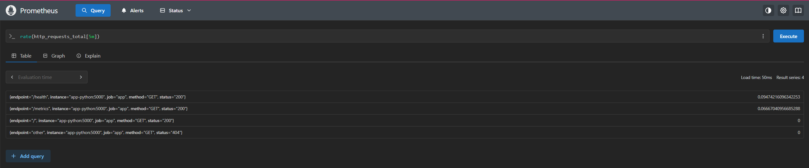
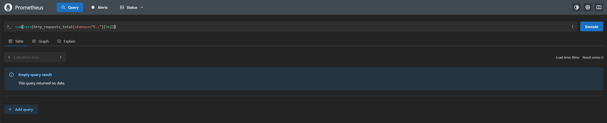
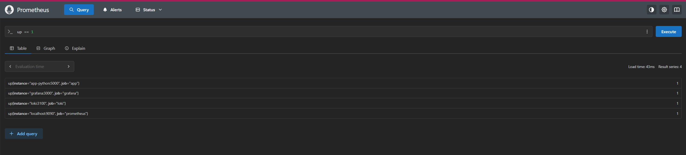
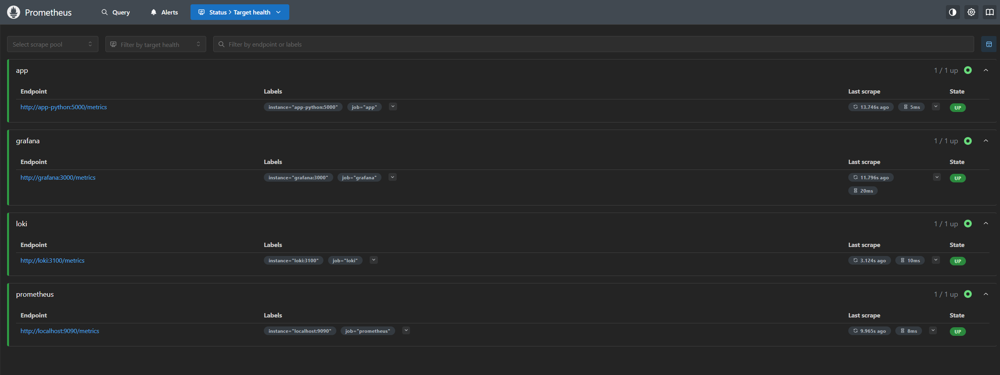
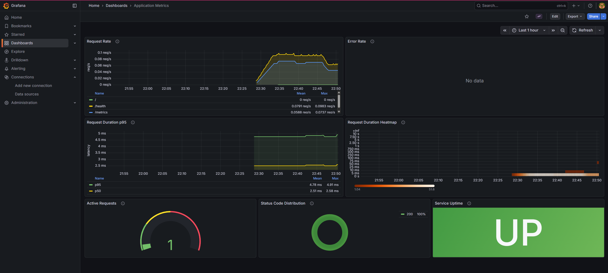
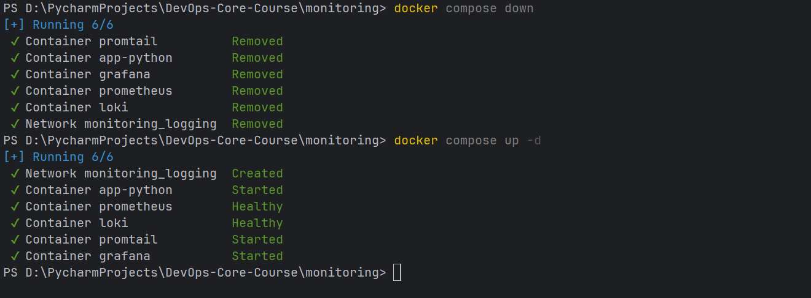
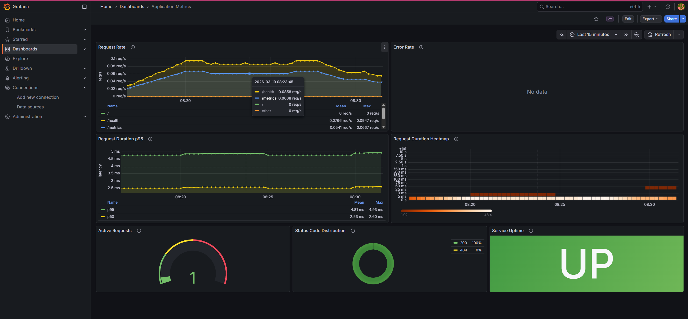

# Lab 8 — Metrics & Monitoring with Prometheus

## 1. Architecture

```
┌──────────────┐         ┌──────────────┐         ┌──────────────┐
│  app-python  │◄─scrape─│  Prometheus  │         │   Grafana    │
│  :5000       │         │  :9090       │◄─query──│  :3000       │
│  /metrics    │         │              │         │              │
└──────────────┘         └──────────────┘         └──────────────┘
                              │                        │
                       scrape │                  query │
                              ▼                        ▼
                       ┌──────────────┐        ┌──────────────┐
                       │    Loki      │        │  Dashboards  │
                       │   :3100      │        │  (metrics +  │
                       │   /metrics   │        │   logs)      │
                       └──────────────┘        └──────────────┘
                              ▲
                              │push
                       ┌──────────────┐
                       │   Promtail   │
                       │   :9080      │
                       └──────────────┘
                              ▲
                              │ Docker logs
                       ┌──────────────┐
                       │  Docker      │
                       │  containers  │
                       └──────────────┘
```

**Data flow:**

1. **app-python** exposes metrics at `/metrics` using `prometheus_client`.
2. **Prometheus** scrapes all targets every 15 seconds (app, itself, Loki, Grafana).
3. **Prometheus** stores time-series data locally with 15-day retention.
4. **Grafana** queries Prometheus via PromQL to render dashboard panels.
5. **Loki** receives logs from Promtail (push-based), while Prometheus scrapes Loki's own metrics.
6. **Grafana** combines both data sources for full observability (logs + metrics).

---

## 2. Application Instrumentation

### Metric Definitions

| Metric | Type | Labels | Purpose |
|--------|------|--------|---------|
| `http_requests_total` | Counter | `method`, `endpoint`, `status` | Tracks total HTTP requests (RED: Rate & Errors) |
| `http_request_duration_seconds` | Histogram | `method`, `endpoint` | Measures request latency distribution (RED: Duration) |
| `http_requests_in_progress` | Gauge | — | Tracks concurrent request count |
| `devops_info_endpoint_calls` | Counter | `endpoint` | Business metric: per-endpoint call count |
| `devops_info_system_collection_seconds` | Histogram | — | Business metric: time to gather system info |

### Why These Metrics?

The metrics follow the **RED method** (Rate, Errors, Duration), which is the standard approach for request-driven services:

- **Rate** (`http_requests_total`): How many requests per second are we serving? Helps understand load.
- **Errors** (`http_requests_total{status=~"5.."}`) : What fraction of requests fail? Detects outages.
- **Duration** (`http_request_duration_seconds`): How long do requests take? Identifies latency regressions.

Business metrics (`devops_info_endpoint_calls`, `devops_info_system_collection_seconds`) provide application-specific insight beyond generic HTTP telemetry.

### Label Cardinality

Endpoint labels are normalized to a fixed set (`/`, `/health`, `/metrics`, `other`) to prevent cardinality explosion from arbitrary paths (e.g., 404 scans).

**Note**: The label `status` is used instead of `status_code` for brevity, while preserving the same semantic meaning.
### Implementation

Metrics are collected via a FastAPI middleware that wraps every request:

```python
from prometheus_client import Counter, Histogram, Gauge, generate_latest, CONTENT_TYPE_LATEST

http_requests_total = Counter(
    "http_requests_total",
    "Total HTTP requests",
    ["method", "endpoint", "status"],
)

http_request_duration_seconds = Histogram(
    "http_request_duration_seconds",
    "HTTP request duration in seconds",
    ["method", "endpoint"],
)

http_requests_in_progress = Gauge(
    "http_requests_in_progress",
    "HTTP requests currently being processed",
)
```

The `/metrics` endpoint returns Prometheus exposition format via `generate_latest()`.

---

## 3. Prometheus Configuration

### File: `monitoring/prometheus/prometheus.yml`

```yaml
global:
  scrape_interval: 15s
  evaluation_interval: 15s

scrape_configs:
  - job_name: "prometheus"
    static_configs:
      - targets: ["localhost:9090"]

  - job_name: "app"
    static_configs:
      - targets: ["app-python:5000"]
    metrics_path: "/metrics"

  - job_name: "loki"
    static_configs:
      - targets: ["loki:3100"]
    metrics_path: "/metrics"

  - job_name: "grafana"
    static_configs:
      - targets: ["grafana:3000"]
    metrics_path: "/metrics"
```

### Scrape Targets

| Job | Target | Port | Path | Purpose |
|-----|--------|------|------|---------|
| `prometheus` | `localhost:9090` | 9090 | `/metrics` | Prometheus self-monitoring |
| `app` | `app-python:5000` | 5000 | `/metrics` | Application metrics |
| `loki` | `loki:3100` | 3100 | `/metrics` | Log aggregator metrics |
| `grafana` | `grafana:3000` | 3000 | `/metrics` | Dashboard service metrics |

**Note**: Prometheus scrapes the application via the internal Docker network using the container port (5000),
while port 8000 is mapped to the host for external access (0.0.0.0:8000 -> 5000).
### Retention Policy

Configured via command-line flags on the Prometheus container:

- **Time-based:** `--storage.tsdb.retention.time=15d` (keep data for 15 days)
- **Size-based:** `--storage.tsdb.retention.size=10GB` (cap disk usage at 10 GB)

Whichever limit is hit first triggers data deletion. This balances query depth with disk usage.

### PromQL query

---

## 4. Dashboard Walkthrough

The **Application Metrics** dashboard (`uid: app-metrics`) has 7 panels:

### Panel 1 — Request Rate (Timeseries)

- **Query:** `sum(rate(http_requests_total[5m])) by (endpoint)`
- **Purpose:** Visualizes requests/second per endpoint. The primary indicator of traffic load.
- **Unit:** req/s

### Panel 2 — Error Rate (Timeseries)

- **Query:** `sum(rate(http_requests_total{status=~"5.."}[5m]))`
- **Purpose:** Tracks 5xx errors per second. A non-zero value signals application failures.
- **Thresholds:** green < 0.1/s, yellow < 1/s, red ≥ 1/s

### Panel 3 — Request Duration p95 (Timeseries)

- **Query:** `histogram_quantile(0.95, sum(rate(http_request_duration_seconds_bucket[5m])) by (le))`
- **Purpose:** Shows 95th-percentile latency. Captures the "worst-case-for-most-users" experience.
- **Unit:** seconds

### Panel 4 — Request Duration Heatmap (Heatmap)

- **Query:** `sum(increase(http_request_duration_seconds_bucket[5m])) by (le)`
- **Purpose:** Visualizes latency distribution over time. Useful for spotting bimodal patterns.

### Panel 5 — Active Requests (Gauge)

- **Query:** `http_requests_in_progress`
- **Purpose:** Shows current concurrency level. High values indicate saturation.
- **Thresholds:** green < 5, yellow < 10, red ≥ 10

### Panel 6 — Status Code Distribution (Pie Chart)

- **Query:** `sum by (status) (rate(http_requests_total[5m]))`
- **Purpose:** Shows proportion of 2xx vs 4xx vs 5xx responses at a glance.

### Panel 7 — Service Uptime (Stat)

- **Query:** `up{job="app"}`
- **Purpose:** Binary indicator (UP/DOWN) of whether Prometheus can reach the application.
- **Mappings:** 1 → "UP" (green), 0 → "DOWN" (red)

---

## 5. PromQL Examples

### 1. Total request rate across all endpoints

```promql
sum(rate(http_requests_total[5m]))
```

Returns the aggregate requests per second over the last 5 minutes.

### 2. Error query

```promql
sum(rate(http_requests_total{status=~"5.."}[5m]))
```

Calculates requests resulting in server errors.

### 3. 95th percentile latency per endpoint

```promql
histogram_quantile(0.95, sum(rate(http_request_duration_seconds_bucket[5m])) by (le, endpoint))
```

Shows the p95 latency broken down by endpoint.

### 4. Services that are currently up

```promql
up == 1
```

Returns any scrape target that Prometheus can reach.

### 5. CPU usage of the Python application process

```promql
rate(process_cpu_seconds_total{job="app"}[5m]) * 100
```

Approximates CPU usage percentage from the built-in process collector.

### 6. Top endpoints by request volume

```promql
topk(5, sum by (endpoint) (rate(http_requests_total[5m])))
```

Ranks endpoints by traffic, useful for capacity planning.

### 7. Histogram average request duration

```promql
rate(http_request_duration_seconds_sum[5m]) / rate(http_request_duration_seconds_count[5m])
```

Calculates the mean request duration from histogram sum and count.

---

## 6. Production Setup

### Health Checks

All services have Docker health checks configured:

| Service | Check | Interval | Timeout | Retries |
|---------|-------|----------|---------|---------|
| Loki | `wget http://localhost:3100/ready` | 10s | 5s | 5 |
| Prometheus | `wget http://localhost:9090/-/healthy` | 10s | 5s | 5 |
| Grafana | `wget http://localhost:3000/api/health` | 10s | 5s | 5 |
| app-python | `python urllib http://localhost:5000/health` | 10s | 5s | 5 |

### Resource Limits

| Service | CPU | Memory | Purpose |
|---------|-----|--------|---------|
| Prometheus | 1.0 | 1 GB | TSDB storage and query processing |
| Loki | 1.0 | 1 GB | Log indexing and query processing |
| Grafana | 0.5 | 512 MB | Dashboard rendering |
| Promtail | 0.5 | 512 MB | Log collection agent |
| app-python | 0.5 | 256 MB | Application container |

### Retention Policies

- **Prometheus:** 15 days / 10 GB (whichever triggers first)
- **Loki:** 168 hours (7 days), with compactor-based deletion

### Persistent Volumes

Three named Docker volumes ensure data survives container restarts:

| Volume | Mount Point | Service |
|--------|-------------|---------|
| `prometheus-data` | `/prometheus` | Prometheus TSDB |
| `loki-data` | `/loki` | Loki chunks and index |
| `grafana-data` | `/var/lib/grafana` | Grafana dashboards, settings, plugins |

**Persistence test:**

1. Deploy the stack: `docker compose up -d`
2. Create a dashboard or check that provisioned dashboards are loaded
3. Stop the stack: `docker compose down`
4. Restart: `docker compose up -d`
5. Dashboards and data remain intact because volumes are preserved (`docker compose down` without `-v` keeps volumes)

---

## 7. Testing Results

### Metrics Endpoint

After starting the application, `curl http://localhost:8000/metrics` returns:

```
# HELP python_gc_objects_collected_total Objects collected during gc
# TYPE python_gc_objects_collected_total counter
python_gc_objects_collected_total{generation="0"} 496.0
python_gc_objects_collected_total{generation="1"} 6.0
python_gc_objects_collected_total{generation="2"} 0.0
# HELP python_gc_objects_uncollectable_total Uncollectable objects found during GC
# TYPE python_gc_objects_uncollectable_total counter
python_gc_objects_uncollectable_total{generation="0"} 0.0
python_gc_objects_uncollectable_total{generation="1"} 0.0
python_gc_objects_uncollectable_total{generation="2"} 0.0
# HELP python_gc_collections_total Number of times this generation was collected
# TYPE python_gc_collections_total counter
python_gc_collections_total{generation="0"} 40.0
python_gc_collections_total{generation="1"} 3.0
python_gc_collections_total{generation="2"} 0.0
# HELP python_info Python platform information
# TYPE python_info gauge
python_info{implementation="CPython",major="3",minor="13",patchlevel="12",version="3.13.12"} 1.0
# HELP process_virtual_memory_bytes Virtual memory size in bytes.
# TYPE process_virtual_memory_bytes gauge
process_virtual_memory_bytes 1.67948288e+08
# HELP process_resident_memory_bytes Resident memory size in bytes.
# TYPE process_resident_memory_bytes gauge
process_resident_memory_bytes 5.6721408e+07
# HELP process_start_time_seconds Start time of the process since unix epoch in seconds.
# TYPE process_start_time_seconds gauge
process_start_time_seconds 1.77386208959e+09
# HELP process_cpu_seconds_total Total user and system CPU time spent in seconds.
# TYPE process_cpu_seconds_total counter
process_cpu_seconds_total 4.37
# HELP process_open_fds Number of open file descriptors.
# TYPE process_open_fds gauge
process_open_fds 16.0
# HELP process_max_fds Maximum number of open file descriptors.
# TYPE process_max_fds gauge
process_max_fds 1.048576e+06
# HELP http_requests_total Total HTTP requests
# TYPE http_requests_total counter
http_requests_total{endpoint="/health",method="GET",status="200"} 75.0
http_requests_total{endpoint="/metrics",method="GET",status="200"} 56.0
http_requests_total{endpoint="/",method="GET",status="200"} 1.0
# HELP http_requests_created Total HTTP requests
# TYPE http_requests_created gauge
http_requests_created{endpoint="/health",method="GET",status="200"} 1.7738620964624329e+09
http_requests_created{endpoint="/metrics",method="GET",status="200"} 1.7738621044538028e+09
http_requests_created{endpoint="/",method="GET",status="200"} 1.7738624351268284e+09
# HELP http_request_duration_seconds HTTP request duration in seconds
# TYPE http_request_duration_seconds histogram
http_request_duration_seconds_bucket{endpoint="/health",le="0.005",method="GET"} 75.0
http_request_duration_seconds_bucket{endpoint="/health",le="0.01",method="GET"} 75.0
http_request_duration_seconds_bucket{endpoint="/health",le="0.025",method="GET"} 75.0
http_request_duration_seconds_bucket{endpoint="/health",le="0.05",method="GET"} 75.0
http_request_duration_seconds_bucket{endpoint="/health",le="0.075",method="GET"} 75.0
http_request_duration_seconds_bucket{endpoint="/health",le="0.1",method="GET"} 75.0
http_request_duration_seconds_bucket{endpoint="/health",le="0.25",method="GET"} 75.0
http_request_duration_seconds_bucket{endpoint="/health",le="0.5",method="GET"} 75.0
http_request_duration_seconds_bucket{endpoint="/health",le="0.75",method="GET"} 75.0
http_request_duration_seconds_bucket{endpoint="/health",le="1.0",method="GET"} 75.0
http_request_duration_seconds_bucket{endpoint="/health",le="2.5",method="GET"} 75.0
http_request_duration_seconds_bucket{endpoint="/health",le="5.0",method="GET"} 75.0
http_request_duration_seconds_bucket{endpoint="/health",le="7.5",method="GET"} 75.0
http_request_duration_seconds_bucket{endpoint="/health",le="10.0",method="GET"} 75.0
http_request_duration_seconds_bucket{endpoint="/health",le="+Inf",method="GET"} 75.0
http_request_duration_seconds_count{endpoint="/health",method="GET"} 75.0
http_request_duration_seconds_sum{endpoint="/health",method="GET"} 0.044797420501708984
http_request_duration_seconds_bucket{endpoint="/metrics",le="0.005",method="GET"} 56.0
http_request_duration_seconds_bucket{endpoint="/metrics",le="0.01",method="GET"} 56.0
http_request_duration_seconds_bucket{endpoint="/metrics",le="0.025",method="GET"} 56.0
http_request_duration_seconds_bucket{endpoint="/metrics",le="0.05",method="GET"} 56.0
http_request_duration_seconds_bucket{endpoint="/metrics",le="0.075",method="GET"} 56.0
http_request_duration_seconds_bucket{endpoint="/metrics",le="0.1",method="GET"} 56.0
http_request_duration_seconds_bucket{endpoint="/metrics",le="0.25",method="GET"} 56.0
http_request_duration_seconds_bucket{endpoint="/metrics",le="0.5",method="GET"} 56.0
http_request_duration_seconds_bucket{endpoint="/metrics",le="0.75",method="GET"} 56.0
http_request_duration_seconds_bucket{endpoint="/metrics",le="1.0",method="GET"} 56.0
http_request_duration_seconds_bucket{endpoint="/metrics",le="2.5",method="GET"} 56.0
http_request_duration_seconds_bucket{endpoint="/metrics",le="5.0",method="GET"} 56.0
http_request_duration_seconds_bucket{endpoint="/metrics",le="7.5",method="GET"} 56.0
http_request_duration_seconds_bucket{endpoint="/metrics",le="10.0",method="GET"} 56.0
http_request_duration_seconds_bucket{endpoint="/metrics",le="+Inf",method="GET"} 56.0
http_request_duration_seconds_count{endpoint="/metrics",method="GET"} 56.0
http_request_duration_seconds_sum{endpoint="/metrics",method="GET"} 0.13316011428833008
http_request_duration_seconds_bucket{endpoint="/",le="0.005",method="GET"} 1.0
http_request_duration_seconds_bucket{endpoint="/",le="0.01",method="GET"} 1.0
http_request_duration_seconds_bucket{endpoint="/",le="0.025",method="GET"} 1.0
http_request_duration_seconds_bucket{endpoint="/",le="0.05",method="GET"} 1.0
http_request_duration_seconds_bucket{endpoint="/",le="0.075",method="GET"} 1.0
http_request_duration_seconds_bucket{endpoint="/",le="0.1",method="GET"} 1.0
http_request_duration_seconds_bucket{endpoint="/",le="0.25",method="GET"} 1.0
http_request_duration_seconds_bucket{endpoint="/",le="0.5",method="GET"} 1.0
http_request_duration_seconds_bucket{endpoint="/",le="0.75",method="GET"} 1.0
http_request_duration_seconds_bucket{endpoint="/",le="1.0",method="GET"} 1.0
http_request_duration_seconds_bucket{endpoint="/",le="2.5",method="GET"} 1.0
http_request_duration_seconds_bucket{endpoint="/",le="5.0",method="GET"} 1.0
http_request_duration_seconds_bucket{endpoint="/",le="7.5",method="GET"} 1.0
http_request_duration_seconds_bucket{endpoint="/",le="10.0",method="GET"} 1.0
http_request_duration_seconds_bucket{endpoint="/",le="+Inf",method="GET"} 1.0
http_request_duration_seconds_count{endpoint="/",method="GET"} 1.0
http_request_duration_seconds_sum{endpoint="/",method="GET"} 0.0011036396026611328
# HELP http_request_duration_seconds_created HTTP request duration in seconds
# TYPE http_request_duration_seconds_created gauge
http_request_duration_seconds_created{endpoint="/health",method="GET"} 1.7738620964624693e+09
http_request_duration_seconds_created{endpoint="/metrics",method="GET"} 1.7738621044538283e+09
http_request_duration_seconds_created{endpoint="/",method="GET"} 1.773862435126861e+09
# HELP http_requests_in_progress HTTP requests currently being processed
# TYPE http_requests_in_progress gauge
http_requests_in_progress 1.0
# HELP devops_info_endpoint_calls_total Endpoint calls by endpoint name
# TYPE devops_info_endpoint_calls_total counter
devops_info_endpoint_calls_total{endpoint="/health"} 75.0
devops_info_endpoint_calls_total{endpoint="/metrics"} 57.0
devops_info_endpoint_calls_total{endpoint="/"} 1.0
# HELP devops_info_endpoint_calls_created Endpoint calls by endpoint name
# TYPE devops_info_endpoint_calls_created gauge
devops_info_endpoint_calls_created{endpoint="/health"} 1.7738620964620905e+09
devops_info_endpoint_calls_created{endpoint="/metrics"} 1.7738621044523425e+09
devops_info_endpoint_calls_created{endpoint="/"} 1.7738624351261952e+09
# HELP devops_info_system_collection_seconds Time spent collecting system information
# TYPE devops_info_system_collection_seconds histogram
devops_info_system_collection_seconds_bucket{le="0.005"} 1.0
devops_info_system_collection_seconds_bucket{le="0.01"} 1.0
devops_info_system_collection_seconds_bucket{le="0.025"} 1.0
devops_info_system_collection_seconds_bucket{le="0.05"} 1.0
devops_info_system_collection_seconds_bucket{le="0.075"} 1.0
devops_info_system_collection_seconds_bucket{le="0.1"} 1.0
devops_info_system_collection_seconds_bucket{le="0.25"} 1.0
devops_info_system_collection_seconds_bucket{le="0.5"} 1.0
devops_info_system_collection_seconds_bucket{le="0.75"} 1.0
devops_info_system_collection_seconds_bucket{le="1.0"} 1.0
devops_info_system_collection_seconds_bucket{le="2.5"} 1.0
devops_info_system_collection_seconds_bucket{le="5.0"} 1.0
devops_info_system_collection_seconds_bucket{le="7.5"} 1.0
devops_info_system_collection_seconds_bucket{le="10.0"} 1.0
devops_info_system_collection_seconds_bucket{le="+Inf"} 1.0
devops_info_system_collection_seconds_count 1.0
devops_info_system_collection_seconds_sum 0.00013108199982525548
# HELP devops_info_system_collection_seconds_created Time spent collecting system information
# TYPE devops_info_system_collection_seconds_created gauge
devops_info_system_collection_seconds_created 1.7738620939787703e+09
```

### Prometheus Targets

All four scrape targets show **UP** status on `http://localhost:9090/targets`:

- `prometheus` — UP
- `app` — UPs
- `loki` — UP
- `grafana` — UP



### Grafana Dashboards

- Prometheus and Loki data sources auto-provisioned and connected
- Application Metrics dashboard auto-provisioned with 7 panels showing live data
- All panels rendering correctly with real-time metrics from the application


### Container Health

`docker compose ps` shows all services in **healthy** state:

```
NAME         IMAGE                    COMMAND                  SERVICE      CREATED         STATUS                   PORTS
app-python   monitoring-app-python    "uvicorn app:app --h…"   app-python   8 minutes ago   Up 8 minutes (healthy)   0.0.0.0:8000->5000/tcp, [::]:8000->5000/tcp
grafana      grafana/grafana:12.3.1   "/run.sh"                grafana      8 minutes ago   Up 8 minutes (healthy)   0.0.0.0:3000->3000/tcp, [::]:3000->3000/tcp
loki         grafana/loki:3.0.0       "/usr/bin/loki -conf…"   loki         8 minutes ago   Up 8 minutes (healthy)   0.0.0.0:3100->3100/tcp, [::]:3100->3100/tcp
prometheus   prom/prometheus:v3.9.0   "/bin/prometheus --c…"   prometheus   8 minutes ago   Up 8 minutes (healthy)   0.0.0.0:9090->9090/tcp, [::]:9090->9090/tcp
promtail     grafana/promtail:3.0.0   "/usr/bin/promtail -…"   promtail     8 minutes ago   Up 8 minutes             0.0.0.0:9080->9080/tcp, [::]:9080->9080/tcp
```


### Data persistence evidence:
#### Restart sequence:

#### Dashboards after restart:

---

## 8. Metrics vs Logs — When to Use Each

| Aspect | Metrics (Prometheus) | Logs (Loki) |
|--------|---------------------|-------------|
| **Data type** | Numeric time-series | Unstructured/structured text |
| **Use case** | "How much?" / "How fast?" | "What happened?" / "Why?" |
| **Alerting** | Ideal for threshold alerts | Better for pattern-based alerts |
| **Cost** | Low storage per data point | High storage (full text) |
| **Cardinality** | Must keep low | Naturally high |
| **Retention** | Weeks-months (aggregated) | Days-weeks (verbose) |
| **Example** | "Error rate is 5%" | "NullPointerException at line 42" |

**Best practice:** Use metrics to detect a problem (alert on error rate spike), then use logs to diagnose the root cause (find the stack trace).

---

## 9. Challenges & Solutions

### Challenge 1: Endpoint Label Cardinality

**Problem:** Arbitrary URL paths (e.g., 404 scanners hitting random URLs) could create thousands of unique label values, bloating Prometheus storage.

**Solution:** Normalize endpoint labels to a fixed set (`/`, `/health`, `/metrics`, `other`). Unknown paths are grouped under `other`.

### Challenge 2: Health Check Without curl

**Problem:** The `python:3.13-slim` Docker image doesn't include `curl` or `wget`, so the standard health check pattern doesn't work.

**Solution:** Used Python's built-in `urllib.request` module for the health check:
```yaml
test: ["CMD", "python", "-c", "import urllib.request; urllib.request.urlopen('http://localhost:5000/health')"]
```


### Challenge 3: Prometheus Retention Tuning

**Problem:** Unbounded retention can fill disk; too-short retention loses historical data for trend analysis.

**Solution:** Dual retention policy — 15-day time limit AND 10 GB size cap — so whichever threshold is reached first triggers cleanup.

---

## 10. Ansible Automation (Bonus)

The `monitoring` Ansible role was extended to deploy the complete observability stack with a single command:

```bash
ansible-playbook playbooks/deploy-monitoring.yml
```

### Role Structure

```
roles/monitoring/
├── defaults/main.yml                          # All configurable variables
├── meta/main.yml                              # Role dependencies (docker)
├── files/
│   └── grafana-app-dashboard.json             # Dashboard JSON
├── tasks/
│   ├── main.yml                               # Includes setup + deploy
│   ├── setup.yml                              # Directories, templates, files
│   └── deploy.yml                             # Pull images, compose up, health waits
└── templates/
    ├── docker-compose.yml.j2                  # Full stack compose file
    ├── loki-config.yml.j2                     # Loki configuration
    ├── promtail-config.yml.j2                 # Promtail configuration
    ├── prometheus.yml.j2                      # Prometheus scrape config
    ├── grafana-datasources.yml.j2             # Auto-provision data sources
    └── grafana-dashboards-provider.yml.j2     # Dashboard file provider
```

### Key Variables

| Variable | Default | Purpose |
|----------|---------|---------|
| `monitoring_prometheus_version` | `3.9.0` | Prometheus image tag |
| `monitoring_prometheus_port` | `9090` | External Prometheus port |
| `monitoring_prometheus_retention_days` | `15` | Data retention period |
| `monitoring_prometheus_retention_size` | `10GB` | Max storage size |
| `monitoring_prometheus_scrape_interval` | `15s` | Scrape frequency |
| `monitoring_prometheus_targets` | (list) | Scrape target definitions |

### Evidence (Bonus):
Ansible playbook execution (first run):
```
adelina@Ubuntu25:~/DevOps-Core-Course/ansible$ ansible-playbook playbooks/deploy-monitoring.yml

PLAY [Deploy monitoring stack] *************************************************
[WARNING]: Found group_vars that is not a directory, skipping:
/home/adelina/DevOps-Core-Course/ansible/inventory/group_vars

TASK [Gathering Facts] *********************************************************
ok: [aws-vm]

TASK [docker : Install prerequisites for Docker repository] ********************
ok: [aws-vm]

TASK [docker : Create keyrings directory] **************************************
ok: [aws-vm]

TASK [docker : Add Docker GPG key] *********************************************
ok: [aws-vm]

TASK [docker : Add Docker repository] ******************************************
ok: [aws-vm]

TASK [docker : Install Docker packages] ****************************************
ok: [aws-vm]

TASK [docker : Ensure Docker service is enabled and started] *******************
ok: [aws-vm]

TASK [docker : Add user to docker group] ***************************************
ok: [aws-vm]

TASK [docker : Install python3-docker for Ansible docker modules] **************
ok: [aws-vm]

TASK [monitoring : Setup monitoring directory structure and configs] ***********
included: /home/adelina/DevOps-Core-Course/ansible/roles/monitoring/tasks/setup.yml for aws-vm

TASK [monitoring : Create monitoring directories] ******************************
ok: [aws-vm] => (item=/opt/monitoring)
ok: [aws-vm] => (item=/opt/monitoring/loki)
ok: [aws-vm] => (item=/opt/monitoring/promtail)

TASK [monitoring : Template docker-compose file] *******************************
changed: [aws-vm]

TASK [monitoring : Template Loki configuration] ********************************
ok: [aws-vm]

TASK [monitoring : Template Promtail configuration] ****************************
ok: [aws-vm]

TASK [monitoring : Deploy monitoring stack] ************************************
included: /home/adelina/DevOps-Core-Course/ansible/roles/monitoring/tasks/deploy.yml for aws-vm

TASK [monitoring : Pull monitoring Docker images] ******************************
ok: [aws-vm] => (item=grafana/loki:3.0.0)
ok: [aws-vm] => (item=grafana/promtail:3.0.0)
ok: [aws-vm] => (item=grafana/grafana:12.3.1)

TASK [monitoring : Deploy monitoring stack with docker compose] ****************
changed: [aws-vm]

TASK [monitoring : Wait for Loki to be ready] **********************************
ok: [aws-vm]

TASK [monitoring : Wait for Grafana to be ready] *******************************
ok: [aws-vm]

TASK [monitoring : Configure Loki data source in Grafana] **********************
ok: [aws-vm]

TASK [monitoring : Display datasource configuration result] ********************
ok: [aws-vm] => {
    "msg": "Loki datasource configured (HTTP 409)"
}

PLAY RECAP *********************************************************************
aws-vm                     : ok=21   changed=2    unreachable=0    failed=0    skipped=0    rescued=0    ignored=0   

adelina@Ubuntu25:~/DevOps-Core-Course/ansible$ 
```
Idempotency: ansible playbook execution (second run):
```
adelina@Ubuntu25:~/DevOps-Core-Course/ansible$ ansible-playbook playbooks/deploy-monitoring.yml

PLAY [Deploy monitoring stack] *************************************************
[WARNING]: Found group_vars that is not a directory, skipping:
/home/adelina/DevOps-Core-Course/ansible/inventory/group_vars

TASK [Gathering Facts] *********************************************************
ok: [aws-vm]

TASK [docker : Install prerequisites for Docker repository] ********************
ok: [aws-vm]

TASK [docker : Create keyrings directory] **************************************
ok: [aws-vm]

TASK [docker : Add Docker GPG key] *********************************************
ok: [aws-vm]

TASK [docker : Add Docker repository] ******************************************
ok: [aws-vm]

TASK [docker : Install Docker packages] ****************************************
ok: [aws-vm]

TASK [docker : Ensure Docker service is enabled and started] *******************
ok: [aws-vm]

TASK [docker : Add user to docker group] ***************************************
ok: [aws-vm]

TASK [docker : Install python3-docker for Ansible docker modules] **************
ok: [aws-vm]

TASK [monitoring : Setup monitoring directory structure and configs] ***********
included: /home/adelina/DevOps-Core-Course/ansible/roles/monitoring/tasks/setup.yml for aws-vm

TASK [monitoring : Create monitoring directories] ******************************
ok: [aws-vm] => (item=/opt/monitoring)
ok: [aws-vm] => (item=/opt/monitoring/loki)
ok: [aws-vm] => (item=/opt/monitoring/promtail)

TASK [monitoring : Template docker-compose file] *******************************
ok: [aws-vm]

TASK [monitoring : Template Loki configuration] ********************************
ok: [aws-vm]

TASK [monitoring : Template Promtail configuration] ****************************
ok: [aws-vm]

TASK [monitoring : Deploy monitoring stack] ************************************
included: /home/adelina/DevOps-Core-Course/ansible/roles/monitoring/tasks/deploy.yml for aws-vm

TASK [monitoring : Pull monitoring Docker images] ******************************
ok: [aws-vm] => (item=grafana/loki:3.0.0)
ok: [aws-vm] => (item=grafana/promtail:3.0.0)
ok: [aws-vm] => (item=grafana/grafana:12.3.1)

TASK [monitoring : Deploy monitoring stack with docker compose] ****************
ok: [aws-vm]

TASK [monitoring : Wait for Loki to be ready] **********************************
ok: [aws-vm]

TASK [monitoring : Wait for Grafana to be ready] *******************************
ok: [aws-vm]

TASK [monitoring : Configure Loki data source in Grafana] **********************
ok: [aws-vm]

TASK [monitoring : Display datasource configuration result] ********************
ok: [aws-vm] => {
    "msg": "Loki datasource configured (HTTP 409)"
}

PLAY RECAP *********************************************************************
aws-vm                     : ok=21   changed=0    unreachable=0    failed=0    skipped=0    rescued=0    ignored=0   

adelina@Ubuntu25:~/DevOps-Core-Course/ansible$ 

```
### Idempotency

The playbook is fully idempotent:
- `file` module checks directory existence before creation
- `template` module only writes when content changes
- `copy` module checksums files before copying
- `docker compose up -d` only recreates changed containers
