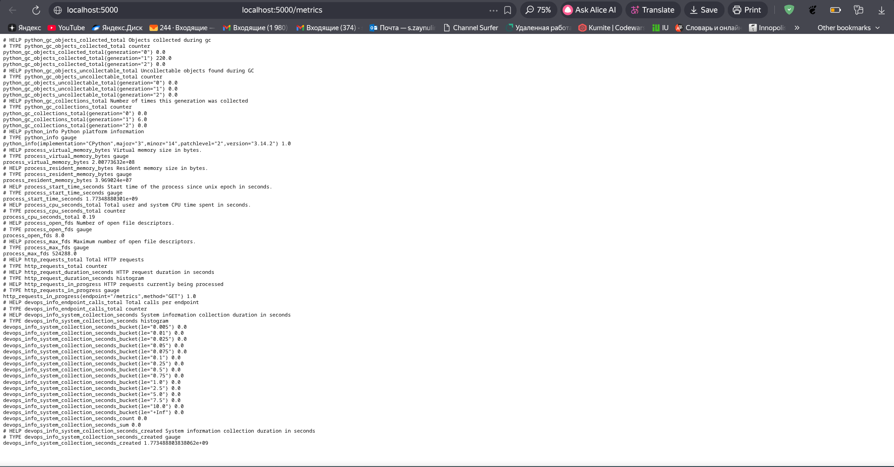
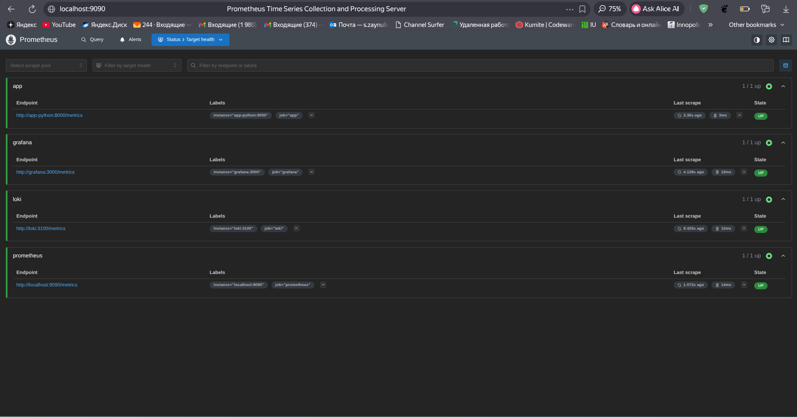
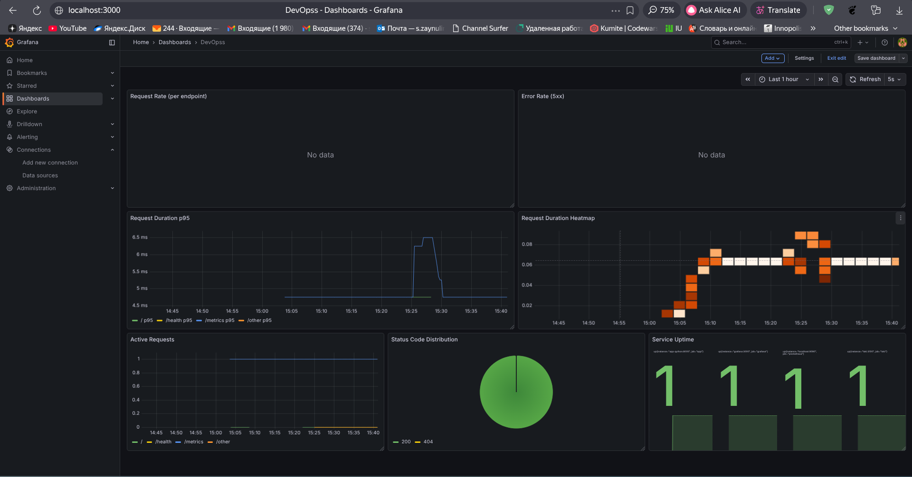
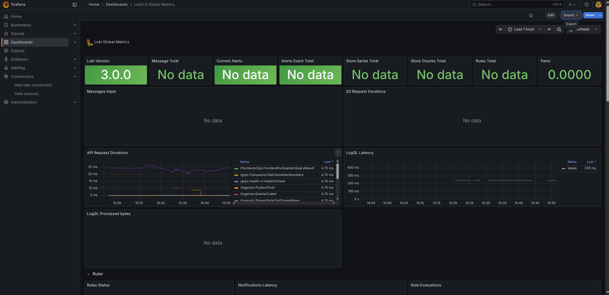
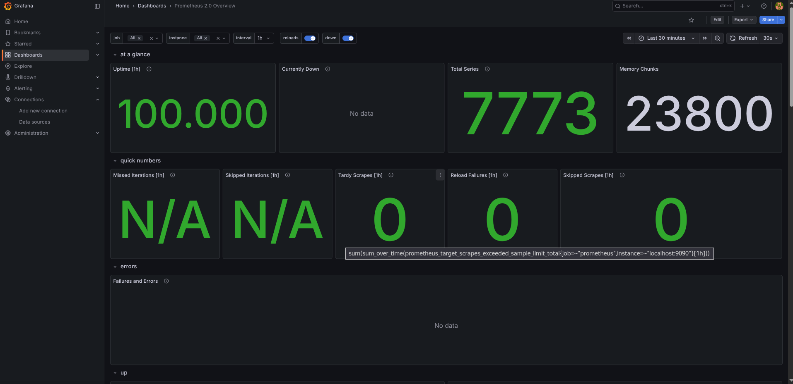

# Lab08 Metrics and monitoring with prometheus

# Task 1 

## Screenshots of the metrics output 



## Metrics choise explanation 

For Task 1, the application exposes Prometheus metrics at `/metrics` using a mix of Counter, Histogram, and Gauge.

### 1. HTTP request volume (`Counter`)
- **Metric:** `http_requests_total`
- **Labels:** `method`, `endpoint`, `status_code`
- **Why:** counts total requests and supports request rate and error-rate queries (RED: **Rate** + **Errors**).

### 2. HTTP request latency (`Histogram`)
- **Metric:** `http_request_duration_seconds`
- **Labels:** `method`, `endpoint`, `status_code`
- **Why:** stores request duration distribution and enables p50/p95/p99 latency queries (RED: **Duration**).

### 3. Concurrent requests (`Gauge`)
- **Metric:** `http_requests_in_progress`
- **Labels:** `method`, `endpoint`
- **Why:** shows how many requests are currently being processed and helps detect overload/spikes.

### 4. Endpoint usage (`Counter`, app-specific)
- **Metric:** `devops_info_endpoint_calls_total`
- **Labels:** `endpoint`
- **Why:** tracks business-level endpoint traffic to compare feature usage over time.

### 5. System info collection time (`Histogram`, app-specific)
- **Metric:** `devops_info_system_collection_seconds`
- **Labels:** none
- **Why:** measures internal operation cost inside the `/` handler and helps catch slow system metadata collection.

### Label design note
To keep label cardinality low, endpoints are normalized (`/`, `/health`, `/metrics`, and `/other`) instead of using raw dynamic paths.

# Task 2 - Prometheus setup

# `docker compose ps` output

```bash
(.venv) ➜  monitoring git:(lab8) ✗ docker compose ps
WARN[0000] /home/setterwars/Documents/IU/DevOps-Core-Course/monitoring/docker-compose.yml: the attribute `version` is obsolete, it will be ignored, please remove it to avoid potential confusion 
NAME         IMAGE                                        COMMAND                  SERVICE      CREATED         STATUS                   PORTS
app-python   zsalavat/devops-info-service-python:latest   "python app.py"          app-python   3 minutes ago   Up 3 minutes             5000/tcp, 0.0.0.0:8000->8000/tcp
grafana      grafana/grafana:12.3.1                       "/run.sh"                grafana      5 days ago      Up 3 minutes (healthy)   0.0.0.0:3000->3000/tcp
loki         grafana/loki:3.0.0                           "/usr/bin/loki -conf…"   loki         5 days ago      Up 3 minutes (healthy)   0.0.0.0:3100->3100/tcp
prometheus   prom/prometheus:v3.9.0                       "/bin/prometheus --c…"   prometheus   3 minutes ago   Up 3 minutes             0.0.0.0:9090->9090/tcp
promtail     grafana/promtail:3.0.0                       "/usr/bin/promtail -…"   promtail     5 days ago      Up 3 minutes             0.0.0.0:9080->9080/tcp
(.venv) ➜  monitoring git:(lab8) ✗ 
```

## Screenshot of the target page



# Task 3 - Grafana dashboard

## Screenshot of the dashboard



## Json file

- Json with dashboard for prometheus: exported_json/promehteus2.json
- Json with dashboard for loki: exported_json/loki.json

#### Screenshots





# Task 4 - Production configuration

## 4.1 Health checks

Health checks were added for all services:
- `loki`: checks `http://localhost:3100/ready`
- `promtail`: validates config with `promtail -check-syntax`
- `grafana`: checks `http://localhost:3000/api/health`
- `prometheus`: checks `http://localhost:9090/-/healthy`
- `app-python`: checks `http://localhost:8000/health`

All checks use:
- `interval: 10s`
- `timeout: 5s`
- `retries: 5`

## 4.2 Resource limits

Configured limits:
- Prometheus: `1 CPU`, `1G`
- Loki: `1 CPU`, `1G`
- Grafana: `0.5 CPU`, `512M`
- App service (`app-python`): `0.5 CPU`, `256M`
- Promtail: `0.5 CPU`, `256M`

## 4.3 Data retention (Prometheus)

Prometheus command flags:

```yaml
command:
	- --config.file=/etc/prometheus/prometheus.yml
	- --storage.tsdb.retention.time=15d
	- --storage.tsdb.retention.size=10GB
```

Retention rationale:
- controls disk growth
- keeps query performance stable
- supports compliance/data lifecycle requirements

## 4.4 Persistent volumes and restart test

Persistent volumes are configured:

```yaml
volumes:
	loki-data:
	grafana-data:
	prometheus-data:
```

Persistence test executed:
1. `docker compose down`
2. verified volumes still exist (`monitoring_loki-data`, `monitoring_grafana-data`, `monitoring_prometheus-data`)
3. `docker compose up -d`

## Task 4 evidence

`docker compose ps` after restart shows healthy services:

```bash
NAME         IMAGE                                        STATUS                    PORTS
app-python   zsalavat/devops-info-service-python:latest   Up (healthy)              0.0.0.0:8000->8000/tcp
grafana      grafana/grafana:12.3.1                       Up (healthy)              0.0.0.0:3000->3000/tcp
loki         grafana/loki:3.0.0                           Up (healthy)              0.0.0.0:3100->3100/tcp
prometheus   prom/prometheus:v3.9.0                       Up (healthy)              0.0.0.0:9090->9090/tcp
promtail     grafana/promtail:3.0.0                       Up (healthy)              0.0.0.0:9080->9080/tcp
```