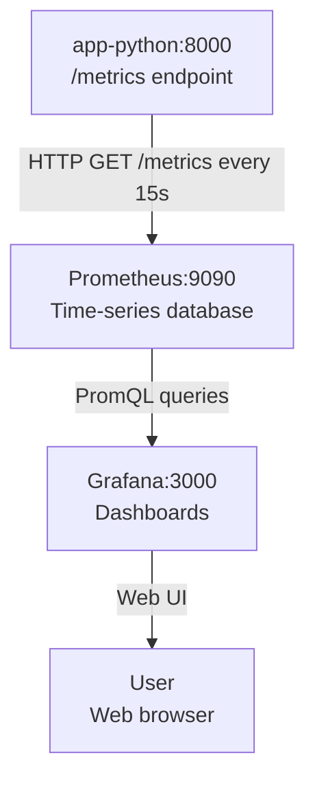
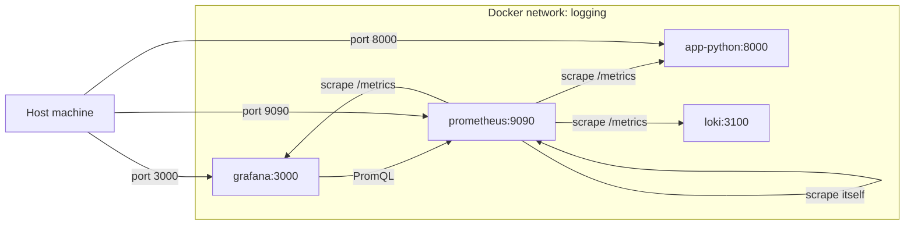
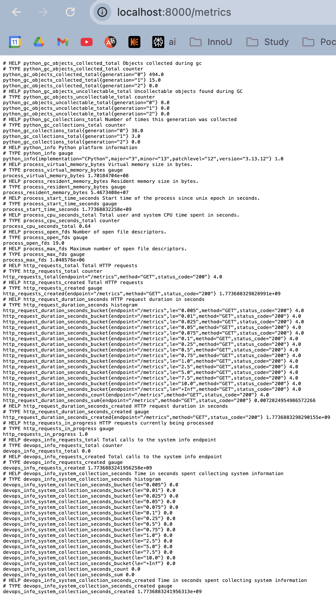
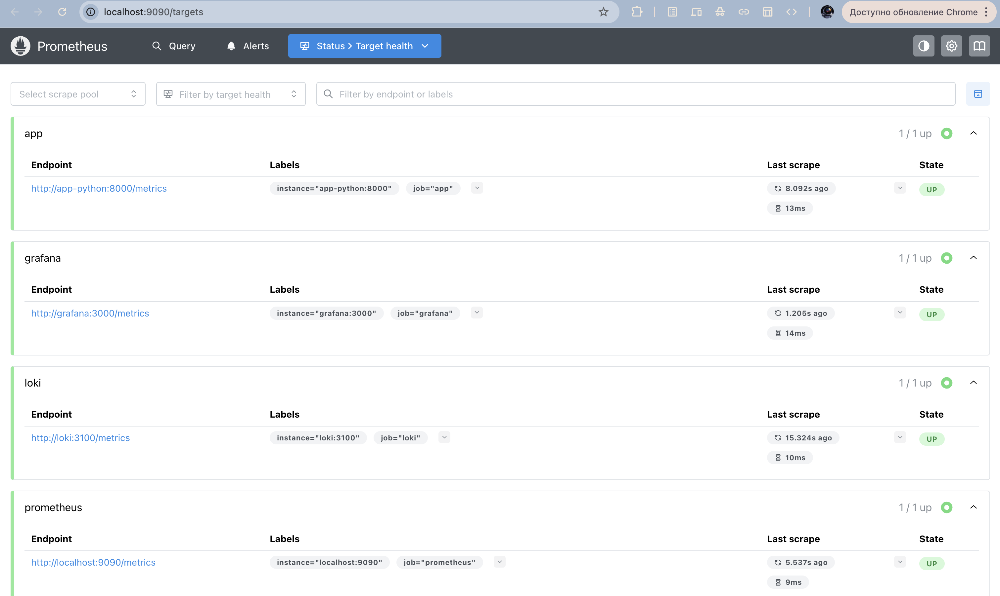
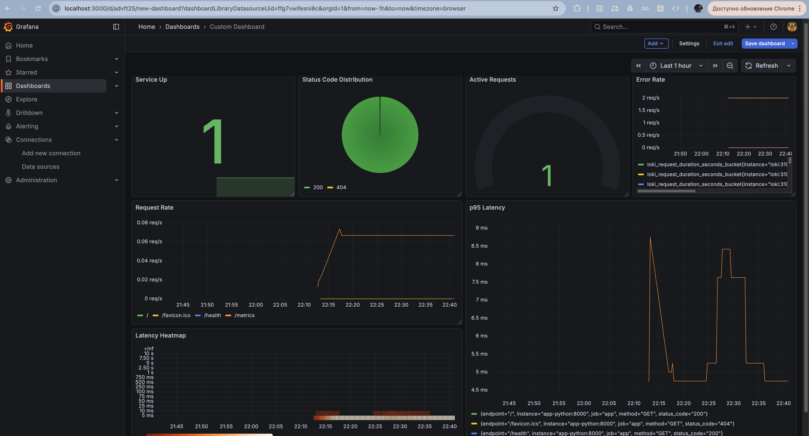
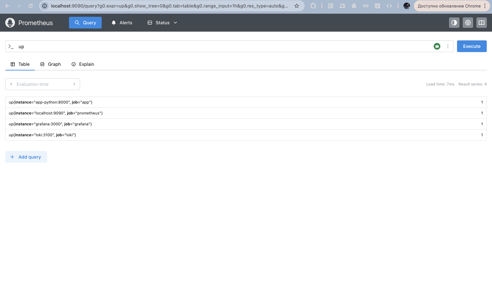
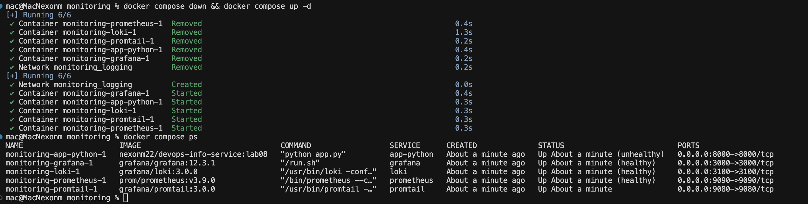
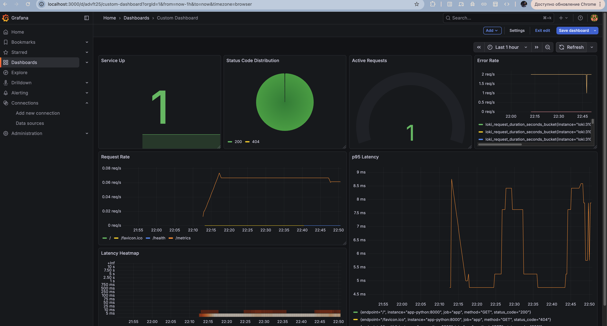

# Lab 8: Metrics and Monitoring with Prometheus

**Name:** Nikita Maksimenko
**Date:** 2026-03-16
**Lab Points:** 10 pts

## 1. Overview

### Environment

- **Prometheus Version:** 3.9.0
- **Grafana Version:** 12.3.1
- **Loki Version:** 3.0.0
- **prometheus-client Version:** 0.23.1
- **Host OS:** macOS
- **Docker Compose Version:** v2
- **Application:** Python FastAPI service (devops-info-service)

### What I Accomplished

I added Prometheus metrics to the Python application, deployed Prometheus alongside the existing Loki and Grafana stack, built a Grafana dashboard with seven panels, and hardened the stack with healthchecks, resource limits, and data retention settings.

1. **Application Instrumentation** - Added five Prometheus metrics to the FastAPI app including a /metrics endpoint
2. **Prometheus Deployment** - Added Prometheus to the Docker Compose stack and configured four scrape targets
3. **Grafana Dashboards** - Created a custom dashboard with seven panels and imported the Prometheus Stats community dashboard
4. **Production Configuration** - Added healthchecks, resource limits, and data retention to all services
5. **Documentation** - Complete documentation with screenshots showing all components working

### Technologies Used

- Prometheus 3.9.0 for metrics collection and storage
- prometheus-client 0.23.1 for Python application instrumentation
- Grafana 12.3.1 for metrics visualization
- PromQL for querying time-series data
- Docker Compose for orchestration
- FastAPI middleware for automatic request tracking

---

## 2. Architecture

### How Metrics Flow

The application exposes a /metrics endpoint that Prometheus scrapes every 15 seconds. Prometheus stores the collected data in its time-series database on disk. Grafana connects to Prometheus as a data source and runs PromQL queries to display the data in dashboards.



### Network Layout

All services run inside the Docker network named `logging`. Prometheus uses Docker service names to reach each target. The diagram below shows every scrape relationship.



### Storage

- **Prometheus data**: stored in Docker volume `prometheus-data` at `/prometheus`
- **Grafana data**: stored in Docker volume `grafana-data` at `/var/lib/grafana`
- **Loki data**: stored in Docker volume `loki-data` at `/loki`

---

## 3. Application Instrumentation

Five metrics were added to `app_python/app.py` using the `prometheus-client` library.

### Standard HTTP Metrics

These three metrics are recorded for every HTTP request through the FastAPI middleware. They use three labels: `method` (HTTP verb), `endpoint` (URL path), and `status_code` (HTTP response code).

| Metric name | Type | Why it is useful |
|---|---|---|
| `http_requests_total` | Counter | Counts every request so you can calculate the rate of traffic over time. |
| `http_request_duration_seconds` | Histogram | Records how long each request takes, which lets you calculate percentiles like p95 latency. |
| `http_requests_in_progress` | Gauge | Shows how many requests are being handled right now, which reveals concurrency spikes. |

### App-Specific Metrics

These two metrics are specific to what this application does: collecting and serving system information.

| Metric name | Type | Why it is useful |
|---|---|---|
| `devops_info_requests_total` | Counter | Counts calls to the root endpoint specifically, which is the main business action of this service. |
| `devops_info_system_collection_seconds` | Histogram | Measures how long the system info collection step takes inside the root handler, isolating that cost from total request duration. |

### How Recording Works

The middleware `log_requests` runs for every request. It increments `http_requests_in_progress` before calling the route handler and decrements it after. After the response is produced, it records the duration in the histogram and increments the counter with the correct labels.

The `get_system_info()` function wraps its body in `devops_info_system_collection_seconds.time()`, which measures the execution time and records it in the histogram automatically.

The `root()` route handler increments `devops_info_requests_total` each time it is called.

### Metrics Endpoint Output

The screenshot below shows the raw output of `http://localhost:8000/metrics` after several requests were made. Every metric defined in the code appears in Prometheus text format with `# HELP` and `# TYPE` headers followed by the current values.



---

## 4. Prometheus Configuration

### Scrape Jobs

Prometheus is configured with four scrape jobs in `monitoring/prometheus/prometheus.yml`.

| Job name | Target | Path | What it scrapes |
|---|---|---|---|
| `prometheus` | `localhost:9090` | `/metrics` | Prometheus's own internal metrics |
| `app` | `app-python:8000` | `/metrics` | The FastAPI application metrics |
| `loki` | `loki:3100` | `/metrics` | Loki log storage metrics |
| `grafana` | `grafana:3000` | `/metrics` | Grafana dashboard server metrics |

### Scrape Interval

The global scrape interval is 15 seconds. This means Prometheus fetches metrics from each target every 15 seconds. The evaluation interval is also 15 seconds, which controls how often recording rules are evaluated.

### Retention Settings

Retention is set using command-line arguments passed to the Prometheus container.

- `--storage.tsdb.retention.time=15d` — Prometheus keeps data for 15 days and then deletes older samples.
- `--storage.tsdb.retention.size=10GB` — If the data volume exceeds 10 GB before 15 days, Prometheus removes the oldest data first.

### Full Configuration File

```yaml
global:
  scrape_interval: 15s
  evaluation_interval: 15s

scrape_configs:
  - job_name: 'prometheus'
    static_configs:
      - targets: ['localhost:9090']

  - job_name: 'app'
    static_configs:
      - targets: ['app-python:8000']
    metrics_path: '/metrics'

  - job_name: 'loki'
    static_configs:
      - targets: ['loki:3100']
    metrics_path: '/metrics'

  - job_name: 'grafana'
    static_configs:
      - targets: ['grafana:3000']
    metrics_path: '/metrics'
```

### All Four Targets Showing UP

The screenshot below shows the Prometheus `/targets` page after the stack started. All four scrape targets have state UP, which means Prometheus successfully reached each service and collected its metrics.



---

## 5. Dashboard Walkthrough

The dashboard is named "Application Metrics" and contains seven panels. It is saved at `monitoring/grafana/dashboards/app-dashboard.json`.

### Panel 1 — Request Rate

- **Type:** Time series
- **Query:** `sum(rate(http_requests_total[5m])) by (endpoint)`
- **Unit:** requests/sec
- This panel shows how many requests per second the application is receiving for each endpoint over the last 5 minutes.

### Panel 2 — Error Rate

- **Type:** Time series
- **Query:** `sum(rate(http_requests_total{status_code=~"5.."}[5m]))`
- **Unit:** requests/sec
- This panel shows the rate of 5xx server error responses per second, which indicates when the application is failing.

### Panel 3 — p95 Latency

- **Type:** Time series
- **Query:** `histogram_quantile(0.95, rate(http_request_duration_seconds_bucket[5m]))`
- **Unit:** seconds
- This panel shows the 95th percentile response time, meaning 95% of requests complete faster than this value.

### Panel 4 — Latency Heatmap

- **Type:** Heatmap
- **Query:** `rate(http_request_duration_seconds_bucket[5m])`
- **Unit:** seconds
- This panel visualizes the full distribution of response times as a heat map, making it easy to see if latency is clustered or spread out.

### Panel 5 — Active Requests

- **Type:** Gauge
- **Query:** `http_requests_in_progress`
- **Unit:** none (count)
- This panel shows how many HTTP requests the application is currently processing at this instant.

### Panel 6 — Status Code Distribution

- **Type:** Pie chart
- **Query:** `sum by (status_code) (rate(http_requests_total[5m]))`
- **Unit:** requests/sec
- This panel shows the proportion of responses by status code, making it easy to see the balance between 2xx, 4xx, and 5xx responses.

### Panel 7 — Service Up

- **Type:** Stat
- **Query:** `up{job="app"}`
- **Unit:** none
- This panel shows whether Prometheus can reach the application. A value of 1 means the service is up; a value of 0 means Prometheus cannot scrape it.

### Dashboard Screenshot

The screenshot below shows the full "Application Metrics" dashboard with all seven panels active and displaying live data from Prometheus.



---

## 6. PromQL Examples

These queries can be run in the Prometheus UI at `http://localhost:9090` or in any Grafana panel.

**Query 1 — Current request rate across all endpoints:**

```promql
sum(rate(http_requests_total[5m]))
```

Returns the total number of HTTP requests per second across all endpoints and methods over the last 5 minutes.

**Query 2 — Request rate broken down by endpoint:**

```promql
sum(rate(http_requests_total[5m])) by (endpoint)
```

Returns the requests-per-second rate for each endpoint separately, so you can see which path receives the most traffic.

**Query 3 — 95th percentile response time:**

```promql
histogram_quantile(0.95, rate(http_request_duration_seconds_bucket[5m]))
```

Returns the latency value below which 95% of requests complete, giving a realistic picture of the slowest normal requests.

**Query 4 — Error rate as a percentage of total traffic:**

```promql
sum(rate(http_requests_total{status_code=~"5.."}[5m])) / sum(rate(http_requests_total[5m])) * 100
```

Returns what percentage of all requests are resulting in server errors, which is directly useful for setting alert thresholds.

**Query 5 — Average system info collection time:**

```promql
rate(devops_info_system_collection_seconds_sum[5m]) / rate(devops_info_system_collection_seconds_count[5m])
```

Returns the average time in seconds that the application spends collecting system information per request.

**Query 6 — Which services are currently up:**

```promql
up
```

Returns a 1 for each scrape target that Prometheus can reach and a 0 for any target that is down.

**Query 7 — Total info endpoint calls since startup:**

```promql
devops_info_requests_total
```

Returns the total number of times the root endpoint has been called since the application started.

### PromQL Query Result in Prometheus UI

The screenshot below shows the result of running the query `up` in the Prometheus web UI. All four jobs return a value of 1, confirming that Prometheus is successfully scraping every target.



---

## 7. Production Setup

### Healthchecks

Every service in `docker-compose.yml` has a healthcheck configured with `interval: 10s`, `timeout: 5s`, and `retries: 5`.

| Service | Healthcheck command | Why it matters |
|---|---|---|
| Loki | `wget` to `http://localhost:3100/ready` | Confirms Loki is ready to accept log pushes before other services depend on it. |
| Grafana | `curl` to `http://localhost:3000/api/health` | Confirms Grafana's HTTP server is responding so users can access dashboards. |
| Prometheus | `wget` to `http://localhost:9090/-/healthy` | Confirms Prometheus is running and its scrape engine is functional. |
| app-python | `curl` to `http://localhost:8000/health` | Confirms the FastAPI app is alive and responding to requests. |

Healthchecks allow Docker to report each service's real status in `docker compose ps` and allow dependent services to wait for dependencies to be healthy before starting.

### Resource Limits

| Service | CPU limit | Memory limit | Why it matters |
|---|---|---|---|
| Loki | 1 CPU | 1G | Prevents Loki from using all CPU during heavy log ingestion. |
| Grafana | 0.5 CPU | 512M | Keeps the dashboard server from consuming excessive memory with many users. |
| Prometheus | 1 CPU | 1G | Gives Prometheus enough headroom for scraping and query processing. |
| app-python | 0.5 CPU | 256M | Constrains the application so it cannot starve the monitoring stack on the same host. |
| Promtail | 0.5 CPU | 256M | Limits the log collector which should be lightweight. |

### Retention Policy

Prometheus stores data for up to 15 days and up to 10 GB. When either limit is reached, the oldest data is removed. This prevents the `prometheus-data` volume from growing without bound on the host machine.

### Persistent Volumes

Three named volumes are declared: `prometheus-data`, `loki-data`, and `grafana-data`. Named volumes persist across `docker compose down` and `docker compose up`, so metric history, logs, and Grafana dashboards survive container restarts.

### All Services Healthy

The screenshot below shows the output of `docker compose ps` after a full restart of the stack. Every service reports status `healthy`, confirming that all healthchecks are passing.



### Dashboard Persists After Restart

The screenshot below shows the "Application Metrics" dashboard open in Grafana after running `docker compose down && docker compose up -d`. The dashboard and all its panels are still present, which proves that the `grafana-data` named volume correctly persists configuration across container restarts.



---

## 8. Metrics vs Logs

Metrics and logs answer different questions and should be used together for full observability.

Metrics (Prometheus) are numeric measurements collected at regular intervals. They are compact and efficient for tracking counts, rates, and durations over time. Use metrics when you need to know how much or how often something is happening, for example the request rate, error rate, or response time of a service. Metrics are the right tool for dashboards, alerting thresholds, and capacity planning.

Logs (Loki from Lab 7) are text records of individual events. They contain the full detail of what happened in a single request or operation. Use logs when you need to understand why something happened, for example reading the exact error message that caused a 500 response or tracing a specific request through the system.

A practical approach is to use metrics to detect a problem and then use logs to investigate its cause. For example, the Error Rate panel in Grafana might show a spike in 5xx responses, and you then open Loki to read the log lines from that time window to find the root cause.
