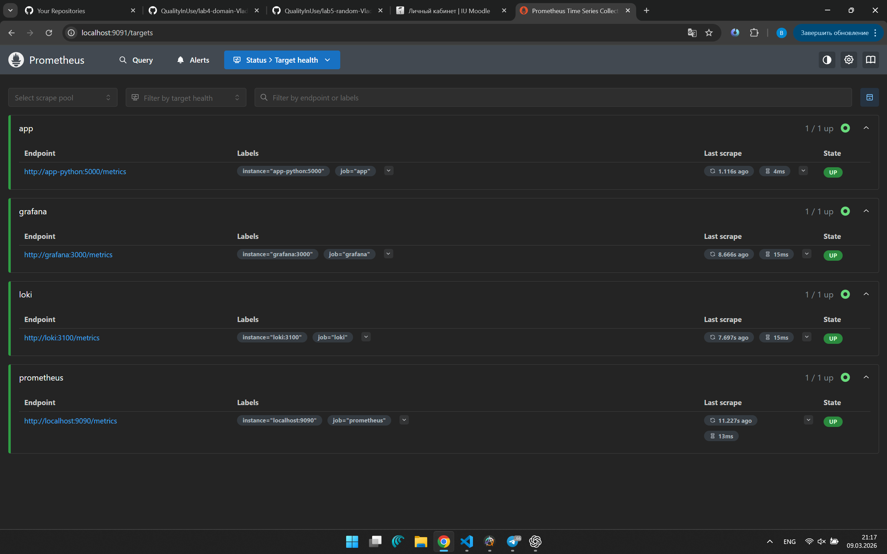
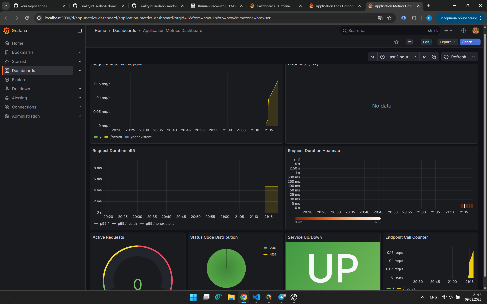
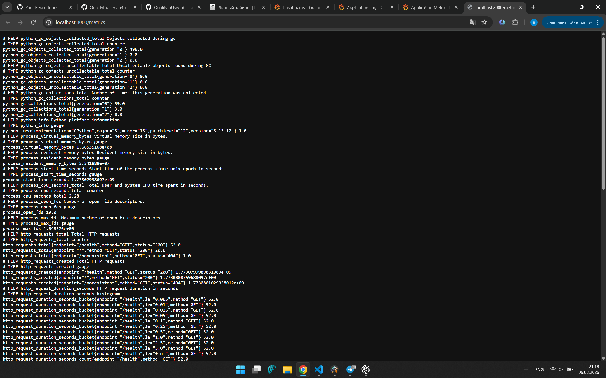

# Lab 08 — Metrics & Monitoring with Prometheus

## Architecture

```
┌──────────────┐         ┌──────────────┐
│  app-python  │◄────────│  Prometheus   │──── scrapes every 15s
│  :5000       │ /metrics│  :9090        │
└──────────────┘         └──────┬───────┘
                                │
            ┌───────────────────┤ also scrapes:
            │                   │  • loki:3100/metrics
            │                   │  • grafana:3000/metrics
            │                   │  • localhost:9090/metrics
            │                   │
       ┌────▼─────┐      ┌─────▼──────┐
       │  Loki    │      │  Grafana   │
       │  :3100   │      │  :3000     │
       └──────────┘      └────────────┘
            ▲                   │
       (logs via Promtail)    Dashboards:
                              • App Metrics (Prometheus)
                              • App Logs (Loki)
```

**Data flow:**
1. App exposes `/metrics` endpoint with Counter, Histogram, Gauge
2. Prometheus scrapes all targets every 15s
3. Grafana queries Prometheus via PromQL for dashboards

---

## Application Instrumentation

### Metrics Added

| Metric | Type | Labels | Purpose |
|--------|------|--------|---------|
| `http_requests_total` | Counter | method, endpoint, status | Total HTTP requests (RED: Rate) |
| `http_request_duration_seconds` | Histogram | method, endpoint | Request latency distribution (RED: Duration) |
| `http_requests_in_progress` | Gauge | — | Concurrent requests |
| `devops_info_endpoint_calls_total` | Counter | endpoint | Business-level endpoint tracking |
| `devops_info_system_collection_seconds` | Histogram | — | Time spent collecting system info |

### Why These Metrics?

Following the **RED Method** for request-driven services:
- **Rate** → `http_requests_total` (counter, use `rate()` in PromQL)
- **Errors** → `http_requests_total{status=~"5.."}` (filter by status label)
- **Duration** → `http_request_duration_seconds` (histogram with buckets)

The gauge `http_requests_in_progress` shows current load, while the business metrics (`devops_info_*`) track application-specific behavior.

### Implementation

No extra dependencies beyond `prometheus-client==0.23.1`. Metrics are collected via middleware that wraps every request (except `/metrics` itself) to avoid recursion.

```python
# Example: middleware records metrics for every request
http_requests_total.labels(method="GET", endpoint="/", status="200").inc()
http_request_duration_seconds.labels(method="GET", endpoint="/").observe(0.003)
```

---

## Prometheus Configuration

### Scrape Targets

| Job | Target | Path | Description |
|-----|--------|------|-------------|
| `prometheus` | `localhost:9090` | `/metrics` | Prometheus self-monitoring |
| `app` | `app-python:5000` | `/metrics` | Python application metrics |
| `loki` | `loki:3100` | `/metrics` | Loki log storage metrics |
| `grafana` | `grafana:3000` | `/metrics` | Grafana dashboard metrics |

### Settings
- **Scrape interval:** 15s
- **Evaluation interval:** 15s
- **Retention time:** 15 days
- **Retention size:** 10 GB

All targets use Docker Compose service names as hostnames within the shared `logging` network.

---

## Dashboard Walkthrough

The provisioned dashboard (`grafana/dashboards/app-metrics.json`) has **8 panels**:

### 1. Request Rate by Endpoint (Time Series)
```promql
sum(rate(http_requests_total[5m])) by (endpoint)
```
Shows requests/sec broken down by endpoint. Answers: "How much traffic is each endpoint getting?"

### 2. Error Rate — 5xx (Time Series)
```promql
sum(rate(http_requests_total{status=~"5.."}[5m]))
```
Shows server error rate. Threshold at 0.1 req/s turns red.

### 3. Request Duration p95 (Time Series)
```promql
histogram_quantile(0.95, sum(rate(http_request_duration_seconds_bucket[5m])) by (le, endpoint))
```
95th percentile latency per endpoint. Answers: "How slow are the slowest 5% of requests?"

### 4. Request Duration Heatmap
```promql
sum(increase(http_request_duration_seconds_bucket[1m])) by (le)
```
Visualizes latency distribution across all bucket boundaries over time.

### 5. Active Requests (Gauge)
```promql
http_requests_in_progress
```
Real-time concurrent request count with thresholds (green < 10, yellow < 50, red ≥ 50).

### 6. Status Code Distribution (Pie Chart)
```promql
sum by (status) (rate(http_requests_total[5m]))
```
Proportional view of 2xx vs 4xx vs 5xx responses.

### 7. Service Up/Down (Stat)
```promql
up{job="app"}
```
Shows UP (green) or DOWN (red) for the application target.

### 8. Endpoint Call Counter (Bar Chart)
```promql
sum(rate(devops_info_endpoint_calls_total[5m])) by (endpoint)
```
Business metric: calls/sec per specific endpoint.

---

## PromQL Examples

### 1. Total request rate across all endpoints
```promql
sum(rate(http_requests_total[5m]))
```

### 2. Error percentage
```promql
sum(rate(http_requests_total{status=~"5.."}[5m])) / sum(rate(http_requests_total[5m])) * 100
```

### 3. Median (p50) request duration
```promql
histogram_quantile(0.5, sum(rate(http_request_duration_seconds_bucket[5m])) by (le))
```

### 4. Top endpoints by request count (instant)
```promql
topk(5, sum by (endpoint) (http_requests_total))
```

### 5. All services currently down
```promql
up == 0
```

### 6. Process CPU usage (Prometheus default metric)
```promql
rate(process_cpu_seconds_total{job="app"}[5m]) * 100
```

### 7. Request rate only for successful responses
```promql
sum(rate(http_requests_total{status="200"}[5m])) by (endpoint)
```

---

## Production Setup

### Health Checks

| Service | Endpoint | Interval | Retries |
|---------|----------|----------|---------|
| Loki | `http://localhost:3100/ready` | 10s | 5 |
| Grafana | `http://localhost:3000/api/health` | 10s | 5 |
| Prometheus | `http://localhost:9090/-/healthy` | 10s | 5 |
| app-python | `http://localhost:5000/health` | 10s | 5 |

### Resource Limits

| Service | CPU Limit | Memory Limit | CPU Reserved | Memory Reserved |
|---------|-----------|-------------|-------------|-----------------|
| Loki | 1.0 | 1G | 0.5 | 512M |
| Promtail | 0.5 | 512M | 0.25 | 256M |
| Grafana | 1.0 | 1G | 0.5 | 512M |
| Prometheus | 1.0 | 1G | 0.5 | 512M |
| app-python | 0.5 | 256M | 0.25 | 128M |

### Retention Policies
- **Prometheus:** 15 days or 10 GB (whichever is reached first)
- **Loki:** 168 hours (7 days) with compactor cleanup

### Data Persistence

Named volumes ensure data survives `docker compose down` / `up`:
- `prometheus-data` → `/prometheus`
- `loki-data` → `/loki`
- `grafana-data` → `/var/lib/grafana`

---

## Testing Results

### Deploy and verify
```bash
cd monitoring
docker compose up -d
docker compose ps               # All services healthy
```

### Generate traffic
```bash
# 20 requests to each endpoint
for i in $(seq 1 20); do curl -s http://localhost:8000/ > /dev/null; done
for i in $(seq 1 20); do curl -s http://localhost:8000/health > /dev/null; done
curl -s http://localhost:8000/nonexistent > /dev/null   # 404
```

### Verify metrics endpoint
```bash
curl http://localhost:8000/metrics
# Expected: Prometheus text format with http_requests_total, histograms, etc.
```

### Check Prometheus targets
- Open http://localhost:9091/targets
- All 4 jobs should show state "UP"

### Verify in Grafana
1. Open http://localhost:3000 (admin / SecretP@ss123)
2. Dashboards → "Application Metrics Dashboard" → 8 panels with data
3. Dashboards → "Application Logs Dashboard" → log panels from Lab 7







---

## Challenges & Solutions

1. **Metrics endpoint recursion** — The middleware must skip `/metrics` to avoid instrumenting Prometheus scrapes, which would create an infinite feedback loop of ever-increasing counters.

2. **Histogram bucket selection** — Default buckets are designed for typical web latency. Custom buckets `(0.005, 0.01, 0.025, ...)` cover sub-millisecond to multi-second ranges appropriate for a lightweight API.

3. **Label cardinality** — Using `endpoint` (path) as a label is safe for fixed routes. For dynamic routes (e.g., `/user/{id}`), normalization is critical to avoid cardinality explosion.

4. **Prometheus in Docker Compose** — Uses `--storage.tsdb.retention.time` and `--storage.tsdb.retention.size` CLI flags for retention (Prometheus 3.x).

5. **Metrics vs Logs** — Metrics (Prometheus) answer "how much / how fast" questions with low overhead. Logs (Loki) answer "what happened" with full context. Both are needed for complete observability.

---

## Metrics vs Logs Comparison

| Aspect | Metrics (Prometheus / Lab 8) | Logs (Loki / Lab 7) |
|--------|------------------------------|----------------------|
| **Data type** | Numeric time series | Text events |
| **Use case** | Rates, durations, counts | Debugging, audit trail |
| **Query language** | PromQL | LogQL |
| **Storage cost** | Low (numbers only) | Higher (full text) |
| **Alerting** | Excellent (thresholds) | Possible but less common |
| **Example** | "50 req/s with p95=12ms" | "User X got 404 on /api/data" |
