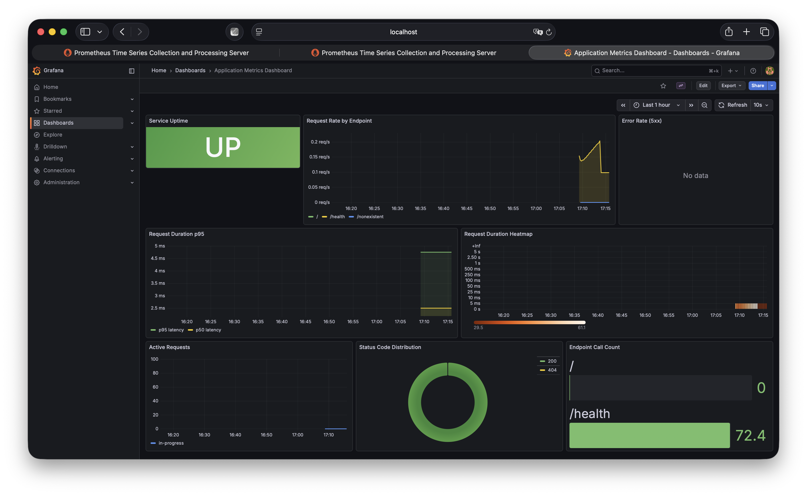
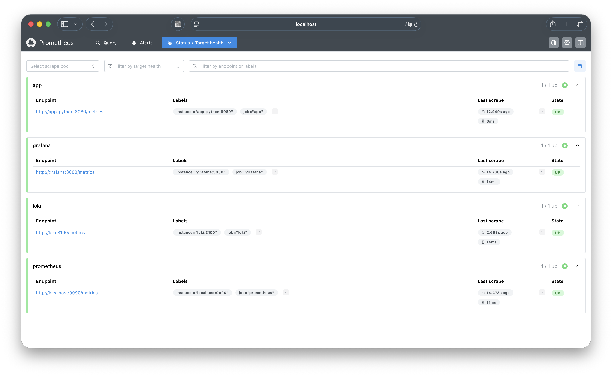
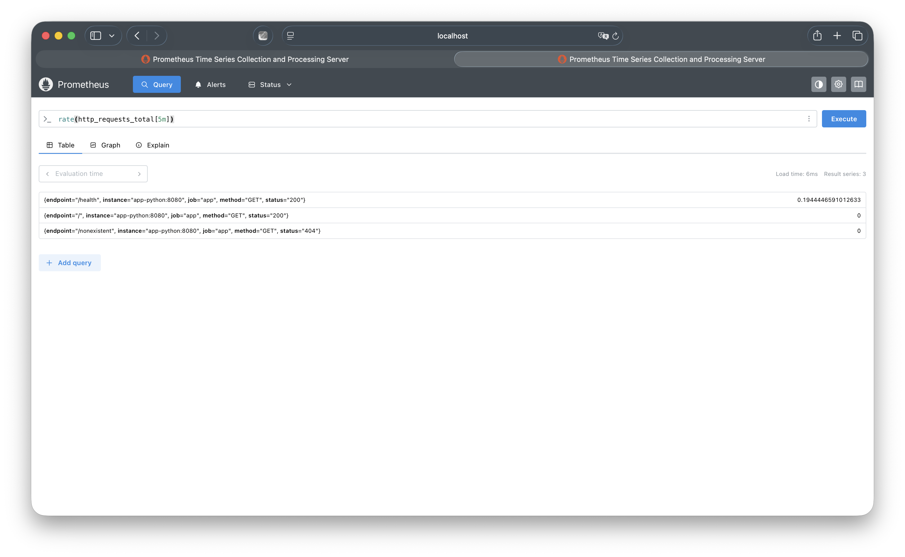
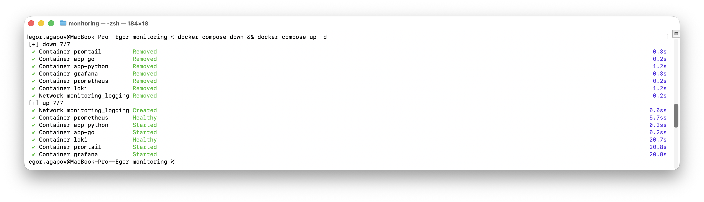
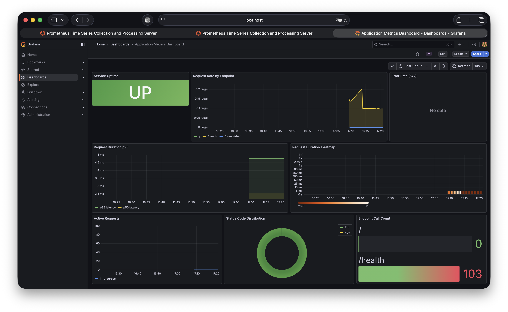

# Lab 8 — Metrics & Monitoring with Prometheus

## 1. Architecture

```
┌─────────────┐
│  app-python  │
│  Flask :8080 │──── /metrics ────┐
└──────────────┘                  │
                                  ▼
                         ┌────────────────┐
                         │   Prometheus   │
                         │  scrape 15s    │
                         │  TSDB :9090    │
                         └───────┬────────┘
                                 │ PromQL
                                 ▼
┌─────────┐  LogQL   ┌──────────────────┐
│  Loki   │◄─────────│     Grafana      │
│  :3100  │          │  Dashboards :3000│
└─────────┘          └──────────────────┘
```

**Metric flow:** The Python app exposes a `/metrics` endpoint using `prometheus_client`. Prometheus scrapes this endpoint every 15 seconds alongside its own metrics, Loki metrics, and Grafana metrics. Grafana queries Prometheus via PromQL and renders dashboards. This complements the logging pipeline from Lab 7 (app → Promtail → Loki → Grafana).

**Key difference — Logs vs Metrics:**

| Aspect | Logs (Lab 7) | Metrics (Lab 8) |
|--------|-------------|-----------------|
| Data type | Text events | Numeric time-series |
| Collection | Push (Promtail → Loki) | Pull (Prometheus scrapes) |
| Query language | LogQL | PromQL |
| Best for | Debugging, audit trail | Alerting, trends, capacity |
| Cardinality | High (every event) | Low (aggregated counters) |

---

## 2. Application Instrumentation

### Metrics Defined

The app implements the **RED method** (Rate, Errors, Duration):

| Metric | Type | Labels | Purpose |
|--------|------|--------|---------|
| `http_requests_total` | Counter | `method`, `endpoint`, `status` | Total request count (Rate & Errors) |
| `http_request_duration_seconds` | Histogram | `method`, `endpoint` | Request latency distribution (Duration) |
| `http_requests_in_progress` | Gauge | — | Concurrent request count |
| `devops_info_endpoint_calls_total` | Counter | `endpoint` | Business-level endpoint usage tracking |
| `devops_info_system_collection_seconds` | Histogram | — | Time spent collecting system info |

### Why These Metrics

- **Counter (`http_requests_total`)** — monotonically increasing, ideal for computing `rate()` (requests/second) and filtering by status code for error rates.
- **Histogram (`http_request_duration_seconds`)** — records request duration into configurable buckets, enabling percentile calculations (p50, p95, p99) via `histogram_quantile()`.
- **Gauge (`http_requests_in_progress`)** — captures instantaneous concurrency level; useful for detecting overload.
- **Business counters** — separate from HTTP-level metrics, track application-specific behavior.

### Implementation

The `/metrics` endpoint is excluded from instrumentation to avoid self-referential noise. Flask hooks `@app.before_request` and `@app.after_request` handle metric recording transparently:

```python
from prometheus_client import Counter, Histogram, Gauge, generate_latest

http_requests_total = Counter(
    'http_requests_total', 'Total HTTP requests',
    ['method', 'endpoint', 'status']
)
http_request_duration_seconds = Histogram(
    'http_request_duration_seconds', 'HTTP request duration in seconds',
    ['method', 'endpoint'],
    buckets=[0.005, 0.01, 0.025, 0.05, 0.1, 0.25, 0.5, 1.0, 2.5, 5.0]
)
http_requests_in_progress = Gauge(
    'http_requests_in_progress', 'HTTP requests currently being processed'
)
```

**`/metrics` endpoint output:**


---

## 3. Prometheus Configuration

**File:** `monitoring/prometheus/prometheus.yml`

```yaml
global:
  scrape_interval: 15s
  evaluation_interval: 15s

scrape_configs:
  - job_name: 'prometheus'
    static_configs:
      - targets: ['localhost:9090']

  - job_name: 'app'
    static_configs:
      - targets: ['app-python:8080']
    metrics_path: '/metrics'

  - job_name: 'loki'
    static_configs:
      - targets: ['loki:3100']
    metrics_path: '/metrics'

  - job_name: 'grafana'
    static_configs:
      - targets: ['grafana:3000']
    metrics_path: '/metrics'
```

### Scrape Targets

| Job | Target | Port | Description |
|-----|--------|------|-------------|
| `prometheus` | `localhost:9090` | 9090 | Prometheus self-monitoring |
| `app` | `app-python:8080` | 8080 | Python Flask application |
| `loki` | `loki:3100` | 3100 | Log storage engine |
| `grafana` | `grafana:3000` | 3000 | Dashboard server |

### Retention

Configured via Prometheus CLI flags:

- `--storage.tsdb.retention.time=15d` — keep data for 15 days
- `--storage.tsdb.retention.size=10GB` — cap TSDB at 10 GB on disk

---

## 4. Dashboard Walkthrough

The auto-provisioned dashboard **"Application Metrics Dashboard"** contains 8 panels:



### Panel 1: Service Uptime (Stat)
- **Query:** `up{job="app"}`
- **Purpose:** Shows if the app target is reachable (UP = 1, DOWN = 0)

### Panel 2: Request Rate by Endpoint (Time Series)
- **Query:** `sum(rate(http_requests_total[5m])) by (endpoint)`
- **Purpose:** Visualizes requests/second per endpoint — the **R** in RED

### Panel 3: Error Rate (Time Series)
- **Query:** `sum(rate(http_requests_total{status=~"5.."}[5m]))`
- **Purpose:** Shows 5xx errors/second — the **E** in RED

### Panel 4: Request Duration p95 (Time Series)
- **Queries:** `histogram_quantile(0.95, ...)` and `histogram_quantile(0.50, ...)`
- **Purpose:** p50 and p95 latency — the **D** in RED

### Panel 5: Request Duration Heatmap
- **Query:** `sum(increase(http_request_duration_seconds_bucket[5m])) by (le)`
- **Purpose:** Latency distribution visualization across all buckets

### Panel 6: Active Requests (Time Series)
- **Query:** `http_requests_in_progress`
- **Purpose:** Current concurrent request count

### Panel 7: Status Code Distribution (Pie Chart)
- **Query:** `sum by (status) (increase(http_requests_total[5m]))`
- **Purpose:** Proportion of 2xx / 4xx / 5xx responses

### Panel 8: Endpoint Call Count (Bar Gauge)
- **Query:** `sum by (endpoint) (increase(devops_info_endpoint_calls_total[1h]))`
- **Purpose:** Business-level endpoint popularity

---

## 5. PromQL Examples

### 1. Total request rate (all endpoints combined)
```promql
sum(rate(http_requests_total[5m]))
```
Returns aggregate requests per second across all methods, endpoints, and statuses.

### 2. Error rate percentage
```promql
sum(rate(http_requests_total{status=~"5.."}[5m])) / sum(rate(http_requests_total[5m])) * 100
```
Computes the percentage of requests resulting in 5xx errors.

### 3. 95th percentile latency
```promql
histogram_quantile(0.95, sum(rate(http_request_duration_seconds_bucket[5m])) by (le))
```
Calculates the p95 request duration across all endpoints.

### 4. Per-endpoint request rate
```promql
sum by (endpoint) (rate(http_requests_total[5m]))
```
Breaks down request rate by endpoint to identify hot paths.

### 5. Services down
```promql
up == 0
```
Returns all scrape targets that are unreachable.

### 6. Prometheus scrape duration
```promql
scrape_duration_seconds{job="app"}
```
Time Prometheus takes to scrape the app — useful for detecting slow `/metrics` endpoints.

### 7. CPU usage of the app process
```promql
rate(process_cpu_seconds_total{job="app"}[5m]) * 100
```
App process CPU utilization percentage (exposed by `prometheus_client` default metrics).

---

## 6. Production Setup

### 6.1 Health Checks

| Service | Check Command | Interval | Retries |
|---------|--------------|----------|---------|
| Loki | `wget ... http://localhost:3100/ready` | 10s | 5 |
| Prometheus | `wget ... http://localhost:9090/-/healthy` | 10s | 5 |
| Grafana | `wget ... http://localhost:3000/api/health` | 10s | 5 |
| app-python | `python urllib.request ... /health` | 10s | 5 |
| app-go | `wget ... http://localhost:8080/health` | 10s | 5 |

### 6.2 Resource Limits

| Service | CPU Limit | Memory Limit | CPU Reserved | Memory Reserved |
|---------|-----------|--------------|--------------|-----------------|
| Prometheus | 1.0 | 1G | 0.25 | 256M |
| Loki | 1.0 | 1G | 0.25 | 256M |
| Grafana | 0.5 | 512M | 0.25 | 128M |
| Promtail | 0.5 | 512M | 0.1 | 128M |
| app-python | 0.5 | 256M | 0.1 | 64M |
| app-go | 0.5 | 256M | 0.1 | 64M |

### 6.3 Retention Policies

| Component | Retention Period | Mechanism |
|-----------|-----------------|-----------|
| Prometheus | 15 days / 10 GB cap | `--storage.tsdb.retention.time`, `--storage.tsdb.retention.size` |
| Loki | 7 days (168h) | `limits_config.retention_period` + compactor |

### 6.4 Persistent Volumes

Three named volumes survive `docker compose down` (without `-v`):

- `prometheus-data` → `/prometheus` (TSDB data)
- `loki-data` → `/loki` (log chunks and index)
- `grafana-data` → `/var/lib/grafana` (dashboards, users, settings)

**Persistence test:**
1. Start stack, generate traffic, verify dashboard data
2. `docker compose down` (no `-v`)
3. `docker compose up -d`
4. Grafana dashboard and Prometheus data are retained

### 6.5 Grafana Provisioning

Data sources and dashboards are provisioned via config files (no manual UI setup):

- `grafana/provisioning/datasources/datasources.yml` — Prometheus + Loki
- `grafana/provisioning/dashboards/dashboards.yml` — file-based dashboard provider
- `grafana/dashboards/app-metrics.json` — application metrics dashboard

---

## 7. Testing Results

### Deploy stack

```bash
cd monitoring
docker compose up -d --build
docker compose ps
```

### Generate test traffic

```bash
for i in {1..30}; do curl -s http://localhost:8000/; done
for i in {1..30}; do curl -s http://localhost:8000/health; done
for i in {1..5}; do curl -s http://localhost:8000/nonexistent; done
```

### Verify metrics endpoint

```bash
curl -s http://localhost:8000/metrics | head -20
```

Expected output includes:
```
# HELP http_requests_total Total HTTP requests
# TYPE http_requests_total counter
http_requests_total{endpoint="/",method="GET",status="200"} 30.0
http_requests_total{endpoint="/health",method="GET",status="200"} 30.0
http_requests_total{endpoint="/nonexistent",method="GET",status="404"} 5.0
```

### Verify Prometheus targets

Open http://localhost:9090/targets — all 4 targets should show **UP** (green).

**Prometheus targets — all UP:**



**PromQL query in Prometheus UI:**



### Verify Grafana dashboard

Open http://localhost:3000 → Dashboards → "Application Metrics Dashboard" — all 8 panels should show data.

**Grafana dashboard with live metrics data:**


### Verify services healthy

**`docker compose ps` — all services running and healthy:**


### Persistence test

After `docker compose down` and `docker compose up -d`, data and dashboards are retained:

**Terminal — restart sequence:**



**Grafana — dashboard intact after restart:**



---

## 8. Challenges & Solutions

### Challenge 1: Excluding /metrics from instrumentation

Scraping `/metrics` generates a request, which would increment `http_requests_total` for `/metrics` on every Prometheus scrape (every 15s), polluting actual traffic data.

**Solution:** Added early-return guards in `before_request` and `after_request` hooks when `request.path == '/metrics'`.

### Challenge 2: Health check in slim Python image

`python:3.12-slim` doesn't include `curl` or `wget`. Using `apt-get install curl` would bloat the image.

**Solution:** Used Python's built-in `urllib.request` for the health check command.

### Challenge 3: Grafana datasource provisioning UIDs

Hardcoding datasource UIDs in dashboard JSON breaks when Grafana assigns different UIDs to provisioned datasources.

**Solution:** Used datasource name string (`"Prometheus"`) in dashboard panel configs instead of UID references.

### Challenge 4: Histogram bucket selection

Default Prometheus histogram buckets are too coarse for a fast API (most requests < 10ms).

**Solution:** Configured custom buckets `[0.005, 0.01, 0.025, 0.05, 0.1, 0.25, 0.5, 1.0, 2.5, 5.0]` to capture sub-10ms latencies accurately.

---

## Bonus: Ansible Automation

### Extended Role Structure

```
ansible/roles/monitoring/
├── defaults/main.yml                           # All variables (versions, ports, targets, limits)
├── files/
│   └── grafana-app-dashboard.json              # Dashboard JSON
├── tasks/
│   ├── main.yml                                # Orchestration entry point
│   ├── setup.yml                               # Dirs, template configs, copy dashboards
│   └── deploy.yml                              # Docker compose, health checks
├── templates/
│   ├── docker-compose.yml.j2                   # Full stack (Loki + Promtail + Prometheus + Grafana)
│   ├── loki-config.yml.j2
│   ├── promtail-config.yml.j2
│   ├── prometheus.yml.j2                       # Templated from prometheus_targets variable
│   ├── grafana-datasources.yml.j2              # Prometheus + Loki datasources
│   └── grafana-dashboards-provisioning.yml.j2  # Dashboard file provider
└── meta/main.yml                               # Depends on: docker role
```

### Key Variables Added (Lab 8)

```yaml
prometheus_version: "3.9.0"
prometheus_port: 9090
prometheus_retention_days: 15
prometheus_retention_size: "10GB"
prometheus_scrape_interval: "15s"

prometheus_targets:
  - job: "prometheus"
    targets: ["localhost:9090"]
  - job: "app"
    targets: ["app-python:8080"]
    path: "/metrics"
  - job: "loki"
    targets: ["loki:3100"]
    path: "/metrics"
  - job: "grafana"
    targets: ["grafana:3000"]
    path: "/metrics"
```

### Prometheus Config Template

`prometheus.yml.j2` generates scrape config from the `prometheus_targets` list:

```yaml
global:
  scrape_interval: {{ prometheus_scrape_interval }}

scrape_configs:

  - job_name: '{{ target.job }}'
    static_configs:
      - targets: {{ target.targets | to_json }}

    metrics_path: '{{ target.path }}'


```

### Single-Command Deployment

```bash
ansible-playbook ansible/playbooks/deploy-monitoring.yml
```

Deploys the entire observability stack:
- Loki + Promtail (logging from Lab 7)
- Prometheus (metrics from Lab 8)
- Grafana with auto-provisioned datasources (Loki + Prometheus) and dashboards
- All configs, health checks, resource limits, and retention policies
