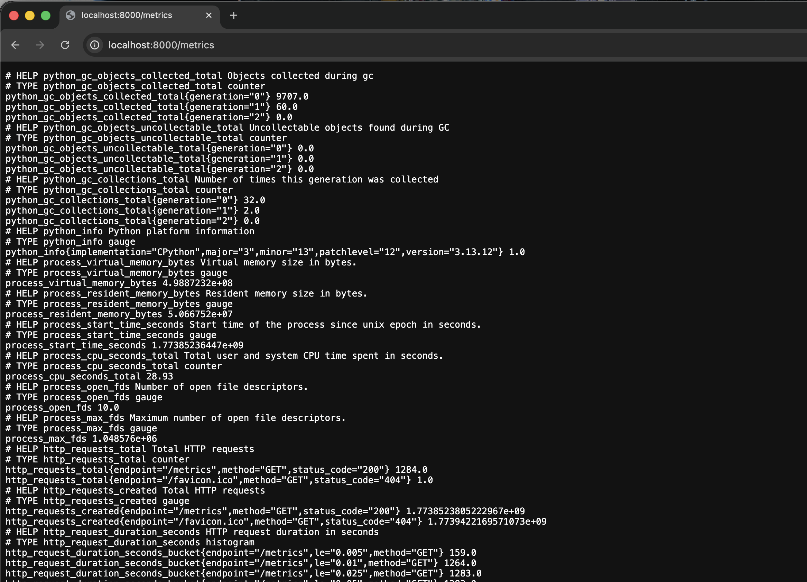
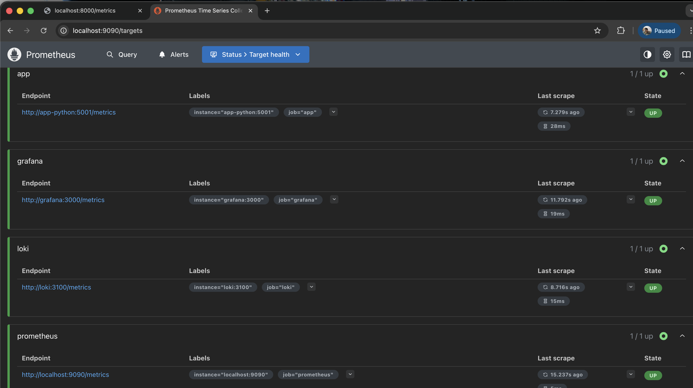
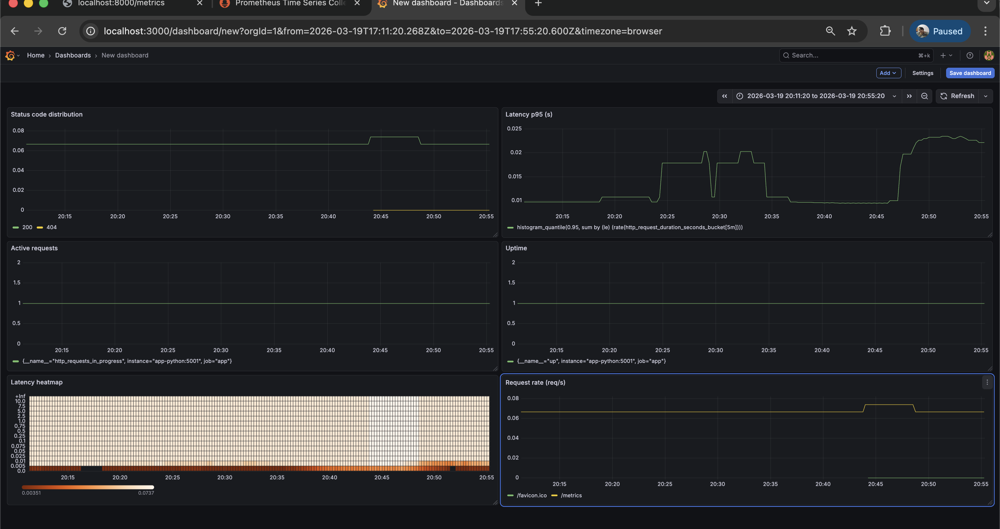

# LAB08 — Metrics & Monitoring with Prometheus

## Architecture

Flow:

- `app-python` exposes metrics on `GET /metrics` (Prometheus format)
- Prometheus scrapes targets every **15s**
- Grafana queries Prometheus to visualize metrics

```
app-python (/metrics) ---> Prometheus ---> Grafana dashboards
         (logs)        ---> Loki        ---> Grafana logs
```

## Application Instrumentation

### Implemented metrics (RED-style)

- Counter: `http_requests_total{method,endpoint,status_code}`
  - Total requests (rate) + errors (5xx)
- Histogram: `http_request_duration_seconds{method,endpoint}`
  - Request latency distribution / p95
- Gauge: `http_requests_in_progress`
  - Concurrent requests (active in-flight)

### Evidence
- Screenshot: `/metrics` output


## Prometheus Configuration

### Scrape targets

- `prometheus` → `localhost:9090`
- `app` → `app-python:5001` (`/metrics`)
- `loki` → `loki:3100` (`/metrics`)
- `grafana` → `grafana:3000` (`/metrics`)

### Retention

- `--storage.tsdb.retention.time=15d`
- `--storage.tsdb.retention.size=10GB`

### Evidence
- Screenshot: Prometheus `/targets` page with all targets **UP**


## Grafana Dashboard 

Create a dashboard named for example `DevOps Info Service — Metrics` with panels:

1. **Request rate (req/s)**  
   `sum(rate(http_requests_total[5m])) by (endpoint)`
2. **Latency p95 (s)**  
   `histogram_quantile(0.95, sum by (le) (rate(http_request_duration_seconds_bucket[5m])))`
3. **Latency heatmap**  
   `sum by (le) (rate(http_request_duration_seconds_bucket[5m]))`
4. **Active requests**  
   `http_requests_in_progress`
5. **Status code distribution**  
   `sum by (status_code) (rate(http_requests_total[5m]))`
6. **Uptime**  
   `up{job="app"}`

### Evidence
- Screenshot: dashboard showing live data



## PromQL Examples 

- Up targets: `up`
- App up: `up{job="app"}`
- Total RPS: `sum(rate(http_requests_total[5m]))`
- RPS by endpoint: `sum by (endpoint) (rate(http_requests_total[5m]))`
- p95 latency: `histogram_quantile(0.95, sum by (le) (rate(http_request_duration_seconds_bucket[5m])))`

## Production Setup

- Healthchecks: Prometheus, Grafana, Loki, `app-python` (compose)
- Resource limits: configured in `monitoring/docker-compose.yml`
- Persistence: `prometheus-data`, `loki-data`, `grafana-data`

## Testing Results

1. `curl http://localhost:8000/metrics` returns Prometheus text format
2. Prometheus UI `http://localhost:9090/targets` shows all jobs **UP**
3. Grafana Prometheus datasource points to `http://prometheus:9090`
4. Dashboard panels show non-empty data after generating traffic


