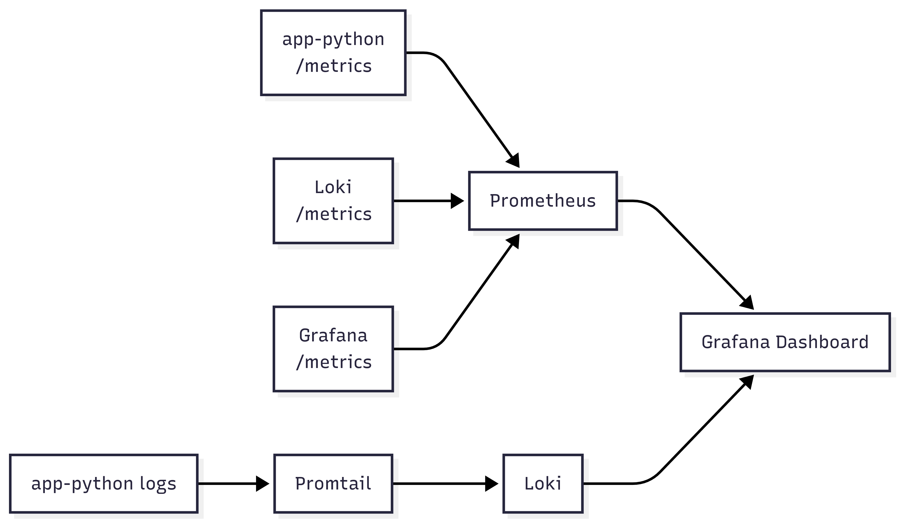
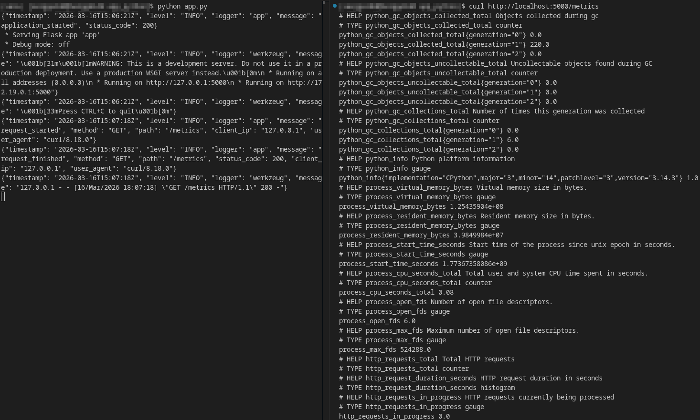
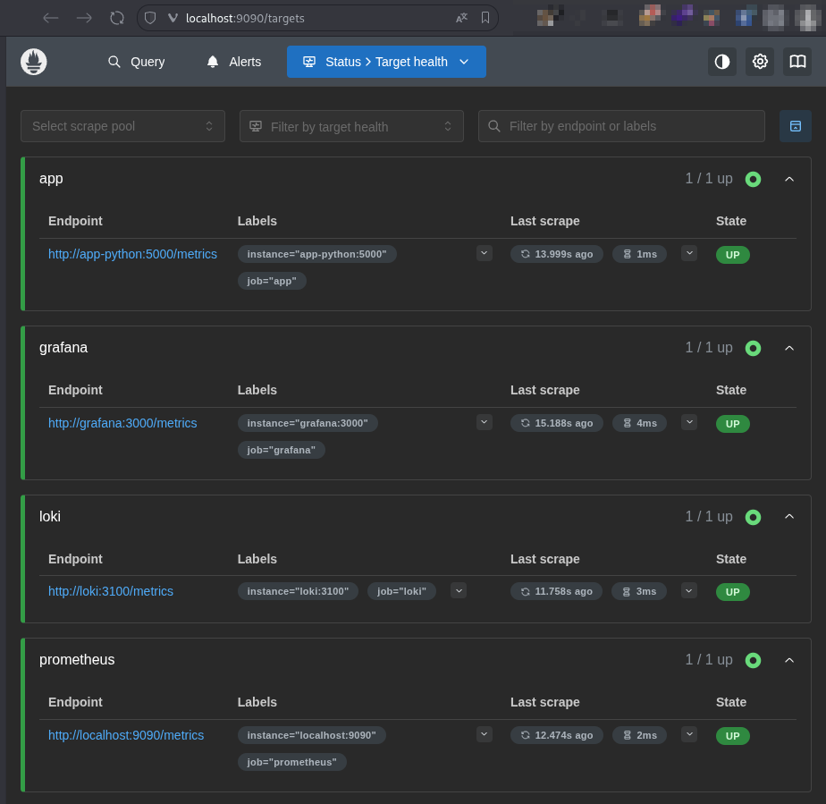
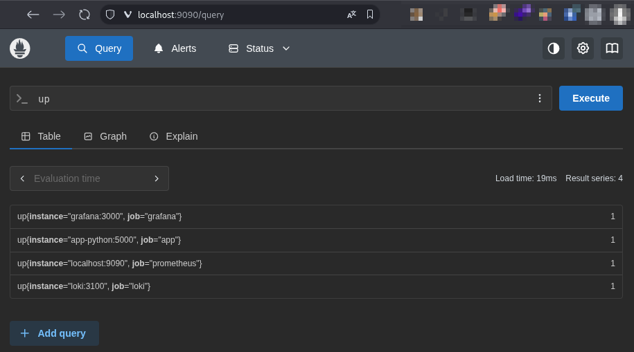
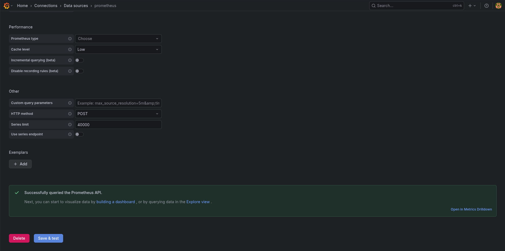
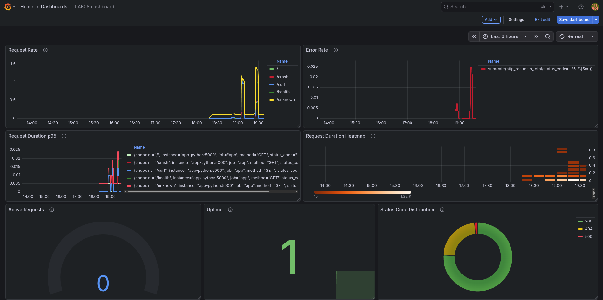
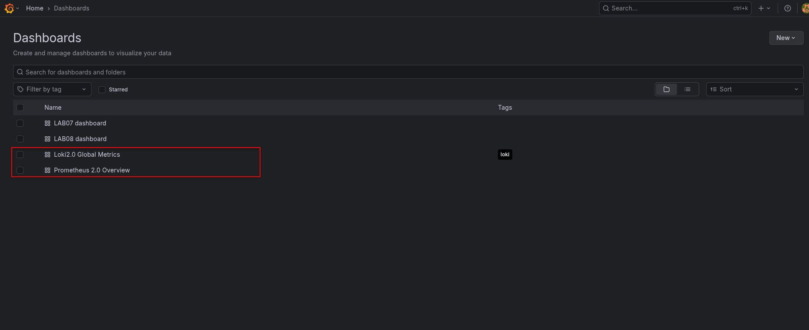
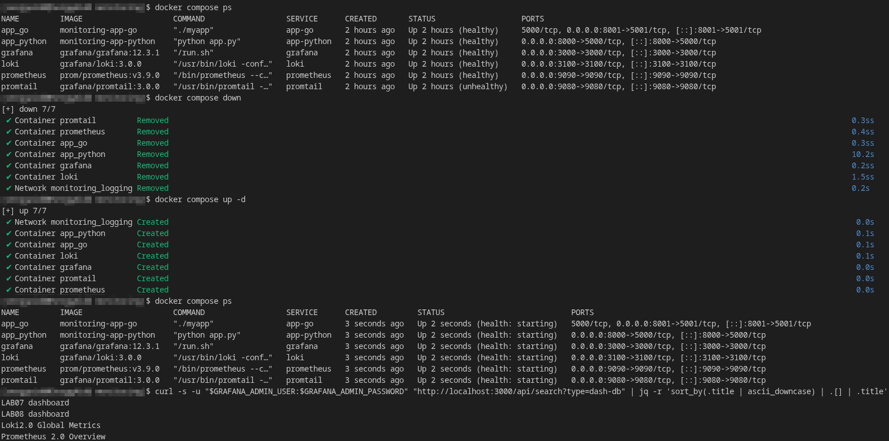

# Lab 8: Metrics & Monitoring with Prometheus - Submission

**Name:** Sergey Aitov  
**Date:** 2026-03-16  
**Lab Points:** 10 + 0
  
---

## 1. Architecture


---

## 2. Application Instrumentation
For the Python application, the `prometheus-client==0.23.1` package was installed and the `/metrics` endpoint was added. Instrumentation is implemented within the Flask application via `before_request` and `after_request`, so metrics are collected automatically for each HTTP request.


### Added metrics
#### 1. `http_requests_total`
`Counter`, which counts the total number of HTTP requests and is marked with the following labels:
- `method`
- `endpoint`
- `status_code`

This metric is needed to understand traffic intensity and to calculate the `error rate`.

#### 2. `http_request_duration_seconds`
A `Histogram` storing the distribution of HTTP request durations. This metric is used for `latency` analysis and `p95` calculation.

#### 3. `http_requests_in_progress`
`Gauge` shows the number of requests currently being processed. For a reasonably fast Flask application, this value is often zero, as requests complete faster than the next `scrape` can capture them.

### Rationale for the choice of metrics
The choice of metrics directly corresponds to the **RED method**:
- **Rate** - `http_requests_total`
- **Errors** - `http_requests_total{status_code=~"5.."}`
- **Duration** - `http_request_duration_seconds`

---

## 3. Prometheus Configuration
Prometheus was configured to collect metrics from app_python and its supporting monitoring services. The configuration was verified using a working /targets page and a successful PromQL query in the Prometheus UI.



### Scrape Targets
The following polling targets were specified in the Prometheus configuration:
- `prometheus` for `localhost:9090`
- `app` for `app-python:5000`
- `loki` for `loki:3100`
- `grafana` for `grafana:3000`

For all services, the `/metrics` path is used, and for Prometheus itself, `self-scrape` is executed.

#### Snippet
```yaml
scrape_configs:
  - job_name: "prometheus"
    static_configs:
      - targets: ["localhost:9090"]

  - job_name: "app"
    static_configs:
      - targets: ["app-python:5000"]
    metrics_path: /metrics

  - job_name: "loki"
    static_configs:
      - targets: ["loki:3100"]
    metrics_path: /metrics

  - job_name: "grafana"
    static_configs:
      - targets: ["grafana:3000"]
    metrics_path: /metrics
```

### Scrape Intervals
Prometheus global intervals are set so that Prometheus collects metrics from targets every 15 seconds and evaluates rules and expressions at the same frequency.

#### Snippet
```yaml
global:
  scrape_interval: 15s
  evaluation_interval: 15s
```

### Retention
The metrics retention policy was set in `docker-compose.yml` via the Prometheus container startup parameters so that metrics would be stored for up to 15 days or until the 10 GB limit was reached, whichever occurred first.

#### Snippet
```yaml
command:
  - "--config.file=/etc/prometheus/prometheus.yml"
  - "--storage.tsdb.path=/prometheus"
  - "--storage.tsdb.retention.time=15d"
  - "--storage.tsdb.retention.size=10GB"
```

---

## 4. Dashboard Walkthrough
### 1. Adding a Prometheus datasource to Grafana (`http://prometheus:9090`):


### 2. Creating a custom dashboard `LAB08 dashboard`:


1. `Request Rate` Panel:
    - **Visualization:** Time series  
    - **Purpose:** Displaying the intensity of incoming requests by endpoint.  
    - **Query:** `sum(rate(http_requests_total[5m])) by (endpoint)`

2. `Error Rate` Panel:
    - **Visualization:** Time series  
    - **Purpose:** Displays the rate of 5xx errors per second. 
    - **Query:** `sum(rate(http_requests_total{status_code=~"5.."}[5m]))`

3. `Request Duration p95` Panel:
    - **Visualization:** Time series  
    - **Purpose:** Monitoring `p95 latency` for application requests.
    - **Query:** `histogram_quantile(0.95, rate(http_request_duration_seconds_bucket[5m]))`

4. `Request Duration Heatmap` Panel:
    - **Visualization:** Heatmap  
    - **Purpose:** Displays the distribution of response times across `histogram buckets`.
    - **Query:** `rate(http_request_duration_seconds_bucket[5m])`

5. `Active Requests` Panel:
    - **Visualization:** Gauge  
    - **Purpose:** Displays the current number of requests that are being processed (as mentioned earlier, this is usually zero).
    - **Query:** `http_requests_in_progress`

6. `Uptime` Panel:
    - **Visualization:** Stat  
    - **Purpose:** Quick indication of app availability (`1 = UP`).  
    - **Query:** `up{job="app"}`

7. `Status Code Distribution` Panel:
    - **Visualization:** Pie chart  
    - **Purpose:** Displays the distribution of response rates by HTTP status code.
    - **Query:** `sum by (status_code) (rate(http_requests_total[20m]))`

### 3. Using community dashboards import from Grafana catalog for testing purposes:


---

## 5. PromQL Examples

| Query | Explanation |
|---|---|
| `up` | Returns the current value of the `up` metric for each scrape target. This metric is automatically created by Prometheus and is set to `1` if the last scrape target completed successfully, and `0` if the scrape failed. |
| `up{job="app"}` | Returns only those time series of the `up` metric whose `job` label is `app`. This means it first filters by the `{job="app"}` label selector, then returns the availability status of only the Python application. |
| `sum(rate(http_requests_total[5m])) by (endpoint)` | The expression `http_requests_total[5m]` forms a **range vector**: for each series of the `http_requests_total` counter, all its values ​​for the last 5 minutes are selected. The function `rate(...)` calculates the average rate of counter growth in **requests per second** over this window, correctly handling possible counter resets. Then `sum ... by (endpoint)` aggregates the resulting series by the label `endpoint`: series with the same `endpoint` are summed, and other labels (`method`, `status_code`, etc.) are collapsed. The result is the total rate of requests per second for each endpoint. |
| `sum(rate(http_requests_total{status_code=~"5.."}[5m]))` | First, the selector `{status_code=~"5.."}` retains only those series of the `http_requests_total` counter whose `status_code` matches the regular expression `5..`, that is, all codes `500–599`. Then `rate(...[5m])` calculates the average growth rate of these counters over the last 5 minutes in requests/sec. The outer `sum(...)` adds all the remaining series into a single final value—the total rate of server errors per second. |
| `histogram_quantile(0.95, rate(http_request_duration_seconds_bucket[5m]))` | The `http_request_duration_seconds_bucket` is a histogram bucket-series, each of which is a separate `counter` for a bucket with a bound of `le`. The expression `[5m]` selects the bucket counter values ​​for the last 5 minutes, and `rate(...)` translates them into the rate at which observations are received in each bucket. The function `histogram_quantile(0.95, ...)` estimates the 95th percentile of latency from the distribution of bucket rates. Important: in this form, the quantile is calculated separately for each unique combination of labels. If an overall p95 is needed for the entire series, an aggregation of the form `histogram_quantile(0.95, sum by (le) (rate(...)))` is typically used. |
| `http_requests_in_progress` | Returns the current value of the gauge metric `http_requests_in_progress`. Unlike counter, this doesn't calculate speed or growth: Prometheus simply reads the current instantaneous value, that is, how many requests are in progress at the time of scraping. |
| `sum by (status_code) (rate(http_requests_total[20m]))` | `http_requests_total[20m]` fetches counter values ​​for the last 20 minutes, `rate(...)` calculates the average growth rate for each individual series during this window, and `sum by (status_code)` aggregates them by the `status_code` label. The result is the total request rate per second for each HTTP response code, with labels like `endpoint` and `method` collapsed. |


---

## 6. Production Setup
### Health Checks:
- `loki` - `http://localhost:3100/ready`
- `grafana` - `http://localhost:3000/api/health`
- `prometheus` - `http://localhost:9090/-/healthy`
- `app-python` - `http://localhost:5000/health`
- `app-go` - `http://localhost:5001/health`
- `promtail` - bash-based TCP probe against `127.0.0.1:9080/ready`

### Resource Limits via `deploy.resources.limits`:
- `prometheus` - `1 CPU`, `1G memory`
- `loki` - `1 CPU`, `1G memory`
- `grafana` - `0.5 CPU`, `512M memory`
- `app-python` - `0.5 CPU`, `256M memory`
- `app-go` - `0.5 CPU`, `256M memory`
- `promtail` - `0.5 CPU`, `512M memory`

### Retention Policies
Retention and data persistence in the monitoring stack are ensured through a combination of configured storage limits and named Docker volumes.

#### 1. Prometheus retains time-series data for up to 15 days or until it reaches 10 GB, the retention policy for which was defined in `docker-compose.yml`:
```yaml
command:
- "--config.file=/etc/prometheus/prometheus.yml"
- "--storage.tsdb.path=/prometheus"
- "--storage.tsdb.retention.time=15d"
- "--storage.tsdb.retention.size=10GB"
```

#### 2. Loki continues to use the log retention policy configured in Lab 7.

#### 3. Named volumes were used to persist data between restarts:
- `loki-data`
- `grafana-data`
- `promtail-positions`
- `prometheus-data`



---

## 7. Testing Results
- Metrics endpoint verification:


- Prometheus scraping verification


- Grafana integration verification:


- Persistence verification


### Metrics vs Logs (Lab 7 vs Lab 8)
**Metrics** and **logs** solve different problems, which is why they complement each other well:
- **Metrics** answer the question: *how often, how fast, how much?*
- **Logs** answer the question: *what exactly happened?*

In the context of this project:
- Prometheus/Grafana are convenient for rate, latency, uptime, error trends, and capacity-style observations.
- Loki/Grafana are convenient for detailed analysis of specific requests, tracebacks, JSON fields, and troubleshooting.

That's why **Logs** and **Metrics** together form a more complete observability stack.

---

## 8. Challenges & Solutions

### 1. Incorrect label name in Grafana queries
**Problem:** The Error Rate panel in Grafana did not show any data.

**Reason:** The query used the label `status`, while the actual Prometheus metric was defined with the label `status_code`.

**Solution:** The Grafana query was updated to use the correct `status_code` label. After that, the panel started displaying data correctly.

### 2. Active Requests gauge stayed at zero
**Problem:** The `Active Requests` panel showed `0` most of the time, even after generating test traffic.

**Reason:** The application processes requests very quickly, while the gauge reflects only the current number of in-progress requests at the exact moment of the Prometheus scrape.

**Solution:** The metric behavior was analyzed and confirmed to be expected for a lightweight application with fast request handling.

### 3. Promtail healthcheck setup
**Problem:** A standard HTTP healthcheck for Promtail could not be configured initially.

**Reason:** The official `grafana/promtail` image does not include `curl` or `wget`, which are commonly used for HTTP-based healthchecks.

**Solution:** A bash-based healthcheck using `/dev/tcp` was added, allowing the container to perform an HTTP GET request to `/ready` without installing additional packages.

---

## 9. Files Produced

- `monitoring/prometheus/prometheus.yml` — Prometheus scrape configuration  
- `monitoring/docker-compose.yml` — updated observability stack  
- `monitoring/docs/LAB08.md` — this report  
- `monitoring/docs/LAB08 dashboard-1773681428929.json` — exported Grafana dashboard JSON
---

## Summary

**Results:** A complete metrics monitoring stack based on Prometheus and Grafana was integrated into the existing observability environment. The Flask application was instrumented with Prometheus metrics, Prometheus was configured to scrape the application and supporting services, a custom Grafana dashboard with 7 panels was created, and production-oriented settings such as health checks, resource limits, retention, and persistent volumes were added.

**Total time spent:** ~5–6 hours (application instrumentation, Prometheus setup, Grafana dashboard creation, PromQL debugging, production readiness configuration, documentation).

**Key learnings:**
- How application metrics complement logs and improve observability;
- How to instrument a Flask application using Counter, Gauge, and Histogram metrics;
- How Prometheus scrape targets, intervals, and retention settings work in practice;
- How to use PromQL to analyze request rate, error rate, latency, and service availability;
- How to build a Grafana dashboard around the RED method and interpret live metric data;
- How to validate monitoring stack health and persistence after container restarts.