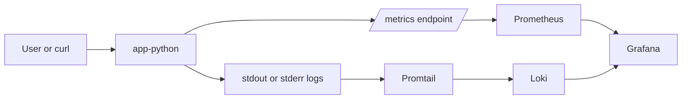
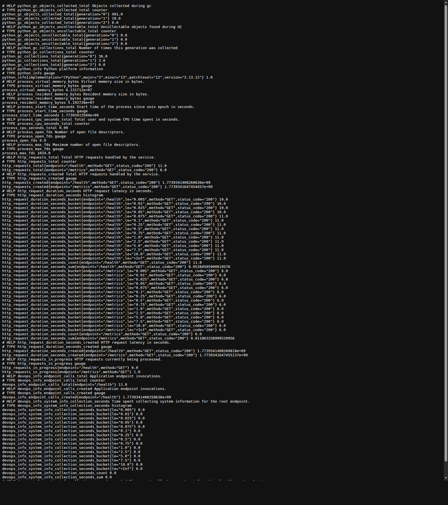
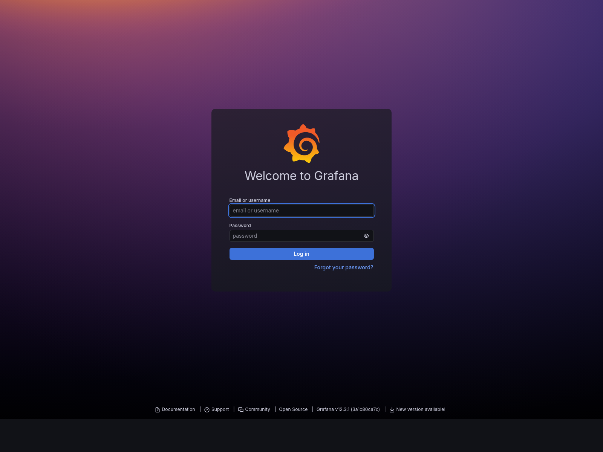

# Lab 08 - Metrics and Monitoring with Prometheus

## Status

Main lab work is implemented in `app_python/` and `monitoring/` and was validated locally on 2026-03-19.

Completed state:

- FastAPI app exposes Prometheus metrics at `/metrics`
- RED-style HTTP metrics are collected with low-cardinality labels
- Prometheus scrapes the app, Loki, Grafana, and Prometheus itself every 15 seconds
- Grafana is provisioned with both Loki and Prometheus data sources
- A 7-panel application dashboard is provisioned from JSON
- Volumes persist Prometheus, Loki, Grafana, and Promtail state across restart
- `docker compose down` followed by `docker compose up -d` preserved the dashboard and healthy stack

## 1. Architecture



### Component roles

- `app-python`: exposes JSON APIs, structured logs, and Prometheus metrics
- `Prometheus`: scrapes time-series metrics from the application and the observability stack
- `Grafana`: visualizes both metrics and logs
- `Promtail`: collects container logs from Docker
- `Loki`: stores log streams from Lab 7

### Metrics vs logs

- Metrics answer how much, how often, and how long
- Logs answer what happened and which request failed
- In this repository the two signals complement each other:
  - Prometheus tracks request rate, errors, and latency
  - Loki keeps the per-request JSON payload with `path`, `client_ip`, `user_agent`, and `duration_ms`

## 2. Application Instrumentation

The FastAPI service in `app_python/app.py` now exposes `/metrics` and records both transport-level and app-specific metrics.

### Metrics added

| Metric | Type | Labels | Purpose |
|---|---|---|---|
| `http_requests_total` | Counter | `method`, `endpoint`, `status_code` | Total request count |
| `http_request_duration_seconds` | Histogram | `method`, `endpoint`, `status_code` | Request latency distribution |
| `http_requests_in_progress` | Gauge | `method`, `endpoint` | Concurrent requests |
| `devops_info_endpoint_calls_total` | Counter | `endpoint` | Business-level endpoint usage |
| `devops_info_system_info_collection_seconds` | Histogram | none | Time spent building `/` response |

### Label strategy

To avoid high cardinality, request paths are normalized before they become metric labels:

- `/`
- `/health`
- `/metrics`
- `unmatched` for unknown routes

This keeps metrics safe for Prometheus while logs still retain the real URL path.

### Local metrics evidence

The `/metrics` endpoint exposes both default Python process metrics and custom application metrics:

```text
# HELP http_requests_total Total HTTP requests handled by the service.
# TYPE http_requests_total counter
http_requests_total{endpoint="/health",method="GET",status_code="200"} 3.0
```



## 3. Prometheus Configuration

Prometheus is defined in `monitoring/docker-compose.yml` and configured through `monitoring/prometheus/prometheus.yml`.

### Scrape policy

- `scrape_interval: 15s`
- `evaluation_interval: 15s`

### Scrape targets

| Job | Target | Notes |
|---|---|---|
| `prometheus` | `localhost:9090` | self-scrape |
| `app` | `app-python:5000` | FastAPI container port inside Compose network |
| `loki` | `loki:3100` | Loki metrics endpoint |
| `grafana` | `grafana:3000` | Grafana metrics endpoint enabled with `GF_METRICS_ENABLED=true` |

### Retention and persistence

Prometheus retention is set through container flags:

```text
--storage.tsdb.retention.time=15d
--storage.tsdb.retention.size=10GB
```

Persistent storage uses the named volume `prometheus-data`.

### Verified target state

Prometheus returned all required targets as `up=1`:

```json
{
  "app-python:5000": "1",
  "grafana:3000": "1",
  "loki:3100": "1",
  "localhost:9090": "1"
}
```


## 4. Dashboard Walkthrough

Grafana is provisioned from files under `monitoring/grafana/`:

- data sources: `monitoring/grafana/provisioning/datasources/datasources.yml`
- dashboard provider: `monitoring/grafana/provisioning/dashboards/dashboards.yml`
- exported dashboard JSON: `monitoring/grafana/dashboards/devops-metrics-dashboard.json`

### Provisioned data sources

- `Loki` -> `http://loki:3100`
- `Prometheus` -> `http://prometheus:9090`

### Dashboard panels

| Panel | Query | Purpose |
|---|---|---|
| Request Rate by Endpoint | `sum by (endpoint) (rate(http_requests_total{job="app",endpoint!="/metrics"}[5m]))` | Request throughput per endpoint |
| Error Rate | `sum(rate(http_requests_total{job="app",endpoint!="/metrics",status_code=~"5.."}[5m]))` | 5xx error rate |
| Request Duration p95 | `histogram_quantile(0.95, sum by (le, endpoint) (rate(http_request_duration_seconds_bucket{job="app",endpoint!="/metrics"}[5m])))` | 95th percentile latency |
| Request Duration Heatmap | `sum by (le) (rate(http_request_duration_seconds_bucket{job="app",endpoint!="/metrics"}[5m]))` | Latency distribution |
| Active Requests | `sum(http_requests_in_progress{job="app",endpoint!="/metrics"})` | In-flight requests |
| Status Code Distribution | `sum by (status_code) (rate(http_requests_total{job="app",endpoint!="/metrics"}[5m]))` | Response mix |
| Application Uptime | `up{job="app"}` | Service availability |

The dashboard intentionally excludes `/metrics` from the main RED panels so Prometheus scrapes do not dominate the charts.



## 5. PromQL Examples

### RED-focused queries

```promql
sum by (endpoint) (rate(http_requests_total{job="app",endpoint!="/metrics"}[5m]))
```

Requests per second by endpoint.

```promql
sum(rate(http_requests_total{job="app",endpoint!="/metrics",status_code=~"5.."}[5m]))
```

5xx error rate.

```promql
histogram_quantile(0.95, sum by (le, endpoint) (rate(http_request_duration_seconds_bucket{job="app",endpoint!="/metrics"}[5m])))
```

95th percentile latency by endpoint.

```promql
sum by (status_code) (rate(http_requests_total{job="app",endpoint!="/metrics"}[5m]))
```

Status code distribution.

```promql
sum(http_requests_in_progress{job="app",endpoint!="/metrics"})
```

Current concurrency.

```promql
sum by (endpoint) (rate(devops_info_endpoint_calls_total[5m]))
```

Application-level endpoint usage.

## 6. Production Setup

### Health checks

| Service | Health check |
|---|---|
| `app-python` | Python stdlib request to `http://localhost:5000/health` |
| `prometheus` | `http://localhost:9090/-/healthy` |
| `grafana` | `http://localhost:3000/api/health` |
| `loki` | `http://localhost:3100/ready` |
| `promtail` | TCP probe to `localhost:9080` via bash |

### Resource limits

| Service | CPU | Memory |
|---|---|---|
| `prometheus` | `1.00` | `1G` |
| `loki` | `1.00` | `1G` |
| `grafana` | `0.50` | `512M` |
| `app-python` | `0.50` | `256M` |
| `promtail` | `0.50` | `256M` |

### Persistent volumes

- `prometheus-data`
- `loki-data`
- `grafana-data`
- `promtail-positions`

## 7. Testing Results

### Unit tests

The FastAPI test suite passed after instrumentation was added:

```text
Ran 7 tests in 0.036s

OK
```

### Compose health after restart

After `docker compose down` and `docker compose up -d`, all services became healthy again:

```text
NAME                      IMAGE                       STATUS                    PORTS
monitoring-app-python-1   devops-info-service:lab08   Up 53 seconds (healthy)   0.0.0.0:8000->5000/tcp
monitoring-grafana-1      grafana/grafana:12.3.1      Up 27 seconds (healthy)   0.0.0.0:3000->3000/tcp
monitoring-loki-1         grafana/loki:3.0.0          Up 53 seconds (healthy)   0.0.0.0:3100->3100/tcp
monitoring-prometheus-1   prom/prometheus:v3.9.0      Up 33 seconds (healthy)   0.0.0.0:9090->9090/tcp
monitoring-promtail-1     grafana/promtail:3.0.0      Up 33 seconds (healthy)   0.0.0.0:9080->9080/tcp
```

### Persistence proof

The dashboard remained provisioned after restart:

- dashboard UID: `devops-lab08-metrics`
- Grafana API still returned the same dashboard metadata after `down` and `up -d`
- data sources still contained only `Loki` and `Prometheus`

## 8. Challenges and Solutions

### 1. Promtail health check was failing

Problem:

- `grafana/promtail:3.0.0` does not contain `wget`
- the inherited Lab 7 health check used `wget`, so the container stayed unhealthy even though Promtail was working

Fix:

- replaced the Promtail health check with a bash TCP probe:

```yaml
test:
  - CMD-SHELL
  - "bash -c ': > /dev/tcp/localhost/9080'"
```

### 2. Grafana had a stale Loki data source

Problem:

- the persisted `grafana-data` volume still contained a manually created `loki` data source from Lab 7
- provisioning a new `Loki` data source created a duplicate

Fix:

- added `deleteDatasources` to the provisioning file and restarted Grafana

### 3. Prometheus exposition label order broke the test

Problem:

- the text exposition order was `endpoint`, `method`, `status_code`
- the original assertion expected a different order

Fix:

- updated the unit test to match the real exposition format emitted by `prometheus_client`

## Summary

Lab 08 is complete in this repository:

- application metrics are implemented and tested
- Prometheus is deployed and scrapes all required targets
- Grafana is provisioned with both data sources and a 7-panel dashboard
- health checks, limits, retention, and persistent volumes are configured
- evidence was captured with screenshots and API validation
