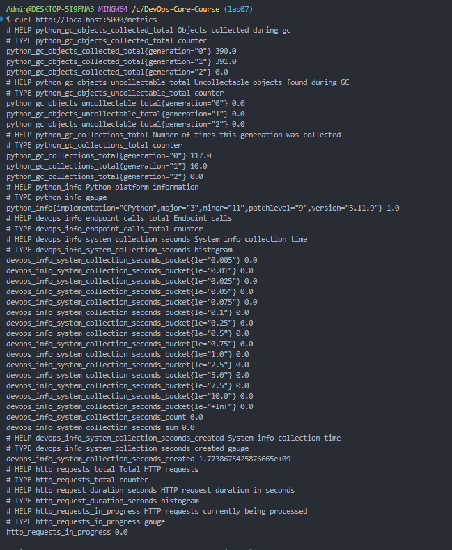
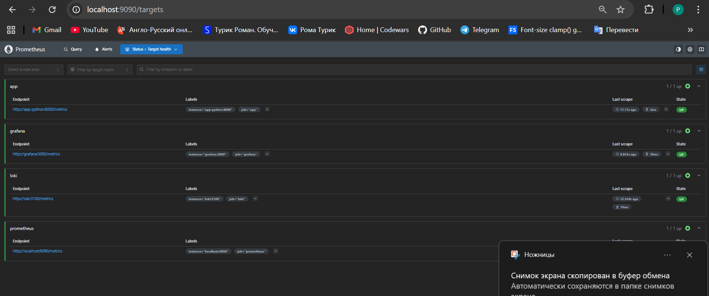
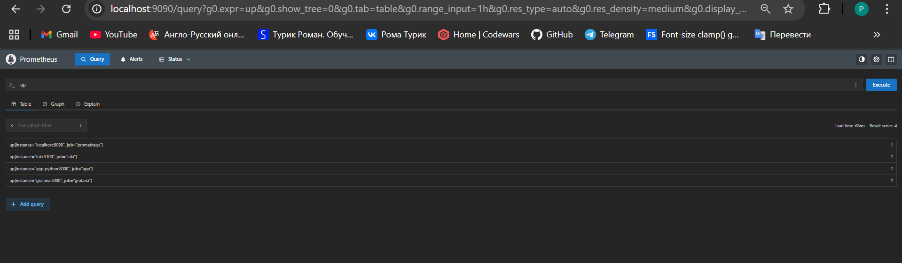
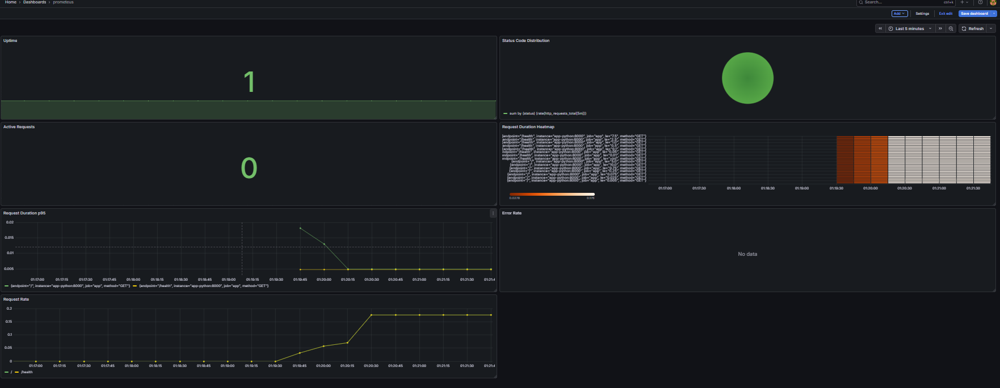
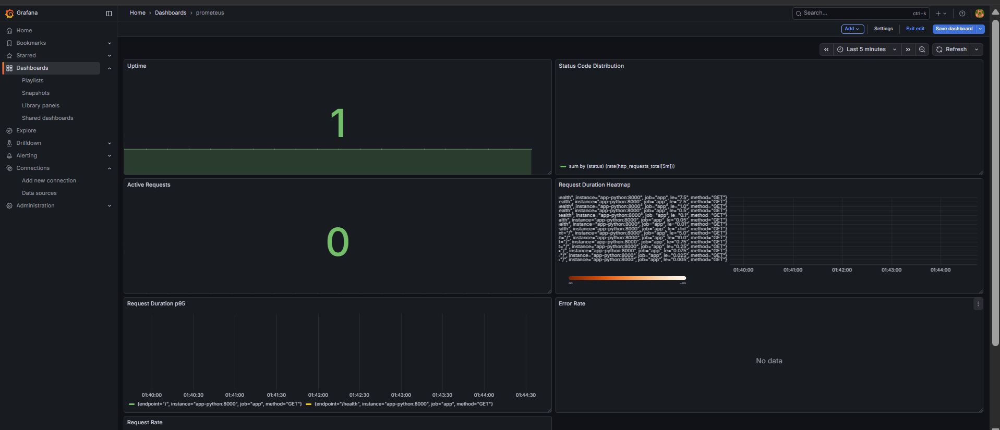
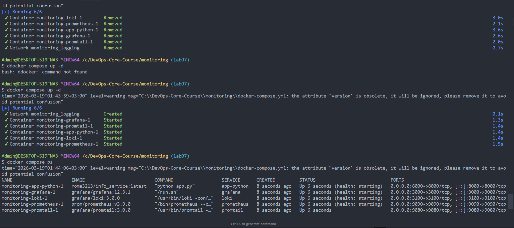

# Lab 08 — Metrics & Monitoring with Prometheus

## 1. Architecture

**Stack:** Prometheus 3.9.0 + Grafana 12.3.1 + prometheus_client (Python)

**Application:** FastAPI info_service (`roma3213/info_service:latest`) on port 8000

**Host:** Windows (Docker Desktop)

**Project structure:**

```
monitoring/
├── docker-compose.yml
├── .env                          # Grafana admin password
├── prometheus/
│   └── prometheus.yml            # Scrape targets config
├── loki/
│   └── config.yml                # From Lab 7
├── promtail/
│   └── config.yml                # From Lab 7
├── grafana-app-dashboard.json    # Exported Grafana dashboard
└── docs/
    ├── LAB07.md
    └── LAB08.md
```

**How metrics flow:**

```
App (port 8000)
    │
    │  /metrics endpoint (prometheus_client)
    │
    ▼ scrape every 15s
Prometheus (port 9090) ◄── also scrapes itself, Loki, Grafana
    │
    │  TSDB storage (15d retention)
    │
    ▼ PromQL queries
Grafana (port 3000)
    │
  Dashboards + panels
```

---

## 2. Application Instrumentation

### Metrics defined in `app_python/app.py`

```python
from prometheus_client import Counter, Histogram, Gauge, generate_latest

http_requests_total = Counter(
    'http_requests_total',
    'Total HTTP requests',
    ['method', 'endpoint', 'status_code']
)

http_request_duration_seconds = Histogram(
    'http_request_duration_seconds',
    'HTTP request duration in seconds',
    ['method', 'endpoint']
)

http_requests_in_progress = Gauge(
    'http_requests_in_progress',
    'HTTP requests currently being processed'
)
```

### Why these metrics (RED method)

| Metric | Type | RED | Purpose |
|---|---|---|---|
| `http_requests_total` | Counter | **R**ate | Requests per second, broken down by method/endpoint/status |
| `http_request_duration_seconds` | Histogram | **D**uration | Latency distribution, enables percentile calculations |
| `http_requests_in_progress` | Gauge | — | Current concurrency level |
| `http_requests_total{status=~"5.."}` | Counter | **E**rrors | 5xx error rate |

### Middleware instrumentation

The middleware wraps every request (except `/metrics` itself):

1. Increments `http_requests_in_progress` gauge
2. Records start time
3. After response: increments counter with labels, observes duration in histogram
4. Decrements gauge

### `/metrics` endpoint

```python
@app.get("/metrics")
async def metrics():
    return Response(content=generate_latest(), media_type="text/plain")
```



---

## 3. Prometheus Configuration

### `prometheus/prometheus.yml`

```yaml
global:
  scrape_interval: 15s
  evaluation_interval: 15s

scrape_configs:
  - job_name: "prometheus"
    static_configs:
      - targets: ["localhost:9090"]

  - job_name: "app"
    static_configs:
      - targets: ["app-python:8000"]
    metrics_path: "/metrics"

  - job_name: "loki"
    static_configs:
      - targets: ["loki:3100"]
    metrics_path: "/metrics"

  - job_name: "grafana"
    static_configs:
      - targets: ["grafana:3000"]
    metrics_path: "/metrics"
```

**4 scrape targets:** prometheus (self), app (Python), loki, grafana — all on the `logging` Docker network, using service names as hostnames.





### Data retention

Configured via Prometheus command args:

```yaml
command:
  - '--config.file=/etc/prometheus/prometheus.yml'
  - '--storage.tsdb.retention.time=15d'
  - '--storage.tsdb.retention.size=10GB'
```

- **Time-based:** 15 days — old data is automatically deleted
- **Size-based:** 10GB cap — prevents disk from filling up
- Whichever limit is hit first triggers cleanup

---

## 4. Dashboard Walkthrough

Custom dashboard **"prometeus"** with 7 panels:

| # | Panel | Type | PromQL Query | Purpose |
|---|---|---|---|---|
| 1 | **Uptime** | Stat | `up{job="app"}` | Shows 1 (up) or 0 (down) |
| 2 | **Status Code Distribution** | Pie chart | `sum by (status) (rate(http_requests_total[5m]))` | 2xx vs 4xx vs 5xx ratio |
| 3 | **Active Requests** | Stat | `http_requests_in_progress` | Current concurrent requests |
| 4 | **Request Duration Heatmap** | Heatmap | `rate(http_request_duration_seconds_bucket[5m])` | Latency distribution over time |
| 5 | **Request Duration p95** | Time series | `histogram_quantile(0.95, rate(http_request_duration_seconds_bucket[5m]))` | 95th percentile latency |
| 6 | **Error Rate** | Time series | `sum(rate(http_requests_total{status=~"5.."}[5m]))` | 5xx errors per second |
| 7 | **Request Rate** | Time series | `sum(rate(http_requests_total[5m])) by (endpoint)` | Requests/sec per endpoint |





Exported JSON: `monitoring/grafana-app-dashboard.json`

---

## 5. PromQL Examples

### 1. Request rate per endpoint

```promql
sum(rate(http_requests_total[5m])) by (endpoint)
```

Shows requests/sec grouped by endpoint (`/`, `/health`, `/system-info`).

### 2. Error rate (5xx)

```promql
sum(rate(http_requests_total{status_code=~"5.."}[5m]))
```

Total 5xx errors per second across all endpoints.

### 3. 95th percentile latency

```promql
histogram_quantile(0.95, rate(http_request_duration_seconds_bucket[5m]))
```

95% of requests complete faster than this value.

### 4. Services health check

```promql
up == 0
```

Returns all targets that are currently down — useful for alerting.

### 5. Total requests by status code

```promql
sum by (status_code) (increase(http_requests_total[1h]))
```

How many requests of each status code in the last hour.

### 6. Average request duration

```promql
rate(http_request_duration_seconds_sum[5m]) / rate(http_request_duration_seconds_count[5m])
```

Average latency over the last 5 minutes.

---

## 6. Production Setup

### Health checks

| Service | Health check | Interval |
|---|---|---|
| Prometheus | `wget --spider http://localhost:9090/-/healthy` | 10s |
| Loki | `wget --spider http://localhost:3100/ready` | 10s |
| Grafana | `curl -f http://localhost:3000/api/health` | 10s |
| App | `curl -f http://localhost:8000/health` | 10s |

All health checks: timeout 5s, retries 5.

### Resource limits

| Service | Memory limit | CPU limit |
|---|---|---|
| Prometheus | 1G | 1.0 |
| Loki | 1G | 1.0 |
| Grafana | 512M | 0.5 |
| Promtail | 512M | 0.5 |
| App | 256M | 0.5 |

### Data retention

| Component | Retention | Mechanism |
|---|---|---|
| Prometheus | 15 days / 10GB | TSDB args (`--storage.tsdb.retention.*`) |
| Loki | 7 days (168h) | `limits_config.retention_period` + compactor |

### Persistent volumes

```yaml
volumes:
  prometheus-data:   # /prometheus — TSDB data
  loki-data:         # /loki — log chunks + index
  grafana-data:      # /var/lib/grafana — dashboards, data sources
```

Data survives `docker compose down` / `docker compose up -d`.



---

## 7. Testing

### Verify all services running

```bash
docker compose ps
# All services: Up (healthy)
```

### Generate traffic

```bash
for i in {1..20}; do curl http://localhost:8000/; done
for i in {1..20}; do curl http://localhost:8000/health; done
```

### Verify Prometheus targets

Open `http://localhost:9090/targets` — all 4 targets should be **UP** (green).

### Verify Grafana dashboard

Open `http://localhost:3000` → Dashboards → prometeus — all 7 panels showing live data.

---

## 8. Challenges & Solutions

### 1. No "Graph" panel type in Grafana 12

**Problem:** The lab instructions reference "Graph" panel type for Request Rate, Error Rate, and p95 Duration panels. Grafana 12.3.1 no longer has the legacy "Graph" panel — it was removed in favor of newer visualization types.

**Solution:** Used "Time series" panel type instead, which is the official replacement for the old Graph panel. Same PromQL queries, same functionality, just the modern visualization.

### 3. Metrics vs Logs — when to use each

| Use case | Metrics (Prometheus) | Logs (Loki) |
|---|---|---|
| "How many requests/sec?" | ✅ `rate(http_requests_total[5m])` | ❌ Expensive count |
| "What happened at 01:15?" | ❌ No detail | ✅ Full request context |
| "Is latency degrading?" | ✅ `histogram_quantile(0.95, ...)` | ❌ No built-in |
| "Why did request X fail?" | ❌ Only counts | ✅ Stack trace, params |
| Alerting on thresholds | ✅ Designed for this | ❌ Not ideal |
| Long-term trends | ✅ Efficient storage | ❌ Too much data |

**Rule of thumb:** Metrics for "how much / how often", logs for "what happened / why".
