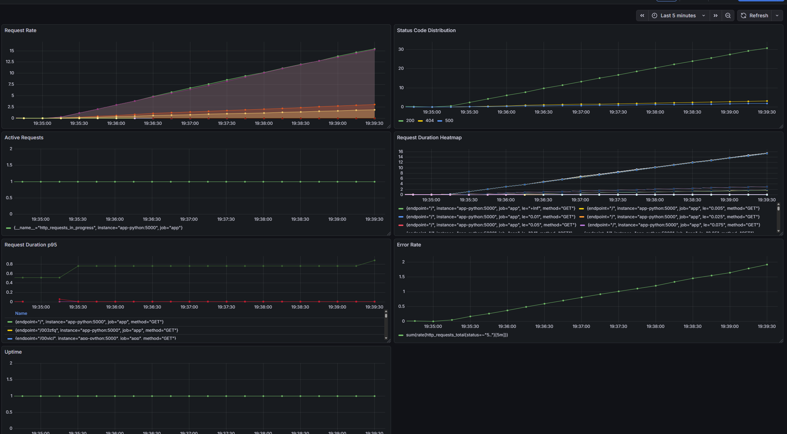

# LAB08 — Metrics & Monitoring with Prometheus

## Architecture

```
[Flask app :5000] --> [Prometheus :9090]
        |                       |   
        |                       |
        └───────────────────────┘
                    |
                    v
           [Grafana 12.3 :3000]
```

---

## Application Instrumentation

The Flask app was instrumented using the `prometheus_client` library to expose Prometheus-compatible metrics on `GET /metrics`.

**`http_requests_total{method,endpoint,status}`**
- **counter**, that increases for every HTTP request.
- Labels:
  - `method`: HTTP verb (GET, POST, etc.)
  - `endpoint`: request path (e.g., `/`, `/health`, `/raise-error`)
  - `status`: response status code (200, 404, 500)
- **Why**: lets Prometheus compute request rate (RPS), error rate, and group by endpoint/method.

### `http_request_duration_seconds{method,endpoint}`
- **histogram** that records request latency in seconds.
- Provides buckets for P50/P90/P99 latency and average request duration.
- **Why**: helps detect slow endpoints and track performance changes over time.

### `http_requests_in_progress`
- **gauge**, that increase at request start and decrease at request end.
- **Why**: shows current concurrent request load (useful for detecting saturation and queueing).

## Prometheus Configuration

Prometheus is configured via `monitoring/prometheus/prometheus.yml` and runs as the `prometheus` service in Docker Compose.

### Global settings
- **Scrape interval**: `15s`
- **Evaluation interval**: `15s`

### Storage settings
- **retention.time**: 15d
- **retention.size**: 10GB
There will be received `retention.time` or `retention.size` first.

### Scrape targets
| Job | Target | Metrics path | Notes |
|-----|--------|--------------|-------|
| `prometheus` | `localhost:9090` | `/metrics` | Self-scrape for internal Prometheus metrics.
| `app` | `app-python:5000` | `/metrics` | Scrapes the Flask app's exposed metrics.
| `loki` | `loki:3100` | `/metrics` | Scrapes Loki internal metrics (ingestion, compactor health, etc.).
| `grafana` | `grafana:3000` | `/metrics` | Scrapes Grafana internal metrics for dashboard health.

---

## Dashboard Walkthrough



### Panels explained (what is shown)

1. **Request Rate** (line chart)
   - Shows incoming request volume over time.
   - Query: `sum(rate(http_requests_total[1m]))`

2. **Status Code Distribution** (stacked area)
   - Shows how many requests return 2xx/4xx/5xx codes.
   - Query: `sum(rate(http_requests_total[1m])) by (status)`

3. **Active Requests** (gauge)
   - Shows current concurrent in-flight requests.
   - Query: `http_requests_in_progress`

4. **Request Duration Heatmap**
   - Visualizes latency distribution over time using histogram buckets.
   - Query: `histogram_quantile(0.95, sum(rate(http_request_duration_seconds_bucket[5m])) by (le, endpoint))`

5. **Request Duration p95**
   - Shows the 95th percentile request latency.
   - Query: `histogram_quantile(0.95, sum(rate(http_request_duration_seconds_bucket[5m])) by (le))`

6. **Error Rate**
   - Shows how many 5xx errors are happening over time.
   - Query: `sum(rate(http_requests_total{status=~"5.."}[5m]))`

7. **Uptime** (optional)
   - Displays application uptime as a single stat.
   - Query: `up{job="app"}`.

---

## PromQL Examples

1. **Overall request rate (RPS)**
   - `sum(rate(http_requests_total[1m]))`
   - Shows how many requests the app is serving per second.

2. **Request rate by endpoint**
   - `sum(rate(http_requests_total[1m])) by (endpoint)`
   - Helps identify which endpoints receive the most traffic.

3. **Error rate (5xx responses)**
   - `sum(rate(http_requests_total{status=~"5.."}[5m]))`
   - Used for alerting when the app starts returning server errors.

4. **Latency (P95 request duration)**
   - `histogram_quantile(0.95, sum(rate(http_request_duration_seconds_bucket[5m])) by (le))`
   - Tracks high-tail latency.

5. **Latency by endpoint (P95)**
   - `histogram_quantile(0.95, sum(rate(http_request_duration_seconds_bucket[5m])) by (le, endpoint))`
   - Compares tail latency across endpoints.

6. **Concurrent requests**
   - `http_requests_in_progress`
   - Shows how many requests are currently being processed.

---

## Production Setup

### Resources
Every service contains `deploy.resources`:
- **Loki**: 1 CPU, 1G memory
- **Grafana**: 1 CPU, 1G memory
- **Prometheus**: 1 CPU, 1G memory
- **Promtail**: 0.5 CPU, 512M memory
- **app-python**: 0.5 CPU, 512M memory

### Health Check
- **Grafana**: `GET http://localhost:3000/api/health`
- **Loki**: `GET http://localhost:3100/ready`
- **Promtail**: `GET http://localhost:9080/ready`
- **Prometheus**: `GET http://localhost:9090/targets`
- **app-python**: `GET http://localhost:5000/health`

---

## Testing Results

You can see there, that this is working


For collect data i used this script
```py
import time
import random
import string
import argparse
from concurrent.futures import ThreadPoolExecutor, as_completed
import threading

try:
    import requests
except ImportError:
    print("Please install requests: pip install requests")
    raise SystemExit(1)


def random_path():
    suffix = ''.join(random.choices(string.ascii_lowercase + string.digits, k=6))
    return f"/{suffix}"


def make_request(session, url, stats, lock):
    try:
        resp = session.get(url, timeout=5)
        if resp.status_code >= 500:
            with lock:
                stats["error"] += 1
    except Exception:
        with lock:
            stats["error"] += 1


def main(base_url: str, duration_sec: int = 300, concurrency: int = 5):
    end_time = time.time() + duration_sec
    stats = {"ok": 0, "error": 0, "raise_error": 0, "not_found": 0}
    lock = threading.Lock()

    with requests.Session() as session:
        with ThreadPoolExecutor(max_workers=concurrency) as pool:
            while time.time() < end_time:
                urls = []
                for _ in range(concurrency):
                    r = random.random()
                    if r < 0.05:
                        path = "/raise-error"
                        with lock:
                            stats["raise_error"] += 1
                    elif r < 0.20:
                        path = random.choice(["/does-not-exist", random_path()])
                        with lock:
                            stats["not_found"] += 1
                    else:
                        path = random.choice(["/", "/health"])
                        with lock:
                            stats["ok"] += 1

                    urls.append(base_url.rstrip("/") + path)

                futures = [
                    pool.submit(make_request, session, url, stats, lock)
                    for url in urls
                ]
                for _ in as_completed(futures):
                    pass

                time.sleep(random.uniform(0.05, 0.25))

    print("=== done ===")
    print(f"duration: {duration_sec}s")
    print(f"ok requests (/, /health)      : {stats['ok']}")
    print(f"raise-error requests          : {stats['raise_error']}")
    print(f"not-found requests            : {stats['not_found']}")
    print(f"errors / timeouts             : {stats['error']}")


if __name__ == "__main__":
    parser = argparse.ArgumentParser(description="Generate random traffic to the app for 5 minutes.")
    parser.add_argument("--base-url", default="http://localhost:5000", help="Base URL of the app")
    parser.add_argument("--duration", type=int, default=300, help="Duration in seconds (default 300)")
    parser.add_argument("--concurrency", type=int, default=5, help="Number of concurrent requests per batch (3-10)")
    args = parser.parse_args()

    main(args.base_url, args.duration, args.concurrency)
```

### Execute `docker ps`
```
andpe@chale:/mnt/g/DevOps/DevOps-Core-Course/monitoring$ docker ps
CONTAINER ID   IMAGE                    COMMAND                  CREATED             STATUS                       PORTS                                         NAMES
319bdae08705   monitoring-app-python    "python -u app.py"       About an hour ago   Up About an hour (healthy)   0.0.0.0:5000->5000/tcp, [::]:5000->5000/tcp   devops-info-app
324fb009d75e   grafana/grafana:12.3.1   "/run.sh"                About an hour ago   Up About an hour (healthy)   0.0.0.0:3000->3000/tcp, [::]:3000->3000/tcp   grafana
9d57983fab9c   grafana/promtail:3.0.0   "/usr/bin/promtail -…"   About an hour ago   Up About an hour (healthy)   0.0.0.0:9080->9080/tcp, [::]:9080->9080/tcp   promtail
9774214dc363   grafana/loki:3.0.0       "/usr/bin/loki -conf…"   About an hour ago   Up About an hour (healthy)   0.0.0.0:3100->3100/tcp, [::]:3100->3100/tcp   loki
d26fe9f64cec   prom/prometheus:latest   "/bin/prometheus --c…"   About an hour ago   Up About an hour (healthy)   0.0.0.0:9090->9090/tcp, [::]:9090->9090/tcp   prometheus
```

### Execute `curl http://localhost:5000/metrics` (full at [/metrics-response](/metrics-response))
```
# HELP python_gc_objects_collected_total Objects collected during gc
# TYPE python_gc_objects_collected_total counter
python_gc_objects_collected_total{generation="0"} 355159.0
python_gc_objects_collected_total{generation="1"} 54729.0
python_gc_objects_collected_total{generation="2"} 4098.0
# HELP python_gc_objects_uncollectable_total Uncollectable objects found during GC
# TYPE python_gc_objects_uncollectable_total counter
python_gc_objects_uncollectable_total{generation="0"} 0.0
python_gc_objects_uncollectable_total{generation="1"} 0.0
python_gc_objects_uncollectable_total{generation="2"} 0.0
# HELP python_gc_collections_total Number of times this generation was collected
# TYPE python_gc_collections_total counter
python_gc_collections_total{generation="0"} 11974.0
python_gc_collections_total{generation="1"} 1088.0
python_gc_collections_total{generation="2"} 98.0
# HELP python_info Python platform information
# TYPE python_info gauge
python_info{implementation="CPython",major="3",minor="12",patchlevel="13",version="3.12.13"} 1.0
# HELP process_virtual_memory_bytes Virtual memory size in bytes.
# TYPE process_virtual_memory_bytes gauge
process_virtual_memory_bytes 6.29710848e+08
# HELP process_resident_memory_bytes Resident memory size in bytes.
# TYPE process_resident_memory_bytes gauge
process_resident_memory_bytes 9.9622912e+07
# HELP process_start_time_seconds Start time of the process since unix epoch in seconds.
# TYPE process_start_time_seconds gauge
process_start_time_seconds 1.77393728299e+09
# HELP process_cpu_seconds_total Total user and system CPU time spent in seconds.
# TYPE process_cpu_seconds_total counter
process_cpu_seconds_total 106.26
# HELP process_open_fds Number of open file descriptors.
# TYPE process_open_fds gauge
process_open_fds 6.0
# HELP process_max_fds Maximum number of open file descriptors.
# TYPE process_max_fds gauge
process_max_fds 1024.0
# HELP http_requests_total Total HTTP requests
# TYPE http_requests_total counter
http_requests_total{endpoint="/metrics",method="GET",status="200"} 266.0
http_requests_total{endpoint="/",method="GET",status="200"} 5683.0
http_requests_total{endpoint="/health",method="GET",status="200"} 5565.0
http_requests_total{endpoint="/does-not-exist",method="GET",status="404"} 1115.0
http_requests_total{endpoint="/raise-error",method="GET",status="500"} 694.0
http_requests_total{endpoint="/o0pdd4",method="GET",status="404"} 1.0
...
http_requests_total{endpoint="/qgv3cl",method="GET",status="404"} 1.0
# HELP http_requests_created Total HTTP requests
# TYPE http_requests_created gauge
http_requests_created{endpoint="/metrics",method="GET",status="200"} 1.7739372849141877e+09
http_requests_created{endpoint="/",method="GET",status="200"} 1.7739375056389189e+09
http_requests_created{endpoint="/health",method="GET",status="200"} 1.7739375060440674e+09
http_requests_created{endpoint="/does-not-exist",method="GET",status="404"} 1.773937506872496e+09
http_requests_created{endpoint="/raise-error",method="GET",status="500"} 1.7739375085100677e+09
http_requests_created{endpoint="/o0pdd4",method="GET",status="404"} 1.7739375156676044e+09
...
http_requests_created{endpoint="/f0vlgk",method="GET",status="404"} 1.773937520390309e+09
# HELP http_requests_in_progress HTTP requests currently being processed
# TYPE http_requests_in_progress gauge
http_requests_in_progress 1.0

```

---

## Challenges
No challenges.
