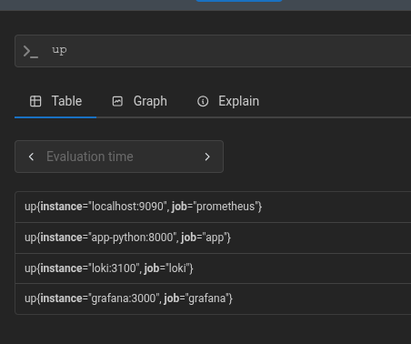

# Lab 8 — Metrics & Monitoring with Prometheus

**Name:** Egor Pustovoytenko  
**Date:** 2026-03-19

---

## Overview

This lab extends the Lab 7 observability stack with Prometheus metrics
and Grafana metric dashboards. The Flask application now exposes a
Prometheus-compatible `/metrics` endpoint, Prometheus scrapes the app and
the monitoring services every 15 seconds, and Grafana is provisioned
with Prometheus and Loki data sources plus a ready-made application
dashboard.

The implementation was added without changing the basic stack layout:
the app, Loki, Promtail, Prometheus, and Grafana all run on the shared
`logging` Docker network with persistent named volumes.

---

## Architecture

```text
Browser / curl
      |
      v
[Flask app :8000]
  |- JSON logs --------------------> [Promtail] ----> [Loki]
  |- /metrics ---------------------> [Prometheus] --> [Grafana]
                                           ^
                                           |
                               scrapes self, Loki, Grafana
```
---

## Application Instrumentation

Instrumentation was added in [`app.py`](/home/egrapa/prog/tmp/DevOps-Core-Course/app_python/app.py).

### HTTP metrics

- `http_requests_total{method, endpoint, status_code}`
  Counts completed HTTP requests.
- `http_request_duration_seconds{method, endpoint, status_code}`
  Histogram for request latency distribution.
- `http_requests_in_progress{method, endpoint}`
  Gauge for concurrent in-flight requests.

### Application-specific metrics

- `devops_info_endpoint_calls_total{endpoint}`
  Tracks usage of the three exposed endpoints.
- `devops_info_system_collection_seconds`
  Measures the time needed to collect runtime/system information for `/`.

### Why these metrics

- **Rate:** `http_requests_total` supports request-rate queries.
- **Errors:** `http_requests_total` filtered by `status_code=~"5.."`.
- **Duration:** `http_request_duration_seconds` supports percentiles and
  heatmaps.
- **Operational state:** `http_requests_in_progress` shows active load.
- **App behavior:** custom counters/histograms describe endpoint usage
  and internal work.


---

## Prometheus Configuration

Prometheus config lives in
[`prometheus.yml`](/home/egrapa/prog/tmp/DevOps-Core-Course/monitoring/prometheus/prometheus.yml).

### Scrape settings

- Scrape interval: `15s`
- Evaluation interval: `15s`
- Jobs:
  - `prometheus` → `localhost:9090`
  - `app` → `app-python:8000/metrics`
  - `loki` → `loki:3100/metrics`
  - `grafana` → `grafana:3000/metrics`

### Retention

Retention is configured in
[`docker-compose.yml`](/home/egrapa/prog/tmp/DevOps-Core-Course/monitoring/docker-compose.yml)
through container arguments:

- `--storage.tsdb.retention.time=15d`
- `--storage.tsdb.retention.size=10GB`

### Persistence

Prometheus data is stored in the named volume `prometheus-data`.




---

## Dashboard Walkthrough

Grafana provisioning was added under
[`monitoring/grafana/provisioning`](/home/egrapa/prog/tmp/DevOps-Core-Course/monitoring/grafana/provisioning)
and the dashboard JSON is stored in
[`app-metrics-dashboard.json`](/home/egrapa/prog/tmp/DevOps-Core-Course/monitoring/grafana/dashboards/app-metrics-dashboard.json).

The dashboard contains 7 panels:

1. **Request Rate by Endpoint**  
   Query: `sum by (endpoint) (rate(http_requests_total[5m]))`
2. **Error Rate**  
   Query: `sum(rate(http_requests_total{status_code=~"5.."}[5m]))`
3. **Request Duration p95**  
   Query: `histogram_quantile(0.95, sum by (le, endpoint) (rate(http_request_duration_seconds_bucket[5m])))`
4. **Request Duration Heatmap**  
   Query: `sum by (le) (rate(http_request_duration_seconds_bucket[5m]))`
5. **Active Requests**  
   Query: `sum(http_requests_in_progress)`
6. **Status Code Distribution**  
   Query: `sum by (status_code) (rate(http_requests_total[5m]))`
7. **App Uptime**  
   Query: `max(up{job="app"})`


---

## PromQL Examples

1. `up`
   Shows whether each scraped target is up.

2. `sum by (endpoint) (rate(http_requests_total[5m]))`
   Request rate per endpoint.

3. `sum(rate(http_requests_total{status_code=~"5.."}[5m]))`
   Current 5xx error rate.

4. `histogram_quantile(0.95, sum by (le, endpoint) (rate(http_request_duration_seconds_bucket[5m])))`
   p95 latency by endpoint.

5. `sum(http_requests_in_progress)`
   Number of active requests being processed right now.

6. `sum by (status_code) (rate(http_requests_total[5m]))`
   Status code split over time.

7. `rate(devops_info_endpoint_calls_total[5m])`
   Business-level endpoint usage.

---

## Production Setup

The production-oriented changes are defined in
[`docker-compose.yml`](/home/egrapa/prog/tmp/DevOps-Core-Course/monitoring/docker-compose.yml).

### Health checks

- Prometheus: `/-/healthy`
- Loki: `/ready`
- Promtail: `/ready` with fallback to `/-/ready`
- Grafana: `/api/health`
- Flask app: `/health`

### Resource limits

- Prometheus: `1 CPU`, `1G`
- Loki: `1 CPU`, `1G`
- Grafana: `0.5 CPU`, `512M`
- App: `0.5 CPU`, `256M`
- Promtail: `0.5 CPU`, `256M`

### Persistent volumes

- `prometheus-data`
- `loki-data`
- `grafana-data`
- `promtail-positions`


(11:30 - app down)
---

## Metrics vs Logs

- **Metrics** are best for trends, saturation, error rates, latency
  percentiles, and alerting.
- **Logs** are best for request-level investigation, debugging, and
  reconstructing what happened for a single event.
- In this project, Prometheus answers questions like "how many requests
  per second?" while Loki answers questions like "which request failed
  and what headers/path did it have?"

---

## Testing Results

I did not execute the stack in this turn, per request. The repository is
prepared so you can run it locally and capture the required evidence.

Expected validation flow:

1. Start the monitoring stack.
2. Generate some traffic to `/`, `/health`, and `/metrics`.
3. Open Prometheus targets and confirm all jobs are `UP`.
4. Open Grafana and confirm the provisioned dashboard shows live data.
5. Restart the stack and verify the dashboard and data source
   provisioning persist.

---

## Challenges & Solutions

- **Low-cardinality labels:** metrics use normalized Flask route rules
  (`/`, `/health`, `/metrics`) rather than raw dynamic paths.
- **Gauge correctness:** active-request tracking increments in
  `before_request` and decrements in `teardown_request` so the gauge is
  released even if a request errors.
- **Reusable setup:** Grafana data sources and dashboard are provisioned
  from files so the environment is reproducible and ready for
  screenshots.

---

## How To Run The App

### Option 1: Run the full monitoring stack

```bash
cd monitoring
docker compose up -d --build
```

Open:

- App: `http://localhost:8000`
- App health: `http://localhost:8000/health`
- App metrics: `http://localhost:8000/metrics`
- Prometheus: `http://localhost:9090`
- Prometheus targets: `http://localhost:9090/targets`
- Grafana: `http://localhost:3000`

Default Grafana credentials come from
[`monitoring/.env`](/home/egrapa/prog/tmp/DevOps-Core-Course/monitoring/.env):

- Username: `admin`
- Password: `changeme`

### Option 2: Run the Flask app only

```bash
cd app_python
python -m venv venv
source venv/bin/activate
pip install -r requirements.txt
PORT=8000 python app.py
```

Then open:

- `http://localhost:8000/`
- `http://localhost:8000/health`
- `http://localhost:8000/metrics`

---