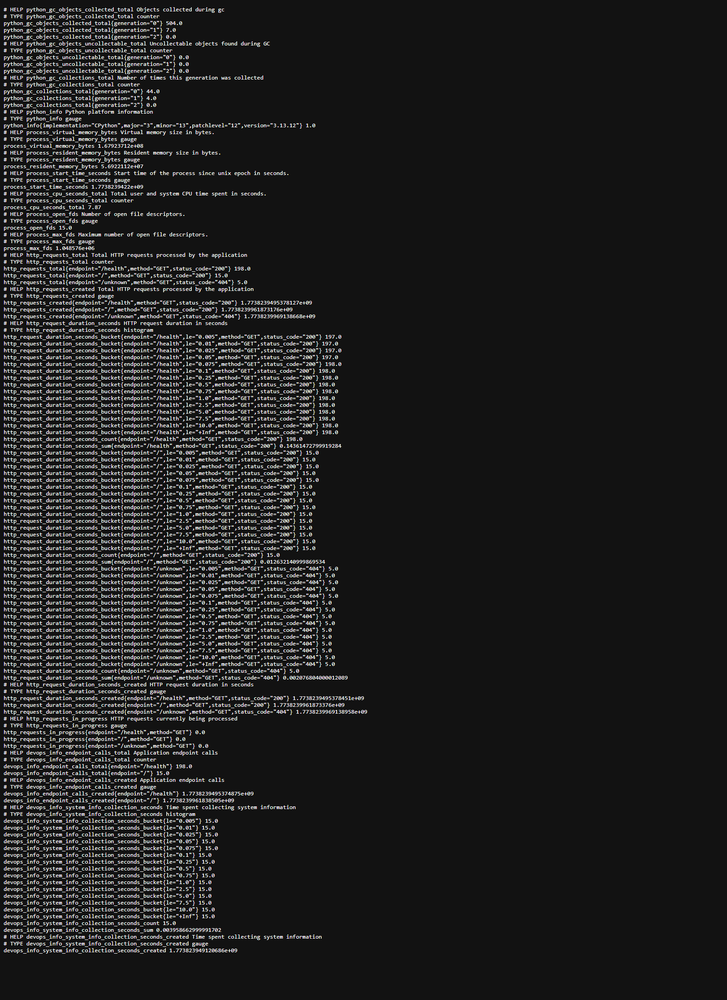
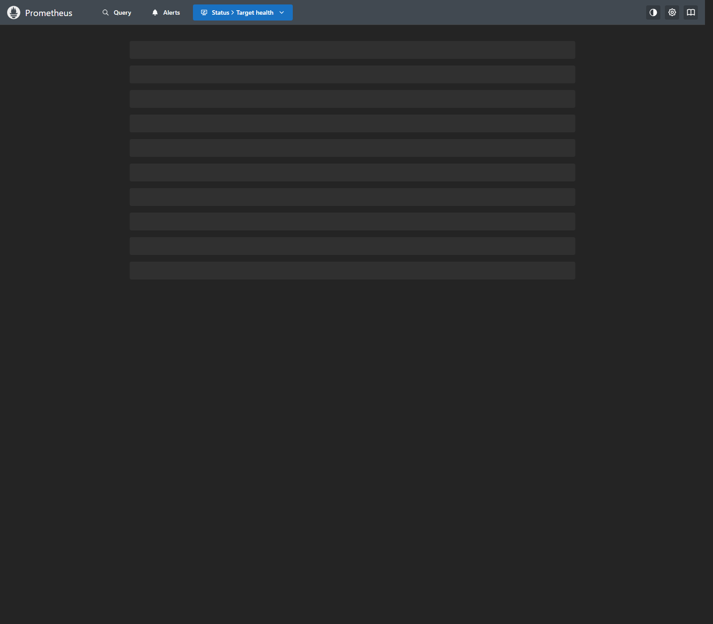
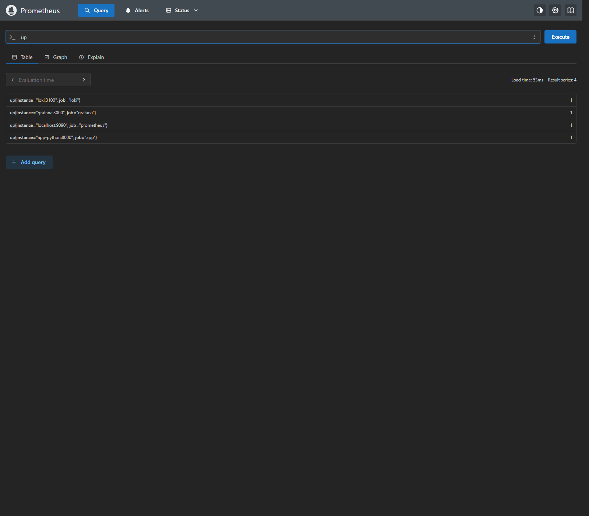
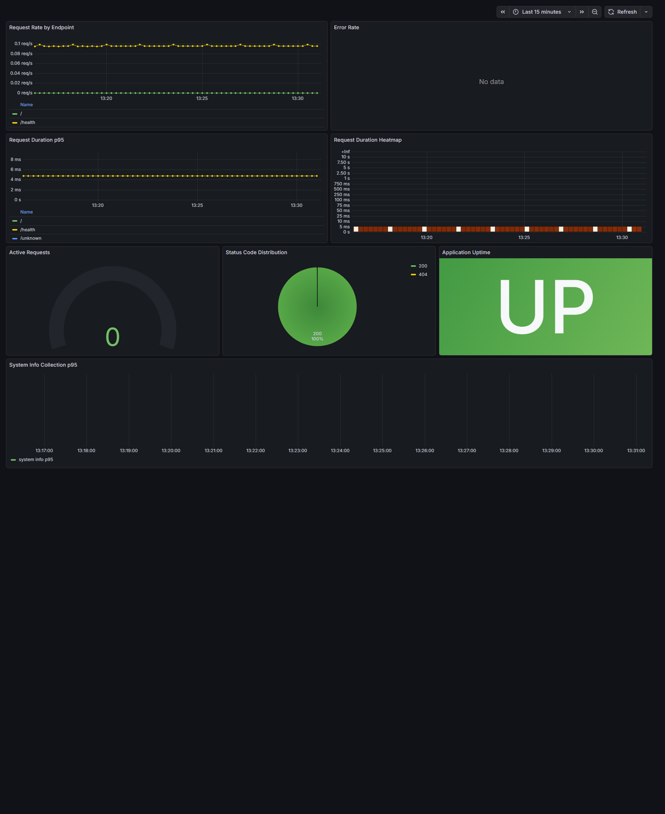
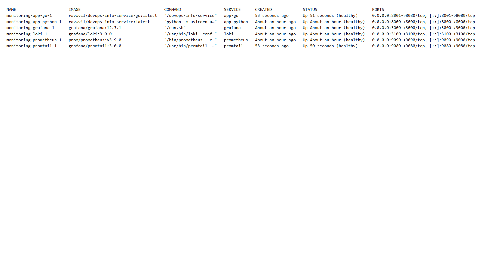

# Lab 8 - Metrics and Monitoring with Prometheus

## Architecture

```text
                     scrape /metrics
  +----------------+ ------------------------------+
  |  app-python    |                              |
  |  port 8000     |                              v
  +----------------+                    +-------------------+
           | logs                        |    Prometheus     |
           |                             |    port 9090      |
           v                             | 15s scrape cycle  |
  +----------------+                     +---------+---------+
  |   Promtail     |                               |
  |   port 9080    |                               | query
  +--------+-------+                               v
           | push                        +-------------------+
           v                             |     Grafana       |
  +----------------+                     |     port 3000     |
  |     Loki       |<--------------------+ provisioned data  |
  |    port 3100   |        logs          | sources + dashs   |
  +----------------+                     +-------------------+
```

The Lab 7 logging stack remains in place. Lab 8 adds Prometheus for metrics scraping, a Prometheus data source in Grafana, and a pre-provisioned application metrics dashboard.

## Application Instrumentation

The Python FastAPI app now exposes Prometheus metrics on `/metrics` and tracks both RED metrics and application-specific metrics.

### HTTP metrics

- `http_requests_total{method,endpoint,status_code}` - Counter for total requests
- `http_request_duration_seconds{method,endpoint,status_code}` - Histogram for latency distribution
- `http_requests_in_progress{method,endpoint}` - Gauge for active concurrent requests

### App-specific metrics

- `devops_info_endpoint_calls_total{endpoint}` - Counter for endpoint usage inside the service
- `devops_info_system_info_collection_seconds` - Histogram for the system info collection path used by `/`

### Label strategy

- Endpoints are normalized to keep label cardinality low
- Known routes stay readable: `/`, `/health`, `/metrics`
- Unknown routes are grouped into `/unknown`
- `/metrics` is excluded from RED instrumentation so Prometheus scrapes do not distort request rate graphs

## Prometheus Configuration

Prometheus is configured in `monitoring/prometheus/prometheus.yml` with a 15 second scrape interval and these targets:

- `prometheus` -> `localhost:9090`
- `app` -> `app-python:8000/metrics`
- `loki` -> `loki:3100/metrics`
- `grafana` -> `grafana:3000/metrics`

Retention is configured through container flags in `monitoring/docker-compose.yml`:

- Time retention: `15d`
- Size retention: `10GB`
- Persistent volume: `prometheus-data`

## Dashboard Walkthrough

Grafana provisions the Prometheus data source automatically and loads `monitoring/grafana/dashboards/devops-app-metrics.json`.

### Panels

1. Request Rate by Endpoint
   Query: `sum by (endpoint) (rate(http_requests_total{endpoint!="/unknown"}[5m]))`
2. Error Rate
   Query: `sum(rate(http_requests_total{status_code=~"5.."}[5m]))`
3. Request Duration p95
   Query: `histogram_quantile(0.95, sum by (le, endpoint) (rate(http_request_duration_seconds_bucket[5m])))`
4. Request Duration Heatmap
   Query: `sum by (le) (rate(http_request_duration_seconds_bucket[5m]))`
5. Active Requests
   Query: `sum(http_requests_in_progress)`
6. Status Code Distribution
   Query: `sum by (status_code) (rate(http_requests_total[5m]))`
7. Application Uptime
   Query: `max(up{job="app"})`
8. System Info Collection p95
   Query: `histogram_quantile(0.95, sum by (le) (rate(devops_info_system_info_collection_seconds_bucket[5m])))`

## PromQL Examples

### RED method

```promql
# Rate
sum by (endpoint) (rate(http_requests_total[5m]))

# Errors
sum(rate(http_requests_total{status_code=~"5.."}[5m]))

# Duration p95
histogram_quantile(0.95, sum by (le, endpoint) (rate(http_request_duration_seconds_bucket[5m])))
```

### Service health and debugging

```promql
# Service up/down
up{job="app"}

# Concurrent requests
sum(http_requests_in_progress)

# System info collection latency
histogram_quantile(0.95, sum by (le) (rate(devops_info_system_info_collection_seconds_bucket[5m])))

# Status code mix
sum by (status_code) (rate(http_requests_total[5m]))

# Endpoint usage
sum by (endpoint) (rate(devops_info_endpoint_calls_total[5m]))
```

## Production Setup

### Health checks

All services in `monitoring/docker-compose.yml` now have health checks:

- Loki -> `http://localhost:3100/ready`
- Promtail -> `grep -q promtail /proc/1/comm`
- Prometheus -> `http://localhost:9090/-/healthy`
- Grafana -> `http://localhost:3000/api/health`
- app-python -> `http://localhost:8000/health`
- app-go -> binary self-check: `/devops-info-service healthcheck`

### Resource limits

- Prometheus: 1 CPU, 1G RAM
- Loki: 1 CPU, 1G RAM
- Grafana: 0.5 CPU, 512M RAM
- Promtail: 0.5 CPU, 512M RAM
- app-python: 0.5 CPU, 256M RAM
- app-go: 0.5 CPU, 256M RAM

### Persistence

Named volumes keep data across restarts:

- `prometheus-data`
- `loki-data`
- `grafana-data`

## Testing and Evidence

The monitoring stack was deployed and verified locally on March 18, 2026.

### Run the stack

```bash
cd monitoring
docker compose up -d --build
docker compose ps
```

### Generate sample traffic

```bash
curl http://localhost:8000/
curl http://localhost:8000/health
curl http://localhost:8000/does-not-exist
curl http://localhost:8000/metrics
```

### Verify Prometheus

```bash
curl http://localhost:9090/-/healthy
```

Verified targets:

- `prometheus` -> `localhost:9090` -> `UP`
- `app` -> `app-python:8000` -> `UP`
- `loki` -> `loki:3100` -> `UP`
- `grafana` -> `grafana:3000` -> `UP`

PromQL query result for `up`:

```text
loki        loki:3100         1
grafana     grafana:3000      1
prometheus  localhost:9090    1
app         app-python:8000   1
```

### Verify Grafana

Grafana started successfully, both data sources were present, and the `DevOps App Metrics` dashboard was provisioned under the `DevOps Monitoring` folder.

### Captured screenshots

- `/metrics` endpoint output from `app-python`:



- Prometheus `/targets` page with all configured targets UP:



- Prometheus query result for `up`:



- Grafana `DevOps App Metrics` dashboard with live panels:



- `docker compose ps` showing healthy containers:



## Metrics vs Logs

- Metrics answer "how much", "how often", and "how slow"
- Logs answer "what happened" and provide event-level context
- In this repo, Prometheus + Grafana covers RED metrics while Loki + Grafana covers request and error details

Use metrics for trend detection and alerting. Use logs for root-cause analysis.

## Challenges and Solutions

1. Self-scrape noise in request metrics
   Solution: `/metrics` is exposed but excluded from request counters and latency histograms.

2. High-cardinality labels
   Solution: unknown routes are grouped under `/unknown` instead of recording arbitrary paths.

3. Health checks for scratch-based Go image
   Solution: the Go binary now supports `/devops-info-service healthcheck`, so Docker Compose can probe the container without adding a shell.

4. Repeatable dashboard setup
   Solution: Grafana data sources and the metrics dashboard are provisioned from files in the repo.

5. Promtail image healthcheck tooling
   Solution: the original `wget`-based probe was incompatible with the image, so the healthcheck was changed to verify the running Promtail process via `/proc/1/comm`.

6. Grafana dashboard screenshot automation
   Solution: the built-in render endpoint returned the expected "image renderer not installed" placeholder, so the dashboard screenshot was captured from the live page and anonymous access was immediately reverted afterward.

## Bonus - Ansible Automation

The Ansible bonus implementation is completed in the repository as a dedicated `monitoring` role and a single-entry deployment playbook for the VM workflow.

### Files

- `ansible/roles/monitoring/defaults/main.yml`
- `ansible/roles/monitoring/tasks/main.yml`
- `ansible/roles/monitoring/templates/prometheus.yml.j2`
- `ansible/roles/monitoring/files/grafana-app-dashboard.json`
- `ansible/roles/monitoring/files/grafana-logs-dashboard.json`
- `ansible/playbooks/deploy_monitoring.yml`

### What it does

- Deploys Loki, Promtail, Prometheus, Grafana, app-python, and app-go with Docker Compose
- Templates Prometheus targets from variables
- Provisions both Loki and Prometheus data sources
- Provisions logs and metrics dashboards
- Verifies `/metrics` exposure after deployment
- Includes service readiness checks for Loki, Prometheus, and Grafana
- Keeps the deployment flow idempotent and repeatable through templated configuration files

### Deployment flow

1. Create the monitoring directory structure on the VM
2. Template Loki, Promtail, Prometheus, Grafana provisioning, and Docker Compose files
3. Copy the prebuilt logs and metrics dashboards
4. Pull images and start the full stack with Docker Compose
5. Wait for ports and health endpoints
6. Assert that the Python application exposes Prometheus metrics

### VM entrypoint

```bash
cd ansible
ansible-playbook playbooks/deploy_monitoring.yml
```
