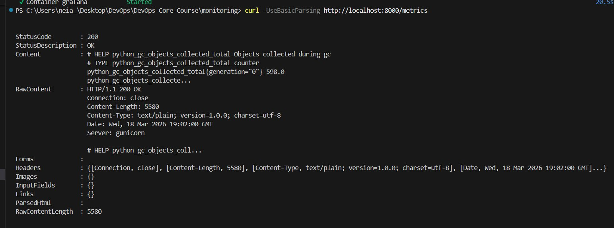
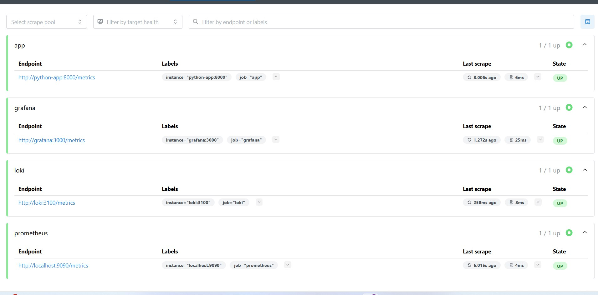
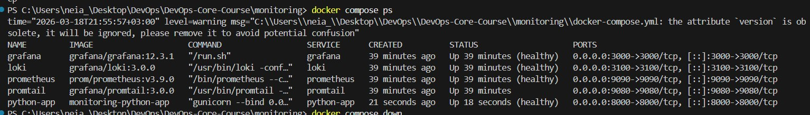
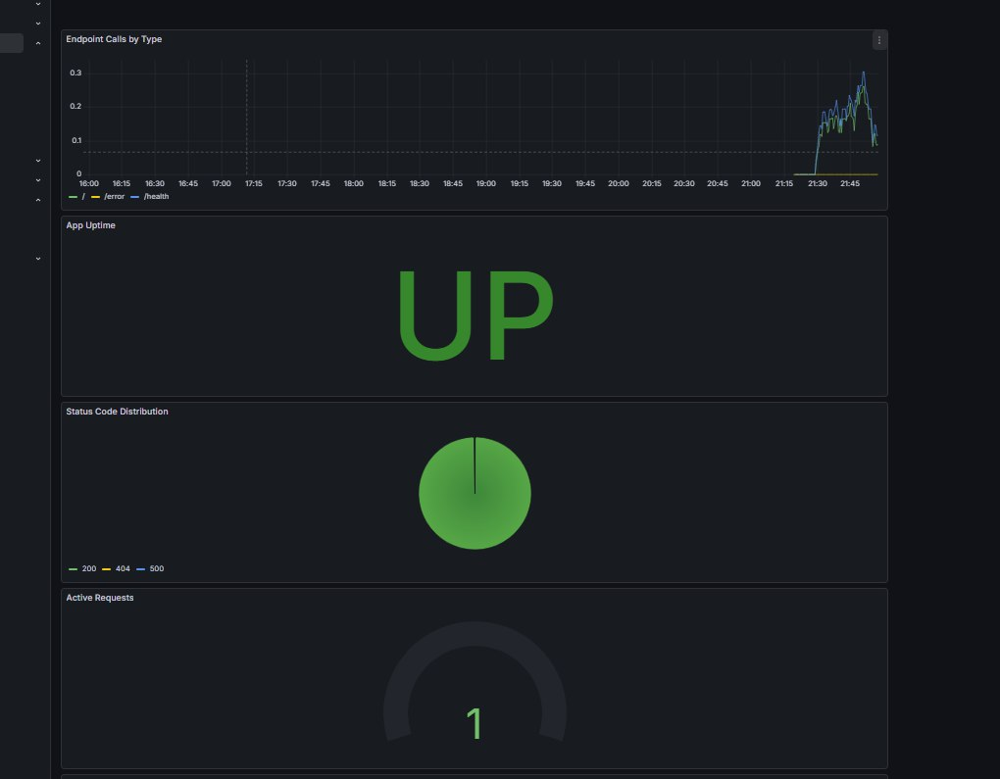
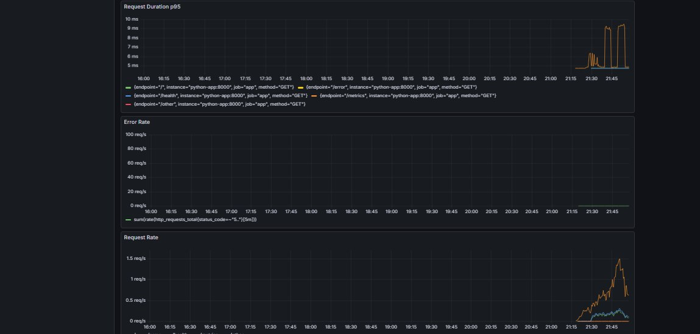

# Lab 8 — Metrics & Monitoring with Prometheus

## Architecture
```
Python App (/metrics) --> Prometheus (scrape) --> Grafana (visualize)
     |                         |
     v                         v
  port 8000                port 9090
  
Loki   --> Grafana (port 3000)
Grafana --> Prometheus (port 9090)
```

Metric flow:
1. Python app exposes metrics at /metrics endpoint
2. Prometheus scrapes all targets every 15s
3. Grafana queries Prometheus via PromQL and visualizes data

## Application Instrumentation

### Metrics added to app.py

**http_requests_total** (Counter)
- Tracks total HTTP requests
- Labels: method, endpoint, status_code
- Why: Measures request rate and error rate (RED method)

**http_request_duration_seconds** (Histogram)
- Tracks request duration distribution
- Labels: method, endpoint
- Why: Measures latency percentiles (p95, p99) for RED method

**http_requests_in_progress** (Gauge)
- Tracks currently active requests
- Why: Shows real-time load on the service

**devops_info_endpoint_calls_total** (Counter)
- Business metric: tracks calls per endpoint
- Labels: endpoint
- Why: Shows which endpoints are most used

### Metric type choices
- Counter for events that only increase (requests, errors)
- Gauge for current state (active connections)
- Histogram for distributions (latency percentiles)

## Prometheus Configuration

File: `monitoring/prometheus/prometheus.yml`

- Scrape interval: 15s
- Evaluation interval: 15s
- Retention: 15 days / 10GB

### Scrape targets:
| Job | Target | Purpose |
|-----|--------|---------|
| prometheus | localhost:9090 | Self-monitoring |
| app | python-app:8000 | Application metrics |
| loki | loki:3100 | Log aggregator metrics |
| grafana | grafana:3000 | Dashboard metrics |

## Dashboard Walkthrough

Dashboard: **DevOps App Metrics** (Grafana)

| Panel | Type | Query | Purpose |
|-------|------|-------|---------|
| Request Rate | Time series | `sum(rate(http_requests_total[5m])) by (endpoint)` | Requests/sec per endpoint (RED: Rate) |
| Error Rate | Time series | `sum(rate(http_requests_total{status_code=~"5.."}[5m]))` | 5xx errors/sec (RED: Errors) |
| Request Duration p95 | Time series | `histogram_quantile(0.95, rate(http_request_duration_seconds_bucket[5m]))` | 95th percentile latency (RED: Duration) |
| Active Requests | Gauge | `http_requests_in_progress` | Current concurrent requests |
| Status Code Distribution | Pie chart | `sum by (status_code) (rate(http_requests_total[5m]))` | 2xx vs 4xx vs 5xx breakdown |
| App Uptime | Stat | `up{job="app"}` | Service availability (UP/DOWN) |
| Endpoint Calls by Type | Time series | `sum(rate(devops_info_endpoint_calls_total[5m])) by (endpoint)` | Business metric: endpoint usage |

## PromQL Examples
```promql
# 1. Request rate per endpoint (RED: Rate)
sum(rate(http_requests_total[5m])) by (endpoint)

# 2. Error rate - 5xx errors per second (RED: Errors)
sum(rate(http_requests_total{status_code=~"5.."}[5m]))

# 3. p95 latency - 95th percentile response time (RED: Duration)
histogram_quantile(0.95, rate(http_request_duration_seconds_bucket[5m]))

# 4. Check if app is up (1 = up, 0 = down)
up{job="app"}

# 5. Total request count per status code
sum by (status_code) (rate(http_requests_total[5m]))

# 6. Active requests right now
http_requests_in_progress

# 7. CPU usage of the app process
rate(process_cpu_seconds_total{job="app"}[5m]) * 100
```

## Production Setup

### Health Checks
All services have health checks configured:
- **Prometheus**: `wget http://localhost:9090/-/healthy`
- **Grafana**: `wget http://localhost:3000/api/health`
- **Loki**: `wget http://localhost:3100/ready`
- **Python App**: `wget http://localhost:8000/health`

### Resource Limits
| Service | CPU limit | Memory limit |
|---------|-----------|--------------|
| Prometheus | 1.0 | 1G |
| Loki | 1.0 | 1G |
| Grafana | 0.5 | 512M |
| Python App | 0.5 | 256M |
| Promtail | 0.5 | 256M |

### Data Retention
- Prometheus: 15 days / 10GB (configured via CLI flags)
- Loki: configured in loki/config.yml

### Persistent Volumes
- `prometheus-data` — stores time-series metrics
- `grafana-data` — stores dashboards and settings
- `loki-data` — stores log data

Data persists after `docker compose down` and `docker compose up -d`.

## Testing Results

### /metrics endpoint


### Prometheus targets UP


### Grafana dashboard


### All services healthy


### Data persistence after restart


### All services healthy
All containers running with status `healthy`:
- prometheus, grafana, loki, promtail, python-app

### Prometheus targets
All 4 targets UP:
- app (python-app:8000) ✅
- grafana (grafana:3000) ✅
- loki (loki:3100) ✅
- prometheus (localhost:9090) ✅

### Metrics endpoint working
`curl http://localhost:8000/metrics` returns Prometheus format metrics
including http_requests_total, http_request_duration_seconds, http_requests_in_progress

## Metrics vs Logs (Lab 7 comparison)

| Aspect | Metrics (Lab 8) | Logs (Lab 7) |
|--------|-----------------|--------------|
| Tool | Prometheus + Grafana | Loki + Grafana |
| Question answered | How much? How often? | What happened? |
| Data type | Numbers over time | Text events |
| Storage | Efficient (TSDB) | More storage needed |
| Use case | Alerting, dashboards, SLOs | Debugging, audit trail |
| Example | "Error rate is 5%" | "ValueError at line 42" |

**When to use metrics**: monitoring trends, setting alerts, capacity planning
**When to use logs**: debugging issues, understanding what exactly happened

## Challenges & Solutions

**Challenge 1**: Error Rate panel showing wrong data
- Problem: Used wrong PromQL query
- Solution: Changed to `sum(rate(http_requests_total{status_code=~"5.."}[5m]))`

**Challenge 2**: Prometheus target for app was DOWN
- Problem: Container name mismatch
- Solution: Used `python-app:8000` matching the docker-compose service name

**Challenge 3**: /metrics endpoint not found
- Problem: prometheus-client not in requirements.txt
- Solution: Added `prometheus-client==0.23.1` and rebuilt container