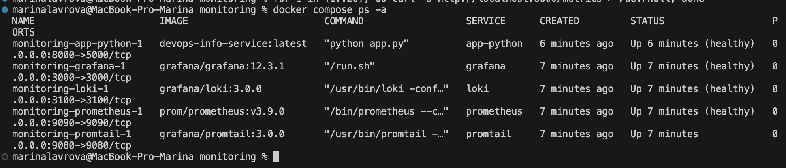
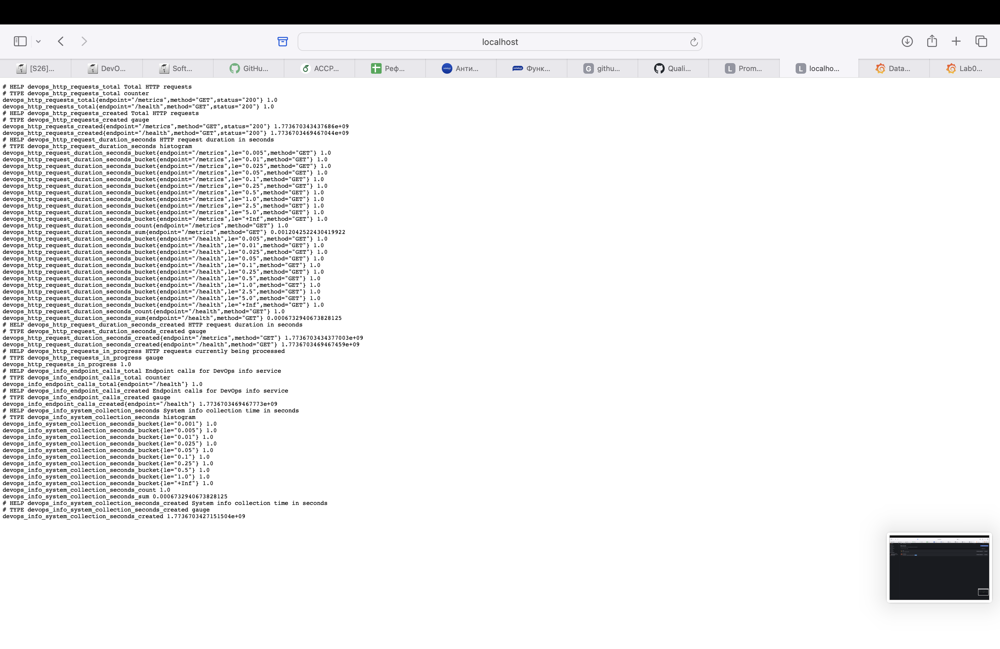
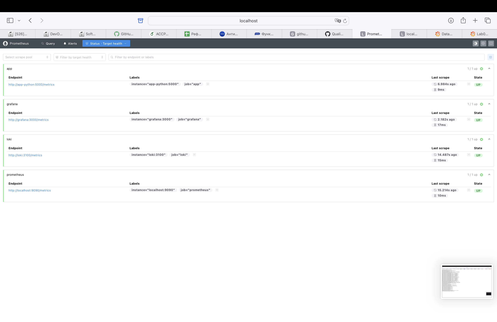
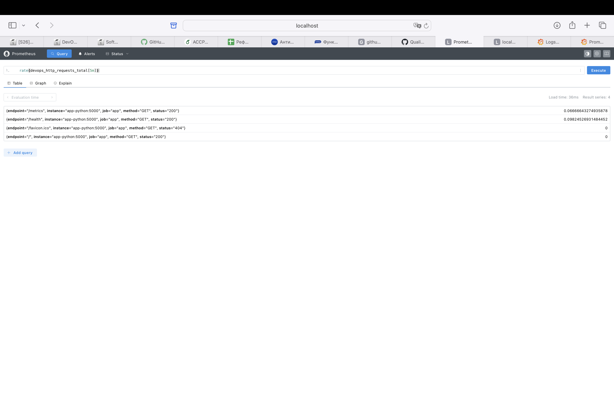
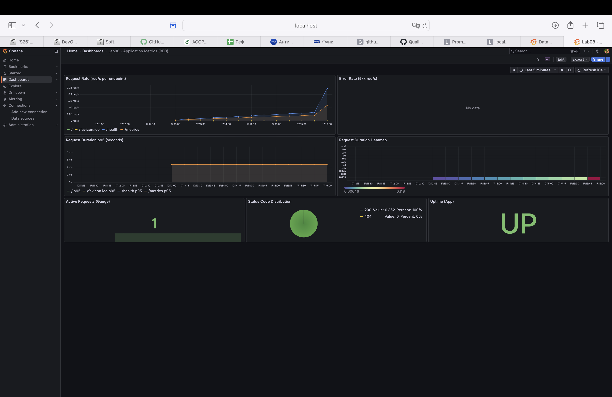
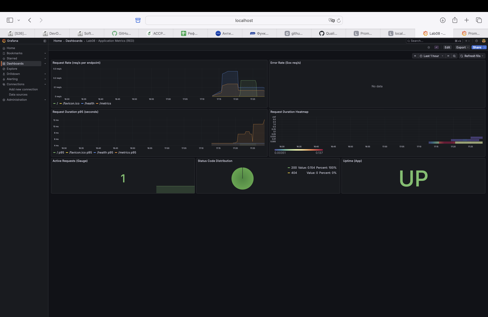

# Lab 8 — Metrics & Monitoring with Prometheus

## 1. Architecture

Metric flow diagram:

```
┌─────────────────┐     scrape /metrics      ┌─────────────────┐     query      ┌─────────────────┐
│   app-python     │ ───────────────────────► │   Prometheus    │ ◄───────────── │    Grafana      │
│   (FastAPI)     │     every 15s             │   (TSDB)        │   PromQL       │  (Dashboards)   │
│   :5000         │                           │   :9090         │                │    :3000        │
└─────────────────┘                           └─────────────────┘                └─────────────────┘
        │                                              │                                  │
        │                                              │ scrape                           │
        │                                              ▼                                  │
        │                                     ┌─────────────────┐                         │
        │                                     │  Loki :3100     │                         │
        │                                     │  Grafana :3000  │                         │
        └─────────────────────────────────────│  (self-metrics)  │─────────────────────────┘
                                              └─────────────────┘
```

- **App** exposes `/metrics` in Prometheus text format.
- **Prometheus** scrapes app, Loki, Grafana, and itself; stores time-series in TSDB.
- **Grafana** queries Prometheus via PromQL and visualizes dashboards.

## 2. Application Instrumentation

### Metrics Added

| Metric | Type | Labels | Purpose |
|--------|------|--------|---------|
| `devops_http_requests_total` | Counter | method, endpoint, status | Total HTTP requests (RED: Rate, Errors) |
| `devops_http_request_duration_seconds` | Histogram | method, endpoint | Request duration distribution (RED: Duration) |
| `devops_http_requests_in_progress` | Gauge | — | Concurrent requests in flight |
| `devops_info_endpoint_calls` | Counter | endpoint | Business metric: calls to / and /health |
| `devops_info_system_collection_seconds` | Histogram | — | Time to collect system info |

### Why These Metrics

- **RED method** for request-driven apps: Rate (req/s), Errors (5xx), Duration (latency).
- **Counter** for cumulative events (requests, errors).
- **Histogram** for latency percentiles (p95, p99).
- **Gauge** for current state (active requests).
- **Low cardinality**: endpoint names normalized (no user IDs in labels).

### Code Location

- `app_python/app.py`: metric definitions, middleware instrumentation, `/metrics` endpoint.
- `app_python/requirements.txt`: `prometheus-client==0.23.1`.

## 3. Prometheus Configuration

**File:** `monitoring/prometheus/prometheus.yml`

| Job | Target | Path |
|-----|--------|------|
| prometheus | localhost:9090 | /metrics |
| app | app-python:5000 | /metrics |
| loki | loki:3100 | /metrics |
| grafana | grafana:3000 | /metrics |

- **Scrape interval:** 15s
- **Evaluation interval:** 15s
- **Retention:** 15 days, 10GB

## 4. Dashboard Walkthrough

**Dashboard:** "Lab08 - Application Metrics (RED)" (see screenshot in section 7)

| Panel | Type | Query | Purpose |
|-------|------|-------|---------|
| Request Rate | Time series | `sum(rate(devops_http_requests_total[5m])) by (endpoint)` | req/s per endpoint |
| Error Rate | Time series | `sum(rate(devops_http_requests_total{status=~"5.."}[5m]))` | 5xx errors/sec |
| Request Duration p95 | Time series | `histogram_quantile(0.95, sum(rate(devops_http_request_duration_seconds_bucket[5m])) by (le, endpoint))` | 95th percentile latency |
| Request Duration Heatmap | Heatmap | `rate(devops_http_request_duration_seconds_bucket[5m])` | Latency distribution |
| Active Requests | Stat | `devops_http_requests_in_progress` | Concurrent requests |
| Status Code Distribution | Pie chart | `sum by (status) (rate(devops_http_requests_total[5m]))` | 2xx vs 4xx vs 5xx |
| Uptime (App) | Stat | `up{job="app"}` | Service up (1) or down (0) |

## 5. PromQL Examples

| Query | Explanation |
|-------|-------------|
| `rate(devops_http_requests_total[5m])` | Requests per second over last 5 minutes |
| `sum(rate(devops_http_requests_total[5m])) by (endpoint)` | req/s grouped by endpoint |
| `sum(rate(devops_http_requests_total{status=~"5.."}[5m]))` | 5xx error rate |
| `histogram_quantile(0.95, rate(devops_http_request_duration_seconds_bucket[5m]))` | 95th percentile latency |
| `up{job="app"}` | App health (1=up, 0=down) |
| `devops_http_requests_in_progress` | Current concurrent requests |

## 6. Production Setup

### Health Checks

- **Prometheus:** `wget --spider http://localhost:9090/-/healthy`
- **app-python:** `curl -f http://localhost:5000/health`
- **Grafana:** `curl -f http://localhost:3000/api/health`
- **Loki:** `wget --spider http://localhost:3100/ready`

### Resource Limits

| Service | Memory | CPU |
|---------|--------|-----|
| Prometheus | 1G | 1.0 |
| Loki | 1G | 1.0 |
| Grafana | 512M | 0.5 |
| app-python | 256M | 0.5 |

### Retention

- Prometheus: 15 days, 10GB (`--storage.tsdb.retention.time=15d`, `--storage.tsdb.retention.size=10GB`)

### Persistent Volumes

- `prometheus-data`, `loki-data`, `grafana-data` — data survives container restarts.

## 7. Testing Results

### Run Stack

```bash
cd monitoring
docker compose up -d --build
docker compose ps
```



All services are healthy.

### Verify Metrics Endpoint

```bash
curl http://localhost:8000/metrics
```



Endpoint returns metrics in Prometheus format: counters, histograms, gauges with labels.

### Verify Prometheus

1. **Targets** — http://localhost:9090/targets — all targets should be UP.



2. **PromQL** — execute the query `rate(devops_http_requests_total[5m])` in Prometheus UI.



### Verify Grafana

1. Open http://localhost:3000
2. Prometheus data source is auto-provisioned (http://prometheus:9090).
3. Dashboard "Lab08 - Application Metrics (RED)" is auto-provisioned.
4. Generate traffic: `for i in {1..50}; do curl -s http://localhost:8000/; done`
5. Panels should show live data.



### Persistence Test

```bash
docker compose down
docker compose up -d
```

Dashboards and data sources persist after container restart.



## 8. Metrics vs Logs (Lab 7)

| Aspect | Metrics (Lab 8) | Logs (Lab 7) |
|--------|-----------------|--------------|
| **What** | Aggregated numbers (counts, rates, percentiles) | Individual events with context |
| **When to use** | "How many?", "How fast?", "What's the error rate?" | "What happened?", "Why did it fail?" |
| **Storage** | Time-series, compact | Raw events, larger |
| **Query** | PromQL (aggregations) | LogQL (filtering, parsing) |
| **Example** | `rate(devops_http_requests_total[5m])` | `{app="devops-python"} \| json \| level="error"` |

Together they provide complete observability: metrics for trends and alerts, logs for debugging.

## 9. Challenges & Solutions

- **Duplicated metrics:** `ValueError: Duplicated timeseries in CollectorRegistry` — uvicorn/other libs register metrics in the default registry. Solution: use a separate `CollectorRegistry` and pass `registry=METRICS_REGISTRY` to all metrics.
- **app-python healthcheck:** Added `curl` to Dockerfile (python:slim does not include it).
- **Port mapping:** App listens on port 5000; Prometheus scrapes `app-python:5000` within the Docker network.
- **Prometheus config:** The `storage.tsdb` block in prometheus.yml caused an error in Prometheus 3.9 — removed; retention is set via command-line arguments.
