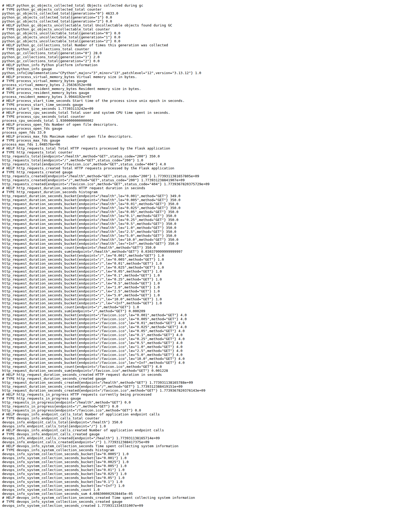
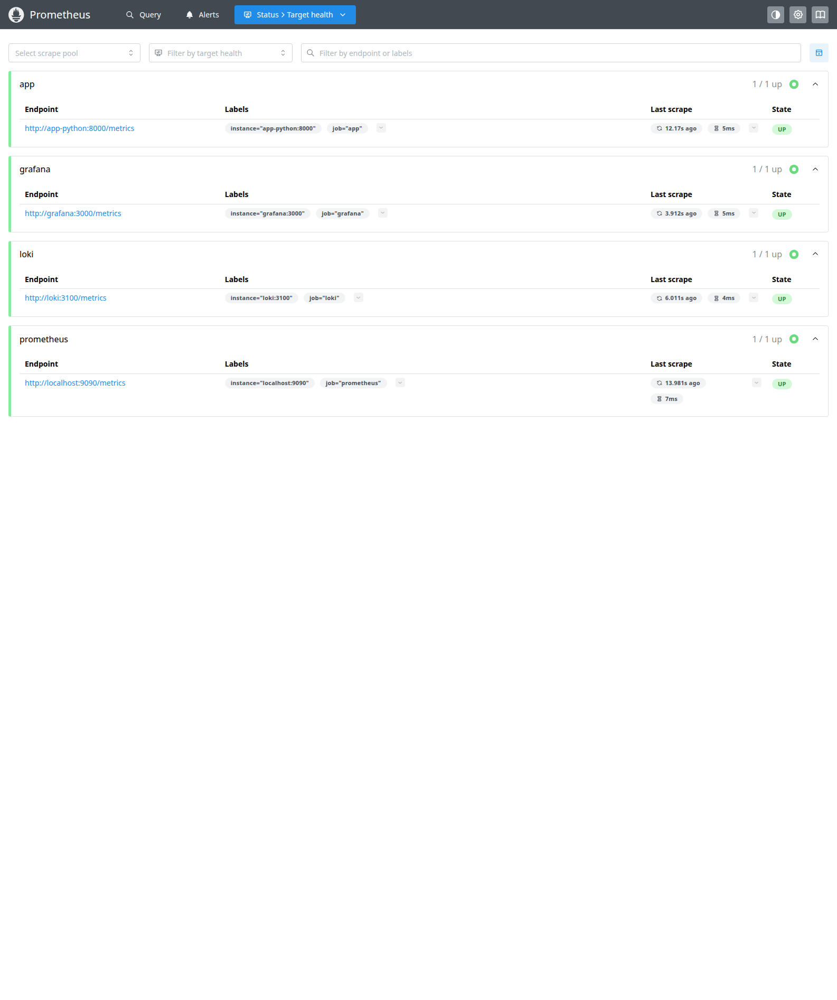
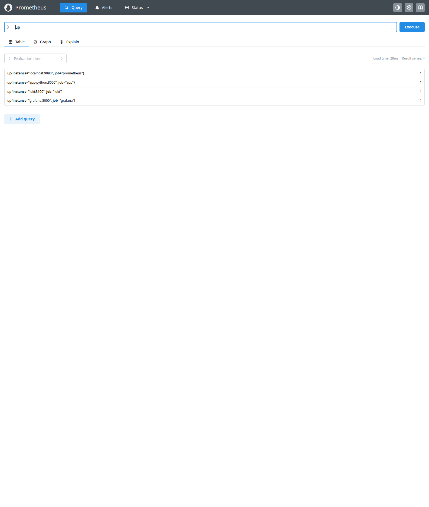
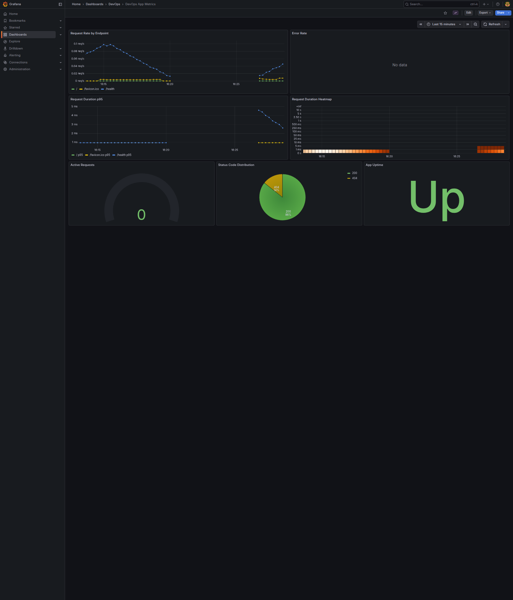
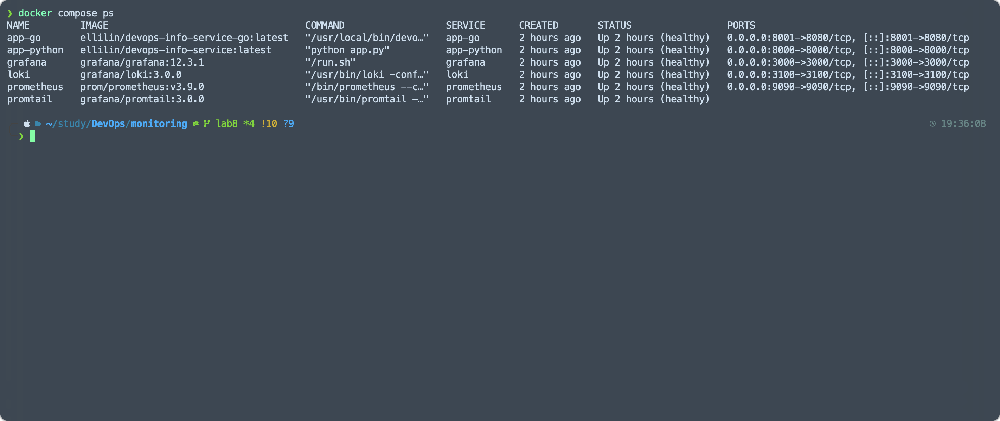

# Lab 8 — Metrics & Monitoring with Prometheus


> Instrument the Python service with Prometheus metrics, scrape them with Prometheus, and visualize both logs and metrics in Grafana.

## Architecture

```text
                           ┌───────────────────────────────┐
                           │        Grafana 12.3.1         │
                           │  Dashboards + Datasources     │
                           │  Loki + Prometheus provisioned│
                           └───────────────▲───────────────┘
                                           │
                   ┌───────────────────────┼───────────────────────┐
                   │                       │                       │
                   │                       │                       │
        ┌──────────┴──────────┐   ┌────────┴────────┐   ┌─────────┴─────────┐
        │    Prometheus       │   │      Loki       │   │     Promtail      │
        │   scrape every 15s  │   │   log storage   │◄──│ container log ship│
        └──────────▲──────────┘   └─────────────────┘   └───────────────────┘
                   │
         ┌─────────┼──────────────────────────────┐
         │         │                              │
         │         │                              │
┌────────┴──────┐ ┌┴───────────────┐   ┌──────────┴──────────┐
│ Python Flask  │ │ Prometheus self│   │ Grafana /metrics    │
│ app /metrics  │ │ metrics        │   │ internal metrics    │
└───────────────┘ └────────────────┘   └─────────────────────┘
```

## Application Instrumentation

### Added dependencies

`app_python/requirements.txt`
- `prometheus-client==0.23.1`

### Added endpoints and metrics

`app_python/app.py`
- `/metrics` endpoint returning Prometheus text format with `generate_latest()`
- `http_requests_total{method,endpoint,status_code}` counter
- `http_request_duration_seconds{method,endpoint}` histogram
- `http_requests_in_progress{method,endpoint}` gauge
- `devops_info_endpoint_calls_total{endpoint}` business counter
- `devops_info_system_collection_seconds` histogram for system info collection

### Instrumentation choices

- RED method is implemented around the Flask request lifecycle with `before_request` and `after_request`.
- Endpoint labels are normalized from `request.url_rule.rule` where possible.
- `/metrics` is intentionally excluded from RED request metrics to avoid Prometheus scrapes distorting request rate and latency panels.
- Business metrics were added for endpoint usage and system info collection latency.

### Metrics verification

Verified on March 19, 2026 from inside the running `app-python` container:

```text
# HELP http_requests_total Total HTTP requests processed by the Flask application
# TYPE http_requests_total counter
# HELP http_request_duration_seconds HTTP request duration in seconds
# TYPE http_request_duration_seconds histogram
# HELP http_requests_in_progress HTTP requests currently being processed
# TYPE http_requests_in_progress gauge
# HELP devops_info_endpoint_calls_total Number of application endpoint calls
# TYPE devops_info_endpoint_calls_total counter
```

## Prometheus Configuration

### Compose service

`monitoring/docker-compose.yml`
- `prom/prometheus:v3.9.0`
- Port `9090`
- Persistent volume `prometheus-data`
- Retention flags:
  - `--storage.tsdb.retention.time=15d`
  - `--storage.tsdb.retention.size=10GB`

### Scrape config

`monitoring/prometheus/prometheus.yml`

Configured scrape interval:
- `15s`

Configured jobs:
- `prometheus` → `localhost:9090`
- `app` → `app-python:8000/metrics`
- `loki` → `loki:3100/metrics`
- `grafana` → `grafana:3000/metrics`

### Prometheus verification

Verified on March 19, 2026 from inside the Prometheus container:

```json
{
  "status": "success",
  "data": {
    "result": [
      {"metric": {"job": "prometheus", "instance": "localhost:9090"}, "value": ["...", "1"]},
      {"metric": {"job": "app", "instance": "app-python:8000"}, "value": ["...", "1"]},
      {"metric": {"job": "loki", "instance": "loki:3100"}, "value": ["...", "1"]},
      {"metric": {"job": "grafana", "instance": "grafana:3000"}, "value": ["...", "1"]}
    ]
  }
}
```

All configured scrape targets were `up`.

## Dashboard Walkthrough

### Provisioned Grafana data sources

`monitoring/grafana/provisioning/datasources/datasources.yml`
- `Loki` at `http://loki:3100`
- `Prometheus` at `http://prometheus:9090`

Verified on March 19, 2026 through the Grafana API:

```json
[
  {"name":"Loki","uid":"loki","type":"loki","url":"http://loki:3100"},
  {"name":"Prometheus","uid":"prometheus","type":"prometheus","url":"http://prometheus:9090"}
]
```

### Provisioned dashboards

Files:
- `monitoring/grafana/dashboards/devops-app-metrics-dashboard.json`
- `monitoring/grafana/dashboards/devops-logs-dashboard.json`

Verified on March 19, 2026 through the Grafana search API:

```json
[
  {"title":"DevOps App Metrics","uid":"devops-app-metrics","type":"dash-db"},
  {"title":"DevOps Application Logs","uid":"devops-logs-dashboard","type":"dash-db"}
]
```

### Application metrics dashboard panels

1. `Request Rate by Endpoint`
   Query: `sum by (endpoint) (rate(http_requests_total[5m]))`
2. `Error Rate`
   Query: `sum(rate(http_requests_total{status_code=~"5.."}[5m]))`
3. `Request Duration p95`
   Query: `histogram_quantile(0.95, sum by (le, endpoint) (rate(http_request_duration_seconds_bucket[5m])))`
4. `Request Duration Heatmap`
   Query: `sum by (le) (rate(http_request_duration_seconds_bucket[5m]))`
5. `Active Requests`
   Query: `sum(http_requests_in_progress)`
6. `Status Code Distribution`
   Query: `sum by (status_code) (rate(http_requests_total[5m]))`
7. `App Uptime`
   Query: `up{job="app"}`

## PromQL Examples

### RED method queries

```promql
sum by (endpoint) (rate(http_requests_total[5m]))
```
Requests per second by endpoint.

```promql
sum(rate(http_requests_total{status_code=~"5.."}[5m]))
```
5xx error rate.

```promql
histogram_quantile(0.95, sum by (le, endpoint) (rate(http_request_duration_seconds_bucket[5m])))
```
p95 latency by endpoint.

```promql
sum(http_requests_in_progress)
```
Current concurrent requests.

```promql
sum by (status_code) (rate(http_requests_total[5m]))
```
Status-code distribution.

### Additional useful queries

```promql
up
```
Instant health overview of all scrape targets.

```promql
rate(process_cpu_seconds_total[5m]) * 100
```
Approximate process CPU usage percentage for the Python app.

```promql
devops_info_endpoint_calls_total
```
Business counter for endpoint usage.

```promql
histogram_quantile(0.95, rate(devops_info_system_collection_seconds_bucket[5m]))
```
p95 latency for system-info collection.

```promql
process_resident_memory_bytes
```
Resident memory usage of instrumented processes.

## Production Setup

### Health checks

Configured in `monitoring/docker-compose.yml`:
- Loki readiness on `http://localhost:3100/ready`
- Prometheus health on `http://localhost:9090/-/healthy`
- Grafana health on `http://localhost:3000/api/health`
- Python app health via Python `urllib` to `http://localhost:8000/health`
- Go app health on `http://localhost:8080/health`
- Promtail TCP readiness check on port `9080`

### Resource limits

| Service | CPU limit | Memory limit |
|---------|-----------|--------------|
| Prometheus | 1.0 | 1G |
| Loki | 1.0 | 1G |
| Grafana | 0.5 | 512M |
| Python app | 0.5 | 256M |
| Go app | 0.5 | 256M |
| Promtail | 0.5 | 256M |

### Persistence

Defined Docker volumes:
- `prometheus-data`
- `loki-data`
- `grafana-data`
- `promtail-positions`

### Retention policies

- Prometheus: `15d` or `10GB`, whichever limit is reached first
- Loki: `168h` (7 days)
- Docker JSON logs: `10m` per file, `3` files per container

## Testing Results

### Screenshots

Generated evidence files in `monitoring/docs/screenshots/lab08/`:

1. `screenshot_01_metrics_endpoint.png` — Python `/metrics` endpoint output
2. `screenshot_02_prometheus_targets.png` — Prometheus targets page with all targets up
3. `screenshot_03_promql_up_query.png` — PromQL `up` query result
4. `screenshot_04_grafana_dashboard.png` — Grafana application metrics dashboard
5. `screenshot_05_docker_compose_ps.png` — `docker compose ps` status showing healthy services

Links:
- [Metrics endpoint screenshot](../screenshots/lab08/screenshot_01_metrics_endpoint.png)
- [Prometheus targets screenshot](../screenshots/lab08/screenshot_02_prometheus_targets.png)
- [PromQL query screenshot](../screenshots/lab08/screenshot_03_promql_up_query.png)
- [Grafana dashboard screenshot](../screenshots/lab08/screenshot_04_grafana_dashboard.png)
- [Docker Compose status screenshot](../screenshots/lab08/screenshot_05_docker_compose_ps.png)

Preview:











### Automated tests

Python app tests executed successfully in an isolated virtual environment on March 19, 2026:

```text
21 passed in 1.45s
Total coverage: 97.51%
```

### Docker runtime verification

`docker compose ps` after fixes:

```text
app-go       Up ... (healthy)
app-python   Up ... (healthy)
grafana      Up ... (healthy)
loki         Up ... (healthy)
prometheus   Up ... (healthy)
promtail     Up ... (healthy)
```

### Metrics vs logs

- Metrics are best for trend analysis, alerting, SLOs, and dashboards.
- Logs are best for explaining specific events and debugging individual failures.
- In this repository:
  - Lab 7 dashboards answer “what happened?”
  - Lab 8 dashboards answer “how much, how often, and how fast?”

## Bonus — Ansible Automation

Extended role:
- `ansible/roles/monitoring/defaults/main.yml`
- `ansible/roles/monitoring/templates/docker-compose.yml.j2`
- `ansible/roles/monitoring/templates/prometheus.yml.j2`
- `ansible/roles/monitoring/templates/grafana-datasources.yml.j2`
- `ansible/roles/monitoring/templates/grafana-dashboards.yml.j2`

### Added role capabilities

- Prometheus version, port, retention, and scrape interval variables
- Parameterized `prometheus_targets`
- Grafana datasource provisioning for Loki and Prometheus
- Grafana dashboard provisioning for both logs and metrics dashboards
- Single playbook support through `ansible/playbooks/deploy-monitoring.yml`

### Ansible verification

Syntax check passed on March 19, 2026:

```text
playbook: ansible/playbooks/deploy-monitoring.yml
```

## Challenges & Solutions

### 1. Prometheus scrape traffic polluted application RED metrics

Problem:
- Prometheus constantly calls `/metrics`, which would skew request count and latency.

Solution:
- Excluded `/metrics` from request counter, histogram, and in-progress gauge updates while still logging the endpoint.

### 2. Container health checks failed despite working services

Problem:
- `app-python` image did not contain `wget`.
- `promtail` image did not contain `wget` or `curl`.

Solution:
- Switched the Python app health check to a Python `urllib` command.
- Switched the Promtail health check to a Bash TCP probe against port `9080`.

### 3. Separate deployment paths for local Compose and Ansible

Problem:
- Local lab stack runs the Python app inside the monitoring Compose project, while Ansible often deploys the app separately.

Solution:
- Kept local Compose scraping `app-python:8000`.
- Parameterized Ansible Prometheus targets so the scrape endpoint can be adapted for the deployment topology.

## Files Delivered

- `app_python/app.py`
- `app_python/requirements.txt`
- `app_python/tests/test_app.py`
- `app_python/Dockerfile`
- `monitoring/docker-compose.yml`
- `monitoring/prometheus/prometheus.yml`
- `monitoring/grafana/provisioning/datasources/datasources.yml`
- `monitoring/grafana/provisioning/dashboards/dashboards.yml`
- `monitoring/grafana/dashboards/devops-app-metrics-dashboard.json`
- `monitoring/grafana/dashboards/devops-logs-dashboard.json`
- `monitoring/docs/LAB08.md`
- `ansible/roles/monitoring/defaults/main.yml`
- `ansible/roles/monitoring/tasks/setup.yml`
- `ansible/roles/monitoring/tasks/deploy.yml`
- `ansible/roles/monitoring/templates/docker-compose.yml.j2`
- `ansible/roles/monitoring/templates/prometheus.yml.j2`
- `ansible/roles/monitoring/templates/grafana-datasources.yml.j2`
- `ansible/roles/monitoring/templates/grafana-dashboards.yml.j2`
