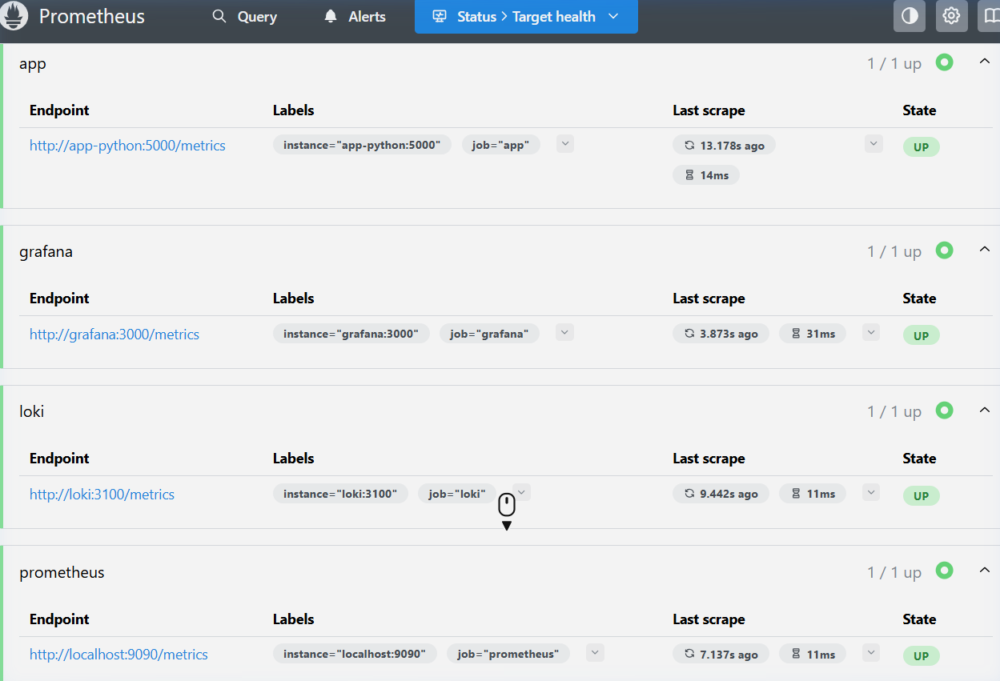
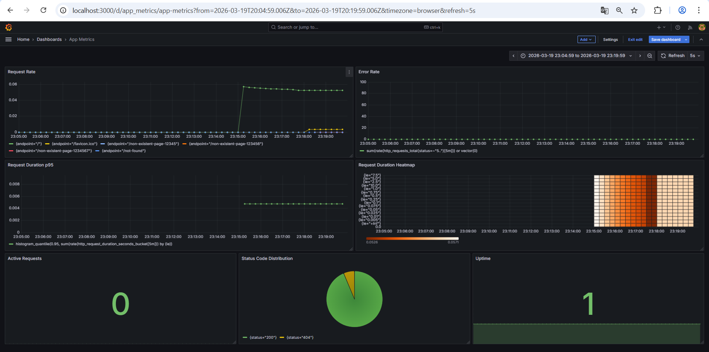

# Lab 08: Metrics & Monitoring with Prometheus

## 1. Architecture
The monitoring stack now incorporates Prometheus for metrics alongside Loki for logs.
- **Python App**: Exposes prometheus metrics at `/metrics` using `prometheus_client`.
- **Prometheus**: Scrapes `/metrics` from the app, Loki, Grafana, and itself every 15s. Stores data persistently in `prometheus-data`.
- **Grafana**: Queries Prometheus to visualize application metrics via dashboards.

## 2. Application Instrumentation
- **Counter (`http_requests_total`)**: Tracks request counts by `method`, `endpoint`, and `status`.
- **Histogram (`http_request_duration_seconds`)**: Measures request latency distribution for service-level objectives (p95).
- **Gauge (`http_requests_in_progress`)**: Monitors concurrent active requests.
- **Custom Histogram (`devops_info_system_collection_seconds`)**: Application-specific metric tracking time spent collecting system information.

## 3. Prometheus Configuration
- **Scrape Interval**: 15 seconds.
- **Targets**: `prometheus:9090`, `app-python:8000`, `loki:3100`, `grafana:3000`.
- **Data Retention**: Configured for 15 days or 10GB max size via command flags.

## 4. Dashboard Walkthrough
The `App Metrics` dashboard utilizes the RED method:
- **Request Rate**: Requests per second per endpoint.
- **Error Rate**: Rate of 5xx server errors.
- **Request Duration p95**: 95th percentile latency distribution.
- **Request Duration Heatmap**: Visual representation of latency distribution.
- **Active Requests**: Current requests being processed.
- **Status Code Distribution**: Pie chart illustrating response ratios.
- **Uptime**: Boolean status indicating app reachability.

## 5. PromQL Examples
1. **Total Request Rate by Endpoint**: `sum(rate(http_requests_total[5m])) by (endpoint)` - Shows RPS across the app grouped by endpoints.
2. **Error Request Rate**: `sum(rate(http_requests_total{status=~"5.."}[5m]))` - Tracks internal server errors per second.
3. **95th Percentile Latency**: `histogram_quantile(0.95, sum(rate(http_request_duration_seconds_bucket[5m])) by (le))` - Indicates latency experienced by 95% of users.
4. **App Uptime**: `up{job="app"}` - Checks if Prometheus was able to scrape the app.
5. **System Info Generation Duration**: `rate(devops_info_system_collection_seconds_sum[5m]) / rate(devops_info_system_collection_seconds_count[5m])` - Average time spent purely collecting system metadata.

## 6. Production Setup
- **Health Checks**: Implemented for Prometheus (`/-/healthy`) and the App (`/health`).
- **Resource Limits**: Applied logic limits (`cpus: 1.0`, `1G` RAM for Prometheus/Loki; `0.5`, `256M`/`512M` for app/grafana).
- **Persistence**: All data stored securely in named volumes (`prometheus-data`, `loki-data`, `grafana-data`).

## 7. Metrics vs Logs
- **Logs (Loki)**: Provide rich context, exact errors, and stack traces. Use for debugging specific incidents.
- **Metrics (Prometheus)**: Aggregated numbers over time. Less storage intensive. Use for alerting, overall health trends, and broad SLA monitoring.

## 8. Testing Results
### Prometheus Targets Status

### Grafana App Metrics Dashboard

