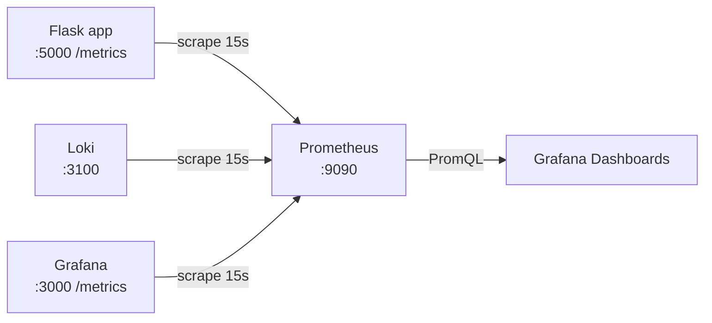
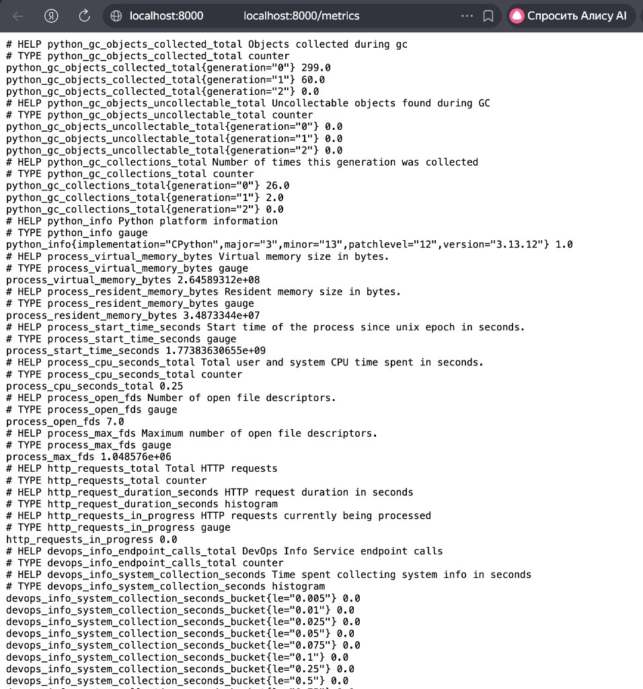
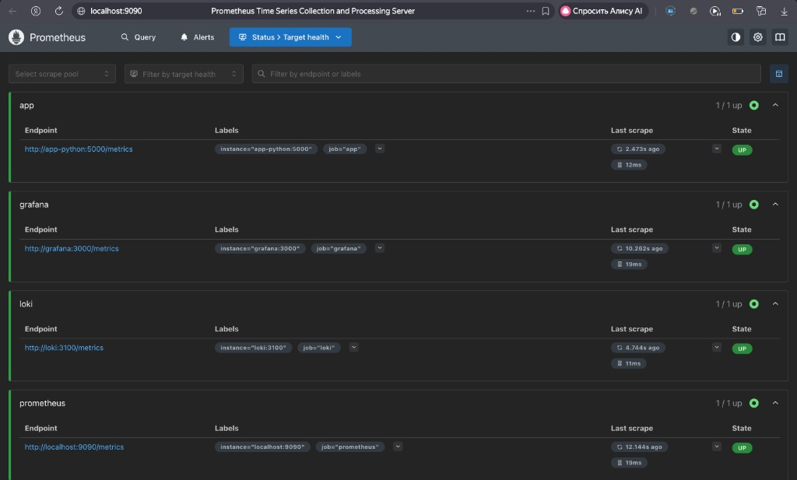
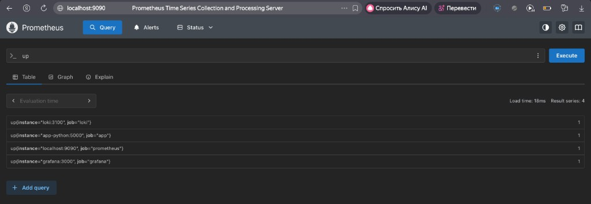
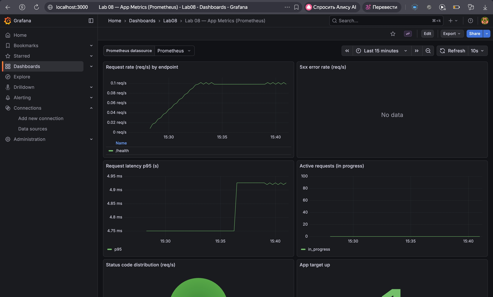
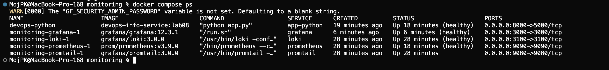
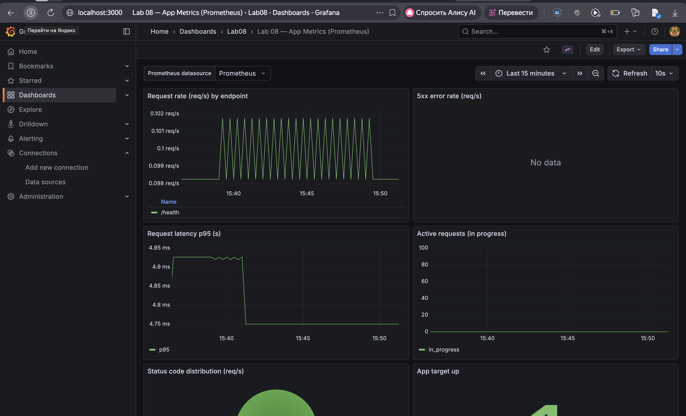
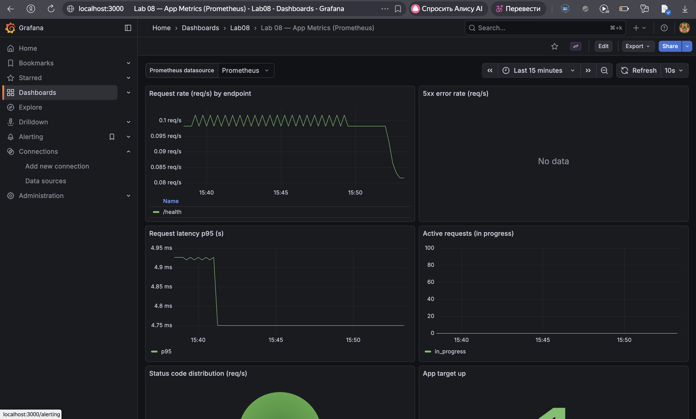

## Lab 8 — Metrics & Monitoring with Prometheus

### Architecture

**Goal**: add application metrics and build a complete metrics monitoring stack.

**Components**:

- **devops-info-service (Flask)** exposes Prometheus metrics at `GET /metrics`
- **Prometheus** scrapes metrics (pull model) and stores time-series in TSDB
- **Grafana** visualizes Prometheus metrics with dashboards (PromQL)
- **(From Lab 7) Loki + Promtail** remain for logs, complementing metrics

**Metric flow**: app → Prometheus (scrape) → Grafana (dashboards)

**Diagram (logical)**:



---

### Application Instrumentation

#### Added dependencies

- `prometheus-client==0.23.1` in `app_python/requirements.txt`

#### Exposed endpoint

- `GET /metrics` returns metrics in Prometheus text format.

#### Metrics (RED method + app-specific)

**HTTP / RED metrics** (labels kept low-cardinality: `method`, normalized `endpoint`, `status_code`):

- **Counter** `http_requests_total{method,endpoint,status_code}`  
  Counts total HTTP requests (used for request rate and errors).
- **Histogram** `http_request_duration_seconds_bucket{method,endpoint,...}`  
  Measures latency distribution (used for p95 and heatmaps).
- **Gauge** `http_requests_in_progress`  
  Current number of in-flight HTTP requests.

**App-specific metrics**:

- **Counter** `devops_info_endpoint_calls{endpoint}`  
  Business-level “endpoint usage” counter for `"/"` and `"/health"`.
- **Histogram** `devops_info_system_collection_seconds`  
  Time spent collecting system info inside request handling.

**Label design note**: endpoint label is normalized via Flask route rules (e.g. `"/health"`). We avoid user IDs or raw dynamic paths to prevent label cardinality explosion.

#### Code location

- Implementation: `app_python/app.py`

#### Local testing (evidence)

Run locally:

```bash
cd app_python
pip install -r requirements.txt
python app.py
curl -s http://localhost:5000/metrics | head -n 40
```

**Screenshot required**: output of `/metrics` showing `http_requests_total` and `http_request_duration_seconds`.

Evidence (Task 1):



---

### Prometheus Configuration

#### Docker Compose

Monitoring stack lives in `monitoring/docker-compose.yml`.

Key settings:

- Prometheus image: `prom/prometheus:v3.9.0`
- Scrape interval: `15s`
- Retention:
  - `--storage.tsdb.retention.time=15d`
  - `--storage.tsdb.retention.size=10GB`
- Persistent data volume: `prometheus-data:/prometheus`
- Same `logging` network as Loki/Grafana (Lab 7)

#### Scrape targets

Prometheus config: `monitoring/prometheus/prometheus.yml`

Jobs:

- `prometheus`: `localhost:9090`
- `app`: `app-python:5000` (path: `/metrics`)
- `loki`: `loki:3100` (path: `/metrics`)
- `grafana`: `grafana:3000` (path: `/metrics`)

#### Deploy & verify (evidence)

```bash
cd monitoring
docker compose up -d --build
```

If Prometheus fails to start, check logs:

```bash
docker compose logs --tail=200 prometheus
```

Verification steps:

- Prometheus UI: `http://localhost:9090`
- Targets page: `http://localhost:9090/targets`
- PromQL sanity: query `up` and confirm jobs are present

**Screenshots required**:

- `/targets` showing `prometheus`, `app`, `loki`, `grafana` are **UP**
- Prometheus query page showing successful `up` result

Evidence (Task 2):





---

### Dashboard Walkthrough (Grafana)

#### Data source

Add Prometheus data source:

- **URL**: `http://prometheus:9090`
- Alternative: auto-provisioned via `monitoring/grafana/provisioning/datasources/datasource-prometheus.yml`

#### Panels (6+ required) and PromQL

1) **Request Rate** (time series)  
Purpose: request throughput (Rate in RED) per endpoint.

```promql
sum by (endpoint) (rate(http_requests_total[5m]))
```

2) **Error Rate (5xx)** (time series)  
Purpose: server-side error rate (Errors in RED).

```promql
sum(rate(http_requests_total{status_code=~"5.."}[5m]))
```

3) **Latency p95** (time series)  
Purpose: tail latency (Duration in RED) as 95th percentile.

```promql
histogram_quantile(0.95, sum by (le) (rate(http_request_duration_seconds_bucket[5m])))
```

4) **Latency heatmap** (heatmap)  
Purpose: visualize latency distribution across histogram buckets over time.

```promql
sum by (le) (rate(http_request_duration_seconds_bucket[5m]))
```

5) **Active Requests** (stat / time series)  
Purpose: current concurrency / in-flight requests.

```promql
http_requests_in_progress
```

6) **Status Code Distribution** (pie)  
Purpose: breakdown of responses by status class (2xx/4xx/5xx).

```promql
sum by (status_code) (rate(http_requests_total[5m]))
```

7) **Uptime (app target)** (stat)  
Purpose: target availability from Prometheus perspective.

```promql
up{job="app"}
```

**Screenshot required**: custom dashboard with live data and all panels working.

Evidence (Task 3):



#### Export

Export the dashboard JSON from Grafana and save it as:

- `monitoring/docs/lab08-dashboard.json`
- Auto-provisioned dashboard file: `monitoring/grafana/dashboards/lab08-dashboard.json`

---

### PromQL Examples (5+)

1) **Overall RPS**  
Shows total request rate across all endpoints/methods/statuses.

```promql
sum(rate(http_requests_total[5m]))
```

2) **RPS by endpoint**  
Shows traffic distribution and identifies the hottest endpoints.

```promql
sum by (endpoint) (rate(http_requests_total[5m]))
```

3) **5xx error rate**  
Shows server error rate (only responses with status_code 5xx).

```promql
sum(rate(http_requests_total{status_code=~"5.."}[5m]))
```

4) **p95 latency**  
Shows 95th percentile latency computed from histogram buckets.

```promql
histogram_quantile(0.95, sum by (le) (rate(http_request_duration_seconds_bucket[5m])))
```

5) **Top endpoints by usage (raw counter increase)**  
Shows the most-used endpoints over the last hour by counter growth.

```promql
topk(5, sum by (endpoint) (increase(http_requests_total[1h])))
```

6) **Service down detection**  
Returns targets that are down (0) at the moment.

```promql
up == 0
```

---

### Production Setup

#### Health checks

- Prometheus: `/-/healthy`
- App: `/health`
- Promtail: `/ready`

Healthchecks are configured in `monitoring/docker-compose.yml`.

#### Resource limits

Configured via `deploy.resources.limits`:

- Prometheus: **1 CPU / 1G**
- Loki (Lab 7): **1 CPU / 1G**
- Grafana: **0.5 CPU / 512M**
- App: **0.5 CPU / 256M**

#### Data retention & persistence

- Prometheus retention: **15d** or **10GB**
- Persistent volumes:
  - `prometheus-data`
  - `loki-data`
  - `grafana-data`

Persistence test:

```bash
cd monitoring
docker compose down
docker compose up -d
```

Expected: dashboards still exist (Grafana volume) and Prometheus keeps data (Prometheus volume).

**Evidence required**:

- `screenshots/lab08-compose-ps.png` showing all services **healthy**
- proof that Grafana dashboard persists after restart:
  - `screenshots/before.png` (dashboard exists before restart)
  - `screenshots/after.png` (dashboard exists after restart)

Evidence (Task 4):







---

### Testing Results

Generate load:

```bash
for i in {1..50}; do curl -s http://localhost:8000/ >/dev/null; done
for i in {1..50}; do curl -s http://localhost:8000/health >/dev/null; done
```

Required screenshots to attach (store next to this file or in a dedicated folder):

- `screenshots/lab08-targets.png` (Prometheus targets all UP)
- `screenshots/lab08-promql-up.png` (query `up`)
- `screenshots/lab08-metrics.png` (`/metrics` output)
- `screenshots/lab08-grafana.png` (custom Grafana dashboard with panels)
- `screenshots/lab08-compose-ps.png` (`docker compose ps` all healthy)
- `screenshots/before.png` (Grafana dashboard before restart)
- `screenshots/after.png` (Grafana dashboard after restart)

---

### Challenges & Solutions

- **Docker image vs local code**: the stack originally ran a prebuilt app image, so changes in `app_python/app.py` wouldn’t be reflected.  
  **Fix**: switched `app-python` service to `build: ../app_python` so instrumentation is included.

---

### Metrics vs Logs (Lab 7)

- **Logs** answer “what exactly happened” (context, errors, traces of events).
- **Metrics** answer “how much/how often/how long” (rates, error ratios, latency distributions).
- Together: use metrics to detect and quantify issues (RED), then pivot to logs in Loki to investigate root cause.

