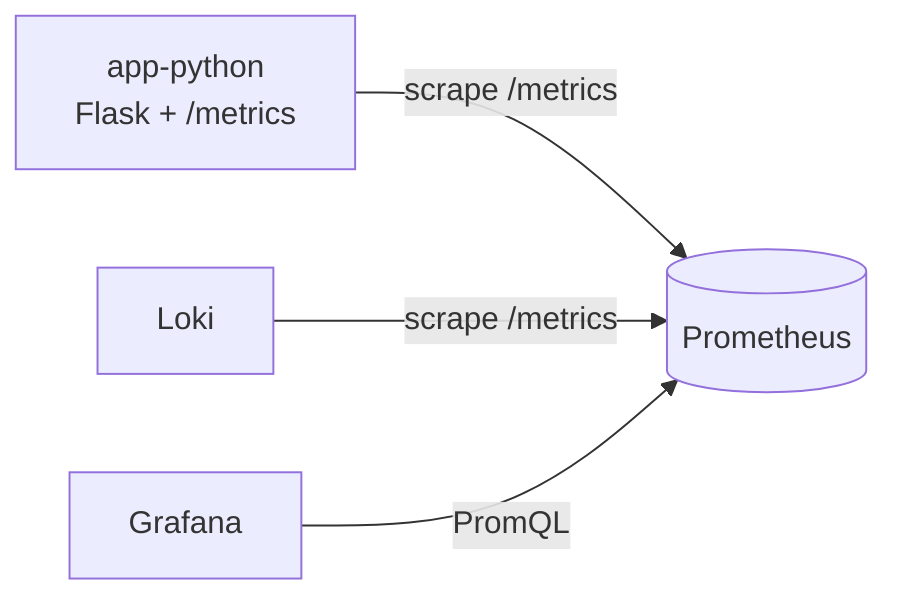

# LAB08 — Metrics & Monitoring with Prometheus

## Architecture



## Application Instrumentation

### Implemented endpoints

- `/` — service info
- `/health` — health check
- `/metrics` — Prometheus metrics endpoint

### Implemented metrics (RED method)

#### Request rate

- **Counter**: `http_requests_total{method,endpoint,status_code}`
  - Increments for every request after it is processed.

#### Error rate

- Derived from `http_requests_total` by filtering `status_code=~"5.."`.

#### Duration

- **Histogram**: `http_request_duration_seconds_bucket{method,endpoint,le}`
  - Observes per-request duration in seconds.

#### Concurrency

- **Gauge**: `http_requests_in_progress`
  - Incremented in `before_request`, decremented in `after_request`.

### Application-specific metrics

- **Counter**: `devops_info_endpoint_calls{endpoint}`
- **Histogram**: `devops_info_system_collection_seconds`

Screenshot of `/metrics`:


## Prometheus Configuration

### Compose changes

- File: `monitoring/compose.yml`
- Added Prometheus service:
  - Image: `prom/prometheus:v3.9.0`
  - Port: `9090:9090`
  - Retention flags:
    - `--storage.tsdb.retention.time=15d`
    - `--storage.tsdb.retention.size=10GB`

### Scrape config

- File: `monitoring/prometheus/prometheus.yml`
- Global:
  - `scrape_interval: 15s`
  - `evaluation_interval: 15s`
- Jobs:
  - `prometheus` → `localhost:9090`
  - `app` → `app-python:8000` (`/metrics`)
  - `loki` → `loki:3100` (`/metrics`)
  - `grafana` → `grafana:3000` (`/metrics`)

Screenshots of targets and PromQL queries:


## Dashboard Walkthrough (panels + queries)

Create a Grafana dashboard (data source: **Prometheus**) with 6+ panels.

1. **Request Rate**:
   - `sum(rate(http_requests_total[5m])) by (endpoint)`

2. **Error Rate (5xx)**:
   - `sum(rate(http_requests_total{status_code=~"5.."}[5m]))`

3. **Request Duration p95**:
   - `histogram_quantile(0.95, rate(http_request_duration_seconds_bucket[5m]))`

4. **Request Duration Heatmap**:
   - `rate(http_request_duration_seconds_bucket[5m])`

5. **Active Requests**:
   - `http_requests_in_progress`

6. **Status Code Distribution**:
   - `sum by (status_code) (rate(http_requests_total[5m]))`

7. **Uptime**:
   - `up{job="app"}`

## PromQL Examples

```promql
up
```

```promql
up{job="app"}
```

```promql
sum(rate(http_requests_total[5m]))
```

```promql
sum(rate(http_requests_total{status_code=~"5.."}[5m]))
```

```promql
sum by (endpoint) (rate(http_requests_total[5m]))
```

```promql
histogram_quantile(0.95, rate(http_request_duration_seconds_bucket[5m]))
```

Screenshot of the Dashboard:


## Production Setup

### Health checks

- Prometheus: `/-/healthy`
- Grafana: `/api/health`
- Loki: `/ready`
- Promtail: `/ready`
- App: `/health`

### Resource limits

Configured in `monitoring/compose.yml` for all services (CPU/memory).

### Persistence

Persistent volumes:

- `prometheus-data`
- `loki-data`
- `grafana-data`

Screenshot of `docker compose ps`:


## Testing Results 

All screenshots are in their sections.

## Challenges & Solutions

No challenges.

