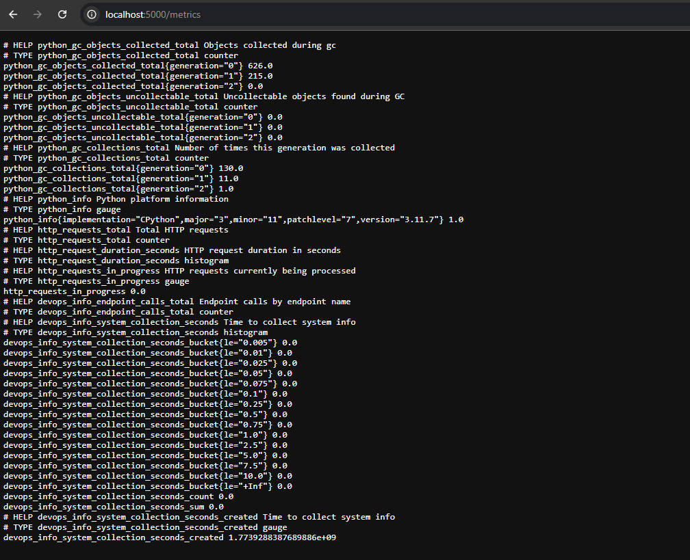
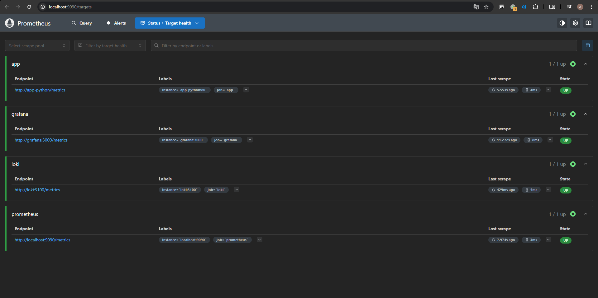
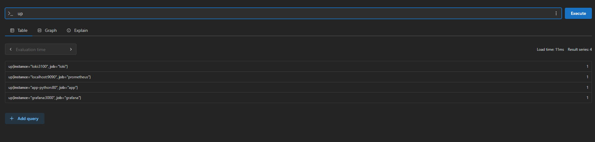
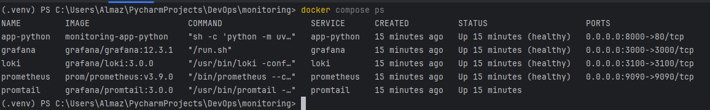

## Architecture

```
┌─────────────┐       scrape /metrics        ┌────────────┐      query      ┌─────────┐
│  app-python │<─────────────────────────────│ Prometheus │<────────────────│ Grafana │
│  :80        │  (every 15 s)                │  :9090     │  (PromQL)       │  :3000  │
└─────────────┘                              └────────────┘                 └─────────┘
                                                   │
                                    also scrapes:  │
                                    • localhost:9090 (self)
                                    • loki:3100
                                    • grafana:3000
```

1. App exports metrics at `/metrics` in Prometheus exposition format.
2. Prometheus scrapes metrics every 15s from all targets.
3. Data stored in TSDB on persistent volume.
4. Grafana queries Prometheus with PromQL and visualizes metrics on dashboards.

## Application Instrumentation

| Metric                                  | Type      | Labels                         | Purpose                            |
|-----------------------------------------|-----------|--------------------------------|------------------------------------|
| `http_requests_total`                   | Counter   | `method`, `endpoint`, `status` | Total count of HTTP-requests       |
| `http_request_duration_seconds`         | Histogram | `method`, `endpoint`           | Duration of request                |
| `http_requests_in_progress`             | Gauge     | -                              | Current requests in process        |
| `devops_info_endpoint_calls`            | Counter   | `endpoint`                     | Number of calls business endpoints |
| `devops_info_system_collection_seconds` | Histogram | -                              | Time spent collecting system info  |


- **Counter** (`http_requests_total`) - monotonic counter, ideal for counting request rates and errors.
- **Histogram** (`http_request_duration_seconds`) - latency with custom buckets, allows calculating percentiles.
- **Gauge** (`http_requests_in_progress`) - current number of in-flight requests, useful for monitoring load and potential bottlenecks.




## Prometheus Configuration

| Parameter             | Value | Description                                          |
|-----------------------|-------|------------------------------------------------------|
| `scrape_interval`     | 15s   | Frequency of scraping targets                        |
| `evaluation_interval` | 15s   | Frequency of evaluating alerting and recording rules |
| `retention.time`      | 15d   | Data storage for 15 days                             |
| `retention.size`      | 10GB  | Size limit                                           |




## Dashboard Walkthrough

| # | Panel                    | Type        | PromQL                                                                                            | Purpose                                  |
|---|--------------------------|-------------|---------------------------------------------------------------------------------------------------|------------------------------------------|
| 1 | Request Rate             | Time series | `sum(rate(http_requests_total[5m])) by (endpoint)`                                                | Requests/sec by endpoint (RED - Rate)    |
| 2 | Error Rate (5xx)         | Time series | `sum(rate(http_requests_total{status=~"5.."}[5m]))`                                               | Server error rate (RED - Errors)         |
| 3 | Request Duration p95     | Time series | `histogram_quantile(0.95, sum(rate(http_request_duration_seconds_bucket[5m])) by (le, endpoint))` | 95th percentile latency (RED - Duration) |
| 4 | Request Duration Heatmap | Heatmap     | `sum(increase(http_request_duration_seconds_bucket[5m])) by (le)`                                 | Latency distribution heatmap             |
| 5 | Active Requests          | Time series | `http_requests_in_progress`                                                                       | Current number of requests in progress   |
| 6 | Status Code Distribution | Pie chart   | `sum by (status) (rate(http_requests_total[5m]))`                                                 | Share of 2xx / 4xx / 5xx responses       |
| 7 | Service Uptime           | Stat        | `up{job="app"}`                                                                                   | Service availability status (UP/DOWN)    |

## 5. PromQL Examples

### 1. Request rate by endpoints
```promql
sum(rate(http_requests_total[5m])) by (endpoint)
```
Shows the number of requests per second for each endpoint over the last 5 minutes.

Result:
```
{endpoint="/health"}
```

### 2. Error rate (5xx)
```promql
sum(rate(http_requests_total{status=~"5.."}[5m]))
```
Total server error rate. The filter `status=~"5.."` selects all 5xx codes.

Result:
```
Empty query result
```

### 3. 95th percentile latency
```promql
histogram_quantile(0.95, sum(rate(http_request_duration_seconds_bucket[5m])) by (le, endpoint))
```
Calculates the p95 query duration from histogram buckets. 95% of queries are processed faster than this value.

Result:
```
{endpoint="/health"}
```

### 4. Availability of services
```promql
up == 0
```
Returns only targets that are currently unavailable. Useful for quickly identifying problems.

Result:
```
Empty query result
```

### 5. CPU usage of process
```promql
rate(process_cpu_seconds_total{job="app"}[5m]) * 100
```
The percentage of CPU used by the application process, averaged over 5 minutes.

### 6. Total number of requests by status codes
```promql
sum by (status) (increase(http_requests_total[1h]))
```
The absolute number of requests for each status code over the last hour.

Result:
```
{status="200"}
```

## 6. Production Setup

### Health Checks

| Service    | Endpoint checks                    | Interval | Retries |
|------------|------------------------------------|----------|---------|
| Loki       | `http://localhost:3100/ready`      | 10s      | 5       |
| Grafana    | `http://localhost:3000/api/health` | 10s      | 5       |
| Prometheus | `http://localhost:9090/-/healthy`  | 10s      | 5       |
| app-python | `http://localhost:80/health`       | 10s      | 5       |

### Resource Limits

| Service    | Memory limit | CPU limit |
|------------|--------------|-----------|
| Prometheus | 1G           | 1.0       |
| Loki       | 1G           | 1.0       |
| Grafana    | 512M         | 1.0       |
| app-python | 256M         | 0.5       |
| Promtail   | 512M         | 0.5       |



## 7. Testing Results

### /metrics endpoint
```bash
curl http://localhost:8000/metrics
```
```
# HELP python_gc_objects_collected_total Objects collected during gc
# TYPE python_gc_objects_collected_total counter
python_gc_objects_collected_total{generation="0"} 626.0
python_gc_objects_collected_total{generation="1"} 215.0
python_gc_objects_collected_total{generation="2"} 0.0
# HELP python_gc_objects_uncollectable_total Uncollectable objects found during GC
# TYPE python_gc_objects_uncollectable_total counter
python_gc_objects_uncollectable_total{generation="0"} 0.0
python_gc_objects_uncollectable_total{generation="1"} 0.0
python_gc_objects_uncollectable_total{generation="2"} 0.0
# HELP python_gc_collections_total Number of times this generation was collected
# TYPE python_gc_collections_total counter
python_gc_collections_total{generation="0"} 130.0
python_gc_collections_total{generation="1"} 11.0
python_gc_collections_total{generation="2"} 1.0
# HELP python_info Python platform information
# TYPE python_info gauge
python_info{implementation="CPython",major="3",minor="11",patchlevel="7",version="3.11.7"} 1.0
# HELP http_requests_total Total HTTP requests
# TYPE http_requests_total counter
http_requests_total{endpoint="/favicon.ico",method="GET",status="404"} 1.0
http_requests_total{endpoint="/",method="GET",status="200"} 2.0
# HELP http_requests_created Total HTTP requests
# TYPE http_requests_created gauge
http_requests_created{endpoint="/favicon.ico",method="GET",status="404"} 1.7739288847940502e+09
http_requests_created{endpoint="/",method="GET",status="200"} 1.7739320476436894e+09
# HELP http_request_duration_seconds HTTP request duration in seconds
# TYPE http_request_duration_seconds histogram
http_request_duration_seconds_bucket{endpoint="/favicon.ico",le="0.005",method="GET"} 1.0
http_request_duration_seconds_bucket{endpoint="/favicon.ico",le="0.01",method="GET"} 1.0
http_request_duration_seconds_bucket{endpoint="/favicon.ico",le="0.025",method="GET"} 1.0
http_request_duration_seconds_bucket{endpoint="/favicon.ico",le="0.05",method="GET"} 1.0
http_request_duration_seconds_bucket{endpoint="/favicon.ico",le="0.1",method="GET"} 1.0
http_request_duration_seconds_bucket{endpoint="/favicon.ico",le="0.25",method="GET"} 1.0
http_request_duration_seconds_bucket{endpoint="/favicon.ico",le="0.5",method="GET"} 1.0
http_request_duration_seconds_bucket{endpoint="/favicon.ico",le="1.0",method="GET"} 1.0
http_request_duration_seconds_bucket{endpoint="/favicon.ico",le="2.5",method="GET"} 1.0
http_request_duration_seconds_bucket{endpoint="/favicon.ico",le="5.0",method="GET"} 1.0
http_request_duration_seconds_bucket{endpoint="/favicon.ico",le="10.0",method="GET"} 1.0
http_request_duration_seconds_bucket{endpoint="/favicon.ico",le="+Inf",method="GET"} 1.0
http_request_duration_seconds_count{endpoint="/favicon.ico",method="GET"} 1.0
http_request_duration_seconds_sum{endpoint="/favicon.ico",method="GET"} 0.0
http_request_duration_seconds_bucket{endpoint="/",le="0.005",method="GET"} 1.0
http_request_duration_seconds_bucket{endpoint="/",le="0.01",method="GET"} 2.0
http_request_duration_seconds_bucket{endpoint="/",le="0.025",method="GET"} 2.0
http_request_duration_seconds_bucket{endpoint="/",le="0.05",method="GET"} 2.0
http_request_duration_seconds_bucket{endpoint="/",le="0.1",method="GET"} 2.0
http_request_duration_seconds_bucket{endpoint="/",le="0.25",method="GET"} 2.0
http_request_duration_seconds_bucket{endpoint="/",le="0.5",method="GET"} 2.0
http_request_duration_seconds_bucket{endpoint="/",le="1.0",method="GET"} 2.0
http_request_duration_seconds_bucket{endpoint="/",le="2.5",method="GET"} 2.0
http_request_duration_seconds_bucket{endpoint="/",le="5.0",method="GET"} 2.0
http_request_duration_seconds_bucket{endpoint="/",le="10.0",method="GET"} 2.0
http_request_duration_seconds_bucket{endpoint="/",le="+Inf",method="GET"} 2.0
http_request_duration_seconds_count{endpoint="/",method="GET"} 2.0
http_request_duration_seconds_sum{endpoint="/",method="GET"} 0.009820938110351562
# HELP http_request_duration_seconds_created HTTP request duration in seconds
# TYPE http_request_duration_seconds_created gauge
http_request_duration_seconds_created{endpoint="/favicon.ico",method="GET"} 1.7739288847940502e+09
http_request_duration_seconds_created{endpoint="/",method="GET"} 1.7739320476436894e+09
# HELP http_requests_in_progress HTTP requests currently being processed
# TYPE http_requests_in_progress gauge
http_requests_in_progress 0.0
# HELP devops_info_endpoint_calls_total Endpoint calls by endpoint name
# TYPE devops_info_endpoint_calls_total counter
devops_info_endpoint_calls_total{endpoint="/favicon.ico"} 1.0
devops_info_endpoint_calls_total{endpoint="/"} 2.0
# HELP devops_info_endpoint_calls_created Endpoint calls by endpoint name
# TYPE devops_info_endpoint_calls_created gauge
devops_info_endpoint_calls_created{endpoint="/favicon.ico"} 1.7739288847940502e+09
devops_info_endpoint_calls_created{endpoint="/"} 1.7739320476436894e+09
# HELP devops_info_system_collection_seconds Time to collect system info
# TYPE devops_info_system_collection_seconds histogram
devops_info_system_collection_seconds_bucket{le="0.005"} 0.0
devops_info_system_collection_seconds_bucket{le="0.01"} 0.0
devops_info_system_collection_seconds_bucket{le="0.025"} 0.0
devops_info_system_collection_seconds_bucket{le="0.05"} 0.0
devops_info_system_collection_seconds_bucket{le="0.075"} 0.0
devops_info_system_collection_seconds_bucket{le="0.1"} 0.0
devops_info_system_collection_seconds_bucket{le="0.25"} 0.0
devops_info_system_collection_seconds_bucket{le="0.5"} 0.0
devops_info_system_collection_seconds_bucket{le="0.75"} 0.0
devops_info_system_collection_seconds_bucket{le="1.0"} 0.0
devops_info_system_collection_seconds_bucket{le="2.5"} 0.0
devops_info_system_collection_seconds_bucket{le="5.0"} 0.0
devops_info_system_collection_seconds_bucket{le="7.5"} 0.0
devops_info_system_collection_seconds_bucket{le="10.0"} 0.0
devops_info_system_collection_seconds_bucket{le="+Inf"} 0.0
devops_info_system_collection_seconds_count 0.0
devops_info_system_collection_seconds_sum 0.0
# HELP devops_info_system_collection_seconds_created Time to collect system info
# TYPE devops_info_system_collection_seconds_created gauge
devops_info_system_collection_seconds_created 1.7739288387689886e+09
```

### Prometheus targets
```bash
curl http://localhost:9090/api/v1/targets
```
All 4 targets (prometheus, app, loki, grafana) must have `state: "up"`.

| Aspect             | Metrics (Prometheus)     | Logs (Loki)             |
|--------------------|--------------------------|-------------------------|
| Data Type          | Numeric Time Series      | Text Records            |
| Storage            | Compact TSDB             | Indexed Chunks          |
| Queries            | PromQL (Aggregations)    | LogQL (Search, Filters) |
| Usage              | Alerts, SLOs, Dashboards | Debug, Audit, Tracing   |

## 8. Challenges & Solutions
The /metrics endpoint automatically generates a counter entry:
The middleware now has a check, skipping metrics entry for the /metrics endpoint itself.

The application port within the Docker network is 80, not 8000:
In prometheus.yml, the target is specified as `app-python:80`.                                                           
