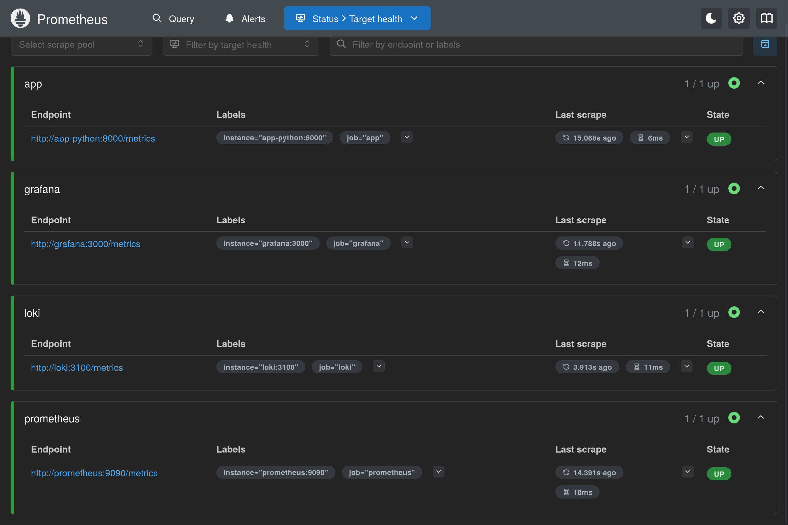
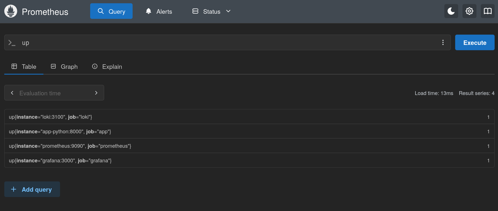
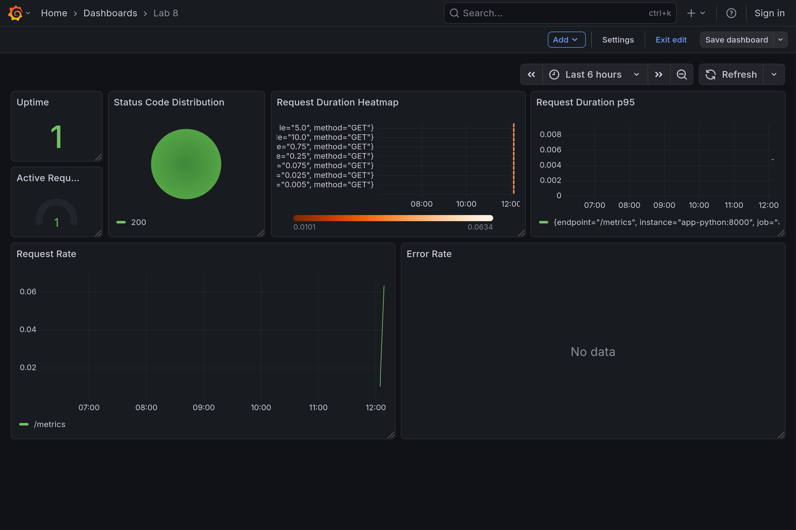

# Lab 8 — Metrics & Monitoring with Prometheus

## 1. Architecture

```
Python App (/metrics) → Prometheus (scraping, TSDB) → Grafana (dashboards)
```

**Flow:**

1. Flask app exposes `/metrics` with RED and custom business metrics
2. Prometheus scrapes every 15s (app, Loki, Grafana, self)
3. Grafana queries Prometheus via provisioned data source and dashboards

---

## 2. Application Instrumentation

Metrics are implemented in `app_python/app.py` using `prometheus-client==0.23.1`.

### Core HTTP Metrics (RED Method)

| Metric | Type | Labels | Purpose |
|--------|------|--------|---------|
| `http_requests_total` | Counter | `method`, `endpoint`, `status` | Request rate and errors |
| `http_request_duration_seconds` | Histogram | `method`, `endpoint` | Latency distribution |
| `http_requests_in_progress` | Gauge | — | Concurrent requests |

`/metrics` is excluded from HTTP instrumentation to avoid skewing RED metrics.

### Custom Application Metrics

| Metric | Type | Labels | Purpose |
|--------|------|--------|---------|
| `external_api_calls_total` | Counter | `service_name` | External dependency usage |
| `cache_items` | Gauge | — | Simulated cache size |
| `db_query_duration_seconds` | Histogram | `query_type` | Simulated DB query latency |

`get_system_info()` records `external_api_calls_total` and `db_query_duration_seconds`; `/` updates `cache_items`.


---

## 3. Prometheus Configuration

**File:** `monitoring/prometheus/prometheus.yml`

| Setting | Value |
|---------|-------|
| Scrape interval | 15s |
| Evaluation interval | 15s |
| TSDB retention (CLI) | `--storage.tsdb.retention.time=15d`, `--storage.tsdb.retention.size=10GB` |

**Scrape targets:**

| Job | Target | Path |
|-----|--------|------|
| `prometheus` | `localhost:9090` | `/metrics` |
| `app` | `app-python:8000` | `/metrics` |
| `loki` | `loki:3100` | `/metrics` |
| `grafana` | `grafana:3000` | `/metrics` |




---

## 4. Dashboard Walkthrough

Dashboard: **Lab 8** (`monitoring/docs/grafana-dashboards.json`), provisioned via `monitoring/grafana/provisioning/`.

| Panel | Query | Purpose |
|-------|-------|---------|
| Request Rate | `sum(rate(http_requests_total[5m])) by (endpoint)` | Traffic per endpoint |
| Error Rate | `sum(rate(http_requests_total{status=~"5.."}[5m]))` | 5xx errors/sec |
| Request Duration p95 | `histogram_quantile(0.95, rate(http_request_duration_seconds_bucket[5m]))` | Tail latency |
| Request Duration Heatmap | `rate(http_request_duration_seconds_bucket[5m])` | Latency distribution |
| Active Requests | `http_requests_in_progress` | Concurrency |
| Status Code Distribution | `sum by (status) (rate(http_requests_total[5m]))` | 2xx/4xx/5xx mix |
| Uptime | `up{job="app"}` | Scrape health |



---

## 5. PromQL Examples

```promql
# Total request rate
sum(rate(http_requests_total[5m]))

# Per-endpoint traffic
sum by (endpoint) (rate(http_requests_total[5m]))

# Error percentage
sum(rate(http_requests_total{status=~"5.."}[5m]))
/ sum(rate(http_requests_total[5m])) * 100

# p95 latency
histogram_quantile(0.95, rate(http_request_duration_seconds_bucket[5m]))

# Service health
up{job="app"}
```

---

## 6. Production Setup

### Health checks

All services in `monitoring/docker-compose.yml` define `healthcheck` probes:

- **Loki:** `GET /ready`
- **Promtail:** `GET /ready`
- **Grafana:** `GET /api/health`
- **Prometheus:** `GET /-/healthy`
- **app-python:** `curl /health`

### Resource limits

| Service | Memory | CPU |
|---------|--------|-----|
| Prometheus | 1G | 1.0 |
| Loki | 1G | 1.0 |
| Grafana | 512M | 0.5 |
| Promtail | 256M | 0.5 |
| app-python | 256M | 0.5 |

### Data retention and persistence

- Prometheus: 15-day / 10GB retention (config + CLI flags)
- Loki: 7-day retention (from Lab 7)
- Volumes: `prometheus-data`, `loki-data`, `grafana-data` survive `docker compose down`

### Grafana provisioning

- Data source: `monitoring/grafana/provisioning/datasources/prometheus.yml`
- Dashboard: `monitoring/grafana/provisioning/dashboards/lab08-app-dashboard.json`

---

## 7. Testing Results

```bash
cd monitoring
docker compose up -d --build
docker compose ps
curl http://localhost:8000/metrics
```

- `/metrics` exposes Prometheus format
- Prometheus targets show **UP**
- Grafana dashboard shows live RED metrics after traffic

---

## 8. Challenges & Solutions

| Issue | Fix |
|-------|-----|
| App target DOWN | Added `/metrics` and rebuilt `app-python` image |
| Grafana no data | Provisioned Prometheus data source with fixed UID |
| `/metrics` skewing RED | Excluded metrics route from HTTP instrumentation |

---

## Metrics vs Logs (Lab 7)

| | Metrics | Logs |
|---|---------|------|
| **Use for** | Trends, SLOs, alerts | Debugging, audit trail |
| **Stack** | Prometheus | Loki |
| **Query** | PromQL | LogQL |
| **Shape** | Aggregated time series | Detailed events |

**Use metrics for:** performance monitoring, alerting on rates and latency.  
**Use logs for:** tracing individual requests and errors.

---

## Conclusion

Full observability pipeline: **App → Prometheus → Grafana**, covering RED (Rate, Errors, Duration) plus production-ready compose configuration.
