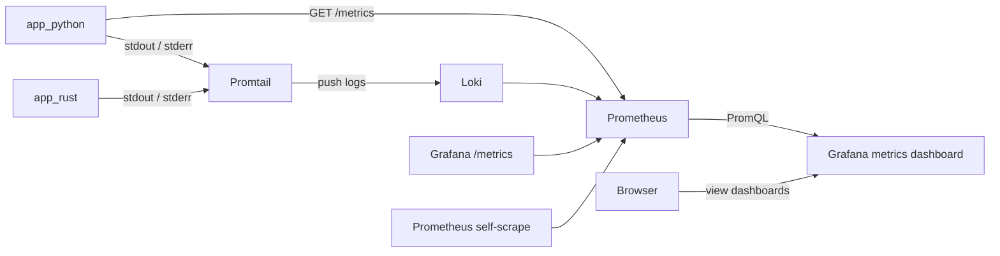
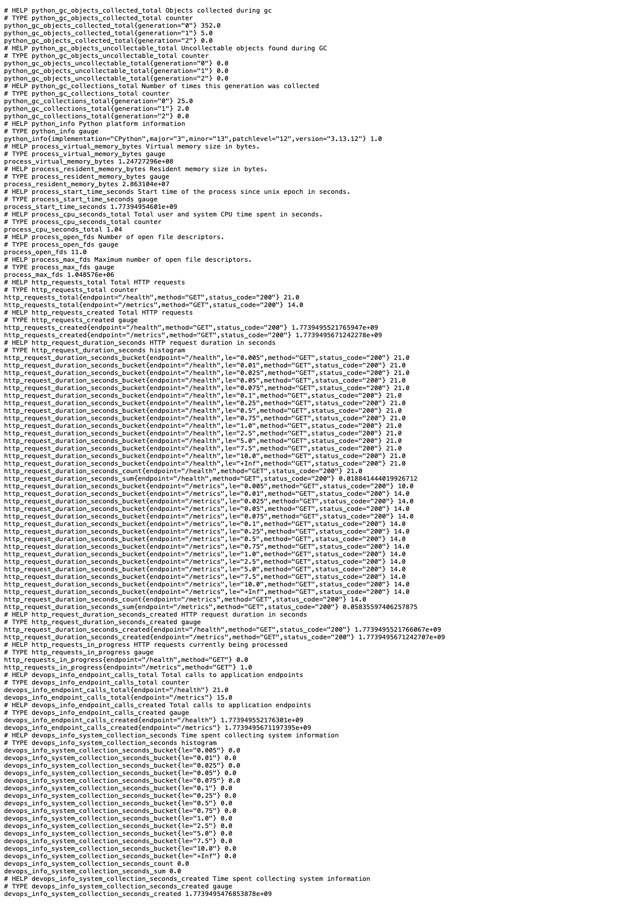
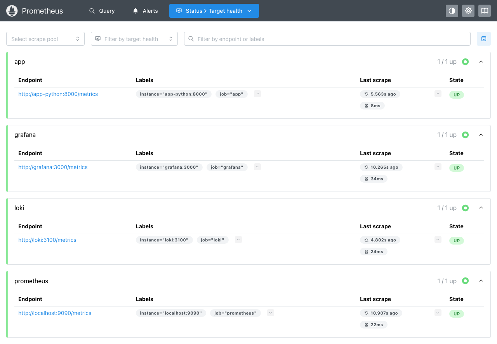
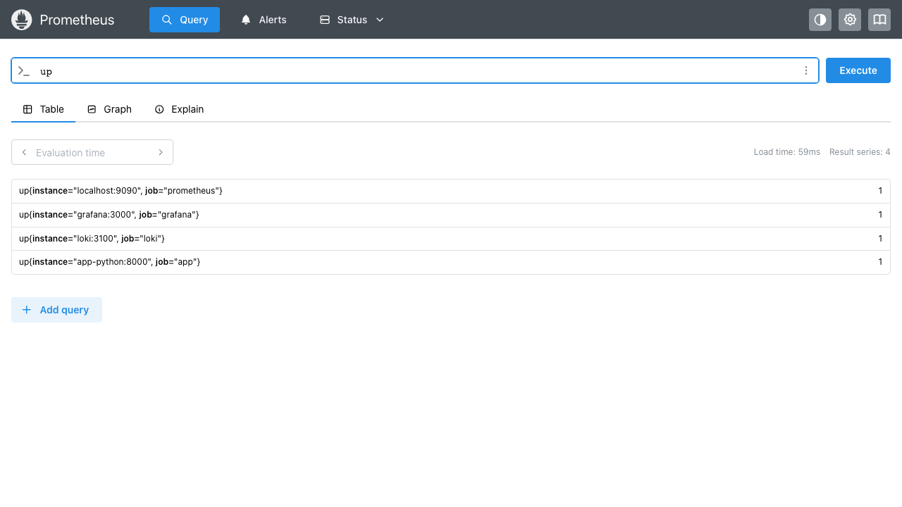
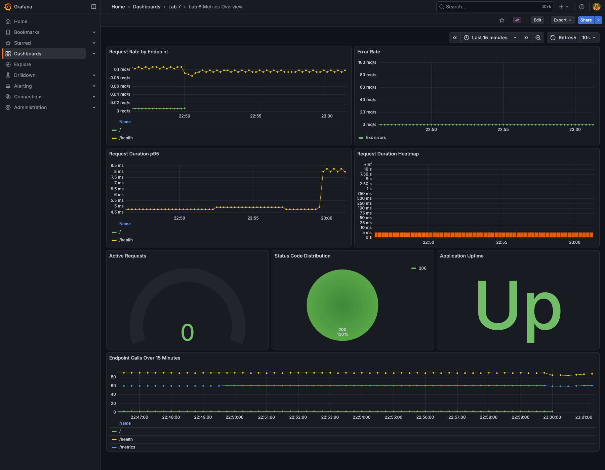

# Lab 08 - Metrics and Monitoring with Prometheus

## What I built

For this lab I extended the observability stack from Lab 7 instead of starting over.

The Python app now exposes Prometheus metrics on `/metrics`, Prometheus scrapes the app together with Loki, Grafana, and itself, and Grafana comes up with both data sources plus a ready-to-open metrics dashboard.

I also completed the bonus part: there is now a dedicated Ansible `monitoring` role and a `deploy-monitoring.yml` playbook that can provision the full stack in one run.

## Architecture



## Project structure

```text
monitoring/
├── docker-compose.yml
├── prometheus/
│   └── prometheus.yml
├── grafana/
│   ├── dashboards/
│   │   ├── logging-overview.json
│   │   └── metrics-overview.json
│   └── provisioning/
│       ├── dashboards/
│       │   └── dashboard.yml
│       └── datasources/
│           ├── loki.yml
│           └── prometheus.yml
└── docs/
    ├── LAB07.md
    ├── LAB08.md
    └── screenshots/
        ├── lab08-metrics-endpoint.png
        ├── lab08-prometheus-targets.png
        ├── lab08-prometheus-up-query.png
        └── lab08-grafana-dashboard-tall.png

ansible/
├── playbooks/
│   └── deploy-monitoring.yml
└── roles/
    └── monitoring/
        ├── defaults/
        ├── files/
        ├── tasks/
        └── templates/
```

## Application instrumentation

### HTTP metrics

I added the three core HTTP metrics the lab asked for:

- `http_requests_total{method, endpoint, status_code}`
- `http_request_duration_seconds{method, endpoint, status_code}`
- `http_requests_in_progress{method, endpoint}`

How they are recorded:

- `before_request` stores a timer start, normalizes the endpoint label, and increments the in-progress gauge.
- `after_request` increments the counter and observes the request duration histogram.
- `teardown_request` always decrements the in-progress gauge, so exceptions do not leave the gauge stuck above zero.

I kept label cardinality small by using the Flask route rule when available. That means `/health` stays `/health` and not some request-specific path.

### App-specific metrics

I added two extra metrics so the dashboard is not only about raw HTTP traffic:

- `devops_info_endpoint_calls_total{endpoint}` tracks how often each application endpoint is used.
- `devops_info_system_collection_seconds` measures how long the system info payload takes to collect in the `/` handler.

That second metric is simple, but it is useful because it shows a real piece of business logic and not only framework middleware.

### Metrics endpoint

The app now exposes metrics at:

```text
http://127.0.0.1:8000/metrics
```

Screenshot of the exported metrics:



## Prometheus configuration

Prometheus is defined in `monitoring/docker-compose.yml` with:

- image `prom/prometheus:v3.9.0`
- config mount `./prometheus/prometheus.yml:/etc/prometheus/prometheus.yml:ro`
- named volume `prometheus-data:/prometheus`
- retention flags `15d` and `10GB`
- health check against `/-/healthy`

The scrape config is intentionally small and explicit:

```yaml
global:
  scrape_interval: 15s
  evaluation_interval: 15s

scrape_configs:
  - job_name: prometheus
    static_configs:
      - targets: [localhost:9090]

  - job_name: app
    metrics_path: /metrics
    static_configs:
      - targets: [app-python:8000]

  - job_name: loki
    static_configs:
      - targets: [loki:3100]

  - job_name: grafana
    static_configs:
      - targets: [grafana:3000]
```

What I verified locally:

- `app up http://app-python:8000/metrics`
- `grafana up http://grafana:3000/metrics`
- `loki up http://loki:3100/metrics`
- `prometheus up http://localhost:9090/metrics`

Targets page screenshot:



PromQL `up` query screenshot:



## Grafana dashboard walkthrough

Grafana now provisions two data sources automatically:

- `Loki` with `uid: loki`
- `Prometheus` with `uid: prometheus`

I kept the existing provisioning folder, so the Lab 8 dashboard appears under the already-provisioned `Lab 7` folder. That is slightly odd naming-wise, but it avoided breaking the previous logging setup.

The custom dashboard is `Lab 8 Metrics Overview` and contains eight panels:

1. `Request Rate by Endpoint`
   Query: `sum by (endpoint) (rate(http_requests_total{endpoint!="/metrics"}[5m]))`

2. `Error Rate`
   Query: `sum(rate(http_requests_total{endpoint!="/metrics",status_code=~"5.."}[5m])) or vector(0)`

3. `Request Duration p95`
   Query: `histogram_quantile(0.95, sum by (le, endpoint) (rate(http_request_duration_seconds_bucket{endpoint!="/metrics"}[5m])))`

4. `Request Duration Heatmap`
   Query: `sum by (le) (rate(http_request_duration_seconds_bucket{endpoint!="/metrics"}[5m]))`

5. `Active Requests`
   Query: `sum(http_requests_in_progress{endpoint!="/metrics"})`

6. `Status Code Distribution`
   Query: `sum by (status_code) (rate(http_requests_total{endpoint!="/metrics"}[5m]))`

7. `Application Uptime`
   Query: `up{job="app"}`

8. `Endpoint Calls Over 15 Minutes`
   Query: `sum by (endpoint) (increase(devops_info_endpoint_calls_total[15m]))`

Dashboard screenshot:



## PromQL examples

These are the PromQL checks I actually ran during local verification.

### 1. Confirm every scrape target is alive

```promql
up
```

Observed result:

```json
[
  {"job": "prometheus", "instance": "localhost:9090", "value": "1"},
  {"job": "grafana", "instance": "grafana:3000", "value": "1"},
  {"job": "loki", "instance": "loki:3100", "value": "1"},
  {"job": "app", "instance": "app-python:8000", "value": "1"}
]
```

### 2. Request rate per endpoint

```promql
sum by (endpoint) (rate(http_requests_total{endpoint!="/metrics"}[5m]))
```

Observed result:

```json
[
  {"endpoint": "/health", "value": "0.11228148969466453"},
  {"endpoint": "/", "value": "0.005417416416749973"}
]
```

### 3. Status code distribution

```promql
sum by (status_code) (rate(http_requests_total{endpoint!="/metrics"}[5m]))
```

Observed result:

```json
[
  {"status_code": "200", "value": "0.11771001352005604"}
]
```

### 4. p95 latency by endpoint

```promql
histogram_quantile(0.95, sum by (le, endpoint) (rate(http_request_duration_seconds_bucket{endpoint!="/metrics"}[5m])))
```

Observed result:

```json
[
  {"endpoint": "/health", "value": "0.004903225806451613"},
  {"endpoint": "/", "value": "0.004750000000000001"}
]
```

### 5. Current in-flight work

```promql
sum(http_requests_in_progress{endpoint!="/metrics"})
```

This stays close to `0` most of the time in my local run, which is what I expect for a tiny Flask app handling short requests.

### 6. Endpoint usage over a short window

```promql
sum by (endpoint) (increase(devops_info_endpoint_calls_total[15m]))
```

This made it easy to separate frequent health checks from real endpoint traffic.

## Production setup

### Health checks

Every service in `monitoring/docker-compose.yml` has a health check now:

- Prometheus: `/-/healthy`
- Loki: `/ready`
- Promtail: `/ready`
- Grafana: `/api/health`
- Python app: `/health`
- Rust app: built-in `--healthcheck`

### Resource limits

I aligned the limits with the lab requirements:

- Prometheus: `1 CPU`, `1G`
- Loki: `1 CPU`, `1G`
- Grafana: `0.5 CPU`, `512M`
- Python app: `0.5 CPU`, `256M`
- Rust app: `0.5 CPU`, `256M`
- Promtail kept the smaller limit from Lab 7 because it is only shipping logs

### Retention and persistence

- Prometheus retention: `15d` and `10GB`
- Loki retention: `168h`
- Persistent volumes:
  - `prometheus-data`
  - `loki-data`
  - `promtail-data`
  - `grafana-data`

One practical detail mattered during testing: exporter counters live inside the app process, so restarting the app resets those counters. The persistent volume preserves Prometheus's own database and Grafana's saved objects, but it does not make in-memory app counters survive a container restart. That is normal.

## Metrics vs logs

Lab 7 and Lab 8 fit together well:

- Logs answer "what happened?" with request details, errors, and context.
- Metrics answer "how often?", "how fast?", and "is it trending up or down?"

Examples from this repo:

- I used Loki logs to see request records from both apps.
- I used Prometheus metrics to see request rate, latency, uptime, and endpoint usage.

If I had to debug a single broken request, I would start with logs.
If I had to notice rising latency or failed scrapes, I would start with metrics.

## Testing results

### Unit tests

I reran the Python test suite after adding instrumentation:

```text
5 passed in 0.15s
```

### Docker Compose validation

I built and started the full stack locally with:

```bash
cd monitoring
docker compose up -d --build
docker compose ps
```

Healthy state after the final restart check:

```text
monitoring-app-python-1   Up (healthy)
monitoring-app-rust-1     Up (healthy)
monitoring-grafana-1      Up (healthy)
monitoring-loki-1         Up (healthy)
monitoring-prometheus-1   Up (healthy)
monitoring-promtail-1     Up (healthy)
```

### Persistence check

I verified persistence with:

```bash
docker compose down
docker compose up -d
```

After the restart:

- the Grafana dashboard `Lab 8 Metrics Overview` was still present
- both data sources were still provisioned
- all services returned to `healthy`

## Bonus task - Ansible automation

I added:

- `ansible/roles/monitoring/defaults/main.yml`
- `ansible/roles/monitoring/tasks/main.yml`
- `ansible/roles/monitoring/templates/docker-compose.yml.j2`
- `ansible/roles/monitoring/templates/prometheus.yml.j2`
- `ansible/roles/monitoring/templates/grafana-datasources.yml.j2`
- `ansible/playbooks/deploy-monitoring.yml`

What the role does:

- prepares the monitoring directory tree
- templates Prometheus and Docker Compose config
- provisions both Grafana data sources
- copies both dashboard JSON files
- deploys the compose project with `community.docker.docker_compose_v2`
- verifies Python metrics, Prometheus health, Prometheus queries, and Grafana health

Important defaults in the role:

- `prometheus_version: 3.9.0`
- `prometheus_retention_days: 15`
- `prometheus_retention_size: 10GB`
- `prometheus_scrape_interval: 15s`
- `prometheus_targets` as a structured list of jobs and targets

I could not do a full remote deploy from this machine because the inventory points at a real server, but I did validate the playbook syntax locally with the repo's Ansible virtual environment:

```bash
cd ansible
../.venv-lab5/bin/python -m ansible.cli.playbook \
  -i inventory/hosts.ini \
  playbooks/deploy-monitoring.yml \
  --syntax-check \
  --vault-password-file .vault_pass
```

Result:

```text
playbook: playbooks/deploy-monitoring.yml
```

## Challenges and solutions

### 1. `/metrics` does not include its own counter sample during the same scrape

At first this looked like a bug in the Flask instrumentation. It is not. The `/metrics` response body is generated before `after_request` runs, so the scrape does not include that exact request's counter update yet.

Fix:

- I kept the instrumentation correct and changed the test expectations to match real exporter behavior.

### 2. Persistence is not the same thing as keeping in-process counters

After a restart, Grafana dashboards persisted immediately, but app counters restarted from zero because the exporter lives in application memory.

Fix:

- treat Grafana and Prometheus storage persistence as separate from app-process lifetime
- document that difference clearly in the report
