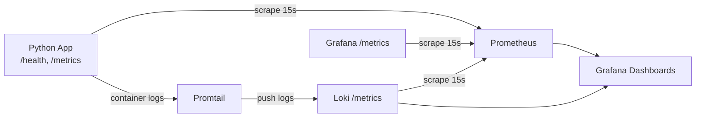

# LAB08 — Metrics & Monitoring with Prometheus

## 1. Architecture

### Monitoring flow



### Components

- `app-python`: Flask app instrumented with Prometheus metrics (RED + app-specific).
- `devops-go`: optional second app from Lab 1 kept in stack for log collection compatibility.
- `prometheus`: pulls metrics from app, Loki, Grafana, and itself every `15s`.
- `grafana`: visualizes Prometheus and Loki data with provisioned dashboards.
- `loki` + `promtail`: log aggregation pipeline from Lab 7.

## 2. Application Instrumentation

File: `app_python/app.py`

### Implemented metrics

- `http_requests_total{method,endpoint,status_code}` (Counter)
  - Tracks total request count (Rate + Errors via status filtering).
- `http_request_duration_seconds{method,endpoint,status_code}` (Histogram)
  - Tracks response latency distribution (Duration).
- `http_requests_in_progress{method,endpoint}` (Gauge)
  - Tracks concurrent requests.
- `devops_info_endpoint_calls{endpoint}` (Counter)
  - App-specific endpoint usage metric.
- `devops_info_system_collection_seconds` (Histogram)
  - App-specific internal operation timing (system info collection).

### Instrumentation points

- `@app.before_request`
  - Stores start time and increments in-progress gauge.
- `@app.after_request`
  - Records request counter + histogram and decrements in-progress gauge.
- `@app.route("/metrics")`
  - Exposes Prometheus text format using `generate_latest()`.

### Label strategy

- Low cardinality endpoint normalization:
  - Known routes keep their route labels (`/`, `/health`, `/metrics`).
  - Unknown paths are grouped into `/unknown`.
- Avoid per-user or per-id labels.

## 3. Prometheus Configuration

File: `monitoring/prometheus/prometheus.yml`

### Global settings

- `scrape_interval: 15s`
- `evaluation_interval: 15s`

### Scrape targets

- `prometheus`: `localhost:9090`
- `app`: `app-python:8000` (`/metrics`)
- `loki`: `loki:3100` (`/metrics`)
- `grafana`: `grafana:3000` (`/metrics`)

### Retention policy

Configured in `monitoring/docker-compose.yml` Prometheus command flags:

- `--storage.tsdb.retention.time=15d`
- `--storage.tsdb.retention.size=10GB`

## 4. Dashboard Walkthrough

Provisioned dashboard JSON:

- `monitoring/grafana/provisioning/dashboards/json/app-metrics-dashboard.json`

### Panels (6+)

1. **Request Rate by Endpoint**
   - `sum by (endpoint) (rate(http_requests_total[5m]))`
2. **Error Rate (5xx)**
   - `sum(rate(http_requests_total{status_code=~"5.."}[5m]))`
3. **Request Duration p95**
   - `histogram_quantile(0.95, sum by (le) (rate(http_request_duration_seconds_bucket[5m])))`
4. **Request Duration Heatmap**
   - `sum by (le) (rate(http_request_duration_seconds_bucket[5m]))`
5. **Active Requests**
   - `sum(http_requests_in_progress)`
6. **Status Code Distribution**
   - `sum by (status_code) (rate(http_requests_total[5m]))`
7. **App Uptime (UP/DOWN)**
   - `up{job="app"}`

## 5. PromQL Examples

1. Requests per second by endpoint:
   - `sum by (endpoint) (rate(http_requests_total[5m]))`
2. Global request rate:
   - `sum(rate(http_requests_total[5m]))`
3. 5xx error rate:
   - `sum(rate(http_requests_total{status_code=~"5.."}[5m]))`
4. Error percentage:
   - `100 * sum(rate(http_requests_total{status_code=~"5.."}[5m])) / sum(rate(http_requests_total[5m]))`
5. p95 latency:
   - `histogram_quantile(0.95, sum by (le) (rate(http_request_duration_seconds_bucket[5m])))`
6. Active requests now:
   - `sum(http_requests_in_progress)`
7. Target availability:
   - `up`

## 6. Production Setup

### Health checks

Configured for all services in `monitoring/docker-compose.yml`:

- `app-python`: `/health`
- `prometheus`: `/-/healthy`
- `grafana`: `/api/health`
- `loki`: `/ready`
- `promtail`: `/ready`

### Resource limits

- Prometheus: `1G`, `1.0 CPU`
- Loki: `1G`, `1.0 CPU`
- Grafana: `512M`, `0.5 CPU`
- App: `256M`, `0.5 CPU`
- Promtail: `256M`, `0.5 CPU`

### Persistence

Named volumes:

- `prometheus-data`
- `loki-data`
- `grafana-data`

Data and dashboards remain after `docker compose down` / `up -d`.

## 7. Testing Results

### Local validation commands

```bash
# App tests
python -m unittest app_python/tests/test_app.py

# Compose syntax
cd monitoring
docker compose config

# Start stack
docker compose up -d

docker compose ps
curl -s http://localhost:8000/metrics | head -40
curl -s http://localhost:9090/api/v1/query?query=up
```

### Evidence to capture

Store screenshots in `monitoring/docs/screenshots/` with names:

- `./screenshots/metrics-endpoint.png` (browser/curl output of `/metrics`)
- `./screenshots/prometheus-targets-up.png` (`http://localhost:9090/targets` all UP)
- `./screenshots/promql-up-query.png` (`up` query result)
- `./screenshots/grafana-app-dashboard1.png` (custom dashboard with 6+ panels)
- `./screenshots/grafana-app-dashboard2.png` (custom dashboard with 6+ panels)
- `./screenshots/compose-healthyyyy.png` (`docker compose ps` healthy services)
- `./screenshots/persistence-proof.png` (dashboard exists after restart)
- `./screenshots/afteerrestart.png`

## 8. Challenges & Solutions

- **High-cardinality risk for endpoint labels**
  - Solution: normalized unknown paths to `/unknown`.
- **Prometheus retention requirements**
  - Solution: set explicit TSDB retention by time and size in container command.
- **Repeatable dashboard setup**
  - Solution: provisioning files + dashboard JSON committed to repo.
- **Automation requirement (bonus)**
  - Solution: extended Ansible `monitoring` role with templated Prometheus and dashboard provisioning.

## Metrics vs Logs (Lab 7 vs Lab 8)

- Use **metrics** for trends/SLOs/alerts (rate, error rate, p95, uptime).
- Use **logs** for event-level debugging and root-cause analysis.
- Together they cover both macro health (metrics) and request-level detail (logs).

## Bonus — Ansible Automation

Extended role: `ansible/roles/monitoring`

### Implemented

- Added Prometheus variables and scrape target list in `defaults/main.yml`.
- Added Jinja2 Prometheus template: `templates/prometheus.yml.j2`.
- Updated Compose template to include:
  - app + Loki + Promtail + Prometheus + Grafana
  - health checks, resource limits, retention, persistent volumes.
- Provisioned Grafana data sources (Loki + Prometheus) and dashboards.
- Added dashboard files:
  - `files/grafana-app-dashboard.json`
  - `files/grafana-logs-dashboard.json`

### End-to-end deployment

```bash
cd ansible
ansible-playbook playbooks/deploy-monitoring.yml -i inventory/hosts.ini --ask-vault-pass
```

Run twice to verify idempotency (`changed=0` expected on second run for stable state).
