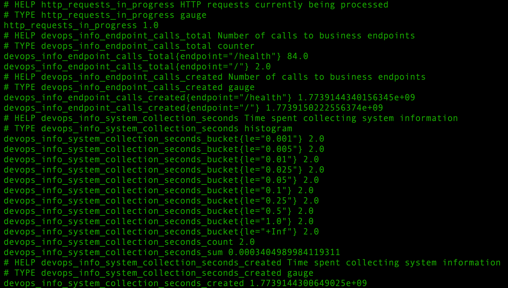
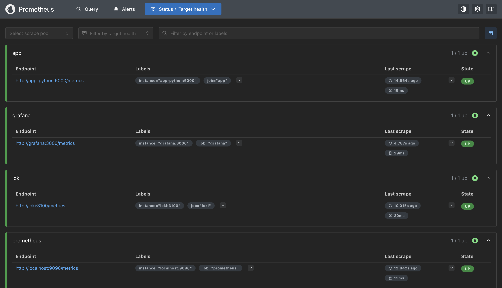
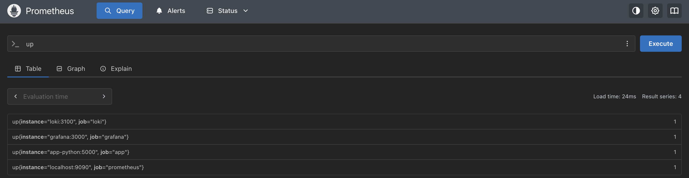
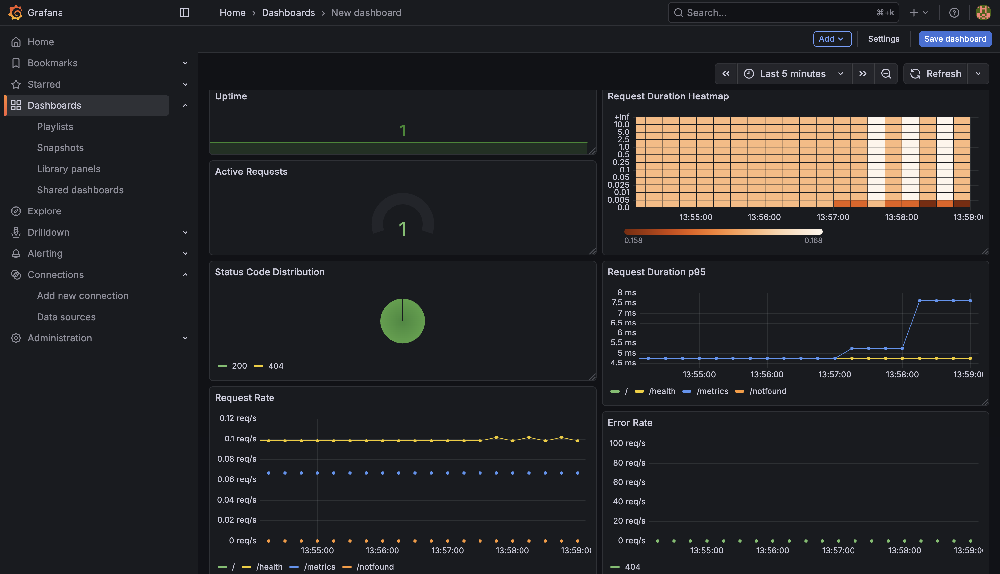
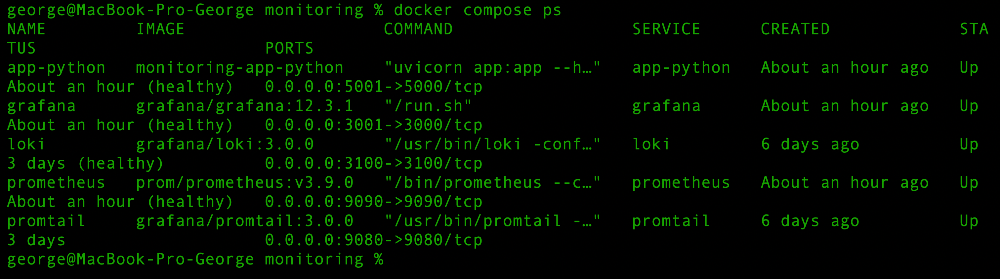
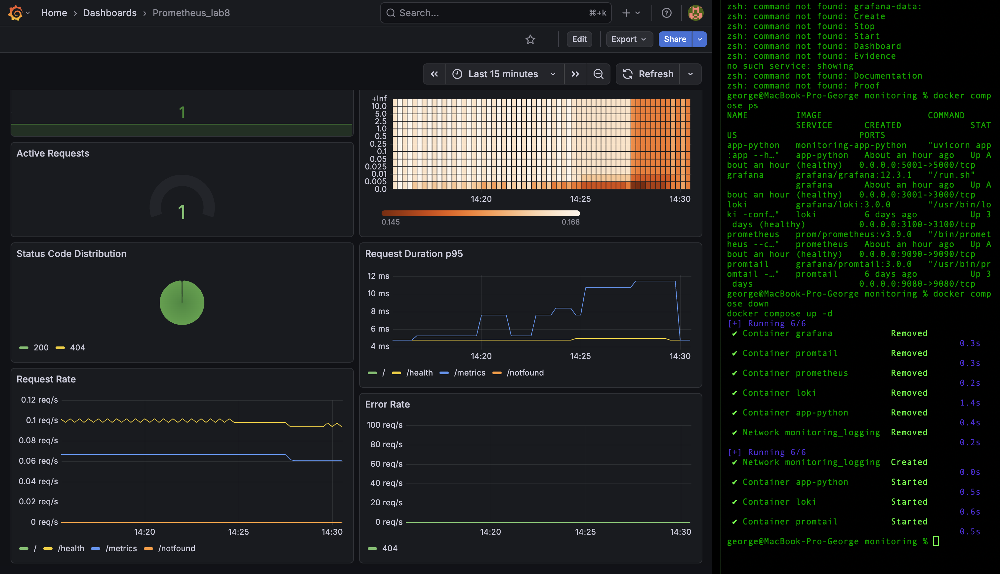

# Lab 08 - Metrics & Monitoring with Prometheus

## Architecture

The monitoring architecture in this lab follows a standard observability pipeline:

```

FastAPI app (/metrics) → Prometheus → Grafana
FastAPI app (logs) → Promtail → Loki → Grafana

```

- The application exposes metrics via `/metrics`
- Prometheus scrapes metrics every 15 seconds
- Grafana queries Prometheus using PromQL
- Loki collects logs (from Lab 7) and integrates into Grafana

This architecture provides full observability using both metrics and logs.

## Task 1 — Application Metrics

### 1.1 Why Metrics Matter

In Lab 7, logs were used to understand **what happened** in the system.  
In this lab, metrics are introduced to understand:

- **How much** (number of requests, errors)
- **How often** (requests per second)
- **How fast** (response time)

Together, logs and metrics provide full observability.

---

### RED Method

The application metrics were designed following the **RED method**:

- **Rate** — number of requests per second  
- **Errors** — number of failed requests  
- **Duration** — response time of requests  

---

### 1.2 Prometheus Client Installation

Prometheus client library was added to the project:

```bash
prometheus-client==0.23.1
```

Installed via:

```bash
pip install prometheus-client
```

---

### 1.3 Metrics Endpoint Implementation

A `/metrics` endpoint was added to the FastAPI application.

This endpoint exposes metrics in Prometheus format:

```bash
http://localhost:5001/metrics
```

---

### Implemented HTTP Metrics

#### 1. Request Counter

```bash
http_requests_total
```

- Type: Counter  
- Labels: `method`, `endpoint`, `status_code`  
- Purpose: counts total HTTP requests  

---

#### 2. Request Duration

```bash
http_request_duration_seconds
```

- Type: Histogram  
- Labels: `method`, `endpoint`, `status_code`  
- Purpose: measures request latency  

---

#### 3. Active Requests

```bash
http_requests_in_progress
```

- Type: Gauge  
- Purpose: shows number of requests currently being processed  

---

### 1.4 Application-Specific Metrics

Additional business metrics were implemented:

#### Endpoint Usage

```bash
devops_info_endpoint_calls_total
```

- Type: Counter  
- Labels: `endpoint`  
- Purpose: tracks usage of application endpoints  

---

#### System Info Collection Time

```bash
devops_info_system_collection_seconds
```

- Type: Histogram  
- Purpose: measures time required to collect system information  

---

### 1.5 Local Testing

The application was tested locally using:

```bash
curl http://localhost:5001/metrics
```

Metrics output included:

- HTTP request counters
- request duration histograms
- active request gauge
- business-specific metrics

---

### Evidence — Metrics Output



---

## Task 2 — Prometheus Setup

### 2.1 Understanding Prometheus Architecture

Prometheus uses a **pull-based monitoring model**.  
This means that the application does not push metrics anywhere by itself. Instead, it exposes metrics on the `/metrics` endpoint, and Prometheus periodically scrapes those endpoints.

In this lab, the monitoring flow is:

```
FastAPI app (/metrics) → Prometheus → Grafana
Loki (/metrics)       → Prometheus → Grafana
Grafana (/metrics)    → Prometheus
Prometheus            → self-scrape
```

This approach is convenient because:

* applications remain independent from Prometheus
* failed scrapes are visible in the Prometheus UI
* new services can be added easily by updating the scrape configuration

---

### 2.2 Adding Prometheus to Docker Compose

Prometheus was added to `monitoring/docker-compose.yml` as a separate service.

Main requirements from the lab were implemented:

* image: `prom/prometheus:v3.9.0`
* exposed port: `9090`
* mounted config file: `./prometheus/prometheus.yml`
* persistent volume: `prometheus-data`
* connected to the existing `logging` network from Lab 7

### Prometheus service configuration

```yaml
  prometheus:
    image: prom/prometheus:v3.9.0
    container_name: prometheus
    ports:
      - "9090:9090"
    command:
      - '--config.file=/etc/prometheus/prometheus.yml'
      - '--storage.tsdb.retention.time=15d'
      - '--storage.tsdb.retention.size=10GB'
    volumes:
      - ./prometheus/prometheus.yml:/etc/prometheus/prometheus.yml:ro
      - prometheus-data:/prometheus
    networks:
      - logging
    labels:
      logging: "promtail"
      app: "prometheus"
    depends_on:
      - app-python
      - loki
    restart: unless-stopped
    healthcheck:
      test: ["CMD-SHELL", "wget --no-verbose --tries=1 --spider http://localhost:9090/-/healthy || exit 1"]
      interval: 10s
      timeout: 5s
      retries: 5
      start_period: 20s
    deploy:
      resources:
        limits:
          cpus: "1.0"
          memory: 1G
        reservations:
          cpus: "0.25"
          memory: 256M
```

The persistent volume was also added to the compose file:

```yaml
volumes:
  loki-data:
  grafana-data:
  promtail-positions:
  prometheus-data:
```

---

### 2.3 Prometheus Configuration

The Prometheus configuration file was created as:

`monitoring/prometheus/prometheus.yml`

```yaml
global:
  scrape_interval: 15s
  evaluation_interval: 15s

scrape_configs:
  - job_name: 'prometheus'
    static_configs:
      - targets: ['localhost:9090']

  - job_name: 'app'
    metrics_path: /metrics
    static_configs:
      - targets: ['app-python:5000']

  - job_name: 'loki'
    metrics_path: /metrics
    static_configs:
      - targets: ['loki:3100']

  - job_name: 'grafana'
    metrics_path: /metrics
    static_configs:
      - targets: ['grafana:3000']
```

### Explanation of scrape jobs

* **prometheus**
  Prometheus scrapes its own internal metrics from `localhost:9090`.

* **app**
  The FastAPI application is scraped from `app-python:5000`.
  This uses the internal Docker network address, not the host port `5001`.

* **loki**
  Loki internal metrics are scraped from `loki:3100`.

* **grafana**
  Grafana internal metrics are scraped from `grafana:3000`.
  Metrics were enabled in Docker Compose with:

```yaml
GF_METRICS_ENABLED: "true"
```

### Scrape interval

The scrape interval was configured as:

```yaml
scrape_interval: 15s
evaluation_interval: 15s
```

This matches the lab requirement and provides near real-time monitoring.

---

### 2.4 Deploy and Verify

The updated stack was deployed with the following commands:

```bash
cd monitoring
docker compose up -d --build
docker compose ps
```

After deployment, all major services were running successfully:

* `app-python` — healthy
* `grafana` — healthy
* `loki` — healthy
* `prometheus` — healthy
* `promtail` — running

Prometheus UI became available at:

`http://localhost:9090`

---

### Verification in Prometheus UI

The `/targets` page was checked at:

`http://localhost:9090/targets`

Configured scrape targets:

* `prometheus`
* `app`
* `loki`
* `grafana`

All targets were expected to be in **UP** state.

To verify metric collection, a PromQL query was executed:

```promql
up
```

This query returned value `1` for all configured scrape targets, confirming that Prometheus successfully scraped metrics from all services.

---

### Evidence

Prometheus `/targets` page:



Successful PromQL query `up`:


---


## Task 3 — Grafana Dashboards

### 3.1 Adding Prometheus Data Source

Prometheus was added to Grafana as a data source through:

- **Connections**
- **Data sources**
- **Add data source**
- **Prometheus**

The following internal Docker URL was used:

```bash
http://prometheus:9090
```

The connection test completed successfully.

---

### 3.2 PromQL Basics

Grafana used PromQL to query metrics stored in Prometheus.

Examples of PromQL patterns used in this lab:

Direct metric:

```promql
http_requests_total
```

Label filtering:

```promql
http_requests_total{method="GET"}
```

Rate calculation:

```promql
rate(http_requests_total[5m])
```

Aggregation:

```promql
sum by (endpoint) (rate(http_requests_total[5m]))
```

Latency percentile:

```promql
histogram_quantile(0.95, sum by (le) (rate(http_request_duration_seconds_bucket[5m])))
```

---

### RED Method in PromQL

- **Rate**
```promql
sum(rate(http_requests_total[5m]))
```

* **Errors**

```promql
sum(rate(http_requests_total{status_code=~"4..|5.."}[5m]))
```

* **Duration**

```promql
histogram_quantile(0.95, sum by (le) (rate(http_request_duration_seconds_bucket[5m])))
```

---

### 3.3 Custom Application Dashboard

A custom Grafana dashboard was created with more than 6 panels.

#### 1. Request Rate

**Query:**

```promql
sum by (endpoint) (rate(http_requests_total[5m]))
```

Shows requests per second per endpoint.

---

#### 2. Error Rate

**Query:**

```promql
sum by (status_code) (rate(http_requests_total{status_code=~"4..|5.."}[5m]))
```

Shows 4xx and 5xx errors per second.

---

#### 3. Request Duration p95

**Query:**

```promql
histogram_quantile(0.95, sum by (le) (rate(http_request_duration_seconds_bucket[5m])))
```

Shows 95th percentile request latency.

---

#### 4. Request Duration Heatmap

**Query:**

```promql
sum by (le) (rate(http_request_duration_seconds_bucket[5m]))
```

Shows latency distribution across histogram buckets.

---

#### 5. Active Requests

**Query:**

```promql
http_requests_in_progress
```

Shows the number of currently processed requests.

---

#### 6. Status Code Distribution

**Query:**

```promql
sum by (status_code) (rate(http_requests_total[5m]))
```

Shows response code distribution.

---

#### 7. Uptime

**Query:**

```promql
up{job="app"}
```

Shows application availability.

---

#### 8. Endpoint Usage

**Query:**

```promql
sum by (endpoint) (rate(devops_info_endpoint_calls_total[5m]))
```

Shows usage of business endpoints.

---

### Dashboard Configuration Notes

* time range: **Last 15 minutes**
* units:

  * requests per second for rate panels
  * seconds for latency panels
* legends used `{{endpoint}}` and `{{status_code}}`
* uptime panel used thresholds to highlight service health

---

### 3.4 Importing Community Dashboards

Grafana provides pre-built dashboards that can be imported using dashboard IDs.

Examples:
- 3662 — Prometheus 2.0 Stats
- 13407 — Loki Dashboard

These dashboards can be imported via:
- Dashboards → New → Import

In this lab, a custom dashboard was created instead, as it provides better visibility into application-specific metrics and satisfies all task requirements.

---

### Evidence

Screenshot of custom Grafana dashboard and all 7 panels:


Exported dashboard JSON file reference:
```txt
./Grafana_lab8.json
```
---


## Task 4 — Production Configuration

### 4.1 Health Checks

Health checks were added to the main services in `docker-compose.yml` to make the monitoring stack more reliable and production-ready.

#### Application health check

The FastAPI application runs on port `5000` inside the container, so the health check was configured as:

```yaml
healthcheck:
  test: ["CMD-SHELL", "curl -f http://localhost:5000/health || exit 1"]
  interval: 10s
  timeout: 5s
  retries: 5
  start_period: 15s
```

#### Prometheus health check

```yaml
healthcheck:
  test: ["CMD-SHELL", "wget --no-verbose --tries=1 --spider http://localhost:9090/-/healthy || exit 1"]
  interval: 10s
  timeout: 5s
  retries: 5
  start_period: 20s
```

#### Grafana health check

```yaml
healthcheck:
  test: ["CMD-SHELL", "wget --no-verbose --tries=1 --spider http://localhost:3000/api/health || exit 1"]
  interval: 15s
  timeout: 5s
  retries: 10
  start_period: 20s
```

#### Loki health check

```yaml
healthcheck:
  test: ["CMD-SHELL", "wget --no-verbose --tries=1 --spider http://localhost:3100/ready || exit 1"]
  interval: 10s
  timeout: 5s
  retries: 5
  start_period: 15s
```

After deployment, service health was verified using:

```bash
docker compose ps
```

All main services were reported as healthy:

* app-python
* grafana
* loki
* prometheus

---

### 4.2 Resource Limits

Resource limits were configured for all major services to prevent excessive resource consumption.

Configured limits:

* **Prometheus** — 1 CPU, 1G memory
* **Loki** — 1 CPU, 1G memory
* **Grafana** — 0.5 CPU, 512M memory
* **FastAPI app** — 0.5 CPU, 256M memory

This improves stack stability and better reflects production deployment practices.

---

### 4.3 Data Retention

Prometheus retention was configured in `docker-compose.yml` using command arguments:

```yaml
command:
  - '--config.file=/etc/prometheus/prometheus.yml'
  - '--storage.tsdb.retention.time=15d'
  - '--storage.tsdb.retention.size=10GB'
```

This means:

* Prometheus stores metrics for up to **15 days**
* or until storage reaches **10GB**

Retention is important because it:

* controls disk usage
* improves query performance
* prevents unbounded growth of time-series data
* supports predictable system operation

---

### 4.4 Persistent Volumes

Persistent Docker volumes were configured to ensure data survives container restarts:

```yaml
volumes:
  loki-data:
  grafana-data:
  promtail-positions:
  prometheus-data:
```

These volumes store:

* **prometheus-data** — Prometheus TSDB data
* **loki-data** — Loki log storage
* **grafana-data** — Grafana dashboards and settings

Persistence was tested by:

```bash
docker compose down
docker compose up -d
```

After restart, the Grafana dashboard remained available, confirming that persistent storage was working correctly.

---

### Evidence

`docker compose ps` showing healthy services


Screenshot proving dashboard persistence after restart


## Testing Results

The monitoring stack was tested end-to-end.

### Metrics

- `/metrics` endpoint successfully exposed application metrics
- Prometheus scraped all targets successfully

### Prometheus

- All targets were in `UP` state
- PromQL queries returned expected values

### Grafana

- Dashboard displayed live data across all panels
- Metrics updated in real time

### Persistence

- After restarting containers:
```bash
docker compose down
docker compose up -d
```

* Grafana dashboards remained unchanged

This confirms correct configuration of the monitoring stack.

---


# Challenges & Solutions

### 1. Missing metrics data in Grafana

**Problem:**  
Dashboard panels initially showed "No data".

**Solution:**  
Generated traffic using curl requests to populate metrics.

---

### 2. Grafana connection to Prometheus

**Problem:**  
Grafana could not connect when using `localhost:9090`.

**Solution:**  
Used internal Docker network URL:

```bash
http://prometheus:9090
```

---

# Metrics vs Logs

This lab extends observability by combining metrics and logs.

### Metrics

- Provide quantitative data (counts, rates, latency)
- Used for monitoring trends and alerting
- Example: request rate, error rate, response time

### Logs

- Provide detailed event information
- Used for debugging and root cause analysis
- Example: request details, errors, stack traces

### Combined usage

- Metrics show **what is happening**
- Logs explain **why it is happening**

Together, they provide a complete observability solution.
