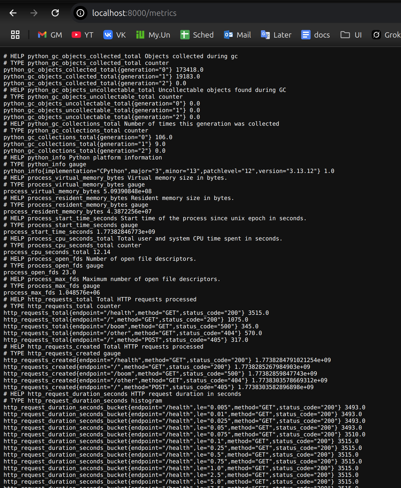
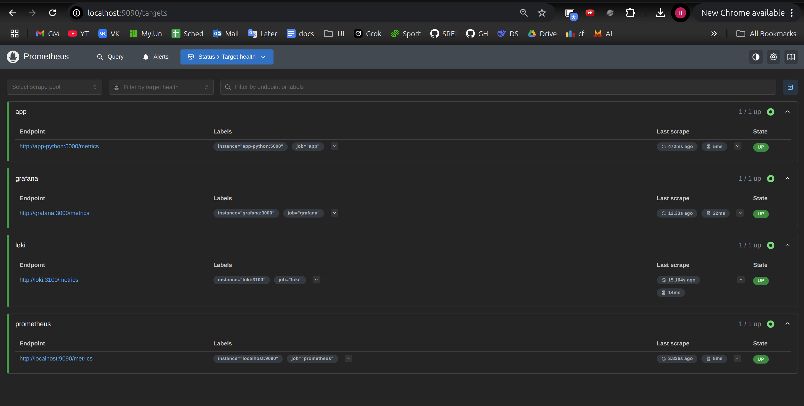
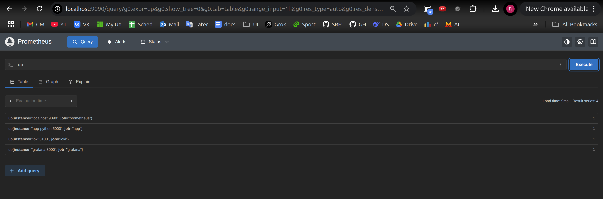
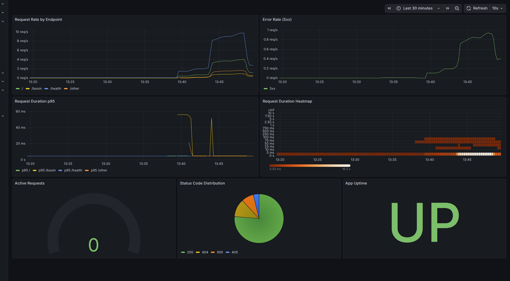
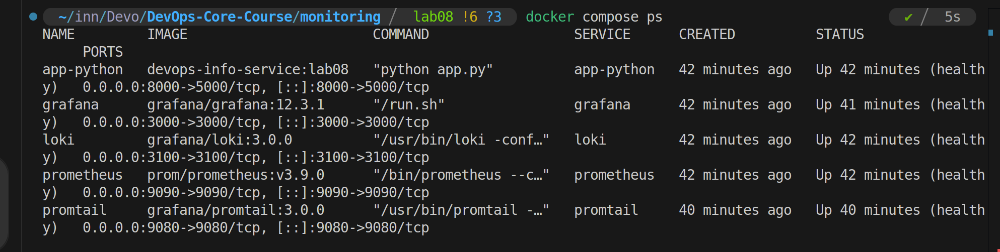
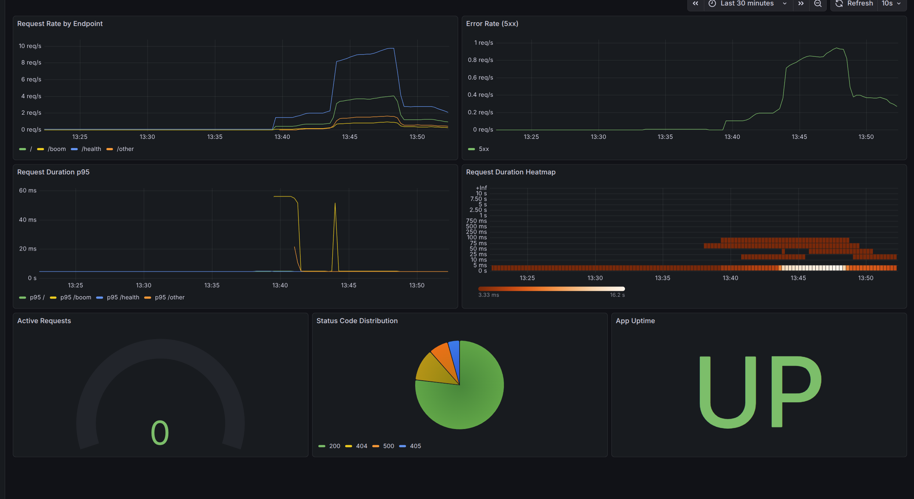

# LAB08 - Metrics & Monitoring with Prometheus

## 1. Architecture

```text
+-------------+      scrape /metrics      +----------------+      query (PromQL)      +---------+
| app-python  | -------------------------> |   Prometheus   | -----------------------> | Grafana |
| Flask app   |                            | TSDB + scrape  |                           | Panels  |
+-------------+                            +----------------+                           +---------+
      |                                            |
      | logs                                       | scrape /metrics
      v                                            v
+-------------+                              +-------------+
|  Promtail   | ---------------------------> |    Loki     |
+-------------+                              +-------------+
```

- Logs path (Lab 7): `app -> promtail -> loki -> grafana`
- Metrics path (Lab 8): `app -> prometheus -> grafana`
- Both stacks run on one Docker Compose network: `monitoring-logging`

## 2. Application Instrumentation

Implemented in [app.py](/home/j0cos/innopolis/Devops/DevOps-Core-Course/app_python/app.py):

- `http_requests_total{method,endpoint,status_code}` (Counter)
- `http_request_duration_seconds{method,endpoint,status_code}` (Histogram)
- `http_requests_in_progress{method,endpoint}` (Gauge)
- `devops_info_endpoint_calls_total{endpoint}` (business Counter)
- `devops_info_system_info_collection_seconds` (business Histogram)

Why these choices:
- Counter tracks request and error volume over time (Rate + Errors from RED).
- Histogram tracks latency distribution and enables p95 queries (Duration from RED).
- Gauge tracks current concurrency pressure.
- Business metrics add service-level visibility beyond generic HTTP stats.

Cardinality protection:
- Unknown paths are normalized to `/other` before labeling, preventing unbounded label growth.

## 3. Prometheus Configuration

Config file: [prometheus.yml](/home/j0cos/innopolis/Devops/DevOps-Core-Course/monitoring/prometheus/prometheus.yml)

- Global scrape interval: `15s`
- Jobs:
  - `prometheus` -> `localhost:9090`
  - `app` -> `app-python:5000` (`/metrics`)
  - `loki` -> `loki:3100` (`/metrics`)
  - `grafana` -> `grafana:3000` (`/metrics`)

Retention is set via Compose command flags:
- `--storage.tsdb.retention.time=15d`
- `--storage.tsdb.retention.size=10GB`

## 4. Dashboard Walkthrough

Provisioned dashboard JSON:
- [lab08-metrics.json](/home/j0cos/innopolis/Devops/DevOps-Core-Course/monitoring/grafana/dashboards/lab08-metrics.json)

Panels included:
- Request Rate by Endpoint: `sum by (endpoint) (rate(http_requests_total[5m]))`
- Error Rate (5xx): `sum(rate(http_requests_total{status_code=~"5.."}[5m]))`
- Request Duration p95: `histogram_quantile(0.95, sum by (le, endpoint) (rate(http_request_duration_seconds_bucket[5m])))`
- Request Duration Heatmap: `sum by (le) (rate(http_request_duration_seconds_bucket[5m]))`
- Active Requests: `sum(http_requests_in_progress)`
- Status Code Distribution: `sum by (status_code) (rate(http_requests_total[5m]))`
- App Uptime: `up{job="app"}`

## 5. PromQL Examples

- Overall request throughput:
  - `sum(rate(http_requests_total[5m]))`
- Throughput per endpoint:
  - `sum by (endpoint) (rate(http_requests_total[5m]))`
- 5xx error throughput:
  - `sum(rate(http_requests_total{status_code=~"5.."}[5m]))`
- Error ratio (5xx / all requests):
  - `sum(rate(http_requests_total{status_code=~"5.."}[5m])) / sum(rate(http_requests_total[5m]))`
- p95 latency by endpoint:
  - `histogram_quantile(0.95, sum by (le, endpoint) (rate(http_request_duration_seconds_bucket[5m])))`
- Concurrent requests:
  - `sum(http_requests_in_progress)`
- Service health:
  - `up{job=~"app|prometheus|loki|grafana"}`

## 6. Production Setup

Configured in [docker-compose.yml](/home/j0cos/innopolis/Devops/DevOps-Core-Course/monitoring/docker-compose.yml):

- Health checks for `app-python`, `prometheus`, `loki`, `promtail`, `grafana`
- Resource limits:
  - Prometheus: `1G`, `1.0 CPU`
  - Loki: `1G`, `1.0 CPU`
  - Grafana: `512M`, `0.5 CPU`
  - App: `256M`, `0.5 CPU`
- Persistence volumes:
  - `prometheus-data`
  - `loki-data`
  - `grafana-data`

## 7. Testing Results

Run:

```bash
cd monitoring
docker compose up -d --build
docker compose ps
```

Validation checklist:
- `http://localhost:9090/targets` shows all targets `UP`
- `http://localhost:9090` query `up` returns `1` for all jobs
- `http://localhost:8000/metrics` returns Prometheus text format
- Grafana contains Loki + Prometheus datasources
- Dashboard `Lab08 Application Metrics` renders all 7 panels

Screenshot folder used for submission:
- `/home/j0cos/innopolis/Devops/DevOps-Core-Course/monitoring/docs/screenshots/lab08`

Collected evidence:
- `01-metrics-endpoint.png` - `/metrics` endpoint output
- `02-prometheus-targets-up.png` - Prometheus targets page with targets `UP`
- `03-promql-up-query.png` - Prometheus `up` query result
- `04-grafana-dashboard-overview.png` - Grafana dashboard overview (used for both "dashboard overview" and "all 6+ panels working")
- `06-compose-healthy-services.png` - `docker compose ps` healthy services proof
- `08-persistence-proof-after.png` - dashboard still available after restart (paired with `04-*` as the before-restart state)

Direct image references:








Requirement-to-evidence check (against `labs/lab08.md`):

| Requirement | Status | Evidence |
|---|---|---|
| Task 1: screenshot of `/metrics` output | Present | `01-metrics-endpoint.png` |
| Task 1: code showing metric definitions | Present | [app.py](/home/j0cos/innopolis/Devops/DevOps-Core-Course/app_python/app.py) |
| Task 1: explanation of metric choices | Present | Section 2 |
| Task 2: screenshot of `/targets` with targets UP | Present | `02-prometheus-targets-up.png` |
| Task 2: screenshot of successful PromQL query | Present | `03-promql-up-query.png` |
| Task 2: include `prometheus.yml` config | Present | [prometheus.yml](/home/j0cos/innopolis/Devops/DevOps-Core-Course/monitoring/prometheus/prometheus.yml) |
| Task 3: custom dashboard with live data | Present | `04-grafana-dashboard-overview.png` |
| Task 3: screenshot showing all 6+ panels working | Present | `04-grafana-dashboard-overview.png` (single screenshot covers all required panels) |
| Task 3: exported dashboard JSON | Present | [lab08-metrics.json](/home/j0cos/innopolis/Devops/DevOps-Core-Course/monitoring/grafana/dashboards/lab08-metrics.json) |
| Task 4: `docker compose ps` healthy services | Present | `06-compose-healthy-services.png` |
| Task 4: retention policy documentation | Present | Section 3 + Section 6 |
| Task 4: proof of persistence after restart | Present | Before: `04-grafana-dashboard-overview.png`; After: `08-persistence-proof-after.png` |
| Task 5: complete LAB08 documentation sections 1-8 | Present | This document |
| Task 5: metrics vs logs comparison | Present | Section "Metrics vs Logs (Lab 8 vs Lab 7)" |
| Task 5: PromQL examples demonstrating RED method | Present | Section 5 |

## 8. Challenges & Solutions

- Challenge: metric labels can explode with dynamic URL paths.
- Solution: normalized unknown endpoints to `/other`.

- Challenge: instrumentation should not distort metrics endpoint traffic.
- Solution: excluded `/metrics` path from request counters/histograms.

- Challenge: collecting RED metrics and business metrics without duplicate logic.
- Solution: RED in request hooks (`before_request`/`after_request`), business metrics inside endpoint functions.

## Metrics vs Logs (Lab 8 vs Lab 7)

- Use metrics when you need trends, rates, SLOs, alert thresholds, and fast aggregation.
- Use logs when you need exact event context and detailed debugging for specific failures.
- In practice: detect issue with metrics first, investigate root cause with logs.
