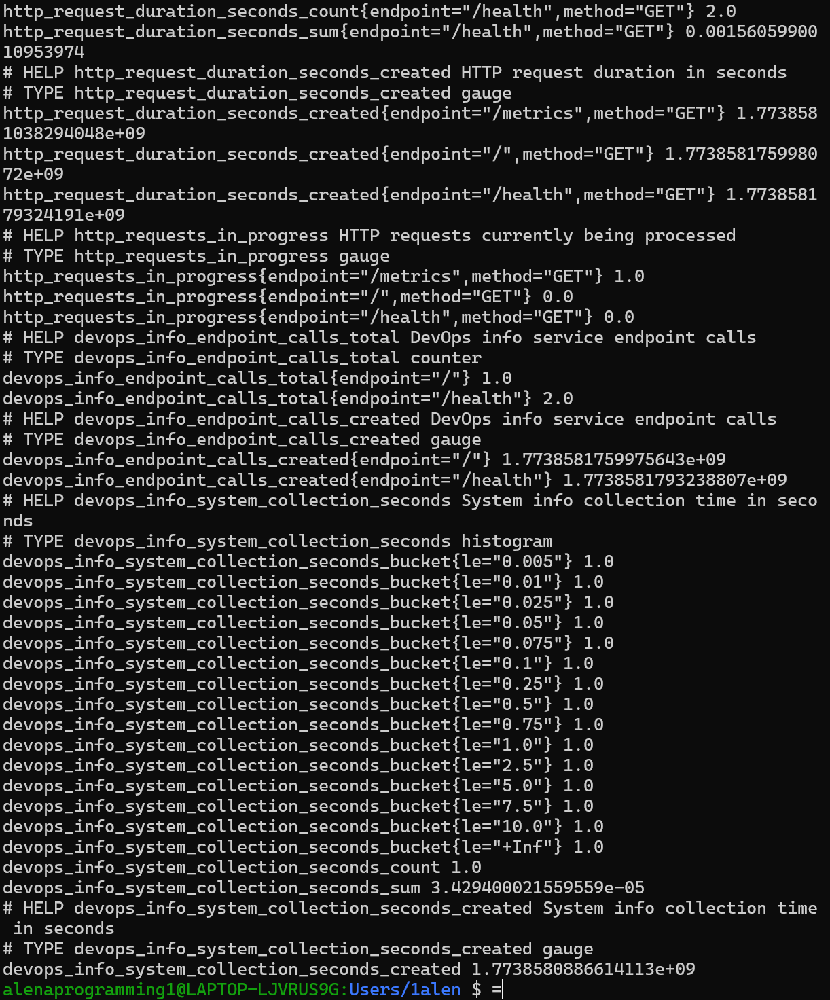
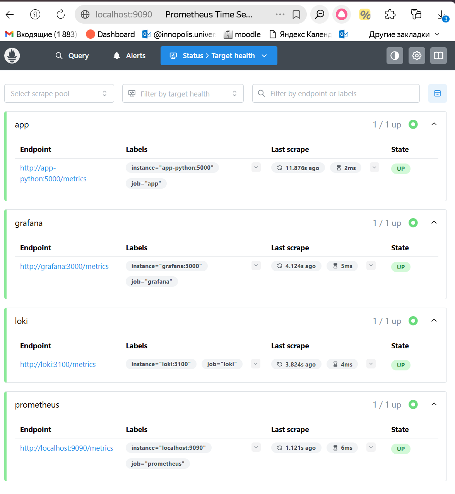
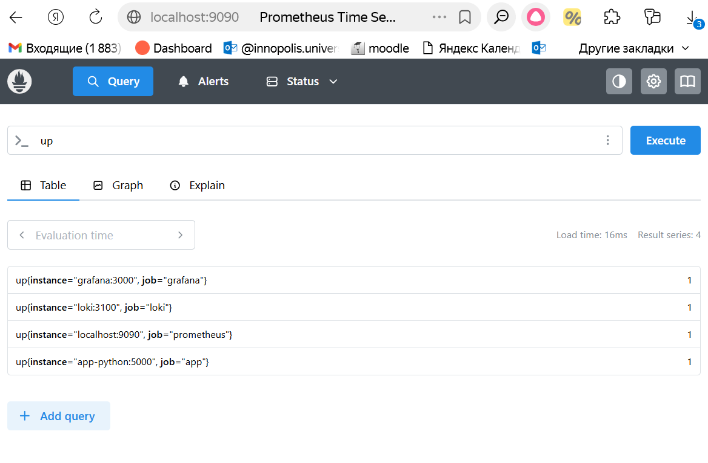
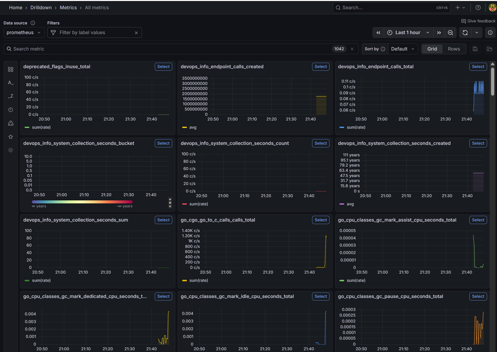
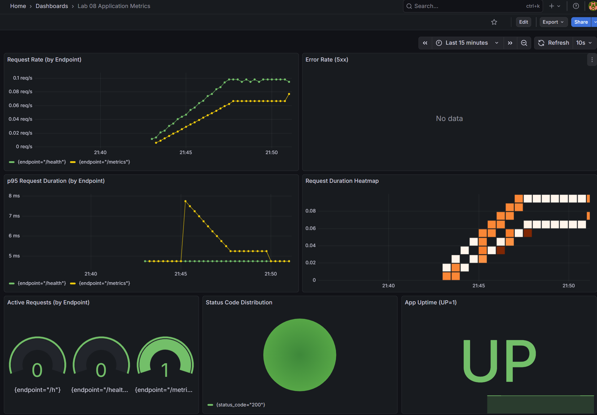
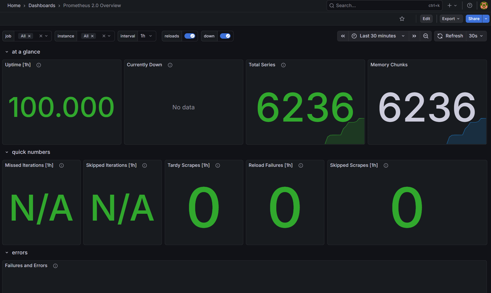
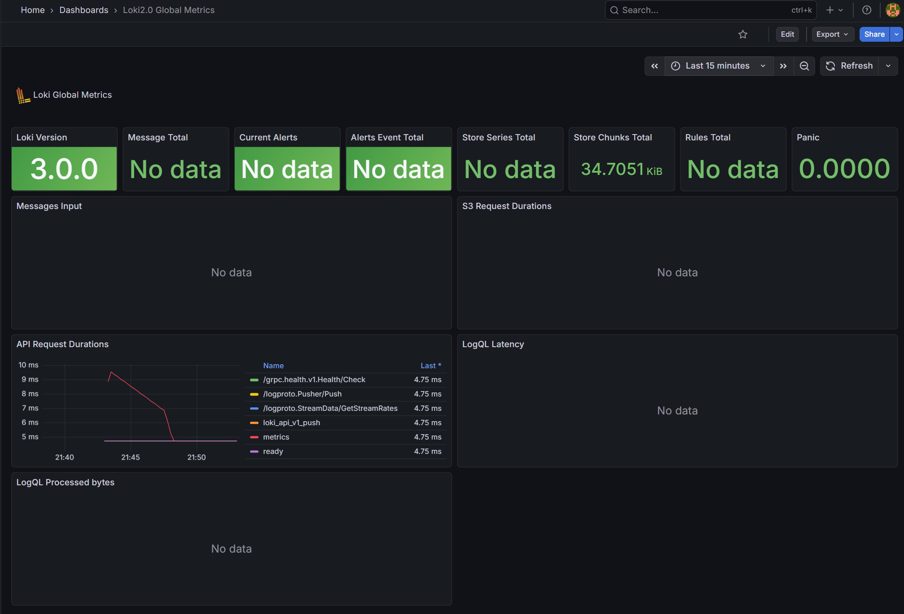
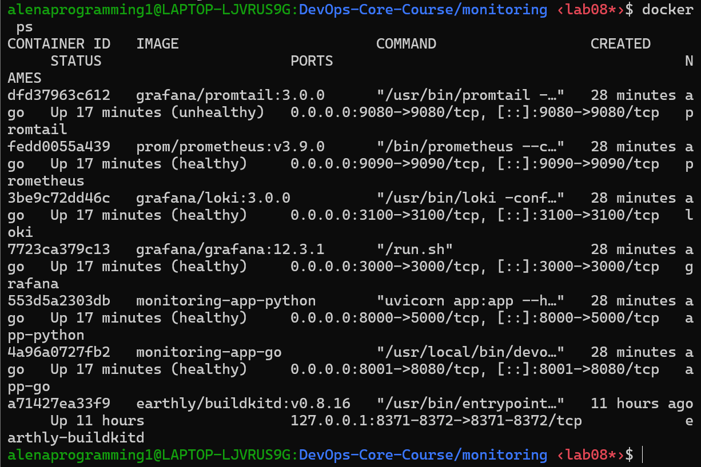
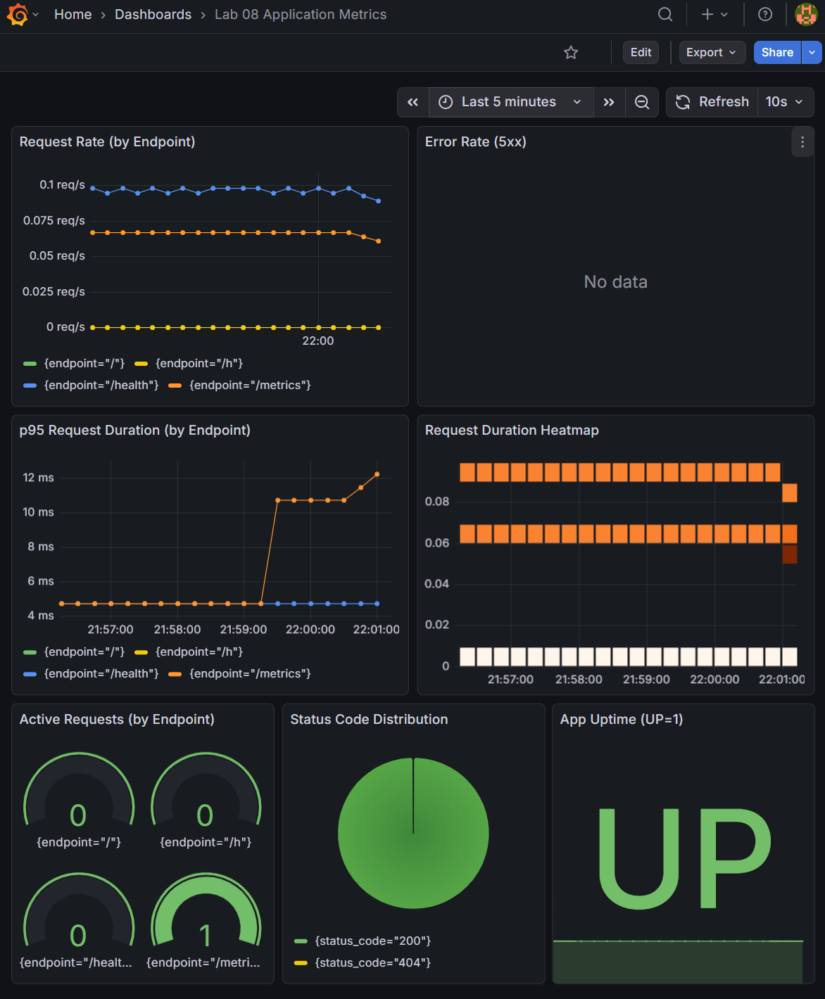

# LAB08 — Metrics & Monitoring with Prometheus

## Architecture

```
                +------------------+
                |     Grafana      |
                |   :3000 (UI)     |
                +--------+---------+
                         |
                         | PromQL queries
                         v
                +------------------+
                |   Prometheus     |
                |  :9090 (API)     |
                +--------+---------+
                         ^
                         | scrape /metrics
                         |
                +--------+---------+
                |  app-python      |
                | :8000 -> 5000    |
                | /metrics         |
                +------------------+
```

Prometheus pulls metrics from the application, Loki, Grafana, and itself, stores them in TSDB, and Grafana visualizes them alongside logs from Lab 7.

## Application Instrumentation

### Metrics Added

- `http_requests_total{method,endpoint,status_code}` (Counter)
  - Counts all HTTP requests with RED-friendly labels.
- `http_request_duration_seconds{method,endpoint}` (Histogram)
  - Measures latency distribution per endpoint.
- `http_requests_in_progress{method,endpoint}` (Gauge)
  - Tracks concurrent requests in-flight.
- `devops_info_endpoint_calls_total{endpoint}` (Counter)
  - Business-level usage of `/` and `/health`.
- `devops_info_system_collection_seconds` (Histogram)
  - Measures system info collection time on `/`.

### Implementation Notes

- Middleware captures method/endpoint/status_code, duration, and in-flight requests.
- Endpoint label uses the FastAPI route pattern to keep cardinality low.
- `/metrics` is exposed directly from the application.
- [`/app_python/app.py`](/app_python/app.py)



## Prometheus Configuration

File: [`monitoring/prometheus/prometheus.yml`](/monitoring/prometheus/prometheus.yml)

- Scrape interval: `15s`
- Targets:
  - `prometheus` → `localhost:9090`
  - `app` → `app-python:5000/metrics`
  - `loki` → `loki:3100/metrics`
  - `grafana` → `grafana:3000/metrics`

Retention (docker-compose command flags):
- `--config.file=/etc/prometheus/prometheus.yml`
- `--storage.tsdb.retention.time=15d`
- `--storage.tsdb.retention.size=10GB`

  


## Dashboard Walkthrough

Grafana data source:
- Add Prometheus with URL `http://prometheus:9090` and save/test.  


Custom dashboard contains 6+ panels focused on the RED method:

1. **Request Rate**
   - Query: `sum(rate(http_requests_total[5m])) by (endpoint)`
   - Purpose: overall throughput per endpoint.
2. **Error Rate**
   - Query: `sum(rate(http_requests_total{status_code=~"5.."}[5m]))`
   - Purpose: 5xx error rate.
3. **p95 Latency**
   - Query: `histogram_quantile(0.95, sum by (le, endpoint) (rate(http_request_duration_seconds_bucket[5m])))`
   - Purpose: tail latency per endpoint.
4. **Latency Heatmap**
   - Query: `sum by (le, endpoint) (rate(http_request_duration_seconds_bucket[5m]))`
   - Purpose: visualize latency distribution.
5. **Active Requests**
   - Query: `sum(http_requests_in_progress) by (endpoint)`
   - Purpose: concurrency pressure.
6. **Status Code Distribution**
   - Query: `sum by (status_code) (rate(http_requests_total[5m]))`
   - Purpose: compare 2xx/4xx/5xx mix.
7. **Uptime**
   - Query: `up{job="app"}`
   - Purpose: service availability.  



Export the dashboard JSON to: [`monitoring/grafana/dashboards/lab08-app-dashboard.json`](/monitoring/grafana/dashboards/lab08-app-dashboard.json).

**Prometheus dasboard:**  


**Loki dasboard:**  


## PromQL Examples

1. Requests per second (all endpoints):
   - `sum(rate(http_requests_total[5m]))`
2. Requests per endpoint:
   - `sum by (endpoint) (rate(http_requests_total[5m]))`
3. Error rate percentage:
   - `sum(rate(http_requests_total{status_code=~"5.."}[5m])) * 100`
4. p95 latency per endpoint:
   - `histogram_quantile(0.95, sum by (le, endpoint) (rate(http_request_duration_seconds_bucket[5m])))`
5. Active requests per endpoint:
   - `sum by (endpoint) (http_requests_in_progress)`
6. System info collection duration (avg):
   - `rate(devops_info_system_collection_seconds_sum[5m]) / rate(devops_info_system_collection_seconds_count[5m])`

## Production Setup

- Health checks added for `prometheus`, `loki`, `grafana`, `promtail`, `app-python`, `app-go`.
- Resource limits:
  - Prometheus: `1 CPU`, `1G`
  - Loki: `1 CPU`, `1G`
  - Grafana: `0.5 CPU`, `512M`
  - Apps: `0.5 CPU`, `256M`
  - Promtail: `0.5 CPU`, `256M`
- Retention:
  - `15d` or `10GB` (whichever comes first).
- Persistence:
  - Volumes for Prometheus, Loki, Grafana.

## Testing Results

Run:

```bash
cd monitoring
docker compose up -d
docker compose ps
```


**Validation:**
- Prometheus targets: `http://localhost:9090/targets`
- Prometheus query: `up`
- Metrics endpoint: `http://localhost:8000/metrics`
- Grafana UI: `http://localhost:3000`

**Evidence:**
- `/metrics` endpoint returns Prometheus format output.  
  
- Prometheus targets are all **UP**.  
  
- Custom Grafana dashboard with 6+ panels.  
  
- Data persists after `docker compose down` and `up -d`.  
  
- All containers are **healthy** in `docker compose ps`.  
  

## Challenges & Solutions

- **Challenge:** Keeping label cardinality low for endpoints.
  - **Solution:** Use FastAPI route patterns for the `endpoint` label.
- **Challenge:** Ensuring correct status codes for error metrics.
  - **Solution:** Middleware records status codes for HTTP/validation exceptions.

## Metrics vs Logs (Lab 7 Comparison)

- **Metrics** answer “how often/how much/how long” (rates, errors, latency, resource usage).
- **Logs** provide per-event context and details for troubleshooting.
- Together, metrics detect issues quickly, logs explain them.
