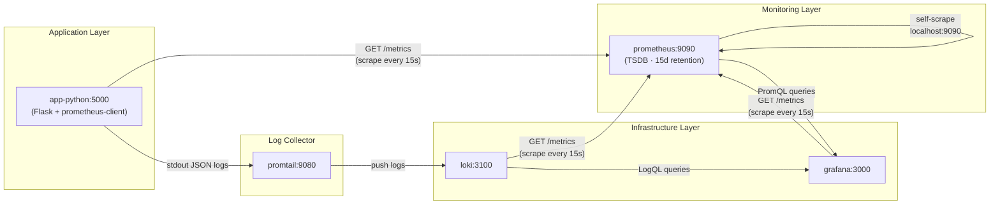
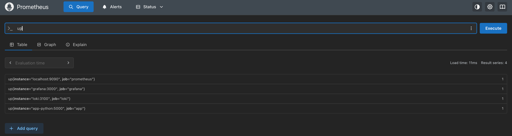
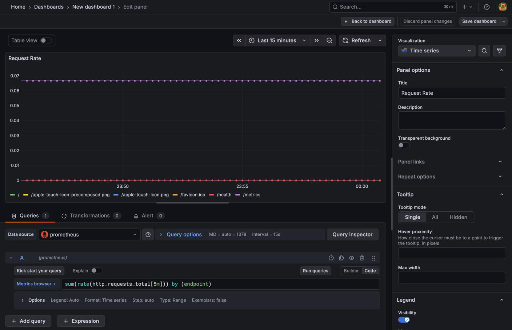
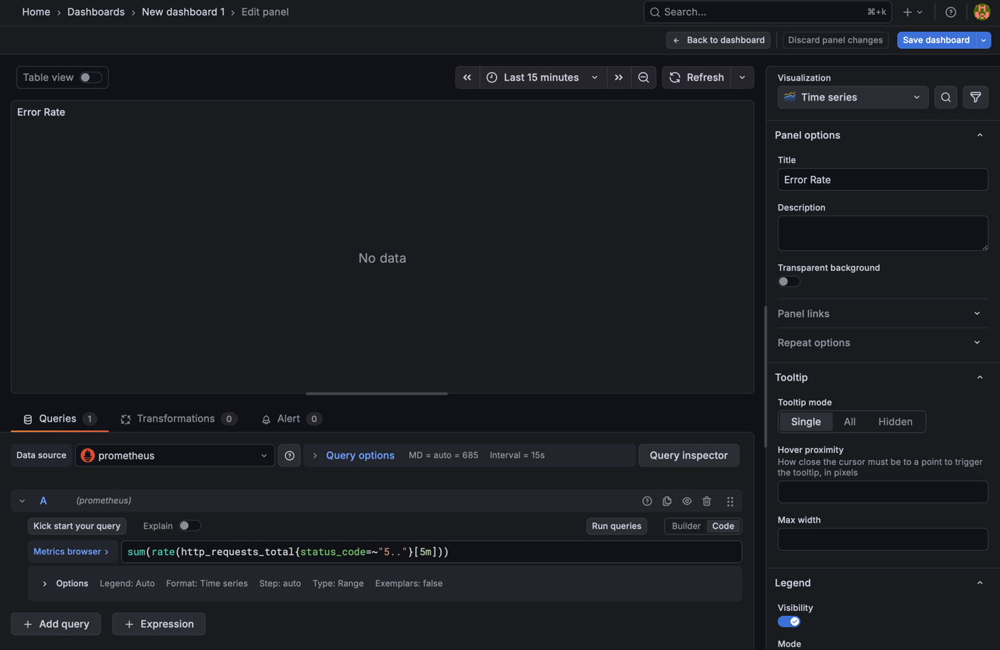
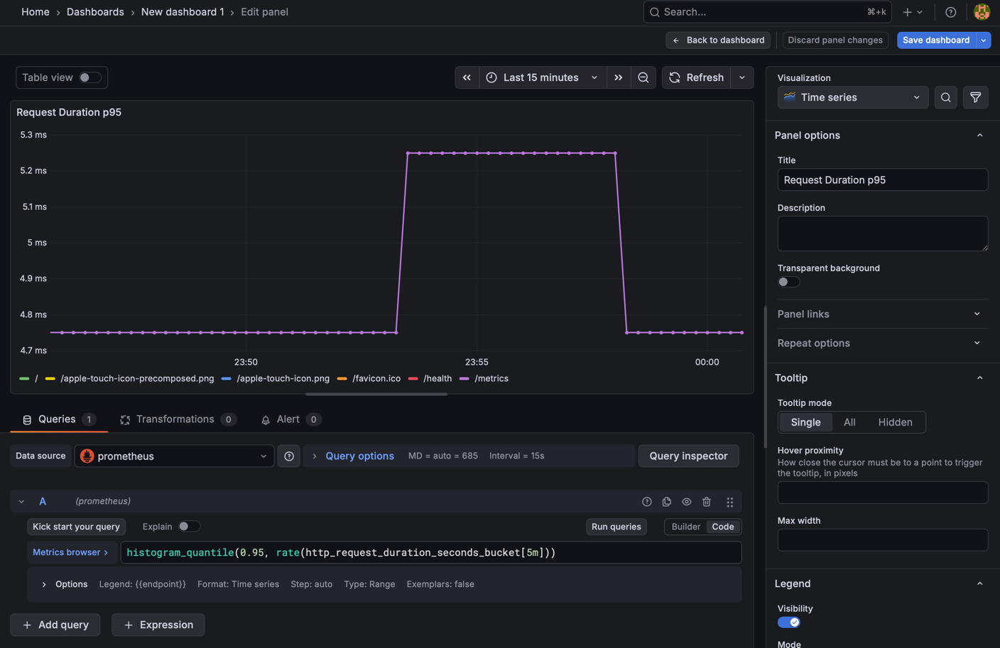
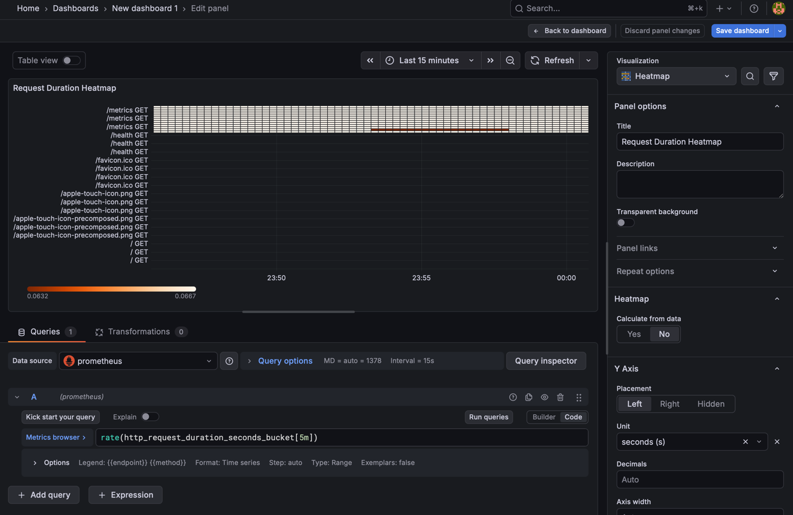
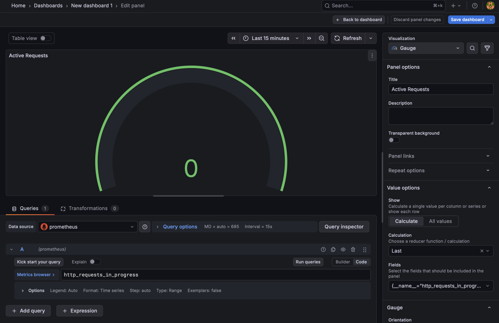
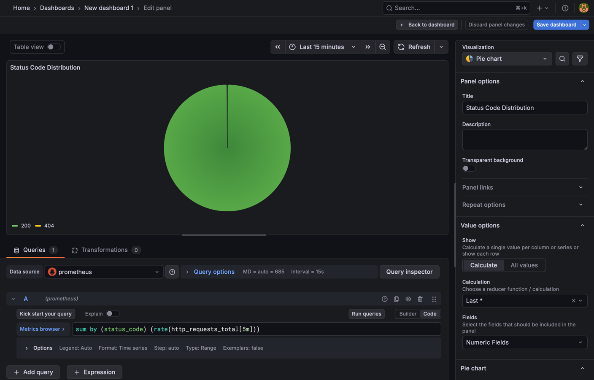
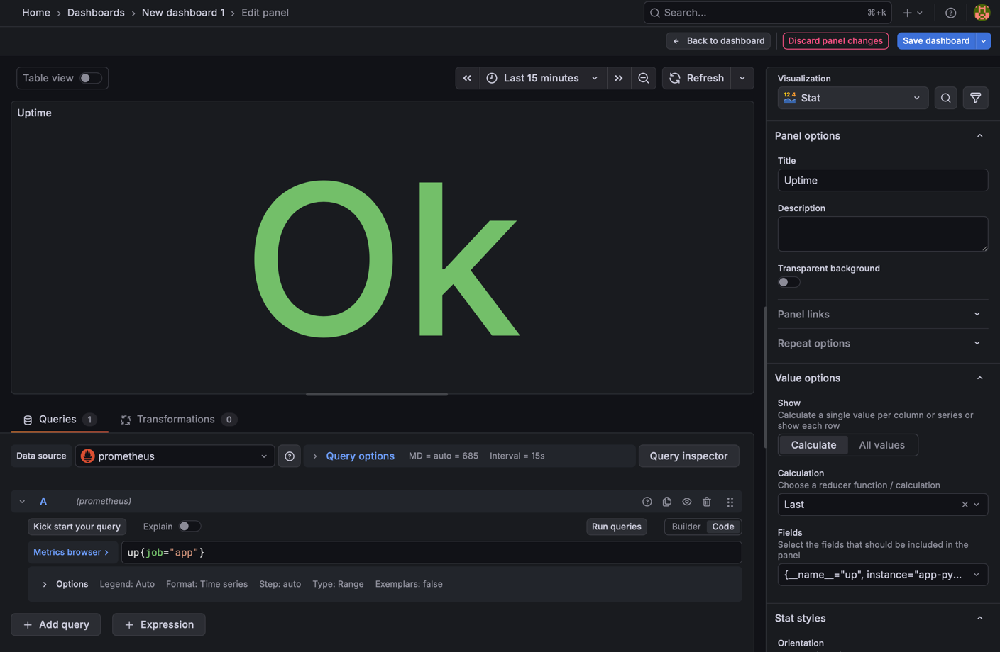
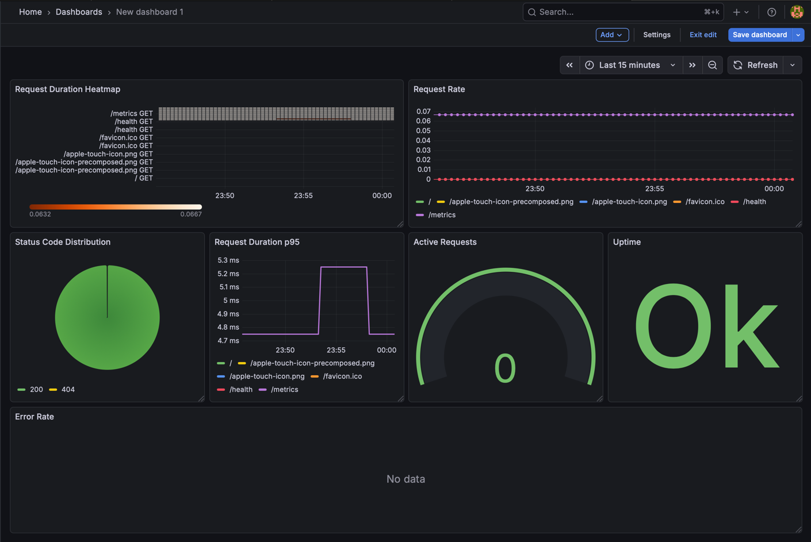

# LAB08

## 1. Architecture

The metric pipeline flows as follows:


All services run in the same Docker bridge network (`logging`), so Prometheus
resolves targets by container name (e.g., `app-python:5000`, `loki:3100`).

Logs (Promtail → Loki → Grafana) and metrics (app → Prometheus → Grafana) share
the same Grafana instance, enabling correlated observability in one UI.

## 2. Application Instrumentation

### 2.1 Added Dependency

```txt
prometheus-client==0.23.1
```
### 2.2 Metrics Defined

| Metric Name                             | Type      | Labels                        | Purpose                          |
|-----------------------------------------|-----------|-------------------------------|----------------------------------|
| `http_requests_total`                   | Counter   | method, endpoint, status_code | RED — Rate & Errors              |
| `http_request_duration_seconds`         | Histogram | method, endpoint              | RED — Duration                   |
| `http_requests_in_progress`             | Gauge     | method, endpoint              | Concurrency visibility           |
| `devops_info_endpoint_calls_total`      | Counter   | endpoint                      | Business-level call tracking     |
| `devops_info_system_collection_seconds` | Histogram | —                             | Profiling get_system_info() cost |

### 2.3 Instrumentation Points
- `before_request` — records `perf_counter()` start time and increments the in-progress Gauge.
- `after_request` — computes elapsed duration, increments the request counter with
`status_code` label, observes the histogram, and decrements the in-progress Gauge.
- `/` route — wraps `get_system_info()` in `devops_info_system_collection_seconds.time()`
to measure OS-level call overhead independently of HTTP overhead.

### 2.4 Why These Metrics
- Counter for requests — monotonically increasing; `rate()` over it gives exact req/s.
- Histogram for duration — enables percentile queries (`histogram_quantile`) and
bucket-level heatmaps; more accurate than a Summary for aggregation across replicas.
- Gauge for in-progress — instantaneous concurrency; useful for detecting request pile-ups
that logs alone cannot reveal until after the fact.
- App-specific counters/histograms — separate signal for business logic vs infrastructure,
making it easy to distinguish "the endpoint was slow" from "system info collection was slow".

## 3. Prometheus Configuration
### 3.1 prometheus.yml
```yml
global:
scrape_interval: 15s
evaluation_interval: 15s

scrape_configs:
- job_name: "prometheus"
  static_configs:
    - targets: ["localhost:9090"]

- job_name: "app"
  static_configs:
    - targets: ["app-python:5000"]
      metrics_path: "/metrics"

- job_name: "loki"
  static_configs:
    - targets: ["loki:3100"]
      metrics_path: "/metrics"

- job_name: "grafana"
  static_configs:
    - targets: ["grafana:3000"]
      metrics_path: "/metrics"
```

### 3.2 Scrape Targets
| Job        | Target          | Path     | Notes                                 |
|------------|-----------------|----------|---------------------------------------|
| prometheus | localhost:9090  | /metrics | Self-scrape                           |
| app        | app-python:5000 | /metrics | Internal port (not host-mapped 8000)  |
| loki       | loki:3100       | /metrics | Exposes internal Loki runtime metrics |
| grafana    | grafana:3000    | /metrics | Grafana server metrics                |




### 3.3 Retention Policy
Configured via CLI flags on the Prometheus container:

```yml
command:
- "--config.file=/etc/prometheus/prometheus.yml"
- "--storage.tsdb.retention.time=15d"
- "--storage.tsdb.retention.size=10GB"
```
- 15 days of time-based retention covers typical sprint/incident review windows.
- 10 GB cap prevents unbounded disk growth on a developer machine.
- When both limits are set, whichever is reached first triggers compaction/deletion.

## 4. Dashboard Walkthrough
### Panel 1 — Request Rate
- Type: Time series
- Query: `sum(rate(http_requests_total[5m])) by (endpoint)`
- Purpose: Shows how many requests per second each endpoint receives.
    

### Panel 2 — Error Rate
- Type: Time series
- Query: `sum(rate(http_requests_total{status_code=~"5.."}[5m]))`
- Purpose: Isolates 5xx errors. A non-zero baseline here is a direct
signal of application-level failures.
    

### Panel 3 — p95 Request Duration
- Type: Time series
- Query: `histogram_quantile(0.95, rate(http_request_duration_seconds_bucket[5m]))`
- Purpose: 95th-percentile latency. Tells you what the slowest 5% of
users experience — more actionable than average latency.
    

### Panel 4 — Latency Heatmap
- Type: Heatmap
- Query: `rate(http_request_duration_seconds_bucket[5m])`
- Purpose: Visualises the full latency distribution over time. Useful for
detecting bimodal distributions (fast + slow requests coexisting).
    

### Panel 5 — Active Requests (In-Progress)
- Type: Gauge / Time series
- Query: `http_requests_in_progress`
- Purpose: Instantaneous concurrency. A rising Gauge that never drops
indicates stuck or long-running requests before they even complete.
    

### Panel 6 — Status Code Distribution
- Type: Pie chart
- Query: `sum by (status_code) (rate(http_requests_total[5m]))`
- Purpose: Proportional view of 2xx vs 4xx vs 5xx traffic. Useful for
distinguishing client errors (4xx) from server errors (5xx).
    

### Panel 7 — Service Uptime
- Type: Stat
- Query: `up{job="app"}`
- Purpose: Binary health signal: 1 = Prometheus can reach the scrape
target, 0 = target is unreachable. First panel to check during an incident.
    



## 5. PromQL Examples
### 5.1 Request Rate per Endpoint (RED — Rate)
```text
sum(rate(http_requests_total[5m])) by (endpoint)
```
Calculates the per-second request rate over a 5-minute sliding window,
broken down by endpoint. `rate()` handles counter resets (restarts) automatically.

### 5.2 5xx Error Rate (RED — Errors)
```text
sum(rate(http_requests_total{status_code=~"5.."}[5m]))
```
Regex `5..` matches any HTTP 5xx status. `sum()` aggregates across all method/endpoint
combinations to give a single service-level error rate.

### 5.3 p95 Latency (RED — Duration)
```text
histogram_quantile(
0.95,
rate(http_request_duration_seconds_bucket[5m])
)
```
`histogram_quantile` computes approximate percentiles from bucket counts.
Change `0.95` to `0.50` or `0.99` for median / p99.

### 5.4 Error Percentage of All Traffic
```text
100 * sum(rate(http_requests_total{status_code=~"5.."}[5m]))
/ sum(rate(http_requests_total[5m]))
```
Expresses error rate as a percentage — useful for SLO burn-rate alerting.
Returns `NaN` when there is no traffic (safe for alert rules with `or vector(0)`).

### 5.5 Average System Info Collection Duration
```text
rate(devops_info_system_collection_seconds_sum[5m])
/ rate(devops_info_system_collection_seconds_count[5m])
```
Derives mean duration of `get_system_info(`) calls from the histogram's
`_sum` and `_count` series. A rising value here indicates OS-level slowness
(e.g., `/proc` reads under load).

### 5.6 All Scrape Targets Status
```text
up
```
Returns `1` for every healthy target and `0` for any target Prometheus
cannot reach. Filter with `up == 0` to alert on missing targets.

## 6. Production Setup
### 6.1 Health Checks
All services define Docker health checks so `depends_on: condition: service_healthy`
works correctly and restarts propagate in the right order.

| Service    | Health Endpoint | Interval | Retries |
|------------|-----------------|----------|---------|
| loki       | GET /ready      | 10s      | 5       |
| grafana    | GET /api/health | 15s      | 10      |
| prometheus | GET /-/healthy  | 10s      | 5       |
| app-python | GET /health     | 15s      | 5       |

### 6.2 Resource Limits
| Service    | CPU Limit | Memory Limit | CPU Reserve | Memory Reserve |
|------------|-----------|--------------|-------------|----------------|
| prometheus | 1.0       | 1 G          | 0.25        | 256 M          |
| loki       | 1.0       | 1 G          | 0.25        | 256 M          |
| grafana    | 0.5       | 512 M        | 0.25        | 256 M          |
| app-python | 0.5       | 256 M        | 0.10        | 128 M          |
| promtail   | 0.5       | 512 M        | 0.10        | 128 M          |

### 6.3 Persistent Volumes
```yml
volumes:
    prometheus-data:    # TSDB blocks — survives container restart
    loki-data:          # Loki chunks and index
    grafana-data:       # Dashboards, datasources, user config
    promtail-positions: # Tail position — prevents log re-ingestion on restart
```

### 6.4 Startup Order
```text
loki (healthy) → promtail
loki (healthy) + prometheus (healthy) → grafana
loki (healthy) + prometheus (healthy) → app-python
```

## 7. Testing Results
### 7.1 /metrics Endpoint Output

### 7.2 Prometheus Targets Page

### 7.3 PromQL Query — up

### 7.4 Grafana Dashboard — All Panels

### 7.5 docker compose ps — All Services Healthy


## 8. Metrics vs Logs — When to Use Each
Both systems run side-by-side in this stack. They answer fundamentally different questions:

| Dimension         | Logs (Lab 7 — Loki)              | Metrics (Lab 8 — Prometheus)                     |
|-------------------|----------------------------------|--------------------------------------------------|
| Question answered | What happened?                   | How much / how often?                            |
| Granularity       | Per-event (each request logged)  | Aggregated over time windows                     |
| Cardinality       | High — free-form text, any field | Low — label sets must be bounded                 |
| Storage cost      | High — full payloads stored      | Low — only numeric time-series                   |
| Best for          | Debugging a specific 500 error   | Detecting that error rate rose                   |
| Example query     | {app="devops-python"} \|= "500"  | rate(http_requests_total{status_code="500"}[5m]) |
| Alerting          | Possible but expensive           | Native — AlertManager integrates directly        |
| Latency insight   | Can log duration_ms per request  | Histogram buckets → percentiles                  |

## 9. Challenges & Solutions
### 9.1 Prometheus scraping app on wrong port
- Problem: Initially configured `app-python:8000` in `prometheus.yml`. Prometheus reported the target as DOWN.
- Cause: Port `8000` is the host binding. Inside the Docker bridge network
`logging`, the container listens on its own port `5000`.
- Fix: Changed target to `app-python:5000`.

### 9.2 Grafana not connecting to Prometheus
- Problem: After adding Prometheus data source with URL `http://localhost:9090`,
the "Save & Test" step returned a connection error.
- Cause: `localhost` inside the Grafana container resolves to itself, not
to the Prometheus container.
- Fix: Use the Docker service name: `http://prometheus:9090`.