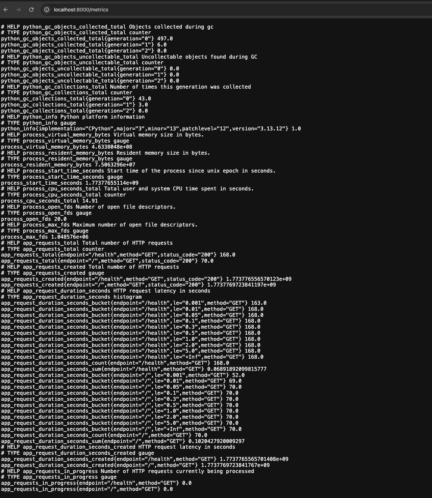
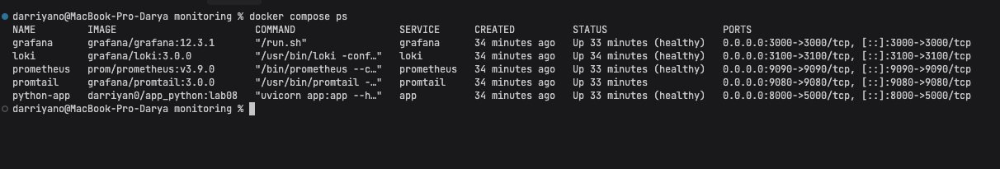
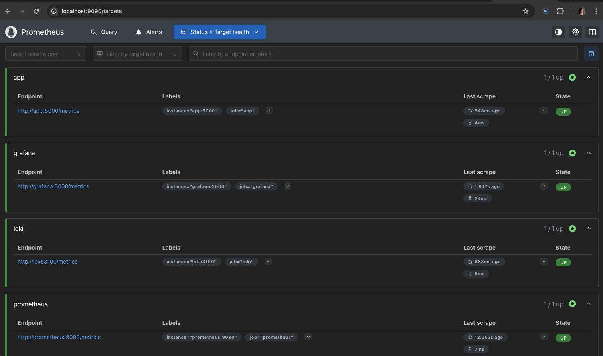
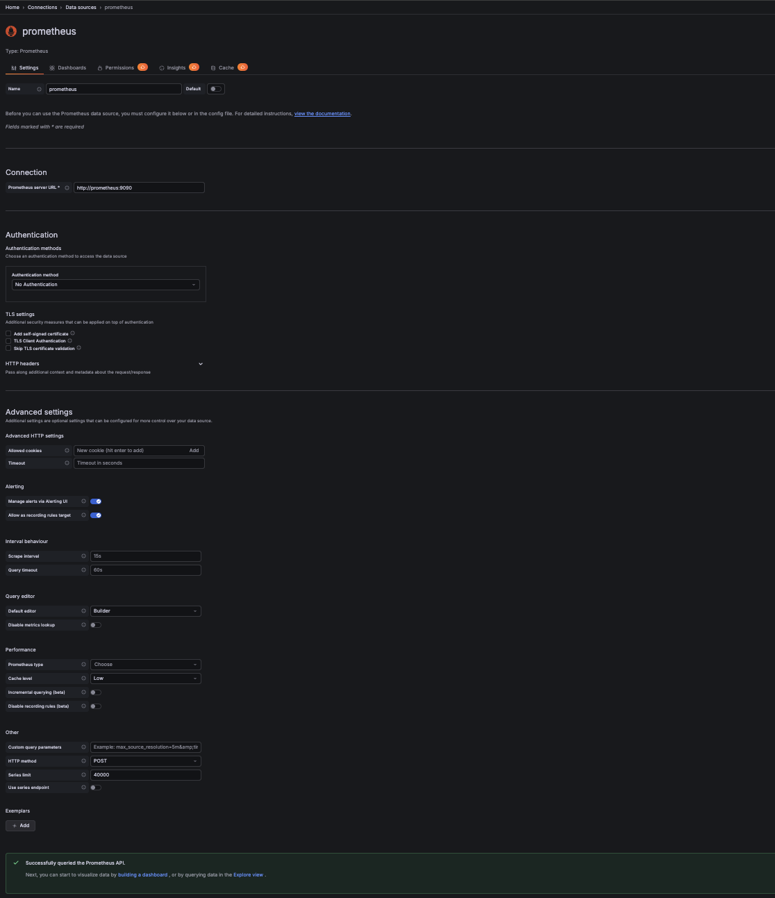
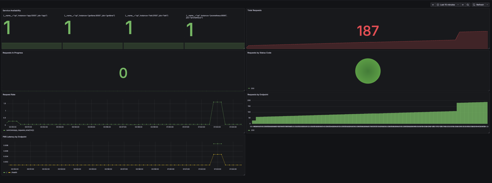
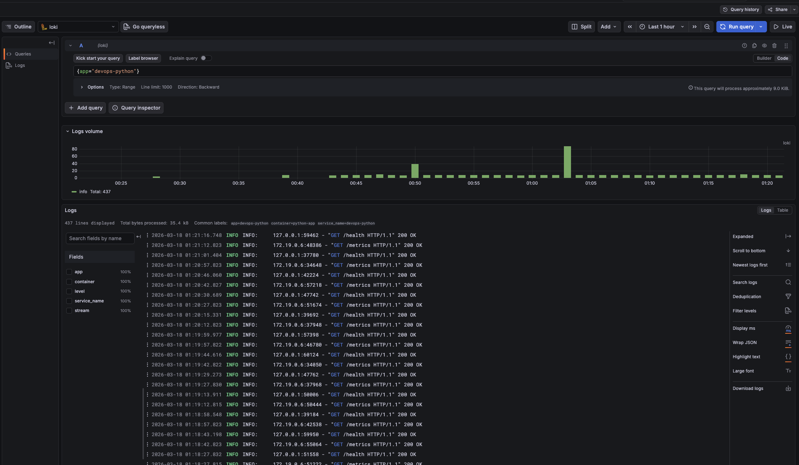

# LAB08 --- Metrics Monitoring with Prometheus & Grafana

## 1. Overview

This lab extends the monitoring stack from the previous lab by adding **Prometheus** for metrics collection and integrating it with **Grafana** for visualization.

The goal of this lab was to:

- instrument the Python FastAPI application with Prometheus metrics,
- expose a `/metrics` endpoint,
- deploy a Prometheus service in Docker Compose,
- configure scraping for the application and monitoring components,
- connect Prometheus to Grafana,
- build a monitoring dashboard with application-level metrics.

---

## 2. Project Structure

```text
DevOps-Core-Course-lab08/
├── app_python/
│   ├── app.py
│   ├── requirements.txt
│   └── Dockerfile
└── monitoring/
    ├── docker-compose.yml
    ├── loki/
    │   └── config.yml
    ├── promtail/
    │   └── config.yml
    ├── prometheus/
    │   └── prometheus.yml
    └── docs/
        └── lab08.md
```

---

## 3. Application Instrumentation

The existing FastAPI application was extended with Prometheus metrics using the `prometheus-client` package.

### Added dependency

`app_python/requirements.txt`

```txt
fastapi==0.116.1
uvicorn[standard]==0.35.0
prometheus-client==0.23.1
```

### Implemented metrics

The application exposes the following custom metrics:

- `app_requests_total` — total number of HTTP requests
- `app_request_duration_seconds` — request latency histogram
- `app_requests_in_progress` — number of currently processed requests

The following labels were used:

- `method`
- `endpoint`
- `status_code`

### Exposed endpoint

A new endpoint was added:

```text
/metrics
```

This endpoint returns metrics in Prometheus format.

### Screenshot proof



Suggested source:
- terminal command: `curl http://localhost:8000/metrics`
- or browser: `http://localhost:8000/metrics`

---

## 4. Docker Compose Monitoring Stack

The monitoring stack consists of:

- **Loki** — log storage
- **Promtail** — log collection
- **Grafana** — dashboards and log exploration
- **Prometheus** — metrics collection
- **FastAPI application** — monitored service

The application container is built locally from source code using Docker Compose.

### Main exposed ports

- `3000` — Grafana
- `3100` — Loki
- `9080` — Promtail
- `9090` — Prometheus
- `8000` — FastAPI application

### Screenshot proof



Suggested source:

```bash
docker compose ps
```

---

## 5. Prometheus Configuration

A dedicated Prometheus configuration file was created:

```text
monitoring/prometheus/prometheus.yml
```

Prometheus scrapes metrics from the following jobs:

- `prometheus`
- `app`
- `loki`
- `grafana`

### Scrape targets

- `prometheus:9090`
- `app:5000`
- `loki:3100`
- `grafana:3000`

### Screenshot proof



Suggested source:
- browser: `http://localhost:9090/targets`

---

## 6. Health Checks and Runtime Reliability

To improve stack stability, health checks were configured for the main services.

Configured health checks:

- `loki`
- `grafana`
- `app`
- `prometheus`

For the Python app, a Python-based health check was used instead of `wget`, because the slim Python image may not include additional HTTP utilities.

Persistent volumes were configured for:

- Loki
- Grafana
- Prometheus

Prometheus retention was configured with:

```text
--storage.tsdb.retention.time=7d
```

---

## 7. Grafana Data Source Configuration

Prometheus was added as a data source in Grafana.

### Prometheus data source URL

```text
http://prometheus:9090
```

After configuration, Grafana successfully connected to Prometheus.

### Screenshot proof



Suggested source:
- Grafana → Connections → Data sources → Prometheus

---

## 8. Dashboard Design

A Grafana dashboard was created to visualize the application metrics.

### Implemented panels

#### 1. Total Requests
**Type:** Stat

```promql
sum(app_requests_total)
```

#### 2. Requests by Endpoint
**Type:** Bar chart

```promql
sum by (endpoint) (app_requests_total)
```

#### 3. Requests by Status Code
**Type:** Pie chart / Bar chart

```promql
sum by (status_code) (app_requests_total)
```

#### 4. Request Rate
**Type:** Time series

```promql
sum(rate(app_requests_total[1m]))
```

#### 5. P95 Latency by Endpoint
**Type:** Time series

```promql
histogram_quantile(0.95, sum by (le, endpoint) (rate(app_request_duration_seconds_bucket[1m])))
```

#### 6. Requests In Progress
**Type:** Stat

```promql
sum(app_requests_in_progress)
```

#### 7. Service Availability
**Type:** Stat / Bar chart

```promql
up
```

### Screenshot proof



Suggested source:
- Grafana dashboard page after generating traffic

---

## 9. Traffic Generation for Metrics

To populate the dashboard with meaningful data, HTTP traffic was generated manually using `curl`.

Example commands used:

```bash
for i in {1..50}; do curl -s http://localhost:8000/ > /dev/null; done
for i in {1..20}; do curl -s http://localhost:8000/health > /dev/null; done
for i in {1..10}; do curl -s http://localhost:8000/metrics > /dev/null; done
```

This generated:

- successful requests to `/`
- successful requests to `/health`
- additional metric scrapes on `/metrics`

As a result, the dashboard displayed:

- request totals,
- endpoint distribution,
- request rate,
- latency spikes,
- service health state.

---

## 10. Log Verification with Loki

Since Loki and Promtail were already part of the stack, logs from the application continued to be collected and explored in Grafana.

Example Loki queries:

### All application logs

```logql
{app="devops-python"}
```

### Health endpoint logs

```logql
{app="devops-python"} |= "/health"
```

### Generic GET requests

```logql
{app="devops-python"} |= "GET"
```

### Screenshot proof



Suggested source:
- Grafana → Explore → data source: Loki

---

## 11. Validation Results

The monitoring setup was validated through the following checks:

### Application checks

```bash
curl http://localhost:8000/health
curl http://localhost:8000/metrics
```

Observed result:
- `/health` returned a healthy status
- `/metrics` returned Prometheus-formatted metrics
- custom `app_*` metrics were present

### Prometheus checks

Prometheus target status page confirmed that all configured jobs were `UP`:

- `app`
- `grafana`
- `loki`
- `prometheus`

### Grafana checks

Grafana successfully:
- connected to Prometheus,
- displayed dashboard panels,
- displayed Loki logs.

---

## 12. Production Readiness Notes

The stack includes several production-oriented improvements:

- service health checks,
- persistent volumes,
- explicit retention policy for Prometheus,
- network separation via Docker bridge network,
- metrics scraping for both the application and monitoring components.

Possible future improvements:

- add alerting rules in Prometheus,
- add Grafana dashboard provisioning,
- provision data sources automatically,
- move secrets from plain environment variables to Docker secrets or `.env` files.

---

## 13. Conclusion

In this lab, a complete metrics monitoring pipeline was implemented for the FastAPI application.

The final result includes:

- instrumented application metrics,
- `/metrics` endpoint,
- Prometheus-based scraping,
- Grafana visualization,
- working dashboard with multiple panels,
- integrated logs through Loki.

This setup provides both **metrics monitoring** and **log monitoring** for the application in a single local observability stack.
