# Lab 16 — Kubernetes Monitoring & Init Containers

## Overview

This laboratory focused on implementing observability and initialization workflows in Kubernetes. The kube-prometheus-stack was deployed to provide monitoring, visualization, and alerting capabilities for the cluster. Grafana dashboards and Prometheus metrics were used to analyze resource usage, network activity, and cluster health.

Additionally, init containers were implemented to demonstrate common initialization patterns such as downloading external files before application startup and waiting for a dependent service to become available.

---

# Task 1 — Kube-Prometheus Stack

## Monitoring Stack Components

### Prometheus Operator

Prometheus Operator automates the management and configuration of Prometheus instances in Kubernetes. It simplifies deployment, monitoring configuration, and integration with Kubernetes resources through CRDs such as `ServiceMonitor`.

### Prometheus

Prometheus is the monitoring and metrics collection system. It periodically scrapes metrics from Kubernetes components and applications and stores them in a time-series database.

### Alertmanager

Alertmanager handles alerts generated by Prometheus. It groups, routes, silences, and manages notifications for active alerts in the cluster.

### Grafana

Grafana provides dashboards and visualization for Prometheus metrics. It allows real-time monitoring of Kubernetes resources such as nodes, pods, CPU, memory, and networking.

### kube-state-metrics

kube-state-metrics exposes Kubernetes object states as metrics. It provides information about Deployments, StatefulSets, Pods, PVCs, namespaces, and other cluster resources.

### node-exporter

node-exporter collects hardware and operating system metrics from Kubernetes nodes, including CPU, memory, filesystem, and network statistics.

---

## Installation

The monitoring stack was installed using the Helm chart `kube-prometheus-stack`.

### Helm Repository

```bash
helm repo add prometheus-community https://prometheus-community.github.io/helm-charts
helm repo update
```

### Installation

```bash
helm install monitoring prometheus-community/kube-prometheus-stack \
  --namespace monitoring \
  --create-namespace
```

### Verification

```bash
kubectl get pods -n monitoring
kubectl get svc -n monitoring
```

All monitoring components started successfully in the `monitoring` namespace.

---

# Task 2 — Grafana Dashboard Exploration

Grafana dashboards were used to analyze cluster and application metrics.

## 1. Pod Resource Usage

The StatefulSet application showed the following resource usage:

* CPU Utilization: 0.267
* CPU Requests Commitment: 23.8%
* CPU Limits Commitment: 2.50%
* Memory Utilization: 29.2%
* Memory Requests Commitment: 3.06%
* Memory Limits Commitment: 2.44%

These metrics demonstrated that the application consumed relatively low cluster resources and operated within configured limits.

---

## 2. Namespace CPU Analysis

The pod consuming the highest CPU resources in the `default` namespace was:

* `vault-0`

This was expected because Vault continuously runs background security and storage operations.

---

## 3. Node Metrics

The node metrics dashboard showed:

* Memory Usage: 30.2%
* CPU Cores: visible in Grafana dashboard screenshots

This confirmed that the Kubernetes node had moderate memory usage and sufficient available CPU capacity.

---

## 4. Kubelet Metrics

The kubelet dashboard reported:

* Running Kubelets: 1
* Pods Managed: 31
* Containers Managed: 65

These metrics represented the current workload running inside the cluster.

---

## 5. Network Traffic

The network monitoring dashboard showed the following traffic rates for pods in the `default` namespace:

* Current Rate of Bits Received: 25.6 kb/s
* Current Rate of Bits Transmitted: 20.5 kb/s

This demonstrated active communication between services and cluster components.

---

## 6. Alerts

The Alertmanager dashboard showed:

* Active Alerts: 10

The alerts were generated automatically by kube-prometheus-stack default alerting rules.

---

# Task 3 — Init Containers

## Download File Init Container

A Deployment with an init container was created to download a file before the main application container started.

### Workflow

1. The init container executed first.
2. The init container downloaded an HTML file using `wget`.
3. The file was saved into a shared `emptyDir` volume.
4. The main application container mounted the same volume and accessed the downloaded file.

### Verification

The pod initialization sequence was observed using:

```bash
kubectl get pods -w
```

Logs from the init container confirmed successful file download:

```bash
kubectl logs <pod-name> -c init-download
```

The downloaded file was successfully accessible inside the main container.

---

## Wait-for-Service Pattern

A second init container example was implemented to wait for another Kubernetes service before starting the main container.

### Workflow

1. The init container continuously checked the availability of a Kubernetes service using `wget` and DNS resolution.
2. The main container started only after the target service became reachable.
3. This ensured dependency readiness before application startup.

### Verification

The waiting process was visible in pod logs:

```bash
kubectl logs <pod-name> -c wait-for-app
```

After the service became available, the init container completed successfully and the main application container entered the `Running` state.

---

# Bonus Task — ServiceMonitor & Custom Metrics

## ServiceMonitor

A `ServiceMonitor` resource was created to allow Prometheus to scrape metrics from the application automatically.

### ServiceMonitor Features

* Integrated application metrics with Prometheus
* Enabled automatic target discovery
* Used `/metrics` endpoint scraping
* Connected monitoring directly to Kubernetes services

### Verification

The target appeared successfully in the Prometheus UI under:

* Status → Targets

The metrics endpoint was shown as `UP`, confirming successful scraping by Prometheus.

---

# Conclusion

This laboratory demonstrated the implementation of production-grade Kubernetes monitoring using the kube-prometheus-stack. Prometheus, Grafana, and Alertmanager provided comprehensive observability for the cluster and applications.

Grafana dashboards were used to inspect CPU, memory, network, kubelet, and alert metrics. Init containers demonstrated important initialization patterns used in real-world Kubernetes deployments.

Finally, Prometheus integration was extended using a custom `ServiceMonitor`, enabling automatic metrics collection from the application itself.

---

# Evidence

## Monitoring Stack Installation

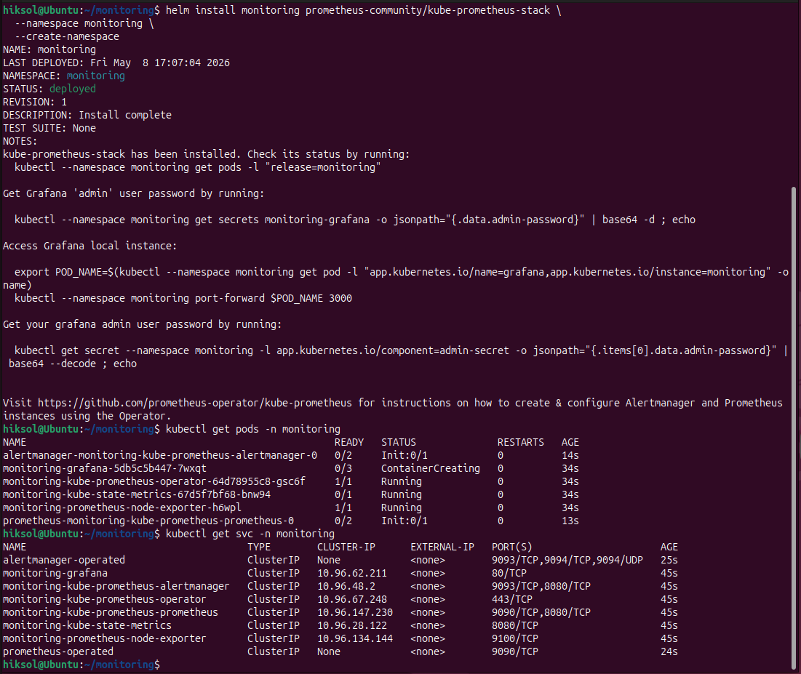

## Grafana Dashboard Screenshots

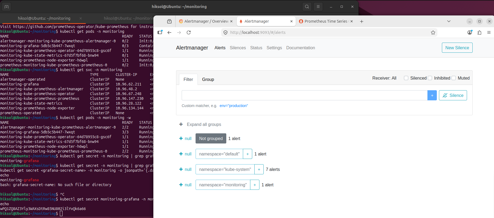
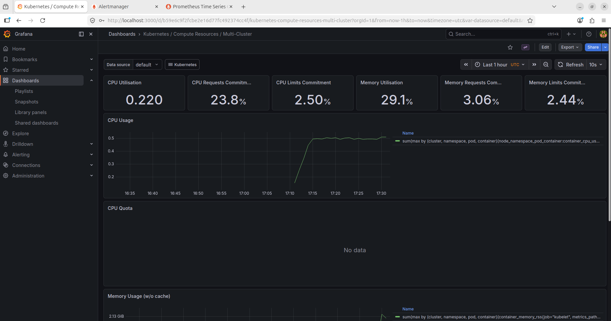
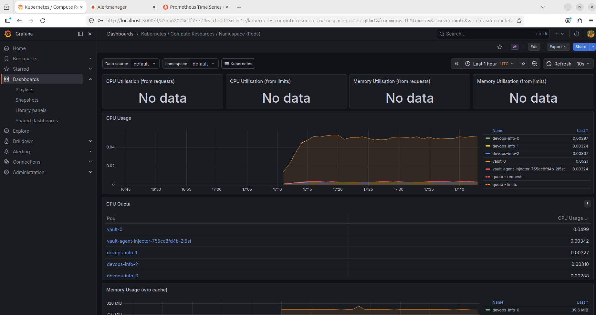
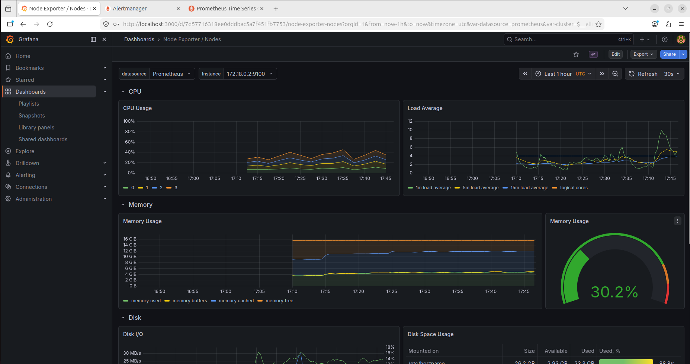
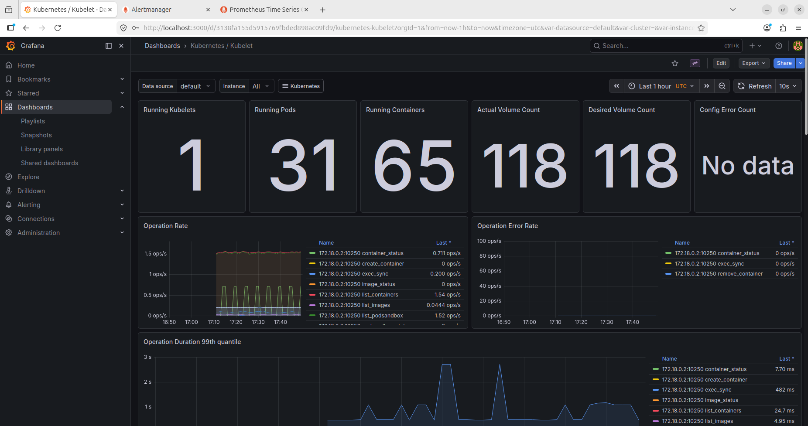
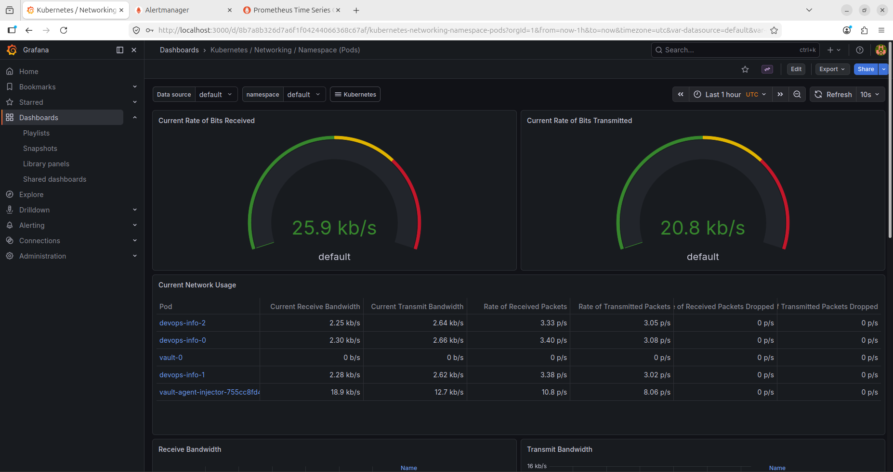
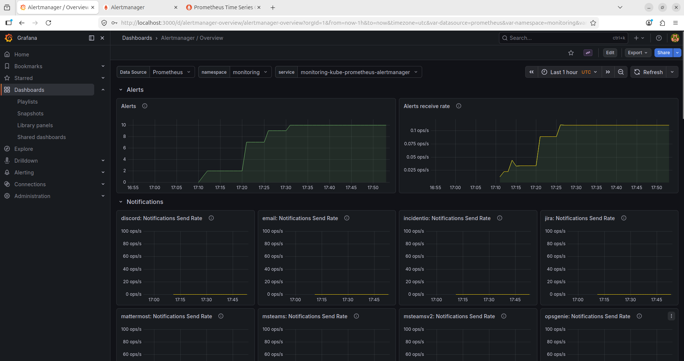

## Init Containers

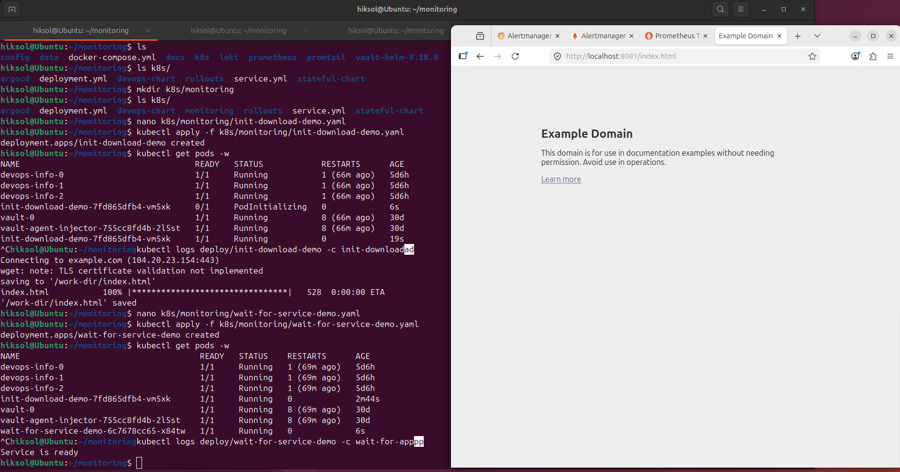

## Bonus Task — ServiceMonitor

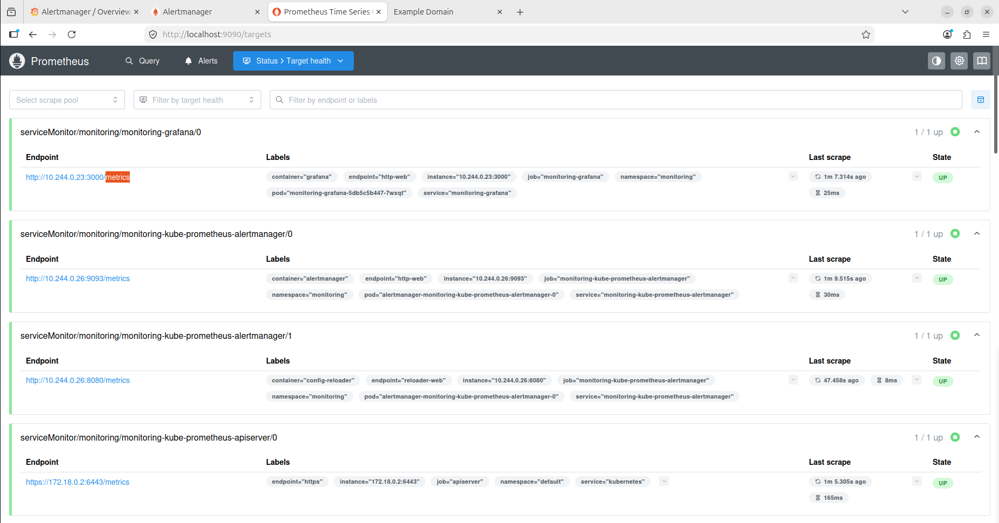
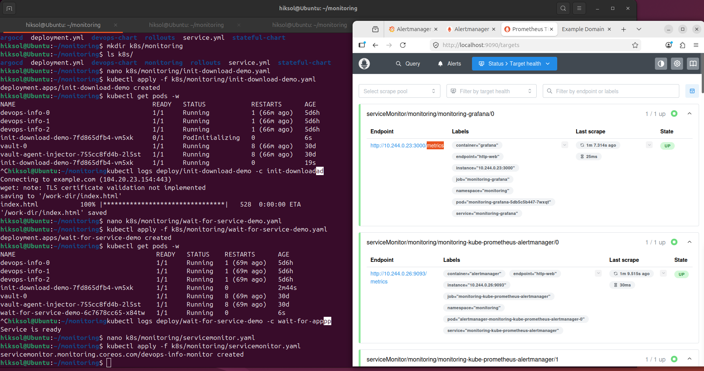