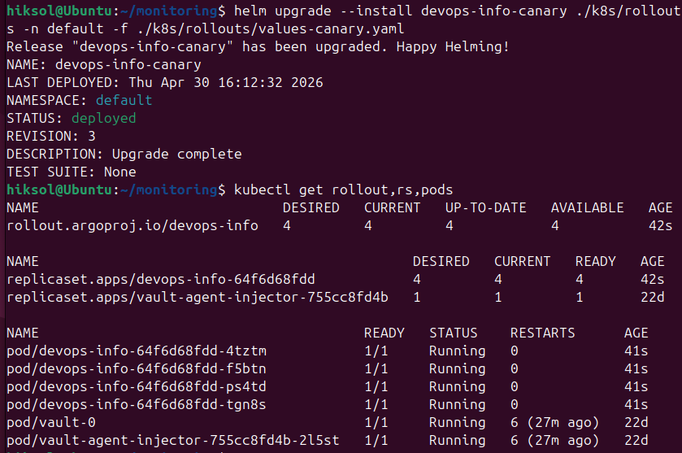
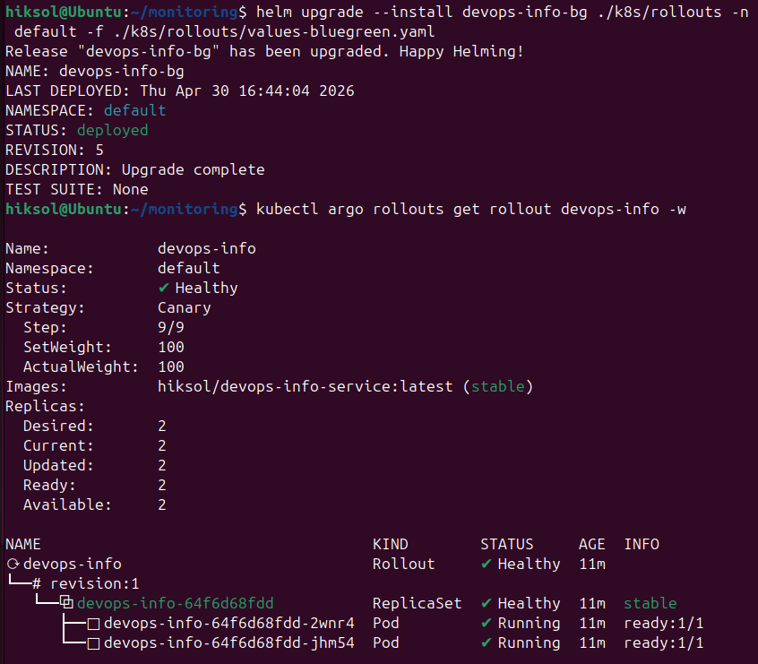

# Lab 14 — Progressive Delivery with Argo Rollouts

## 1. Objective

The purpose of this lab was to implement progressive delivery for the application using **Argo Rollouts**. The goal was to replace the standard Kubernetes Deployment with a Rollout resource and demonstrate two deployment strategies:

* **Canary deployment** with gradual traffic shifting
* **Blue-green deployment** with preview and active services

This lab focused on safer releases, controlled rollout progression, and the ability to promote or abort changes during deployment.

---

## 2. Environment

The work was completed in a Kubernetes cluster running on **kind**. The application used in previous labs was reused and adapted for Argo Rollouts. The environment also included:

* Helm
* Argo CD from Lab 13
* Argo Rollouts controller
* kubectl Rollouts plugin
* Argo Rollouts dashboard

---

## 3. Argo Rollouts Setup

Argo Rollouts was installed into a dedicated namespace and the Rollouts controller was successfully started. After installation, the kubectl plugin was available for rollout management commands such as:

* `kubectl argo rollouts get rollout`
* `kubectl argo rollouts promote`
* `kubectl argo rollouts abort`
* `kubectl argo rollouts retry`

The dashboard was also deployed and accessed through port-forwarding. This allowed visual monitoring of rollout state, canary progression, and service switching.

### Result

Argo Rollouts was successfully installed and the cluster was ready for progressive delivery testing.

---

## 4. Rollout vs Deployment

A standard Kubernetes Deployment provides basic rolling updates, but Argo Rollouts extends this model with advanced progressive delivery capabilities.

The main differences observed in this lab were:

* **Deployment** is suitable for simple rolling updates.
* **Rollout** supports canary and blue-green strategies.
* **Rollout** allows controlled traffic shifting.
* **Rollout** supports manual promotion and abort.
* **Rollout** can be integrated with analysis and automated decision-making.

### Result

The application was converted from a basic Deployment-based approach to a Rollout-based approach to support progressive delivery.

---

## 5. Canary Deployment

For the canary scenario, the application was configured as an Argo Rollout with a canary strategy. The rollout steps were defined so that traffic would move gradually through several stages:

* 20%
* pause for manual promotion
* 40%
* pause for 30 seconds
* 60%
* pause for 30 seconds
* 80%
* pause for 30 seconds
* 100%

This strategy allowed the new version to be introduced step by step while keeping the previous version available during the rollout.

### Testing the Canary Flow

The rollout was deployed and then a change was introduced to trigger a new version. During the rollout:

* the dashboard showed the active step and current percentage
* the first pause required manual promotion
* later stages progressed automatically after timed pauses
* the rollout could also be aborted if needed

### Result

The canary deployment worked as expected. Traffic was shifted gradually, and the rollout could be controlled manually or stopped during the process.

---

## 6. Rollback During Canary Deployment

A rollback test was performed during an active rollout. When the rollout was aborted:

* the new version was stopped
* traffic returned to the stable version
* the rollout state reflected the aborted deployment

This demonstrated the rollback capability of Argo Rollouts and showed that changes can be safely cancelled before full promotion.

### Result

Rollback during canary deployment was successfully verified.

---

## 7. Blue-Green Deployment

The second strategy used in this lab was blue-green deployment. In this setup, two services were used:

* **Active service** — serves production traffic
* **Preview service** — serves the new version for validation before promotion

The Rollout was configured with the blue-green strategy and manual promotion was enabled. This allowed the new version to be tested through the preview service before switching production traffic.

### Testing the Blue-Green Flow

The initial version was deployed as the active version. After updating the image or configuration:

* a new ReplicaSet was created as the green version
* the preview service exposed the new version
* the active service continued serving the stable version
* after validation, the new version was promoted to active

This demonstrated the instant switching behavior of blue-green deployments.

### Result

The blue-green deployment worked correctly. The preview version was available for testing, and the promotion step switched traffic to the new version immediately.

---

## 8. Rollback in Blue-Green Deployment

Rollback in blue-green deployment was also verified. After promotion, it was possible to return to the previous stable version quickly by switching traffic back.

Compared to canary, blue-green rollback is more immediate because it is an all-or-nothing switch rather than a gradual traffic shift.

### Result

The instant rollback behavior of blue-green deployment was confirmed.

---

## 9. Comparison of Canary and Blue-Green

Both strategies were useful, but they serve different needs.

### Canary

Canary deployment is best when:

* you want to gradually expose changes
* you want to test the new version on a small percentage of traffic
* you want a safer release process with progressive validation

Advantages:

* lower risk
* gradual rollout
* easier to observe behavior in production

Disadvantages:

* more complex rollout process
* longer deployment time
* requires monitoring and manual control

### Blue-Green

Blue-green deployment is best when:

* you want an instant switch between versions
* you want a separate preview environment
* you need fast rollback

Advantages:

* simple and fast promotion
* quick rollback
* easy to test the new version before switching

Disadvantages:

* requires more resources
* both versions may exist at the same time
* switch is all-or-nothing

### Recommendation

For safer gradual releases, canary is the better choice.
For fast production switching with a preview stage, blue-green is more convenient.

---

## 10. Conclusion

In this lab, Argo Rollouts was successfully installed and used to implement progressive delivery for the application. The application was converted from a standard Deployment to a Rollout resource, and both canary and blue-green strategies were tested.

The canary rollout demonstrated gradual traffic shifting, manual promotion, automatic progression, and rollback. The blue-green rollout demonstrated preview testing, instant promotion, and fast rollback.

This lab showed how Argo Rollouts improves deployment safety and provides more control over application releases than a standard Kubernetes Deployment.

## 7. Evidence

