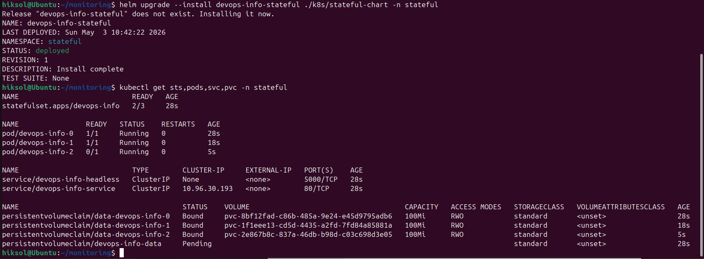
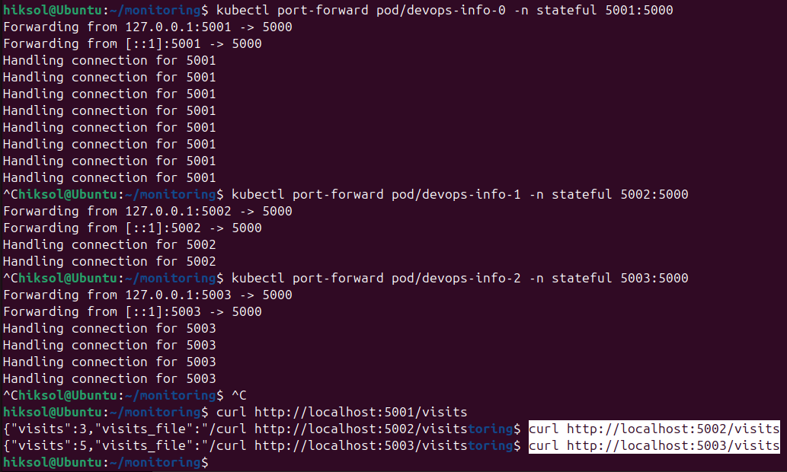
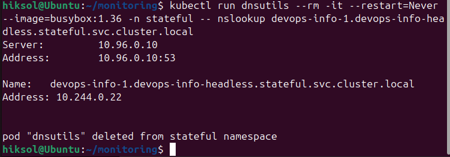
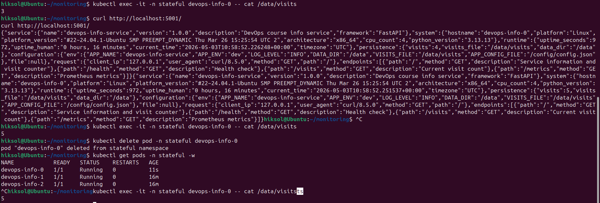
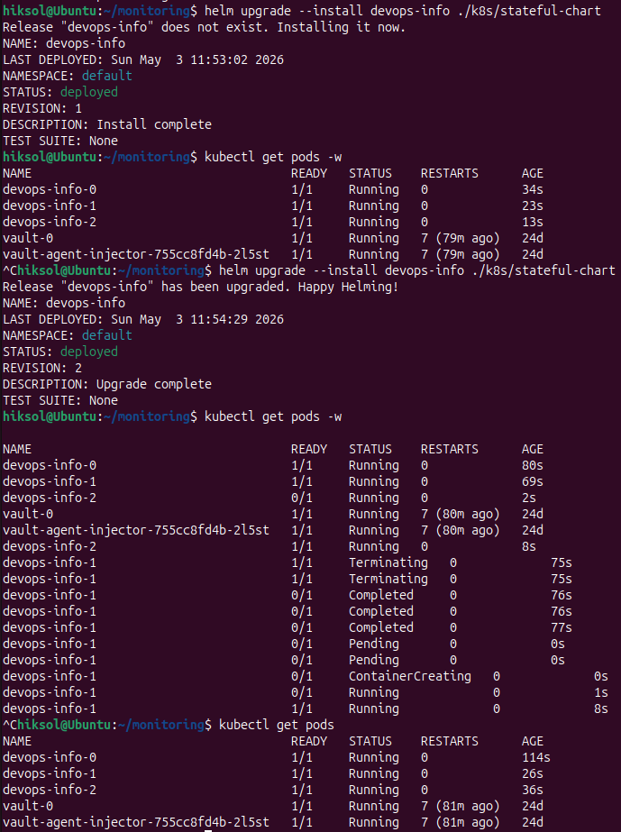
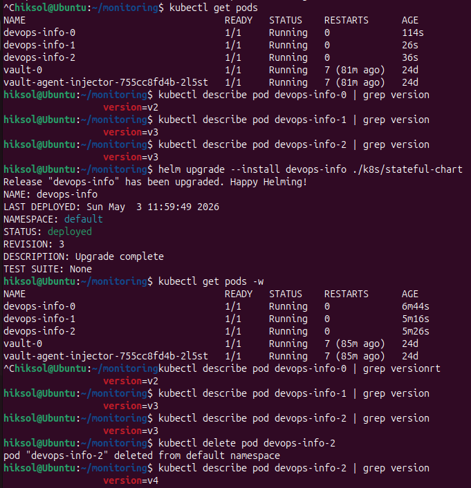

# **Lab 15 — StatefulSets & Persistent Storage**

## **1. StatefulSet Overview**

In this lab, a StatefulSet was implemented to manage a stateful application that requires stable identities and persistent storage.

Unlike Deployments (used in previous labs), StatefulSets provide:

* **Stable pod identities** (e.g., `devops-info-0`, `devops-info-1`)
* **Stable network DNS names**
* **Persistent storage per pod**
* **Ordered deployment and updates**

### **Deployment vs StatefulSet**

| Feature    | Deployment | StatefulSet                |
| ---------- | ---------- | -------------------------- |
| Pod naming | Random     | Ordered (`pod-0`, `pod-1`) |
| Storage    | Shared     | Per-pod PVC                |
| Scaling    | Parallel   | Ordered                    |
| Identity   | Ephemeral  | Stable                     |

StatefulSets are typically used for:

* Databases
* Distributed systems
* Applications with local state

---

## **2. Implementation**

### **StatefulSet Configuration**

A StatefulSet was created using a Helm chart with:

* `replicas: 3`
* `volumeClaimTemplates` for per-pod storage
* environment variables for visit counter persistence
* health checks (`/health` endpoint)

Each pod mounts its own storage volume at `/data`.

---

### **Headless Service**

A headless service was configured:

```yaml
clusterIP: None
```

This enables direct DNS resolution:

```
devops-info-0.devops-info-headless.default.svc.cluster.local
devops-info-1.devops-info-headless.default.svc.cluster.local
```

---

## **3. Resource Verification**

After deployment:

```bash
kubectl get pods
```

Result:

* `devops-info-0`
* `devops-info-1`
* `devops-info-2`

All pods were running successfully.

Each pod had its own PersistentVolumeClaim:

```bash
kubectl get pvc
```

---

## **4. Network Identity**

Each pod received a stable DNS identity via the headless service.

This ensures:

* predictable communication between pods
* stable addressing for distributed systems

---

## **5. Per-Pod Storage Isolation**

Each pod maintains its own independent storage.

This was verified by:

* accessing `/data/visits` per pod
* observing independent values

Each pod stores its visit counter separately, confirming isolation.

---

## **6. Persistence Test**

The persistence mechanism was validated:

1. A pod was deleted:

   ```bash
   kubectl delete pod devops-info-2
   ```

2. Kubernetes recreated the pod automatically.

3. The data inside `/data/visits` remained unchanged.

This confirms:

* storage is bound to PVC, not pod lifecycle
* data survives pod restarts

---

# **7. Bonus Task — Update Strategies**

## **7.1 Partitioned Rolling Update**

A rolling update strategy with partition was configured:

```yaml
updateStrategy:
  type: RollingUpdate
  rollingUpdate:
    partition: 1
```

### **Observed Behavior**

After updating the pod template (changing version label):

* `devops-info-0` remained on **version v2**
* `devops-info-1` and `devops-info-2` updated to **version v3**

Verification:

```bash
kubectl describe pod devops-info-0 | grep version
→ version=v2

kubectl describe pod devops-info-1 | grep version
→ version=v3

kubectl describe pod devops-info-2 | grep version
→ version=v3
```

### **Conclusion**

* Partition controls which pods are updated
* Pods with ordinal **≥ partition** are updated
* Lower-index pods remain unchanged

---

## **7.2 OnDelete Strategy**

The update strategy was changed to:

```yaml
updateStrategy:
  type: OnDelete
```

### **Observed Behavior**

After applying a new version:

* No pods were updated automatically
* All pods continued running old versions

Manual update was performed:

```bash
kubectl delete pod devops-info-2
```

After recreation:

```bash
kubectl describe pod devops-info-2 | grep version
→ version=v4
```

### **Conclusion**

* Pods are updated **only after manual deletion**
* Kubernetes does not trigger automatic rollout
* Full control over update timing

---

## **8. Strategy Comparison**

| Strategy      | Behavior          | Use Case                          |
| ------------- | ----------------- | --------------------------------- |
| RollingUpdate | Automatic updates | Standard apps                     |
| Partitioned   | Partial update    | Staged rollout                    |
| OnDelete      | Manual update     | Critical systems (DB, migrations) |

---

## **9. Key Takeaways**

* StatefulSets provide **stable identity and storage**
* Each pod has **its own persistent volume**
* Data persists across restarts
* Headless services enable **direct pod addressing**
* Update strategies allow **fine-grained control**

---

## **10. Evidence**

The following screenshots are provided as proof of implementation:











