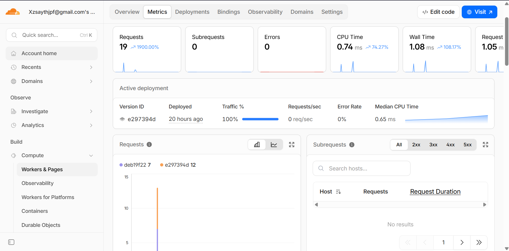
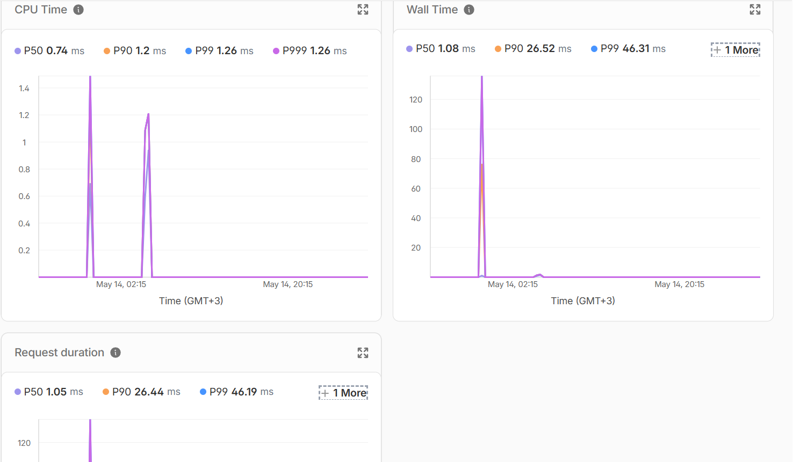
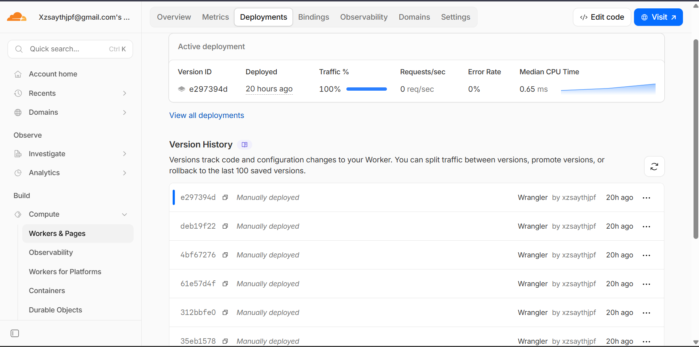

# Cloudflare Workers Deployment Report

## Deployment Summary

The Lab 17 API was implemented as a TypeScript Cloudflare Worker named `edge-api`.

Public Worker URL:

```text
https://edge-api.xrixis-devops-core.workers.dev
```

The Worker is deployed to the account `xzsaythjpf@gmail.com's Account` and uses the account-level `workers.dev` subdomain `xrixis-devops-core`.

Main routes:

| Route | Method | Purpose |
|---|---:|---|
| `/` | GET | Service metadata and route index |
| `/health` | GET | Health check with version and KV binding status |
| `/edge` | GET | Cloudflare edge metadata from `request.cf` |
| `/config` | GET | Plaintext vars and secret binding status |
| `/counter` | GET | KV-backed persisted visit counter |
| `/settings` | GET | Read a persisted KV value |
| `/settings` | POST | Store a persisted KV value |

Configuration used:

| Item | Value |
|---|---|
| Worker name | `edge-api` |
| Runtime | Cloudflare Workers |
| Language | TypeScript |
| Wrangler | `4.90.1` |
| Compatibility date | `2026-05-13` |
| Current API version | `1.0.1` |
| Public routing | `workers.dev` |
| KV binding | `SETTINGS` |
| KV namespace ID | `b2e9980fe2844a7684c62d0eedab1120` |
| Plaintext vars | `APP_NAME`, `COURSE_NAME`, `ENVIRONMENT`, `API_VERSION` |
| Secrets | `API_TOKEN`, `ADMIN_EMAIL` |
| Observability | Enabled in `wrangler.jsonc` |

Plaintext variables are stored in `wrangler.jsonc` because they are not sensitive and are part of the deployed configuration. Secret values were created with `wrangler secret put` and are not committed to Git.

## Implementation

The project was created with C3 using the Worker-only TypeScript template:

```text
npm create cloudflare@latest -- edge-api --category=hello-world --type=hello-world --lang=ts --no-deploy --no-git --accept-defaults
```

The generated starter Worker was replaced with a small JSON API in `src/index.ts`. The implementation includes structured JSON responses, no-store cache headers, a 404 response for unknown routes, a `console.log()` request record, Cloudflare request metadata, secret status checks, and Workers KV persistence.

The `wrangler.jsonc` file defines the Worker entry point, `workers_dev` routing, observability, plaintext vars, required secrets, and the KV namespace binding.

## Public API Evidence

The Worker was deployed to `workers.dev` with Wrangler. In this environment, terminal requests to the HTTPS URL failed during TLS handshake, while the same `workers.dev` hostname responded successfully over HTTP and the Cloudflare dashboard confirms the HTTPS route. The lab's regional connectivity note covers this class of Cloudflare network-path issue.

Health check after the second deployment:

```text
HTTP/1.1 200 OK
Server: cloudflare
CF-RAY: 9fb4a23ffb1b82d7-ARN

{"status":"ok","app":"edge-api","version":"1.0.1","kv":true,"timestamp":"2026-05-13T21:07:37.613Z"}
```

Edge metadata response:

```text
HTTP/1.1 200 OK
Server: cloudflare
CF-RAY: 9fb4a244bec999fc-ARN

{"colo":"ARN","country":"FI","city":"Helsinki","asn":56971,"httpProtocol":"HTTP/1.1","tlsVersion":"","timezone":"Europe/Helsinki","workerGlobal":true}
```

Configuration and secret status:

```text
HTTP/1.1 200 OK
Server: cloudflare

{"app":"edge-api","course":"devops-core","environment":"production","version":"1.0.0","secrets":{"API_TOKEN":"configured","ADMIN_EMAIL":"configured"},"note":"Plaintext vars are visible in wrangler.jsonc; secret values are supplied through Cloudflare bindings."}
```

KV counter response:

```text
HTTP/1.1 200 OK
Server: cloudflare

{"key":"visits","visits":1,"persistedIn":"Workers KV"}
```

KV persistence after redeploy:

```text
HTTP/1.1 200 OK
Server: cloudflare

{"key":"lab17-note","value":"persisted after redeploy","found":true}
```

The persisted value `lab17-note=persisted after redeploy` was written before the `1.0.1` redeploy and read successfully after the redeploy. This confirms that the value is stored in Workers KV and is not tied to a single Worker version.

## Dashboard Evidence

Metrics dashboard:



Additional latency metrics:



Deployment history:



The dashboard shows 19 requests, 0 errors, active deployment `e297394d`, and visible deployment history with earlier versions including `deb19f22`, `4bf67276`, `61e57d4f`, and `312bbfe0`.

## Logs and Operations

The Worker writes one structured log entry per request:

```ts
console.log(JSON.stringify({
  event: "request",
  path: url.pathname,
  method: request.method,
  colo: cf?.colo ?? "local",
  country: cf?.country ?? "local",
}));
```

Example `wrangler tail` entry:

```text
scriptName: edge-api
scriptVersion: e297394d-b430-4090-80c7-340e513c23c8
outcome: ok
response status: 200
log: {"event":"request","path":"/health","method":"GET","colo":"ARN","country":"FI"}
request host: edge-api.xrixis-devops-core.workers.dev
cf.colo: ARN
cf.country: FI
cf.city: Helsinki
```

Deployment history from Wrangler:

```text
Created:     2026-05-13T21:04:15.497Z
Author:      xzsaythjpf@gmail.com
Source:      Unknown (deployment)
Version(s):  (100%) deb19f22-fcac-4240-b70c-31e163344e3d

Created:     2026-05-13T21:07:13.336Z
Author:      xzsaythjpf@gmail.com
Source:      Unknown (deployment)
Version(s):  (100%) e297394d-b430-4090-80c7-340e513c23c8
```

At least two deployable versions exist. A rollback can be performed from the dashboard by selecting a previous version in the Deployments tab, or from the CLI with:

```text
npx wrangler rollback
```

No rollback was executed because the current deployment is healthy. The rollback path was verified by the deployment history and by the availability of previous version IDs.

## Global Edge Behavior

Cloudflare Workers does not require a manual "deploy to three regions" step. The Worker is published once to Cloudflare's edge platform, and Cloudflare routes incoming requests to a nearby data center. The `/edge` endpoint proves that Cloudflare enriches the request with edge metadata such as `colo`, `country`, `city`, `asn`, `httpProtocol`, and `timezone`.

In this deployment, the request was served from colo `ARN`, with country `FI` and city `Helsinki`. If the same Worker is called from another region, Cloudflare can execute it closer to that client without changing the deployment configuration.

Routing concepts:

| Concept | Meaning |
|---|---|
| `workers.dev` | Cloudflare-managed public hostname for quick Worker access |
| Routes | Rules that attach a Worker to traffic for an existing Cloudflare zone |
| Custom Domains | Domain or subdomain bindings that make the Worker the public service endpoint |

This lab uses `workers.dev`, which is the required routing mode. Custom domains are not required for the submission.

## Kubernetes vs Cloudflare Workers

| Aspect | Kubernetes | Cloudflare Workers |
|---|---|---|
| Setup complexity | Requires a cluster, nodes, manifests, networking, ingress, and runtime configuration | Requires a Cloudflare account, Wrangler, project config, and bindings |
| Deployment speed | Slower because containers must be built, pushed, pulled, scheduled, and rolled out | Fast because Worker code is uploaded directly to Cloudflare |
| Global distribution | Requires manual multi-region clusters, global load balancing, or a managed platform layer | Built into the Workers platform and handled by Cloudflare |
| Cost for small apps | Cluster overhead can be high even for small services | Usually cheaper for lightweight APIs and low traffic |
| State and persistence model | Uses volumes, databases, StatefulSets, external storage, and operators | Uses platform bindings such as KV, D1, R2, Durable Objects, and secrets |
| Control and flexibility | High control over containers, networking, sidecars, runtimes, and long-running services | More constrained runtime, no arbitrary container image, no long-running background process |
| Best use case | Complex services, container workloads, internal platforms, custom networking, long-running processes | Lightweight APIs, edge logic, request rewriting, auth checks, webhooks, globally distributed small services |

## When to Use Each

Use Kubernetes when the workload needs containers, custom system packages, multiple services, private networking, long-running workers, complex release strategies, or strong control over runtime behavior. It is also a better fit when the application already depends on a containerized architecture.

Use Cloudflare Workers when the workload is HTTP-centric, lightweight, latency-sensitive, globally distributed, and can use Cloudflare platform bindings for state and configuration. Workers is also a strong choice for request filtering, API gateways, webhooks, small JSON APIs, and edge personalization.

For this lab's API, Cloudflare Workers is the better fit. The service is small, stateless except for KV data, and benefits from public global routing without operating a cluster.

## Reflection

Workers felt easier than Kubernetes in the deployment path. There were no Docker images, manifests, pods, services, ingress rules, or node-level concerns. A single `wrangler deploy` published the service and attached it to a public hostname.

Workers felt more constrained because the app is not a Docker container. The code must fit the Workers runtime model, secrets and state must be accessed through bindings, and persistence uses platform services such as KV rather than a mounted volume or a local database.

The biggest design change is that the deployment is source-centric instead of image-centric. The application is written for Cloudflare's runtime directly, so operational concerns are expressed through `wrangler.jsonc`, bindings, deployment versions, logs, and dashboard metrics rather than Kubernetes resources.

## Verification

Local and runtime checks completed:

```text
npm test -- --run
Test Files  1 passed (1)
Tests       4 passed (4)
```

```text
npx tsc --noEmit
completed with exit code 0
```

Wrangler authentication:

```text
You are logged in with an OAuth Token, associated with the email xzsaythjpf@gmail.com.
Account ID: c06d78b24888f512d54cdf8b8273ac24
Permissions include workers:write, workers_kv:write, workers_scripts:write, and workers_tail:read.
```

Checklist status:

| Requirement | Status |
|---|---|
| Cloudflare account created | Done |
| Workers project initialized | Done |
| Wrangler authenticated | Done |
| Worker deployed to `workers.dev` | Done |
| `/health` endpoint working | Done |
| Edge metadata endpoint implemented | Done |
| Plaintext variable configured | Done |
| Two secrets configured | Done |
| KV namespace created and bound | Done |
| Persistence verified after redeploy | Done |
| Logs reviewed | Done |
| Metrics reviewed | Done |
| Deployment history viewed | Done |
| Kubernetes comparison documented | Done |
