# Cloud Provider & Infrastructure

## Cloud provider chosen and why
I chose Yandex Cloud because it is accessible from Russia, provides a free‑tier–friendly VM configuration, and has first‑class Terraform support with official documentation and local mirrors for Terraform and providers.

## Resources created
Using Terraform and the official Yandex Cloud provider, I created:
- A VPC network and subnet in availability zone ru-central1-a with CIDR 10.10.0.0/24.
- A security group attached to that network with inbound rules allowing:
  - SSH on port 22 only from my current public IP (77.79.157.131/32),
  - HTTP on port 80 from 0.0.0.0/0,
  - Application traffic on port 5000 from 0.0.0.0/0, and an egress rule allowing all outbound traffic.
- A compute instance lab-vm using platform standard-v3, with 2 vCPUs at 20% core fraction, 1 GB RAM, and a 10 GB boot disk initialized from a public Ubuntu image `fd84mnbiarffhtfrhnog`.
- A network interface on the VM with nat = true, which assigns a public (NAT) IP address and attaches the previously created security group.

## Total cost


# Terraform Implementation

## Terraform version used
Terraform CLI version: terraform v1.14.5, installed on macOS via Homebrew while connected to a VPN (so the HashiCorp release download was accessible).

## Project structure explanation
The Terraform code was organized under a dedicated terraform/ directory to keep IaC isolated from application code and to make state/config handling predictable.
Recommended structure used:
```text
terraform/
├── main.tf          # Provider + resources (VPC, subnet, SG, VM)
├── variables.tf     # Input variables (zone, CIDRs, image_id, ssh paths, etc.)
├── outputs.tf       # Public IP output
├── terraform.tfvars # Local values (gitignored)
└── .gitignore       # Ignore state, tfvars, and sensitive files
```
Terraform’s standard workflow (init → plan → apply) runs from this directory and stores local state files there by default.

## Key configuration decisions
- Public access via NAT: the VM network interface was configured with NAT so the instance receives a public IPv4 address.
- Public IP output: the NAT public IP was exposed via an output using `network_interface[0].nat_ip_address`, so the address can be retrieved with `terraform output -raw public_ip`.
- SSH key injection via metadata: the VM receives the SSH public key through `metadata.ssh-keys` in the format `<username>:<SSH_key_contents>`.
- Firewall (security group) rules: SSH (22) was restricted to the current public IP (VPN egress IP) using CIDR /32, while HTTP (80) and app port (5000) were opened as required. (This matches the “allow specific CIDRs and ports” security group model in Yandex VPC.)

## Challenges encountered
- Terraform install/download issue: installing Terraform via Homebrew failed without VPN due to geo restrictions when downloading from HashiCorp releases; using VPN allowed installation.
- Permissions in Yandex Cloud folder: initial terraform apply failed with PermissionDenied (“Operation is not permitted in the folder”), which was resolved by granting the required roles in the target folder (or switching to credentials that had those permissions).
- SSH connectivity and changing IP: SSH initially timed out because SSH ingress was restricted to a specific /32, and the VPN/public IP changed; updating the security group rule to the current VPN IP (`77.79.157.131/32`) fixed access.

## Terminal output from terraform plan and terraform apply
### Terraform plan
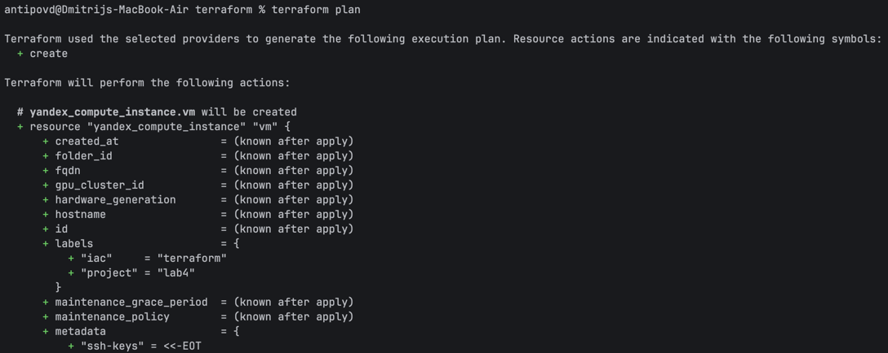
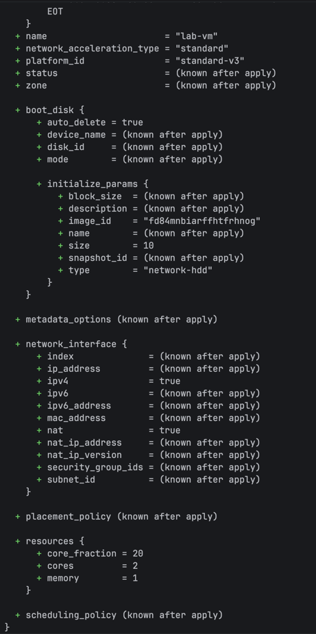
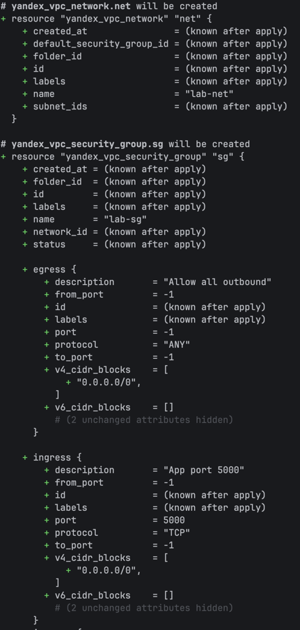
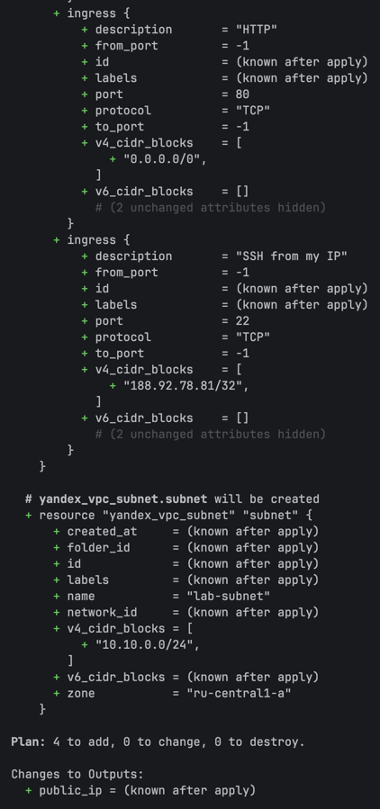

### Terraform apply
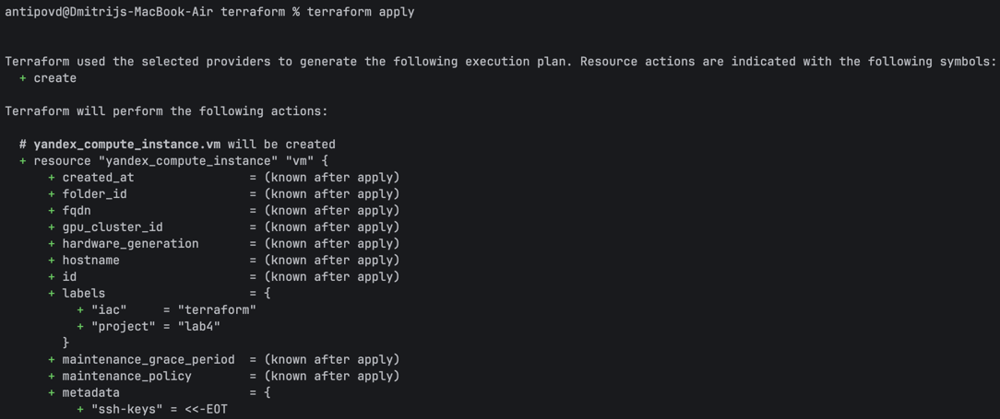
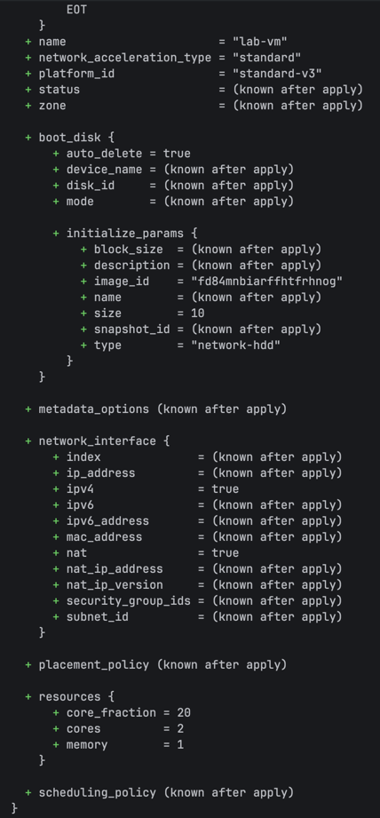
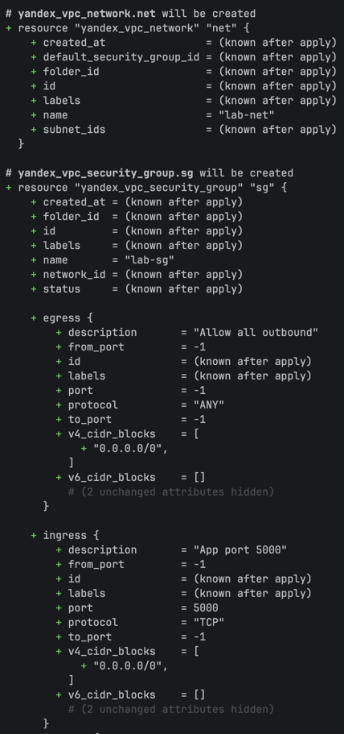
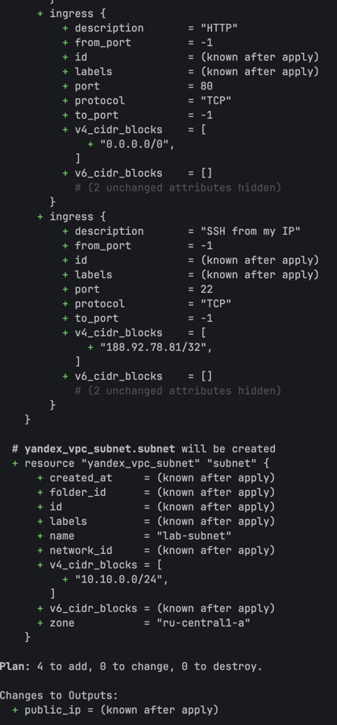
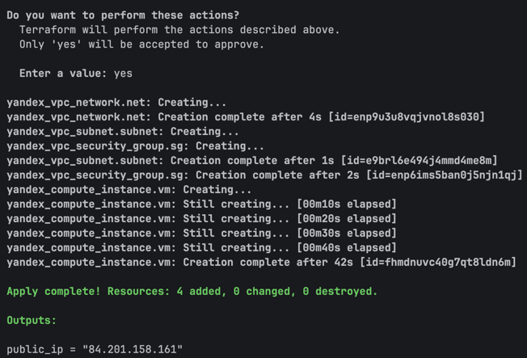

### Proof of SSH access to VM
After applying the configuration and updating the security group to allow SSH only from the current VPN IP (`77.79.157.131/32`), SSH access to the VM succeeds using the command:
```bash
ssh -i ~/.ssh/yc_lab ubuntu@84.201.158.161
```
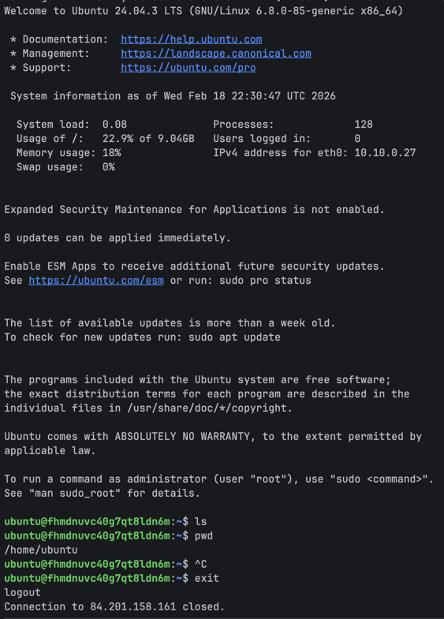

# Pulumi Implementation
## Pulumi version and language used
- Language: Python (Pulumi project created from the python template, using a virtual environment and pulumi-yandex provider package).
- Pulumi CLI version: v3.222.0

## How code differs from Terraform
Terraform (HCL): infrastructure is described declaratively using resource blocks, and inputs/outputs are typically split across `main.tf`, `variables.tf`, and `outputs.tf`.
Pulumi (Python): infrastructure is defined by creating resource objects in `__main__.py`, configuration is read from stack config (`pulumi config set ...`), and outputs are exported with `pulumi.export(...)`.

## Advantages you discovered
- Real programming language: Python made it easy to reuse variables and build values programmatically (for example, reading the SSH public key from a file and composing metadata strings).
- Stack-based configuration: Pulumi uses stacks to separate environments (e.g., dev), and each stack has its own configuration values.
- Safer secret handling: Pulumi supports marking config values as secrets using --secret, storing them encrypted in the backend/state.

## Challenges encountered
- SSH key path handling: the program initially failed because Python does not expand ~ in paths (e.g., `~/.ssh/yc_lab.pub`), which caused a FileNotFoundError until the path was set using a full `$HOME/...` path or expanded in code.
- Provider authentication not set: the Yandex provider failed until `YC_TOKEN` (or a service account key file) plus the required cloud/folder identifiers were provided.
- Security group rules API difference: unlike Terraform, VpcSecurityGroup in pulumi-yandex did not accept ingress/egress directly, so rules had to be created as separate VpcSecurityGroupRule resources.
- Zone requirement: VM creation failed until the availability zone was explicitly set (either in the resource or provider configuration).
- IP restrictions + VPN changes: SSH access depended on the current public IP; when the VPN/public IP changed, the SSH rule (`myIpCidr` /32) had to be updated to the new IP to allow port 22.

## Pulumi preview and up output

### Pulumi preview
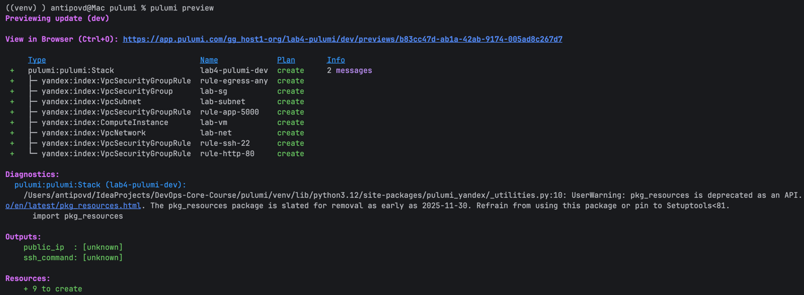

### Pulumi up
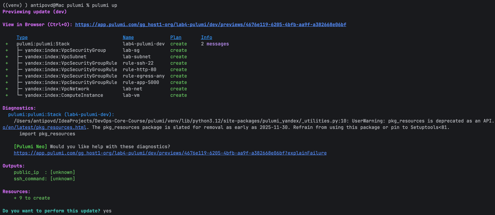
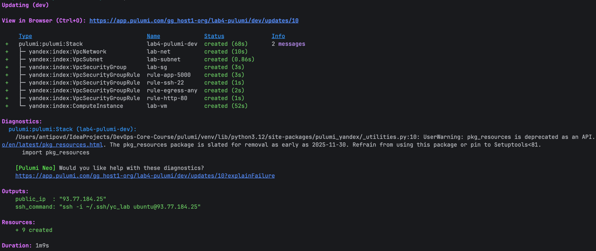

### Proof of SSH access to VM
After applying the configuration and updating the security group to allow SSH only from the current VPN IP (`77.79.157.131/32`), SSH access to the VM succeeds using the command:
```bash
ssh -i ~/.ssh/yc_lab ubuntu@93.77.184.25
```
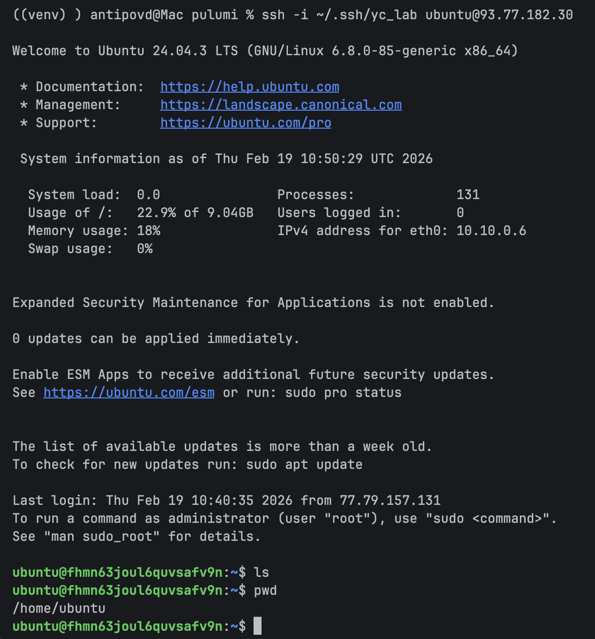

# Terraform vs Pulumi Comparison
## Ease of Learning
- Terraform was easier to learn for this lab because the workflow is very standardized (init → plan → apply → destroy) and the HCL syntax is purpose-built for infrastructure.
- Pulumi had a steeper start because I needed to set up a Python virtual environment, install provider packages, and understand how stacks/config work.

Once running, Pulumi became easier to extend because it uses normal programming constructs (variables, functions), but the initial setup cost was higher.

## Code Readability
- For simple infrastructure like “one VM + network + firewall,” Terraform felt more readable because the HCL blocks map directly to resources and are short.
- Pulumi Python was readable too, but more verbose due to object constructors and handling outputs/config.

I personally find Terraform easier to scan quickly, while Pulumi is easier to refactor as the project grows.

## Debugging
- Terraform debugging was more straightforward: errors usually point to a specific resource block and line in `.tf` files, and terraform plan helps confirm intended changes.
- Pulumi debugging involved both cloud/provider errors and Python/runtime errors (for example, path handling and missing provider config), so it required checking stack config, environment variables, and program exceptions.

Pulumi’s preview is helpful, but troubleshooting sometimes felt more “software-like” than “declarative IaC-like.”

## Documentation
- Terraform documentation and examples felt stronger overall because Terraform has a very large ecosystem and many provider examples, and the CLI behavior is well documented.
- Pulumi docs are good, especially around stacks, config, and state backends, but provider-specific examples for less common clouds can be more limited.

For Yandex Cloud specifically, I relied more on provider API docs and trial-and-error (e.g., SG rules as separate resources).

## Use Case
- I would use Terraform when I need a standard, predictable IaC workflow, straightforward resource definitions, and maximum portability across teams and CI/CD systems.
- I would use Pulumi when I need real programming language features (complex conditionals, loops, code reuse), want stack-based configuration per environment, or want secret handling integrated into the IaC workflow.

For labs and simple infra, Terraform is usually the fastest; for larger “infrastructure + application” projects, Pulumi can scale better in code structure.

# Lab 5 Preparation & Cleanup
## VM for Lab 5:
- Are you keeping your VM for Lab 5? No
- If no: What will you use for Lab 5? Will recreate cloud VM

## Cleanup Status:
The terminal output is not saved, but cloud console screenshot is accessible
