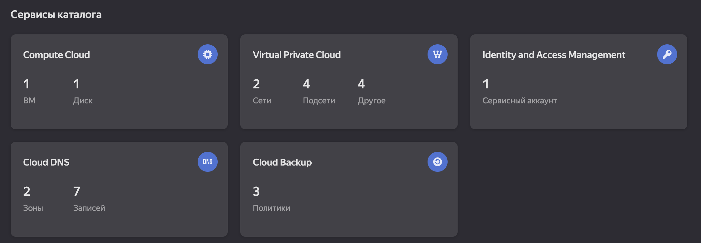
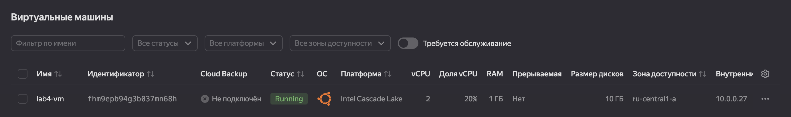
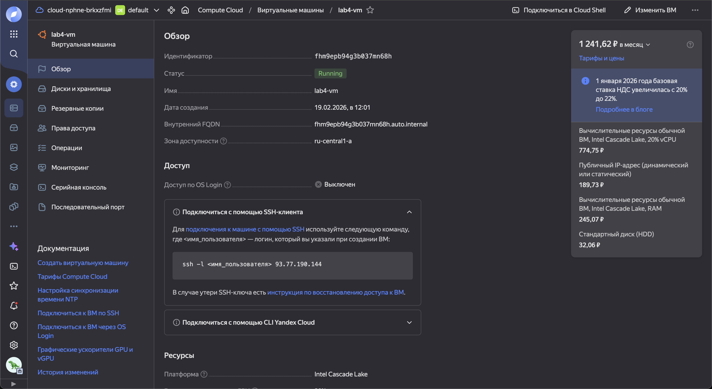
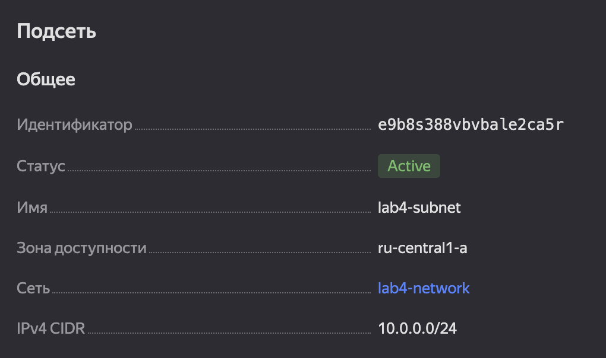
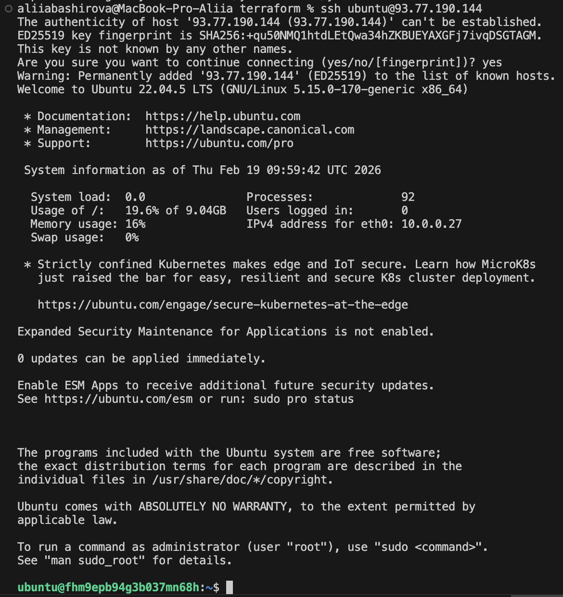
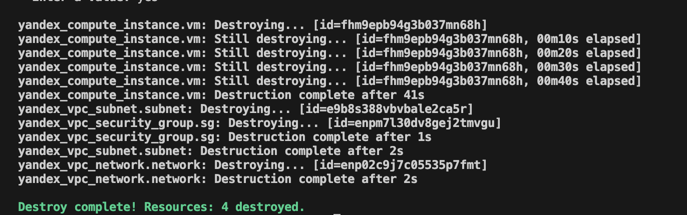
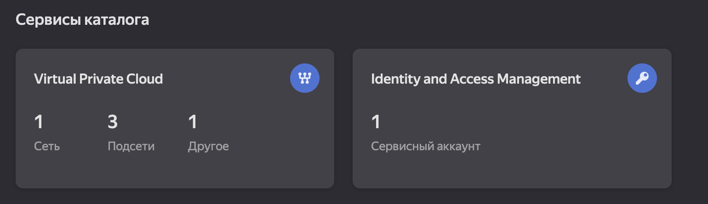
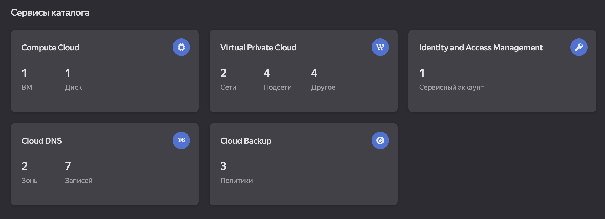

# LAB04 — Infrastructure as Code Documentation

---

## 1. Cloud Provider & Infrastructure

**Cloud Provider:** Yandex Cloud

**Rationale:** Free tier, stable infrastructure in Russia, support for Terraform and Pulumi.

| Parameter            | Value                       |
| ------------------- | ------------------------------- |
| VM name              | lab4-vm                         |
| Type/size          | Free Tier, 2 vCPU, 1 GB RAM     |
| Platform           | Intel Cascade Lake              |
| Disc               | 10 GB                           |
| ОS                  | Ubuntu 22.04 LTS                |
| Public IP        | 93.77.190.144 (dynamic)    |
| Private IP       | 10.0.0.27                       |
| Zone                | ru-central1-a                   |
| Net                | lab4-subnet                     |
| Security group | lab4-sg                         |
| SSH access          | Turned on with IP 185.252.144.192    |
| Ports               | 22 (SSH), 80 (HTTP), 5000 (app) |

**Region / Zone:** `ru-central1-a`

**Total Cost:** $0

**Resources Created:**

* **VPC Network:** `lab4-network`
* **Subnet:** `lab4-subnet` (10.0.0.0/24)
* **Security Group:** `lab4-sg`

  * SSH (port 22) only from my IP
  * HTTP (port 80) opened
  * App port (port 5000)

**Screenshots:**






---

## 2. Terraform Implementation

**Terraform Version:** `v1.14.5`

**Project Structure:**

```
terraform/
├── main.tf          
├── variables.tf    
└── outputs.tf  
```

**Key Configuration Decisions:**

* A separate security group with access rules was used
* The SSH key is stored locally and connected via `ssh-keys`
* A separate subnet was used for the VM

**Challenges Encountered:**

* Errors with the key path `~/.ssh/id_rsa.pub` — I had to specify the full path `/Users/aliiabashirova/.ssh/id_rsa.pub`
* Incorrect use of `image_family` had to be replaced with data source `yandex_compute_image'

**Terminal Output (Sanitized):**

```bash
% terraform init

Initializing the backend...
Initializing provider plugins...
- Reusing previous version of yandex-cloud/yandex from the dependency lock file
- Using previously-installed yandex-cloud/yandex v0.187.0

Terraform has been successfully initialized!

You may now begin working with Terraform. Try running "terraform plan" to see
any changes that are required for your infrastructure. All Terraform commands
should now work.

If you ever set or change modules or backend configuration for Terraform,
rerun this command to reinitialize your working directory. If you forget, other
commands will detect it and remind you to do so if necessary.
```

``` bash
% terraform validate
Success! The configuration is valid.
```

``` bash
% terraform plan
data.yandex_compute_image.ubuntu: Reading...
data.yandex_compute_image.ubuntu: Read complete after 1s [id=fd8t9g30r3pc23et5krl]

Terraform used the selected providers to generate the following execution plan. Resource actions are indicated with the following symbols:
  + create

Terraform will perform the following actions:

  # yandex_compute_instance.vm will be created
  + resource "yandex_compute_instance" "vm" {
      + created_at                = (known after apply)
      + folder_id                 = (known after apply)
      + fqdn                      = (known after apply)
      + gpu_cluster_id            = (known after apply)
      + hardware_generation       = (known after apply)
      + hostname                  = (known after apply)
      + id                        = (known after apply)
      + maintenance_grace_period  = (known after apply)
      + maintenance_policy        = (known after apply)
      + metadata                  = {
          + "ssh-keys" = <<-EOT
                ubuntu:ssh-rsa AAAAB3NzaC1yc2EAAAADAQABAAACAQC65CIO0z/polm45wKOfYC8J2Nmhk8TwztD7Z7zdMKKTplZ4meXxD7vh/6nt0c8/vYCHsi35HzsCNaCllPqm8XHVO4o8qXguAIFNAlZ0dwtb56vXXLqwS5YNOcmwFjjEcOgGR2+K+QiZ/ZySBX7VfDqpWRFFXHV2+jpkiIySUi4mOeh5Wc2rzHIV6CwAh9ymQiJ6zldVUX8s16SLVTnMwDE5Xl1gTdcrIilUPYPVWYOvdsP2SyyoDNiCP+5Be7bLwOkI8sHn2MDFnol+c7VGMTZ6cdvkK7cY53LSKwSsDObLCIG8Dz8UVg51F/04gQlZ+rhloYbs5JoKFmL95KO0Ugp2lxIZjQ8WMYbdM/Ta7R0R+I3fBubHeykv+rtNuboxZd/lF4aFDSyOo+uE4B0XZnutzeavrrPyeWgKgwppS0IEsVCUTahY1gRYLTP6JJx+p4zW/qbNON/69QEGOnFkA07ayRcEtGrPJjqgfq1gQZVTCxOBPZB9TtQpm/QxJj7xWbobw8OFh8kx3J1bA7K6KdEDJK8QagunZziWdORPivJ+0+QLYq7YBc7kY9Dci6w44ENo6bZnWU9zP1Mz8mqq7ZXj4tFI2v3XrbN3nTZuVNee5/+PeVpwR5V2IpN3jwVE53YGujah+fPlC9JQh63pTSvaCa2nU7cPkmL6O8LIsNIgw== aliiabashirova@MacBook-Pro-Aliia.local
            EOT
        }
      + name                      = "lab4-vm"
      + network_acceleration_type = "standard"
      + platform_id               = "standard-v2"
      + status                    = (known after apply)
      + zone                      = (known after apply)

      + boot_disk {
          + auto_delete = true
          + device_name = (known after apply)
          + disk_id     = (known after apply)
          + mode        = (known after apply)

          + initialize_params {
              + block_size  = (known after apply)
              + description = (known after apply)
              + image_id    = "fd8t9g30r3pc23et5krl"
              + name        = (known after apply)
              + size        = 10
              + snapshot_id = (known after apply)
              + type        = "network-hdd"
            }
        }

      + metadata_options (known after apply)

      + network_interface {
          + index              = (known after apply)
          + ip_address         = (known after apply)
          + ipv4               = true
          + ipv6               = (known after apply)
          + ipv6_address       = (known after apply)
          + mac_address        = (known after apply)
          + nat                = true
          + nat_ip_address     = (known after apply)
          + nat_ip_version     = (known after apply)
          + security_group_ids = (known after apply)
          + subnet_id          = (known after apply)
        }

      + placement_policy (known after apply)

      + resources {
          + core_fraction = 20
          + cores         = 2
          + memory        = 1
        }

      + scheduling_policy (known after apply)
    }

  # yandex_vpc_network.network will be created
  + resource "yandex_vpc_network" "network" {
      + created_at                = (known after apply)
      + default_security_group_id = (known after apply)
      + folder_id                 = (known after apply)
      + id                        = (known after apply)
      + labels                    = (known after apply)
      + name                      = "lab4-network"
      + subnet_ids                = (known after apply)
    }

  # yandex_vpc_security_group.sg will be created
  + resource "yandex_vpc_security_group" "sg" {
      + created_at = (known after apply)
      + folder_id  = (known after apply)
      + id         = (known after apply)
      + labels     = (known after apply)
      + name       = "lab4-sg"
      + network_id = (known after apply)
      + status     = (known after apply)

      + egress {
          + from_port         = -1
          + id                = (known after apply)
          + labels            = (known after apply)
          + port              = -1
          + protocol          = "ANY"
          + to_port           = -1
          + v4_cidr_blocks    = [
              + "0.0.0.0/0",
            ]
          + v6_cidr_blocks    = []
            # (3 unchanged attributes hidden)
        }

      + ingress {
          + description       = "App port"
          + from_port         = -1
          + id                = (known after apply)
          + labels            = (known after apply)
          + port              = 5000
          + protocol          = "TCP"
          + to_port           = -1
          + v4_cidr_blocks    = [
              + "0.0.0.0/0",
            ]
          + v6_cidr_blocks    = []
            # (2 unchanged attributes hidden)
        }
      + ingress {
          + description       = "HTTP"
          + from_port         = -1
          + id                = (known after apply)
          + labels            = (known after apply)
          + port              = 80
          + protocol          = "TCP"
          + to_port           = -1
          + v4_cidr_blocks    = [
              + "0.0.0.0/0",
            ]
          + v6_cidr_blocks    = []
            # (2 unchanged attributes hidden)
        }
      + ingress {
          + description       = "SSH from my IP"
          + from_port         = -1
          + id                = (known after apply)
          + labels            = (known after apply)
          + port              = 22
          + protocol          = "TCP"
          + to_port           = -1
          + v4_cidr_blocks    = [
              + "185.252.144.192/32",
            ]
          + v6_cidr_blocks    = []
            # (2 unchanged attributes hidden)
        }
    }

  # yandex_vpc_subnet.subnet will be created
  + resource "yandex_vpc_subnet" "subnet" {
      + created_at     = (known after apply)
      + folder_id      = (known after apply)
      + id             = (known after apply)
      + labels         = (known after apply)
      + name           = "lab4-subnet"
      + network_id     = (known after apply)
      + v4_cidr_blocks = [
          + "10.0.0.0/24",
        ]
      + v6_cidr_blocks = (known after apply)
      + zone           = "ru-central1-a"
    }

Plan: 4 to add, 0 to change, 0 to destroy.

Changes to Outputs:
  + public_ip   = (known after apply)
  + ssh_command = (known after apply)

──────────────────────────────────────────────────────────────────────────────────────────────────────────────────────────────────────────────────────

Note: You didn't use the -out option to save this plan, so Terraform can't guarantee to take exactly these actions if you run "terraform apply" now.
```

```bash
terraform apply
data.yandex_compute_image.ubuntu: Reading...
data.yandex_compute_image.ubuntu: Read complete after 1s [id=fd8t9g30r3pc23et5krl]

Terraform used the selected providers to generate the following execution plan. Resource actions are indicated with the following symbols:
  + create

Terraform will perform the following actions:

  # yandex_compute_instance.vm will be created
  + resource "yandex_compute_instance" "vm" {
      + created_at                = (known after apply)
      + folder_id                 = (known after apply)
      + fqdn                      = (known after apply)
      + gpu_cluster_id            = (known after apply)
      + hardware_generation       = (known after apply)
      + hostname                  = (known after apply)
      + id                        = (known after apply)
      + maintenance_grace_period  = (known after apply)
      + maintenance_policy        = (known after apply)
      + metadata                  = {
          + "ssh-keys" = <<-EOT
                ubuntu:ssh-rsa AAAAB3NzaC1yc2EAAAADAQABAAACAQC65CIO0z/polm45wKOfYC8J2Nmhk8TwztD7Z7zdMKKTplZ4meXxD7vh/6nt0c8/vYCHsi35HzsCNaCllPqm8XHVO4o8qXguAIFNAlZ0dwtb56vXXLqwS5YNOcmwFjjEcOgGR2+K+QiZ/ZySBX7VfDqpWRFFXHV2+jpkiIySUi4mOeh5Wc2rzHIV6CwAh9ymQiJ6zldVUX8s16SLVTnMwDE5Xl1gTdcrIilUPYPVWYOvdsP2SyyoDNiCP+5Be7bLwOkI8sHn2MDFnol+c7VGMTZ6cdvkK7cY53LSKwSsDObLCIG8Dz8UVg51F/04gQlZ+rhloYbs5JoKFmL95KO0Ugp2lxIZjQ8WMYbdM/Ta7R0R+I3fBubHeykv+rtNuboxZd/lF4aFDSyOo+uE4B0XZnutzeavrrPyeWgKgwppS0IEsVCUTahY1gRYLTP6JJx+p4zW/qbNON/69QEGOnFkA07ayRcEtGrPJjqgfq1gQZVTCxOBPZB9TtQpm/QxJj7xWbobw8OFh8kx3J1bA7K6KdEDJK8QagunZziWdORPivJ+0+QLYq7YBc7kY9Dci6w44ENo6bZnWU9zP1Mz8mqq7ZXj4tFI2v3XrbN3nTZuVNee5/+PeVpwR5V2IpN3jwVE53YGujah+fPlC9JQh63pTSvaCa2nU7cPkmL6O8LIsNIgw== aliiabashirova@MacBook-Pro-Aliia.local
            EOT
        }
      + name                      = "lab4-vm"
      + network_acceleration_type = "standard"
      + platform_id               = "standard-v2"
      + status                    = (known after apply)
      + zone                      = (known after apply)

      + boot_disk {
          + auto_delete = true
          + device_name = (known after apply)
          + disk_id     = (known after apply)
          + mode        = (known after apply)

          + initialize_params {
              + block_size  = (known after apply)
              + description = (known after apply)
              + image_id    = "fd8t9g30r3pc23et5krl"
              + name        = (known after apply)
              + size        = 10
              + snapshot_id = (known after apply)
              + type        = "network-hdd"
            }
        }

      + metadata_options (known after apply)

      + network_interface {
          + index              = (known after apply)
          + ip_address         = (known after apply)
          + ipv4               = true
          + ipv6               = (known after apply)
          + ipv6_address       = (known after apply)
          + mac_address        = (known after apply)
          + nat                = true
          + nat_ip_address     = (known after apply)
          + nat_ip_version     = (known after apply)
          + security_group_ids = (known after apply)
          + subnet_id          = (known after apply)
        }

      + placement_policy (known after apply)

      + resources {
          + core_fraction = 20
          + cores         = 2
          + memory        = 1
        }

      + scheduling_policy (known after apply)
    }

  # yandex_vpc_network.network will be created
  + resource "yandex_vpc_network" "network" {
      + created_at                = (known after apply)
      + default_security_group_id = (known after apply)
      + folder_id                 = (known after apply)
      + id                        = (known after apply)
      + labels                    = (known after apply)
      + name                      = "lab4-network"
      + subnet_ids                = (known after apply)
    }

  # yandex_vpc_security_group.sg will be created
  + resource "yandex_vpc_security_group" "sg" {
      + created_at = (known after apply)
      + folder_id  = (known after apply)
      + id         = (known after apply)
      + labels     = (known after apply)
      + name       = "lab4-sg"
      + network_id = (known after apply)
      + status     = (known after apply)

      + egress {
          + from_port         = -1
          + id                = (known after apply)
          + labels            = (known after apply)
          + port              = -1
          + protocol          = "ANY"
          + to_port           = -1
          + v4_cidr_blocks    = [
              + "0.0.0.0/0",
            ]
          + v6_cidr_blocks    = []
            # (3 unchanged attributes hidden)
        }

      + ingress {
          + description       = "App port"
          + from_port         = -1
          + id                = (known after apply)
          + labels            = (known after apply)
          + port              = 5000
          + protocol          = "TCP"
          + to_port           = -1
          + v4_cidr_blocks    = [
              + "0.0.0.0/0",
            ]
          + v6_cidr_blocks    = []
            # (2 unchanged attributes hidden)
        }
      + ingress {
          + description       = "HTTP"
          + from_port         = -1
          + id                = (known after apply)
          + labels            = (known after apply)
          + port              = 80
          + protocol          = "TCP"
          + to_port           = -1
          + v4_cidr_blocks    = [
              + "0.0.0.0/0",
            ]
          + v6_cidr_blocks    = []
            # (2 unchanged attributes hidden)
        }
      + ingress {
          + description       = "SSH from my IP"
          + from_port         = -1
          + id                = (known after apply)
          + labels            = (known after apply)
          + port              = 22
          + protocol          = "TCP"
          + to_port           = -1
          + v4_cidr_blocks    = [
              + "185.252.144.192/32",
            ]
          + v6_cidr_blocks    = []
            # (2 unchanged attributes hidden)
        }
    }

  # yandex_vpc_subnet.subnet will be created
  + resource "yandex_vpc_subnet" "subnet" {
      + created_at     = (known after apply)
      + folder_id      = (known after apply)
      + id             = (known after apply)
      + labels         = (known after apply)
      + name           = "lab4-subnet"
      + network_id     = (known after apply)
      + v4_cidr_blocks = [
          + "10.0.0.0/24",
        ]
      + v6_cidr_blocks = (known after apply)
      + zone           = "ru-central1-a"
    }

Plan: 4 to add, 0 to change, 0 to destroy.

Changes to Outputs:
  + public_ip   = (known after apply)
  + ssh_command = (known after apply)

Do you want to perform these actions?
  Terraform will perform the actions described above.
  Only 'yes' will be accepted to approve.

  Enter a value: yes

yandex_vpc_network.network: Creating...
yandex_vpc_network.network: Creation complete after 4s [id=enp02c9j7c05535p7fmt]
yandex_vpc_subnet.subnet: Creating...
yandex_vpc_security_group.sg: Creating...
yandex_vpc_subnet.subnet: Creation complete after 1s [id=e9b8s388vbvbale2ca5r]
yandex_vpc_security_group.sg: Creation complete after 3s [id=enpm7l30dv8gej2tmvgu]
yandex_compute_instance.vm: Creating...
yandex_compute_instance.vm: Still creating... [00m10s elapsed]
yandex_compute_instance.vm: Still creating... [00m20s elapsed]
yandex_compute_instance.vm: Still creating... [00m30s elapsed]
yandex_compute_instance.vm: Still creating... [00m40s elapsed]
yandex_compute_instance.vm: Still creating... [00m50s elapsed]
yandex_compute_instance.vm: Creation complete after 59s [id=fhm9epb94g3b037mn68h]

Apply complete! Resources: 4 added, 0 changed, 0 destroyed.

Outputs:

public_ip = "93.77.190.144"
ssh_command = "ssh ubuntu@93.77.190.144"
```

**SSH Connection:**

```bash
ssh ubuntu@93.77.190.144
```



---

## 3. Pulumi Implementation

**Pulumi Version:** `v3.222.0`

**Language:** Python

**Code Differences from Terraform:**

* Pulumi uses Python instead HCL
* You can use the usual language constructs: functions, loops, conditions.
* Resources are created by objects, not declaratively.

**Advantages Discovered:**

* Easily reuse code through functions and loops
* Fewer problems with file paths
* Dynamic configurations are easier to implement

**Challenges Encountered:**

* It was necessary to study the syntax of Pulumi for Yandex Cloud
* Initialization of the project requires explicit configuration of the stack and configurations

**Terminal Output (Sanitized):**

```bash
% pulumi preview
Previewing update (dev)

View in Browser (Ctrl+O): https://app.pulumi.com/Gpshfrd-org/lab4-pulumi/dev/previews/a1c3f8e2-3608-4356-8696-f583784d23a2

     Type                              Name             Plan       Info
     pulumi:pulumi:Stack               lab4-pulumi-dev             2 messages
 ~   ├─ yandex:index:VpcSecurityGroup  lab4-sg          update     [diff: ~ingresses]
 +   └─ yandex:index:ComputeInstance   lab4-vm          create     

Diagnostics:
  pulumi:pulumi:Stack (lab4-pulumi-dev):
    /Users/aliiabashirova/DevOps/DevOps-Core-Course/pulumi/venv/lib/python3.11/site-packages/pulumi_yandex/_utilities.py:10: UserWarning: pkg_resources is deprecated as an API. See https://setuptools.pypa.io/en/latest/pkg_resources.html. The pkg_resources package is slated for removal as early as 2025-11-30. Refrain from using this package or pin to Setuptools<81.
      import pkg_resources

Outputs:
  + private_ip : [unknown]
  + public_ip  : [unknown]
  + ssh_command: [unknown]
  + vm_id      : [unknown]

Resources:
    + 1 to create
    ~ 1 to update
    2 changes. 3 unchanged
```

```bash
% pulumi up
Previewing update (dev)

View in Browser (Ctrl+O): https://app.pulumi.com/Gpshfrd-org/lab4-pulumi/dev/previews/5e32de12-3b39-414d-93a8-8d2c9a1169a0

     Type                              Name             Plan       Info
     pulumi:pulumi:Stack               lab4-pulumi-dev             2 messages
 ~   ├─ yandex:index:VpcSecurityGroup  lab4-sg          update     [diff: ~ingresses]
 +   └─ yandex:index:ComputeInstance   lab4-vm          create     

Diagnostics:
  pulumi:pulumi:Stack (lab4-pulumi-dev):
    /Users/aliiabashirova/DevOps/DevOps-Core-Course/pulumi/venv/lib/python3.11/site-packages/pulumi_yandex/_utilities.py:10: UserWarning: pkg_resources is deprecated as an API. See https://setuptools.pypa.io/en/latest/pkg_resources.html. The pkg_resources package is slated for removal as early as 2025-11-30. Refrain from using this package or pin to Setuptools<81.
      import pkg_resources

    [Pulumi Neo] Would you like help with these diagnostics?
    https://app.pulumi.com/Gpshfrd-org/lab4-pulumi/dev/previews/5e32de12-3b39-414d-93a8-8d2c9a1169a0?explainFailure

Outputs:
  + private_ip : [unknown]
  + public_ip  : [unknown]
  + ssh_command: [unknown]
  + vm_id      : [unknown]

Resources:
    + 1 to create
    ~ 1 to update
    2 changes. 3 unchanged

Do you want to perform this update? yes
Updating (dev)

View in Browser (Ctrl+O): https://app.pulumi.com/Gpshfrd-org/lab4-pulumi/dev/updates/6

     Type                              Name             Status            Info
     pulumi:pulumi:Stack               lab4-pulumi-dev                    2 messages
 ~   ├─ yandex:index:VpcSecurityGroup  lab4-sg          updated (2s)      [diff: ~ingresses]
 +   └─ yandex:index:ComputeInstance   lab4-vm          created (43s)     

Diagnostics:
  pulumi:pulumi:Stack (lab4-pulumi-dev):
    /Users/aliiabashirova/DevOps/DevOps-Core-Course/pulumi/venv/lib/python3.11/site-packages/pulumi_yandex/_utilities.py:10: UserWarning: pkg_resources is deprecated as an API. See https://setuptools.pypa.io/en/latest/pkg_resources.html. The pkg_resources package is slated for removal as early as 2025-11-30. Refrain from using this package or pin to Setuptools<81.
      import pkg_resources

    [Pulumi Neo] Would you like help with these diagnostics?
    https://app.pulumi.com/Gpshfrd-org/lab4-pulumi/dev/updates/6?explainFailure

Outputs:
  + private_ip : "10.0.0.29"
  + public_ip  : "93.77.185.74"
  + ssh_command: "ssh ubuntu@93.77.185.74"
  + vm_id      : "fhmj4m3fulsqf48l0v7q"

Resources:
    + 1 created
    ~ 1 updated
    2 changes. 3 unchanged

Duration: 48s
```

**Public IP of Pulumi VM:** `93.77.185.74`

**SSH Connection:**

```bash
% ssh ubuntu@93.77.185.74
The authenticity of host '93.77.185.74 (93.77.185.74)' can't be established.
ED25519 key fingerprint is SHA256:Ur5dyVwufM/C7zI8v8Mkn8BtXoRtp1HcyQW6Q8gW9Xs.
This key is not known by any other names.
Are you sure you want to continue connecting (yes/no/[fingerprint])? yes
Warning: Permanently added '93.77.185.74' (ED25519) to the list of known hosts.
Welcome to Ubuntu 22.04.5 LTS (GNU/Linux 5.15.0-151-generic x86_64)

 * Documentation:  https://help.ubuntu.com
 * Management:     https://landscape.canonical.com
 * Support:        https://ubuntu.com/pro

 System information as of Thu Feb 19 11:19:38 UTC 2026

  System load:  0.01              Processes:             100
  Usage of /:   19.4% of 9.04GB   Users logged in:       0
  Memory usage: 8%                IPv4 address for eth0: 10.0.0.29
  Swap usage:   0%


Expanded Security Maintenance for Applications is not enabled.

0 updates can be applied immediately.

Enable ESM Apps to receive additional future security updates.
See https://ubuntu.com/esm or run: sudo pro status


The list of available updates is more than a week old.
To check for new updates run: sudo apt update


The programs included with the Ubuntu system are free software;
the exact distribution terms for each program are described in the
individual files in /usr/share/doc/*/copyright.

Ubuntu comes with ABSOLUTELY NO WARRANTY, to the extent permitted by
applicable law.

To run a command as administrator (user "root"), use "sudo <command>".
See "man sudo_root" for details.
```

---

## 4. Terraform vs Pulumi Comparison

**Ease of Learning:**
Terraform проще для начальной декларативной инфраструктуры. Pulumi требует знания языка (Python/TypeScript), но мощнее для сложной логики.

**Code Readability:**
Terraform HCL нагляднее для статической инфраструктуры, Pulumi Python удобен для динамических конфигураций.

**Debugging:**
Terraform выдаёт понятные ошибки при `plan`/`apply`. Pulumi иногда требует изучения стек-трейса Python.

**Documentation:**
Terraform — подробные примеры для всех провайдеров. Pulumi — меньше, но есть хорошие примеры на GitHub.

**Use Case:**

* Terraform — лучше для фиксированной инфраструктуры
* Pulumi — удобно для интеграции с приложением, динамических ресурсов и условной логики

---

## 5. Lab 5 Preparation & Cleanup

**VM for Lab 5:**

* Keeping VM? Yes
* Which VM? Pulumi-created

**Cleanup Status:**

* Terraform resources destroyed:

```bash
% terraform destroy
data.yandex_compute_image.ubuntu: Reading...
yandex_vpc_network.network: Refreshing state... [id=enp02c9j7c05535p7fmt]
yandex_vpc_subnet.subnet: Refreshing state... [id=e9b8s388vbvbale2ca5r]
yandex_vpc_security_group.sg: Refreshing state... [id=enpm7l30dv8gej2tmvgu]
data.yandex_compute_image.ubuntu: Read complete after 1s [id=fd8t9g30r3pc23et5krl]
yandex_compute_instance.vm: Refreshing state... [id=fhm9epb94g3b037mn68h]

Terraform used the selected providers to generate the following execution plan. Resource actions are indicated with the following symbols:
  - destroy

Terraform will perform the following actions:

  # yandex_compute_instance.vm will be destroyed
  - resource "yandex_compute_instance" "vm" {
      - created_at                = "2026-02-19T09:01:45Z" -> null
      - folder_id                 = "b1gm6brei5ugn9vm9n8f" -> null
      - fqdn                      = "fhm9epb94g3b037mn68h.auto.internal" -> null
      - hardware_generation       = [
          - {
              - generation2_features = []
              - legacy_features      = [
                  - {
                      - pci_topology = "PCI_TOPOLOGY_V2"
                    },
                ]
            },
        ] -> null
      - id                        = "fhm9epb94g3b037mn68h" -> null
      - labels                    = {} -> null
      - metadata                  = {
          - "ssh-keys" = <<-EOT
                ubuntu:ssh-rsa AAAAB3NzaC1yc2EAAAADAQABAAACAQC65CIO0z/polm45wKOfYC8J2Nmhk8TwztD7Z7zdMKKTplZ4meXxD7vh/6nt0c8/vYCHsi35HzsCNaCllPqm8XHVO4o8qXguAIFNAlZ0dwtb56vXXLqwS5YNOcmwFjjEcOgGR2+K+QiZ/ZySBX7VfDqpWRFFXHV2+jpkiIySUi4mOeh5Wc2rzHIV6CwAh9ymQiJ6zldVUX8s16SLVTnMwDE5Xl1gTdcrIilUPYPVWYOvdsP2SyyoDNiCP+5Be7bLwOkI8sHn2MDFnol+c7VGMTZ6cdvkK7cY53LSKwSsDObLCIG8Dz8UVg51F/04gQlZ+rhloYbs5JoKFmL95KO0Ugp2lxIZjQ8WMYbdM/Ta7R0R+I3fBubHeykv+rtNuboxZd/lF4aFDSyOo+uE4B0XZnutzeavrrPyeWgKgwppS0IEsVCUTahY1gRYLTP6JJx+p4zW/qbNON/69QEGOnFkA07ayRcEtGrPJjqgfq1gQZVTCxOBPZB9TtQpm/QxJj7xWbobw8OFh8kx3J1bA7K6KdEDJK8QagunZziWdORPivJ+0+QLYq7YBc7kY9Dci6w44ENo6bZnWU9zP1Mz8mqq7ZXj4tFI2v3XrbN3nTZuVNee5/+PeVpwR5V2IpN3jwVE53YGujah+fPlC9JQh63pTSvaCa2nU7cPkmL6O8LIsNIgw== aliiabashirova@MacBook-Pro-Aliia.local
            EOT
        } -> null
      - name                      = "lab4-vm" -> null
      - network_acceleration_type = "standard" -> null
      - platform_id               = "standard-v2" -> null
      - status                    = "running" -> null
      - zone                      = "ru-central1-a" -> null
        # (5 unchanged attributes hidden)

      - boot_disk {
          - auto_delete = true -> null
          - device_name = "fhm2rtec3r4bma850gm4" -> null
          - disk_id     = "fhm2rtec3r4bma850gm4" -> null
          - mode        = "READ_WRITE" -> null

          - initialize_params {
              - block_size  = 4096 -> null
              - image_id    = "fd8t9g30r3pc23et5krl" -> null
                name        = null
              - size        = 10 -> null
              - type        = "network-hdd" -> null
                # (3 unchanged attributes hidden)
            }
        }

      - metadata_options {
          - aws_v1_http_endpoint = 1 -> null
          - aws_v1_http_token    = 2 -> null
          - gce_http_endpoint    = 1 -> null
          - gce_http_token       = 1 -> null
        }

      - network_interface {
          - index              = 0 -> null
          - ip_address         = "10.0.0.27" -> null
          - ipv4               = true -> null
          - ipv6               = false -> null
          - mac_address        = "d0:0d:97:65:69:24" -> null
          - nat                = true -> null
          - nat_ip_address     = "93.77.190.144" -> null
          - nat_ip_version     = "IPV4" -> null
          - security_group_ids = [
              - "enpm7l30dv8gej2tmvgu",
            ] -> null
          - subnet_id          = "e9b8s388vbvbale2ca5r" -> null
            # (1 unchanged attribute hidden)
        }

      - placement_policy {
          - host_affinity_rules       = [] -> null
          - placement_group_partition = 0 -> null
            # (1 unchanged attribute hidden)
        }

      - resources {
          - core_fraction = 20 -> null
          - cores         = 2 -> null
          - gpus          = 0 -> null
          - memory        = 1 -> null
        }

      - scheduling_policy {
          - preemptible = false -> null
        }
    }

  # yandex_vpc_network.network will be destroyed
  - resource "yandex_vpc_network" "network" {
      - created_at                = "2026-02-19T09:01:38Z" -> null
      - default_security_group_id = "enpgplhbc0hobnve5if3" -> null
      - folder_id                 = "b1gm6brei5ugn9vm9n8f" -> null
      - id                        = "enp02c9j7c05535p7fmt" -> null
      - labels                    = {} -> null
      - name                      = "lab4-network" -> null
      - subnet_ids                = [
          - "e9b8s388vbvbale2ca5r",
        ] -> null
        # (1 unchanged attribute hidden)
    }

  # yandex_vpc_security_group.sg will be destroyed
  - resource "yandex_vpc_security_group" "sg" {
      - created_at  = "2026-02-19T09:01:43Z" -> null
      - folder_id   = "b1gm6brei5ugn9vm9n8f" -> null
      - id          = "enpm7l30dv8gej2tmvgu" -> null
      - labels      = {} -> null
      - name        = "lab4-sg" -> null
      - network_id  = "enp02c9j7c05535p7fmt" -> null
      - status      = "ACTIVE" -> null
        # (1 unchanged attribute hidden)

      - egress {
          - from_port         = -1 -> null
          - id                = "enpvj40c5cnfjenp9ufu" -> null
          - labels            = {} -> null
          - port              = -1 -> null
          - protocol          = "ANY" -> null
          - to_port           = -1 -> null
          - v4_cidr_blocks    = [
              - "0.0.0.0/0",
            ] -> null
          - v6_cidr_blocks    = [] -> null
            # (3 unchanged attributes hidden)
        }

      - ingress {
          - description       = "App port" -> null
          - from_port         = -1 -> null
          - id                = "enprp35nd6o2k2pnh1gs" -> null
          - labels            = {} -> null
          - port              = 5000 -> null
          - protocol          = "TCP" -> null
          - to_port           = -1 -> null
          - v4_cidr_blocks    = [
              - "0.0.0.0/0",
            ] -> null
          - v6_cidr_blocks    = [] -> null
            # (2 unchanged attributes hidden)
        }
      - ingress {
          - description       = "HTTP" -> null
          - from_port         = -1 -> null
          - id                = "enph4oievukot0simtgf" -> null
          - labels            = {} -> null
          - port              = 80 -> null
          - protocol          = "TCP" -> null
          - to_port           = -1 -> null
          - v4_cidr_blocks    = [
              - "0.0.0.0/0",
            ] -> null
          - v6_cidr_blocks    = [] -> null
            # (2 unchanged attributes hidden)
        }
      - ingress {
          - description       = "SSH from my IP" -> null
          - from_port         = -1 -> null
          - id                = "enpbcgmoic5gi7ch8art" -> null
          - labels            = {} -> null
          - port              = 22 -> null
          - protocol          = "TCP" -> null
          - to_port           = -1 -> null
          - v4_cidr_blocks    = [
              - "185.252.144.192/32",
            ] -> null
          - v6_cidr_blocks    = [] -> null
            # (2 unchanged attributes hidden)
        }
    }

  # yandex_vpc_subnet.subnet will be destroyed
  - resource "yandex_vpc_subnet" "subnet" {
      - created_at     = "2026-02-19T09:01:41Z" -> null
      - folder_id      = "b1gm6brei5ugn9vm9n8f" -> null
      - id             = "e9b8s388vbvbale2ca5r" -> null
      - labels         = {} -> null
      - name           = "lab4-subnet" -> null
      - network_id     = "enp02c9j7c05535p7fmt" -> null
      - v4_cidr_blocks = [
          - "10.0.0.0/24",
        ] -> null
      - v6_cidr_blocks = [] -> null
      - zone           = "ru-central1-a" -> null
        # (2 unchanged attributes hidden)
    }

Plan: 0 to add, 0 to change, 4 to destroy.

Changes to Outputs:
  - public_ip   = "93.77.190.144" -> null
  - ssh_command = "ssh ubuntu@93.77.190.144" -> null

Do you really want to destroy all resources?
  Terraform will destroy all your managed infrastructure, as shown above.
  There is no undo. Only 'yes' will be accepted to confirm.

  Enter a value: yes
```




* Pulumi resources still running:

```bash
% pulumi stack output    
Current stack outputs (4):
    OUTPUT       VALUE
    private_ip   10.0.0.29
    public_ip    93.77.185.74
    ssh_command  ssh ubuntu@93.77.185.74
    vm_id        fhmj4m3fulsqf48l0v7q
```



---
