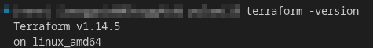
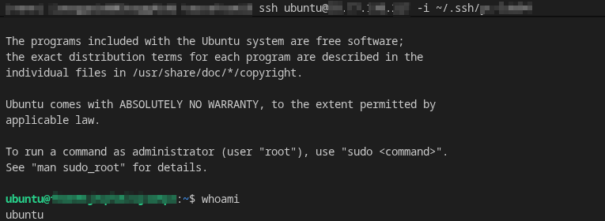
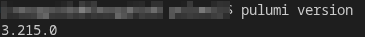
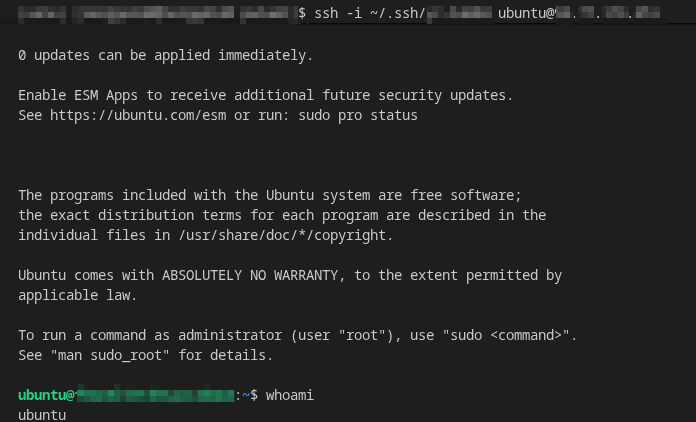
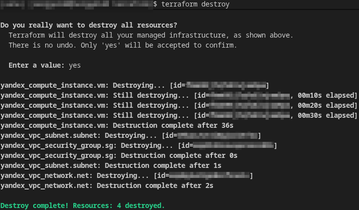
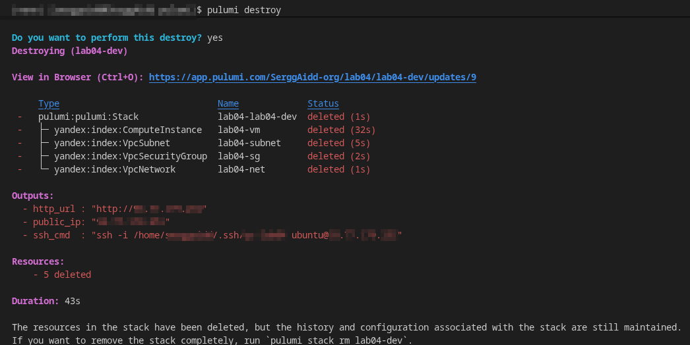
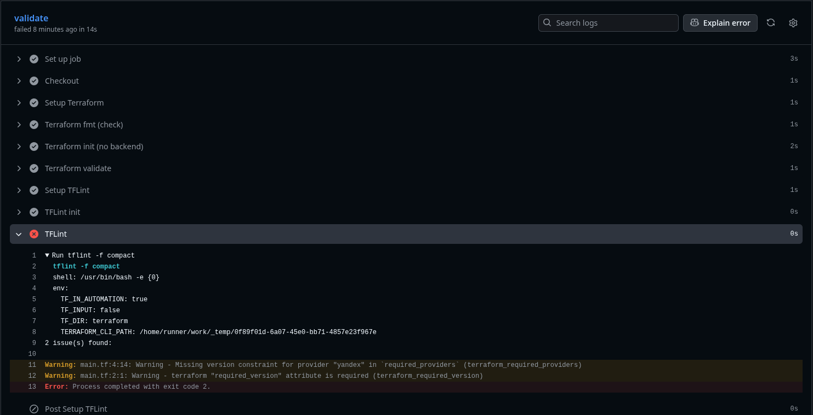
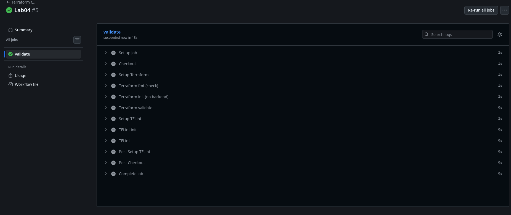

# LAB04 — Infrastructure as Code (Terraform & Pulumi)

## 1. Cloud Provider & Infrastructure

### Cloud provider chosen and rationale
**Yandex Cloud** was chosen as the provider, as it is the simplest and most accessible option in the Russian Federation with a free trial period.

### Instance type and size
- **Instance (YC Compute)**: standard-v2
- **vCPU**: 2
- **RAM**: 1 GB
- **Guaranteed CPU (core_fraction)**: 20%
- **Boot disk**: 10 GB, network-hdd
- **OS image**: ubuntu-2204-lts

### Selected zone: 
The `ru-central1-a` zone was chosen due to the availability of resources and the standard recommended zone from the documentation.

### Total cost: 
The trial period provides free use of the system for 60 days, plus 4,000 rubles for the capacity used. Therefore, the total cost is 0 rubles.

### Resources created
- ***VPC Network***
- ***Subnet*** 
- ***Security Group*** (firewall rules):
  - SSH 22/tcp — allowed **only from my public IP** (`/32`)
  - HTTP 80/tcp — permitted from outside
  - Custom 5000/tcp — permitted from outside
- ***Compute Instance (VM)*** — has a public IP (NAT) for connecting via SSH

---

## 2. Terraform Implementation

### Terraform version used: 


### Project structure explanation
Структура каталога `terraform/`:
```text
├── .gitignore
├── main.tf
├── outputs.tf
├── .terraform
│   └── ...
├── .terraform.lock.hcl
├── terraform.tfstate
├── terraform.tfstate.backup
├── terraform.tfvars
├── .tflint.hcl
└── variables.tf
```

### Key configuration decisions
- A **service account** and authorization key were used to access ***Yandex Cloud***. Connection parameters (cloud/folder/key) were passed via environment variables to avoid hardcoding identifiers and secrets in the code.
- The Terraform configuration is parameterized via variables.tf + terraform.tfvars: the zone, VM properties, subnet CIDR, SSH allowlist, and public key path are set as variables to ensure the setup is reproducible and easily portable.
- Local artifacts were excluded from the repository using the `.gitignore` file.
- The Security Group is configured based on the principle of minimum necessary access.
- For IaC CI validation, terraform init -backend=false is used so that fmt/validate/tflint checks work without access to cloud credentials and without a state backend.

### Challenges encountered
- **YC permission error:** `PermissionDenied desc = Operation is not permitted in the folder`
    
    **Solution:** Grant the service account permissions to the required folder in YC.
- **SSH connection error:** `Permission denied (publickey)`
    
    **Solution:** Explicitly specify the correct private key using `ssh -i ...`.

### Terminal output from key commands (sanitized)

#### Command `terraform init`: 


#### Command `terraform plan` (sanitized):
```text
data.yandex_compute_image.ubuntu: Reading...
data.yandex_compute_image.ubuntu: Read complete after 1s [id=********************]

Terraform used the selected providers to generate the following execution plan. Resource actions are indicated with the following symbols:
  + create

Terraform will perform the following actions:

  # yandex_compute_instance.vm will be created
  + resource "yandex_compute_instance" "vm" {
      + created_at                = (known after apply)
      + folder_id                 = (known after apply)
      + fqdn                      = (known after apply)
      + gpu_cluster_id            = (known after apply)
      + hardware_generation       = (known after apply)
      + hostname                  = (known after apply)
      + id                        = (known after apply)
      + labels                    = {
          + "lab" = "lab04"
        }
      + maintenance_grace_period  = (known after apply)
      + maintenance_policy        = (known after apply)
      + metadata                  = {
          + "ssh-keys" = "ubuntu:ssh-ed25519 ******************************************************************** lab04"
        }
      + name                      = "lab04-vm"
      + network_acceleration_type = "standard"
      + platform_id               = "standard-v2"
      + status                    = (known after apply)
      + zone                      = "ru-central1-a"

      + boot_disk {
          + auto_delete = true
          + device_name = (known after apply)
          + disk_id     = (known after apply)
          + mode        = (known after apply)

          + initialize_params {
              + block_size  = (known after apply)
              + description = (known after apply)
              + image_id    = "***********************"
              + name        = (known after apply)
              + size        = 10
              + snapshot_id = (known after apply)
              + type        = "network-hdd"
            }
        }

      + metadata_options (known after apply)

      + network_interface {
          + index              = (known after apply)
          + ip_address         = (known after apply)
          + ipv4               = true
          + ipv6               = (known after apply)
          + ipv6_address       = (known after apply)
          + mac_address        = (known after apply)
          + nat                = true
          + nat_ip_address     = (known after apply)
          + nat_ip_version     = (known after apply)
          + security_group_ids = (known after apply)
          + subnet_id          = (known after apply)
        }

      + placement_policy (known after apply)

      + resources {
          + core_fraction = 20
          + cores         = 2
          + memory        = 1
        }

      + scheduling_policy (known after apply)
    }

  # yandex_vpc_network.net will be created
  + resource "yandex_vpc_network" "net" {
      + created_at                = (known after apply)
      + default_security_group_id = (known after apply)
      + folder_id                 = (known after apply)
      + id                        = (known after apply)
      + labels                    = {
          + "lab" = "lab04"
        }
      + name                      = "lab04-net"
      + subnet_ids                = (known after apply)
    }

  # yandex_vpc_security_group.sg will be created
  + resource "yandex_vpc_security_group" "sg" {
      + created_at = (known after apply)
      + folder_id  = (known after apply)
      + id         = (known after apply)
      + labels     = {
          + "lab" = "lab04"
        }
      + name       = "lab04-sg"
      + network_id = (known after apply)
      + status     = (known after apply)

      + egress {
          + description       = "Allow all egress"
          + from_port         = 0
          + id                = (known after apply)
          + labels            = (known after apply)
          + port              = -1
          + protocol          = "ANY"
          + to_port           = 65535
          + v4_cidr_blocks    = [
              + "0.0.0.0/0",
            ]
          + v6_cidr_blocks    = []
            # (2 unchanged attributes hidden)
        }

      + ingress {
          + description       = "App port 5000"
          + from_port         = -1
          + id                = (known after apply)
          + labels            = (known after apply)
          + port              = 5000
          + protocol          = "TCP"
          + to_port           = -1
          + v4_cidr_blocks    = [
              + "0.0.0.0/0",
            ]
          + v6_cidr_blocks    = []
            # (2 unchanged attributes hidden)
        }
      + ingress {
          + description       = "HTTP"
          + from_port         = -1
          + id                = (known after apply)
          + labels            = (known after apply)
          + port              = 80
          + protocol          = "TCP"
          + to_port           = -1
          + v4_cidr_blocks    = [
              + "0.0.0.0/0",
            ]
          + v6_cidr_blocks    = []
            # (2 unchanged attributes hidden)
        }
      + ingress {
          + description       = "SSH from my IP"
          + from_port         = -1
          + id                = (known after apply)
          + labels            = (known after apply)
          + port              = 22
          + protocol          = "TCP"
          + to_port           = -1
          + v4_cidr_blocks    = [
              + "***.***.***.***/32",
            ]
          + v6_cidr_blocks    = []
            # (2 unchanged attributes hidden)
        }
    }

  # yandex_vpc_subnet.subnet will be created
  + resource "yandex_vpc_subnet" "subnet" {
      + created_at     = (known after apply)
      + folder_id      = (known after apply)
      + id             = (known after apply)
      + labels         = (known after apply)
      + name           = "lab04-subnet"
      + network_id     = (known after apply)
      + v4_cidr_blocks = [
          + "**.**.*.*/24",
        ]
      + v6_cidr_blocks = (known after apply)
      + zone           = "ru-central1-a"
    }

Plan: 4 to add, 0 to change, 0 to destroy.

Changes to Outputs:
  + public_ip = (known after apply)
  + ssh_cmd   = (known after apply)
```
#### Command `terraform apply`:


#### SSH connection to VM:


---

## 3. Pulumi Implementation

### Pulumi version and language used
- **Language used**: Python
- **Pulumi version**:   `3.215.0`


### How code differs from Terraform
While Terraform uses HCL, which declaratively describes resources, Pulumi uses full-fledged Python code, which allows you to use variables, functions, conditional logic, etc.

### Advantages you discovered
In Pulumi, it is more convenient to “programmatically” collect configurations (for example, generate rules, naming, conditions).

### Challenges encountered

- **`setuptools` version error:** `pulumi-yandex` had problems with `pkg_resources` due to the version of `setuptools`.
    
    **Solution:** Change the entry in `pulumi/requirements.txt` to `setuptools<82`


### Terminal output

#### Command `pulumi preview`:


#### Command `pulumi up`:


#### SSH connection to VM:


---

## 4. Terraform vs Pulumi Comparison

### Ease of Learning
Terraform is easier to understand because HCL is short and templated, while Pulumi requires an understanding of the provider and the nuances of types/Output, but is more convenient in the long run with a good knowledge of the language.

### Code Readability
For understanding the infrastructure, Terraform is simpler; for complex conditions and reusing logic, Pulumi (Python) is clearer.

### Debugging
Terraform's errors usually directly point to the problem and are easier to manage in terms of resources and planning. In the case of pulumi, you sometimes have to deal with Python errors and its dependencies.

### Documentation
While Terraform provides a large number of ready-made examples and standards for almost any case, Pulumi, although it provides good examples, has a smaller number of ready-made templates.

### Use Case
- **Terraform** — when you need a standard IaC with ready-made modules.
- **Pulumi** — when you need complex logic, configuration generation, and custom modules.

---

## 5. Lab 5 Preparation & Cleanup

### VM for Lab 5
- **Keeping VM for Lab 5:** `NO` 
- **VM:** Will recreate cloud VM with terraform 

### Cleanup Status
- Terraform:

- Pulumi:


---

# Bonus Task — IaC CI/CD + Infrastructure Import

## Part 1: GitHub Actions for IaC Validation

### Workflow file implementation
Pipeline `.github/workflows/terraform-ci.yml` executes the following commands:
- `terraform fmt -check -recursive`
- `terraform init -backend=false`
- `terraform validate`
- `tflint --init`
- `tflint`

### Path filter configuration
The workflow is triggered only on changes in `terraform/**`, excluding `docs`.

### tflint results and workflow running
In the first CI run, tflint found two issues:
- Missing terraform.required_version — the minimum Terraform version wasn't specified in the config.
- Missing version constraint for provider Yandex — the provider version wasn't specified in required_providers.

These errors led to the fall of ci:


After correcting the file `/terraform/main.tf`, the execution was successful:


## Part 2: Import GitHub Repository to Terraform

### GitHub repository import process
1. Created a Terraform configuration for the GitHub provider (`terraform/github`)
2. Define the `github_repository` resource for the existing course repository
3. Run `terraform import`, after which the repository is added to the state
4. `terraform plan` shows drift, adjusting the configuration to reality
5. After alignment, `plan` should show "No changes"

### Terminal output 

##

### Why importing matters (brief explanation)
Importing allows you to bring an existing resource (created manually) under IaC control without recreating it. This reduces manual changes, minimizes drift, and makes the configuration "living documentation".

### Benefits of managing repos with IaC
- Unified repository settings via code
- Change control via PR review
- Preventing manual drift
- Quickly re-create settings for new repositories/projects
