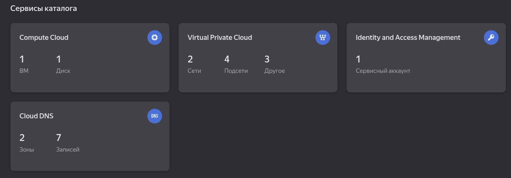

# LAB 04: Infrastructure as Code with Terraform (Yandex Cloud)

## 1. Cloud Provider & Infrastructure

### Cloud Provider Chosen and Rationale

**Provider:** Yandex Cloud

**Rationale for choosing Yandex Cloud:**

- **Local Infrastructure:** Provides low latency and data residency within Russia
- **Payment Convenience:** Billing in Russian Rubles with support for local payment methods

### Instance Type/Size and Why

**Instance Type:** `standard-v1` with `core-fraction=5%`

**Specifications:**

- **vCPU:** 2 cores (Intel Xeon Platinum)
- **RAM:** 1 GB
- **Core Fraction:** 5% (guaranteed vCPU performance)

**Why this configuration:**

- **Cost Optimization:** The 5% core fraction significantly reduces costs while being sufficient for development and testing
- **Minimal Requirements:** 1 GB RAM is enough for a basic Ubuntu server with Python applications
- **Free Tier Compatibility:** This configuration stays within the free grant limits
- **Real-world Scenario:** Represents typical "burstable" instances like AWS t2.micro or GCP f1-micro

**Region/Zone Selected:** `ru-central1-a` (Moscow region)

**Current Cost:** **$0.00** (within free grant limits)

### Resources Created

| Resource Type | Name | Purpose |
|---------------|------|---------|
| **VPC Network** | `myapp-network` | Isolated cloud network for resources |
| **VPC Subnet** | `myapp-subnet` | Subnet in ru-central1-a with CIDR 192.168.10.0/24 |
| **Security Group** | `myapp-security-group` | Firewall rules for VM access control |
| **Compute Instance** | `myapp-vm` | Main virtual machine running Ubuntu 22.04 |
| **Public IP** | (Dynamic) | External access point for SSH and web services |

### Network Configuration

**Security Group Rules:**

| Direction | Protocol | Port | Source/Destination | Purpose |
|-----------|----------|------|-------------------|---------|
| Ingress | TCP | 22 | My Public IP Only | Secure SSH access |
| Ingress | TCP | 80 | 0.0.0.0/0 | HTTP web traffic |
| Ingress | TCP | 5000 | 0.0.0.0/0 | Future application port |
| Egress | ALL | ALL | 0.0.0.0/0 | Outbound internet access |

---

## 2. Terraform Implementation

### Terraform Version Used

```bash
Terraform v1.14.5
on linux_amd64
+ provider registry.terraform.io/yandex-cloud/yandex v0.187.0
```

### Project structure

```bash
terraform/
├── main.tf # Primary configuration with all resources
├── variables.tf # Variable declarations
├── outputs.tf # Output definitions for important values
├── terraform.tfvars # Actual variable values (NOT in git)
```

- terraform init

```bash
Initializing the backend...
Initializing provider plugins...
- Reusing previous version of yandex-cloud/yandex from the dependency lock file
- Using previously-installed yandex-cloud/yandex v0.187.0

Terraform has been successfully initialized!
```

- terraform plan

```bash

Terraform used the selected providers to generate the following execution plan. Resource actions are indicated with the following
symbols:
  + create

Terraform will perform the following actions:

  # yandex_compute_instance.vm will be created
  + resource "yandex_compute_instance" "vm" {
      + created_at                = (known after apply)
      + folder_id                 = (known after apply)
      + fqdn                      = (known after apply)
      + gpu_cluster_id            = (known after apply)
      + hardware_generation       = (known after apply)
      + hostname                  = "myapp-vm"
      + id                        = (known after apply)
      + labels                    = {
          + "environment" = "dev"
          + "managed_by"  = "terraform"
          + "project"     = "myapp"
        }
      + maintenance_grace_period  = (known after apply)
      + maintenance_policy        = (known after apply)
      + metadata                  = {
          + "ssh-keys"  = <<-EOT
                ubuntu:ssh-rsa AAAAB3NzaC1yc2EAAAADAQABAAABAQCllx+4eH/Jy9XVaY4Phk8g1w0NaXy4kw5iUs8TicP3wewIPBypwaGcLJPPuxPB7Mll9bRxGh8SCMJs3r/S50J1piQotd8XTW+1JeNUXPx3/ZIQtnM8872WnehCDm3qTplD5swFirx/h05bXyaW7hky2OKi4VT6AwtSap1b34TDIi9ryPZemUY1fv+MDkTX2ARw+awS9RARBI2WUXbuj3IdgGyUnaV4EZ/UOzK1/NmDzE/ADsMDk2AhS4ttyiLVVGVYuS0C/denPiTWvSzhFe8A6C1Jb3051MuH+VZEGRCG8j4tvcJqwYt+avVG7bFDZOSu+fcTkoj12E3T3EAVUAhT bulatgazizov@fedora
            EOT
          + "user-data" = (sensitive value)
        }
      + name                      = "myapp-vm"
      + network_acceleration_type = "standard"
      + platform_id               = "standard-v1"
      + status                    = (known after apply)
      + zone                      = "ru-central1-a"

      + boot_disk {
          + auto_delete = true
          + device_name = (known after apply)
          + disk_id     = (known after apply)
          + mode        = (known after apply)

          + initialize_params {
              + block_size  = (known after apply)
              + description = (known after apply)
              + image_id    = "fd84mnbiarffhtfrhnog"
              + name        = (known after apply)
              + size        = 20
              + snapshot_id = (known after apply)
              + type        = "network-hdd"
            }
        }

      + metadata_options (known after apply)

      + network_interface {
          + index          = (known after apply)
          + ip_address     = (known after apply)
          + ipv4           = true
          + ipv6           = (known after apply)
          + ipv6_address   = (known after apply)
          + mac_address    = (known after apply)
          + nat            = true
          + nat_ip_address = (known after apply)
          + nat_ip_version = (known after apply)
          + subnet_id      = (known after apply)
        }

      + placement_policy (known after apply)

      + resources {
          + core_fraction = 5
          + cores         = 2
          + memory        = 1
        }

      + scheduling_policy (known after apply)
    }

  # yandex_vpc_network.network will be created
  + resource "yandex_vpc_network" "network" {
      + created_at                = (known after apply)
      + default_security_group_id = (known after apply)
      + folder_id                 = (known after apply)
      + id                        = (known after apply)
      + labels                    = {
          + "environment" = "dev"
          + "managed_by"  = "terraform"
          + "project"     = "myapp"
        }
      + name                      = "myapp-network"
      + subnet_ids                = (known after apply)
    }

  # yandex_vpc_subnet.subnet will be created
  + resource "yandex_vpc_subnet" "subnet" {
      + created_at     = (known after apply)
      + folder_id      = (known after apply)
      + id             = (known after apply)
      + labels         = {
          + "environment" = "dev"
          + "managed_by"  = "terraform"
          + "project"     = "myapp"
        }
      + name           = "myapp-subnet"
      + network_id     = (known after apply)
      + v4_cidr_blocks = [
          + "192.168.10.0/24",
        ]
      + v6_cidr_blocks = (known after apply)
      + zone           = "ru-central1-a"
    }

Plan: 3 to add, 0 to change, 0 to destroy.

Changes to Outputs:
  + ssh_connection_command = (known after apply)
  + vm_id                  = (known after apply)
  + vm_name                = "myapp-vm"
  + vm_private_ip          = (known after apply)
  + vm_public_ip           = (known after apply)

```

- terraform apply

```bash
Terraform will perform the following actions:

  # yandex_compute_instance.vm will be created
  + resource "yandex_compute_instance" "vm" {
      + created_at                = (known after apply)
      + folder_id                 = (known after apply)
      + fqdn                      = (known after apply)
      + gpu_cluster_id            = (known after apply)
      + hardware_generation       = (known after apply)
      + hostname                  = "myapp-vm"
      + id                        = (known after apply)
      + labels                    = {
          + "environment" = "dev"
          + "managed_by"  = "terraform"
          + "project"     = "myapp"
        }
      + maintenance_grace_period  = (known after apply)
      + maintenance_policy        = (known after apply)
      + metadata                  = {
          + "user-data" = (sensitive value)
        }
      + name                      = "myapp-vm"
      + network_acceleration_type = "standard"
      + platform_id               = "standard-v1"
      + status                    = (known after apply)
      + zone                      = "ru-central1-a"

      + boot_disk {
          + auto_delete = true
          + device_name = (known after apply)
          + disk_id     = (known after apply)
          + mode        = (known after apply)

          + initialize_params {
              + block_size  = (known after apply)
              + description = (known after apply)
              + image_id    = "fd84mnbiarffhtfrhnog"
              + name        = (known after apply)
              + size        = 20
              + snapshot_id = (known after apply)
              + type        = "network-hdd"
            }
        }

      + metadata_options (known after apply)

      + network_interface {
          + index          = (known after apply)
          + ip_address     = (known after apply)
          + ipv4           = true
          + ipv6           = (known after apply)
          + ipv6_address   = (known after apply)
          + mac_address    = (known after apply)
          + nat            = true
          + nat_ip_address = (known after apply)
          + nat_ip_version = (known after apply)
          + subnet_id      = (known after apply)
        }

      + placement_policy (known after apply)

      + resources {
          + core_fraction = 20
          + cores         = 2
          + memory        = 1
        }

      + scheduling_policy (known after apply)
    }

  # yandex_vpc_network.network will be created
  + resource "yandex_vpc_network" "network" {
      + created_at                = (known after apply)
      + default_security_group_id = (known after apply)
      + folder_id                 = (known after apply)
      + id                        = (known after apply)
      + labels                    = {
          + "environment" = "dev"
          + "managed_by"  = "terraform"
          + "project"     = "myapp"
        }
      + name                      = "myapp-network"
      + subnet_ids                = (known after apply)
    }

  # yandex_vpc_subnet.subnet will be created
  + resource "yandex_vpc_subnet" "subnet" {
      + created_at     = (known after apply)
      + folder_id      = (known after apply)
      + id             = (known after apply)
      + labels         = {
          + "environment" = "dev"
          + "managed_by"  = "terraform"
          + "project"     = "myapp"
        }
      + name           = "myapp-subnet"
      + network_id     = (known after apply)
      + v4_cidr_blocks = [
          + "192.168.10.0/24",
        ]
      + v6_cidr_blocks = (known after apply)
      + zone           = "ru-central1-a"
    }

Plan: 3 to add, 0 to change, 0 to destroy.

Changes to Outputs:
  + ssh_connection_command = (known after apply)
  + vm_id                  = (known after apply)
  + vm_name                = "myapp-vm"
  + vm_private_ip          = (known after apply)
  + vm_public_ip           = (known after apply)

Do you want to perform these actions?
  Terraform will perform the actions described above.
  Only 'yes' will be accepted to approve.

  Enter a value: yes

yandex_vpc_network.network: Creating...
yandex_vpc_network.network: Creation complete after 2s [id=enpqgkei35jl65ftspug]
yandex_vpc_subnet.subnet: Creating...
yandex_vpc_subnet.subnet: Creation complete after 1s [id=e9btsik9pu3gg032gho0]
yandex_compute_instance.vm: Creating...
yandex_compute_instance.vm: Creation complete after 50s [id=fhmr8695gib7n8d65p7d]

Apply complete! Resources: 3 added, 0 changed, 0 destroyed.

Outputs:

ssh_connection_command = "ssh ubuntu@62.84.124.236"
vm_id = "fhmr8695gib7n8d65p7d"
vm_name = "myapp-vm"
vm_private_ip = "192.168.10.5"
vm_public_ip = "62.84.124.236"
```



```bash
bulatgazizov@fedora:~$ ssh -J root@80.71.232.39 ubuntu@62.84.124.236
root@80.71.232.39's password:
The authenticity of host '62.84.124.236 (<no hostip for proxy command>)' can't be established.
ED25519 key fingerprint is SHA256:0w9t8/mHMIvCel0FqxRvDDaksZDHG0bRJIdY4bmDIFw.
This key is not known by any other names.
Are you sure you want to continue connecting (yes/no/[fingerprint])? yes
To run a command as administrator (user "root"), use "sudo <command>".
See "man sudo_root" for details.

ubuntu@myapp-vm:~$
```

- terraform destroy

```bash

yandex_compute_instance.vm: Destroying... [id=fhmr8695gib7n8d65p7d]
yandex_compute_instance.vm: Destruction complete after 1m0s
yandex_vpc_subnet.subnet: Destroying... [id=e9btsik9pu3gg032gho0]
yandex_vpc_subnet.subnet: Destruction complete after 6s
yandex_vpc_network.network: Destroying... [id=enpqgkei35jl65ftspug]
yandex_vpc_network.network: Destruction complete after 2s
```

## 3. Pulumi Implementation

**Pulumi Version**: v3.222.0

**Language**: Go 1.21+ with Pulumi Go SDK

**Key Packages**:

- github.com/pulumi/pulumi-yandex/sdk/go/yandex v0.2.0 (Yandex Cloud provider)

- github.com/pulumi/pulumi/sdk/v3/go/pulumi v3.103.0 (Pulumi core)

### How Code Differs from Terraform

| Aspect | Terraform (HCL) | Pulumi (Go) |
|--------|-----------------|-------------|
| **Language** | Declarative DSL | Compiled Go code |
| **Type Safety** | Runtime checking | Compile-time checking |
| **Error Handling** | Stops on error | Go `error` handling |
| **Logic** | Limited (`count`, `for_each`) | Full Go (loops, functions, interfaces) |
| **Configuration** | `.tfvars` files | Type-safe config with `pulumi.Config` |
| **Outputs** | String interpolation | `ApplyT()` transformations |

- pulumi preview

```bash

Enter your passphrase to unlock config/secrets
    (set PULUMI_CONFIG_PASSPHRASE or PULUMI_CONFIG_PASSPHRASE_FILE to remember):  
Enter your passphrase to unlock config/secrets
Previewing update (dev):
     Type                             Name         Plan       
 +   pulumi:pulumi:Stack              yacloud-dev  create     
 +   ├─ yandex:index:ComputeInstance  vm           create     
 +   ├─ yandex:index:VpcNetwork       network      create     
 +   └─ yandex:index:VpcSubnet        subnet       create     

Outputs:
    ssh_command : [unknown]
    vm_id       : [unknown]
    vm_public_ip: [unknown]

Resources:
    + 4 to create

```

- palumi up

```bash


Enter your passphrase to unlock config/secrets
    (set PULUMI_CONFIG_PASSPHRASE or PULUMI_CONFIG_PASSPHRASE_FILE to remember):  
Enter your passphrase to unlock config/secrets
Previewing update (dev):
     Type                             Name         Plan       
 +   pulumi:pulumi:Stack              yacloud-dev  create     
 +   ├─ yandex:index:VpcNetwork       network      create     
 +   ├─ yandex:index:VpcSubnet        subnet       create     
 +   └─ yandex:index:ComputeInstance  vm           create     

Outputs:
    ssh_command : [unknown]
    vm_id       : [unknown]
    vm_public_ip: [unknown]

Resources:
    + 4 to create

Do you want to perform this update? yes
Updating (dev):
     Type                             Name         Status              
 +   pulumi:pulumi:Stack              yacloud-dev  created (41s)       
 +   ├─ yandex:index:VpcNetwork       network      created (2s)        
 +   ├─ yandex:index:VpcSubnet        subnet       created (0.40s)     
 +   └─ yandex:index:ComputeInstance  vm           created (38s)       

Outputs:
    ssh_command : "ssh ubuntu@93.77.184.200"
    vm_id       : "fhm0u648ujj7incuqqk3"
    vm_public_ip: "93.77.184.200"

Resources:
    + 4 created

Duration: 45s

```

- ssh:

```bash

 ssh -J root@80.71.232.39 ubuntu@93.77.184.200
root@80.71.232.39's password: 
The authenticity of host '93.77.184.200 (<no hostip for proxy command>)' can't be established.
ED25519 key fingerprint is SHA256:O2kZBUE35pHTPWMa5hP3q/3K3jgMGXF7hD34gxYmXRM.
This key is not known by any other names.
Are you sure you want to continue connecting (yes/no/[fingerprint])? yes
Warning: Permanently added '93.77.184.200' (ED25519) to the list of known hosts.
Welcome to Ubuntu 24.04.3 LTS (GNU/Linux 6.8.0-85-generic x86_64)

 * Documentation:  https://help.ubuntu.com
 * Management:     https://landscape.canonical.com
 * Support:        https://ubuntu.com/pro

 System information as of Thu Feb 19 18:23:33 UTC 2026

  System load:  1.36               Processes:             155
  Usage of /:   11.1% of 18.72GB   Users logged in:       0
  Memory usage: 23%                IPv4 address for eth0: 192.168.10.23
  Swap usage:   0%


Expanded Security Maintenance for Applications is not enabled.

0 updates can be applied immediately.

Enable ESM Apps to receive additional future security updates.
See https://ubuntu.com/esm or run: sudo pro status


The list of available updates is more than a week old.
To check for new updates run: sudo apt update


The programs included with the Ubuntu system are free software;
the exact distribution terms for each program are described in the
individual files in /usr/share/doc/*/copyright.

Ubuntu comes with ABSOLUTELY NO WARRANTY, to the extent permitted by
applicable law.

To run a command as administrator (user "root"), use "sudo <command>".
See "man sudo_root" for details.

ubuntu@fhm0u648ujj7incuqqk3:~$ 
```

- pulumi destroy

```bash


Previewing destroy (dev):
     Type                             Name         Plan       
 -   pulumi:pulumi:Stack              yacloud-dev  delete     
 -   ├─ yandex:index:VpcNetwork       network      delete     
 -   ├─ yandex:index:ComputeInstance  vm           delete     
 -   └─ yandex:index:VpcSubnet        subnet       delete     

Outputs:
  - ssh_command : "ssh ubuntu@93.77.184.200"
  - vm_id       : "fhm0u648ujj7incuqqk3"
  - vm_public_ip: "93.77.184.200"

Resources:
    - 4 to delete

Do you want to perform this destroy? yes
Destroying (dev):
     Type                             Name         Status              
 -   pulumi:pulumi:Stack              yacloud-dev  deleted (0.00s)     
 -   ├─ yandex:index:ComputeInstance  vm           deleted (62s)       
 -   ├─ yandex:index:VpcSubnet        subnet       deleted (5s)        
 -   └─ yandex:index:VpcNetwork       network      deleted (0.45s)     

Outputs:
  - ssh_command : "ssh ubuntu@93.77.184.200"
  - vm_id       : "fhm0u648ujj7incuqqk3"
  - vm_public_ip: "93.77.184.200"

Resources:
    - 4 deleted

Duration: 1m8s

The resources in the stack have been deleted, but the history and configuration associated with the stack are still maintained. 
If you want to remove the stack completely, run `pulumi stack rm dev`.

```

## 4. Terraform vs Pulumi Comparison

### Ease of Learning

Terraform: Easier to pick up because it uses its own simple language (HCL) that just lists what you want to create.

Pulumi: Harder to learn because you need to know a real programming language and understand special concepts like "Outputs" and "Apply."

### Code Readability

Terraform: Clean and straightforward - you can quickly see what resources will be created just by looking at the file.

Pulumi: Can get messy with code, but is more organized if you're building complex things with functions and reusable parts.

### Debugging

Terraform: Gives clear error messages that tell you exactly which resource and setting caused the problem.

Pulumi: Catches many mistakes before you even run it, but errors about Outputs can be confusing.

### Documentation

Terraform: Excellent documentation with working examples for every resource across all cloud providers.

Pulumi: Decent but not as good - Yandex Cloud examples are hard to find and docs vary by programming language.

### Use Case

Terraform: Go-to choice for infrastructure teams and when working with multiple cloud providers.

Pulumi: Better fit for software development teams who already code in Go/Python and need to add complex logic to their infrastructure.

## 5. Lab 5 Preparation & Cleanup

VM for Lab 5:

- Are you keeping your VM for Lab 5? - No
- What will you use for Lab 5? - Local VM
