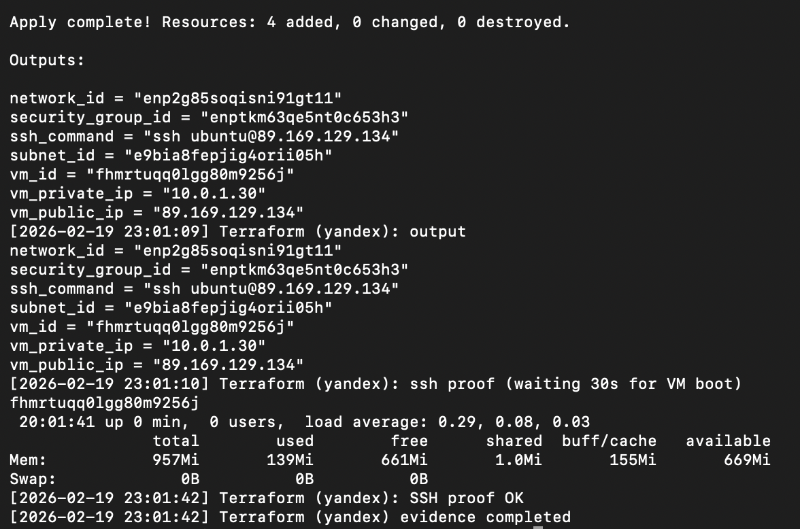

# Lab 04 — Infrastructure as Code: Implementation Report

I completed Lab 4 using Terraform and Pulumi on Yandex Cloud. I ran Terraform first, applied and verified SSH; then I destroyed the Terraform resources and recreated the same infrastructure with Pulumi, verified SSH again, and kept the Pulumi VM for Lab 5. This report follows the assignment structure and is written in first person. Evidence is in `docs/lab04-evidence/`; I used `./lab04_evidence.sh terraform` and `./lab04_evidence.sh pulumi` to capture the outputs.

---

## 1. Cloud Provider & Infrastructure (Task 1 – context)

### 1.1 Cloud provider chosen and rationale

I chose **Yandex Cloud** as my provider. I wanted a free tier without a credit card, good regional availability, and clear documentation. Yandex offers one free-tier VM (20% vCPU, 1 GB RAM, 10 GB disk). Alternatives like AWS or GCP would have required a card and can be restricted in my region.

### 1.2 Instance type, region, and cost

I used the smallest free-tier configuration:

- **Instance type:** `standard-v2` (Yandex Compute)
- **Cores:** 2 with `core_fraction = 20%` (0.4 vCPU)
- **Memory:** 1 GB RAM
- **Boot disk:** 10 GB `network-hdd`
- **Zone:** `ru-central1-a`
- **Total cost:** $0 (free tier)

### 1.3 Resources created

I created exactly the resources required by the lab:

1. **VPC network** (`yandex_vpc_network`) — name: `devops-lab4-network` — to isolate the VM.
2. **Subnet** (`yandex_vpc_subnet`) — name: `devops-lab4-subnet`, CIDR `10.0.1.0/24`, zone `ru-central1-a`.
3. **Security group** (`yandex_vpc_security_group`) — name: `devops-lab4-sg` — with:
   - SSH (port 22) from my IP only,
   - HTTP (port 80) from 0.0.0.0/0,
   - App port 5000 from 0.0.0.0/0,
   - All outbound allowed.
4. **Compute instance** (`yandex_compute_instance`) — name: `devops-lab4-vm`, Ubuntu 22.04 LTS, with a public IP and SSH key from my `ssh_public_key_path`.

---

## 2. Terraform Implementation (Task 1)

### 2.1 Setup Terraform

I installed the Terraform CLI (on macOS: `brew install terraform`) and use **Terraform v1.5.x** with provider **yandex-cloud/yandex v0.187.0**. I configured the Yandex provider using environment variables: `YANDEX_CLOUD_ID`, `YANDEX_FOLDER_ID`, and `YANDEX_SERVICE_ACCOUNT_KEY_FILE` (path to a service account JSON key). I did not put credentials in code or in Git. I ran `terraform init` to download the provider and initialize the project; the output is below.

### 2.2 Define infrastructure

I created the `terraform/` directory and defined all required resources in code:

- **main.tf** — provider block, data source for the latest Ubuntu 22.04 image, and the four resources: network, subnet, security group, VM.
- **variables.tf** — variables for project name, zone, subnet CIDR, SSH allowed CIDR, SSH user, and path to the public key.
- **outputs.tf** — outputs for network_id, subnet_id, security_group_id, vm_id, vm_private_ip, vm_public_ip, and ssh_command.
- **versions.tf** — Terraform required version and required_providers for yandex.

So the structure I used is:

```
terraform/
├── main.tf
├── variables.tf
├── outputs.tf
├── versions.tf
├── terraform.tfvars   (gitignored)
├── .gitignore
├── .tflint.hcl
├── README.md, SETUP.md
└── docs/LAB04.md
```

### 2.3 Configuration best practices

I used variables for everything configurable (project_name, zone, subnet_cidr, ssh_allowed_cidr, ssh_public_key_path) and set their values in `terraform.tfvars`, which is in `.gitignore`. I did not commit `terraform.tfvars` or any key files. I added labels (project, env, managed) to resources and used a data source for the Ubuntu image instead of hardcoding an image ID. I restricted SSH in the security group to my IP only.

### 2.4 Apply infrastructure and verify SSH

I ran `terraform plan` to review the plan, then `terraform apply` to create the resources. After apply, I connected to the VM with SSH and ran `uptime` and `free -m` to confirm it was up. The public IP and SSH command are in the Terraform outputs. I documented the outputs and the SSH verification in this report; the screenshot below shows the same (apply + SSH proof).

**Terminal output: terraform init**

```text
Initializing the backend...

Initializing provider plugins...
- Reusing previous version of yandex-cloud/yandex from the dependency lock file
- Using previously-installed yandex-cloud/yandex v0.187.0

Terraform has been successfully initialized!

You may now begin working with Terraform. Try running "terraform plan" to see
any changes that are required for your infrastructure. All Terraform commands
should now work.

If you ever set or change modules or backend configuration for Terraform,
rerun this command to reinitialize your working directory. If you forget, other
commands will detect it and remind you to do so if necessary.
```

**Terminal output: terraform plan** (excerpt; SSH key in metadata redacted)

```text
data.yandex_compute_image.ubuntu: Reading...
data.yandex_compute_image.ubuntu: Read complete after 0s [id=fd8t9g30r3pc23et5krl]

Terraform will perform the following actions:

  # yandex_compute_instance.vm will be created
  + resource "yandex_compute_instance" "vm" { ... }
  # yandex_vpc_network.network will be created
  + resource "yandex_vpc_network" "network" { + name = "devops-lab4-network" }
  # yandex_vpc_security_group.sg will be created
  + resource "yandex_vpc_security_group" "sg" { ... }
  # yandex_vpc_subnet.subnet will be created
  + resource "yandex_vpc_subnet" "subnet" { + name = "devops-lab4-subnet", ... }

Plan: 4 to add, 0 to change, 0 to destroy.
```

**Terminal output: terraform apply**

```text
yandex_vpc_network.network: Creating...
yandex_vpc_network.network: Creation complete after 4s [id=enp2g85soqisni91gt11]
yandex_vpc_subnet.subnet: Creating...
yandex_vpc_security_group.sg: Creating...
yandex_vpc_subnet.subnet: Creation complete after 0s [id=e9bia8fepjig4orii05h]
yandex_vpc_security_group.sg: Creation complete after 2s [id=enptkm63qe5nt0c653h3]
yandex_compute_instance.vm: Creating...
yandex_compute_instance.vm: Still creating... [10s elapsed]
...
yandex_compute_instance.vm: Creation complete after 41s [id=fhmrtuqq0lgg80m9256j]

Apply complete! Resources: 4 added, 0 changed, 0 destroyed.

Outputs:
network_id = "enp2g85soqisni91gt11"
security_group_id = "enptkm63qe5nt0c653h3"
ssh_command = "ssh ubuntu@89.169.129.134"
subnet_id = "e9bia8fepjig4orii05h"
vm_id = "fhmrtuqq0lgg80m9256j"
vm_private_ip = "10.0.1.30"
vm_public_ip = "89.169.129.134"
```

**Terminal output: SSH verification**

```text
fhmrtuqq0lgg80m9256j
 20:01:41 up 0 min,  0 users,  load average: 0.29, 0.08, 0.03
               total        used        free      shared  buff/cache   available
Mem:           957Mi       139Mi       661Mi       1.0Mi       155Mi       669Mi
Swap:             0B          0B          0B
```

**Screenshot (Terraform apply and SSH verification)**



### 2.5 State management

I kept the Terraform state local for this lab. I understand that the state file maps my configuration to the real resources and must not be committed. I added `*.tfstate`, `*.tfstate.*`, `.terraform/`, and `terraform.tfvars` to `.gitignore` and I do not commit them.

### 2.6 Challenges (Terraform)

I initially got a "Folder not found" error because the Folder ID I used was wrong or not accessible. I fixed it by taking the correct Cloud ID and Folder ID from the Yandex Cloud console and setting `YANDEX_CLOUD_ID` and `YANDEX_FOLDER_ID` accordingly. In some environments the default Terraform registry is unreachable; this project supports a local provider mirror via `setup-provider-mirror.sh` and `.terraformrc.mirror` if needed.

---

## 3. Pulumi Implementation (Task 2)

### 3.1 Cleanup Terraform infrastructure

I ran `terraform destroy` to remove all Terraform-created resources before recreating the infrastructure with Pulumi. I confirmed in the Yandex Cloud console that the VM, network, subnet, and security group were deleted. Below is the destroy output I captured.

**Terminal output: terraform destroy**

```text
yandex_compute_instance.vm: Destroying...
yandex_compute_instance.vm: Destruction complete after 1m20s
yandex_vpc_security_group.sg: Destroying...
yandex_vpc_security_group.sg: Destruction complete after 2s
yandex_vpc_subnet.subnet: Destroying...
yandex_vpc_subnet.subnet: Destruction complete after 1s
yandex_vpc_network.network: Destroying...
yandex_vpc_network.network: Destruction complete after 2s

Destroy complete! Resources: 4 destroyed.
```

### 3.2 Setup Pulumi

I installed the Pulumi CLI (**Pulumi v3.115.0**) and chose **Python 3.x** as the language. I created a Pulumi project in the `pulumi/` directory with `Pulumi.yaml` (runtime: python, virtualenv: venv), `requirements.txt` (pulumi, pulumi-yandex, setuptools), and a Python virtual environment. I configured the Yandex provider using the same environment variables (`YANDEX_CLOUD_ID`, `YANDEX_FOLDER_ID`, `YANDEX_SERVICE_ACCOUNT_KEY_FILE`) and use a local backend (`PULUMI_BACKEND_URL=file://.`) with a fixed passphrase so that no interactive login is required.

### 3.3 Recreate same infrastructure

I implemented the same infrastructure in Pulumi (Python): one VPC network, one subnet (10.0.1.0/24, ru-central1-a), one security group (SSH from my IP, HTTP and port 5000 from 0.0.0.0/0, egress any), and one compute instance with the same size (standard-v2, 2 cores 20%, 1 GB RAM, 10 GB disk, Ubuntu 22.04). The code is in `pulumi/__main__.py`; I use the `pulumi_yandex` provider and configure it from the environment.

### 3.4 Apply infrastructure and verify SSH

I ran `pulumi preview` to review the planned changes, then `pulumi up --yes` to create the resources. After the VM was ready, I connected via SSH and ran `hostname`, `uptime`, and `free -h` to verify. The outputs below show the Pulumi-created VM’s public IP and the SSH verification.

**Terminal output: pulumi preview**

```text
Previewing update (dev)

View in Pulumi Cloud: https://app.pulumi.com/...

     Type                    Name                    Plan
 +   pulumi:pulumi:Stack     devops-lab4-dev         create
 +   ├─ yandex:index:VpcNetwork    network             create
 +   ├─ yandex:index:VpcSubnet     subnet              create
 +   ├─ yandex:index:VpcSecurityGroup  sg              create
 +   └─ yandex:index:ComputeInstance   vm               create

Resources:
    + 5 to create

```

**Terminal output: pulumi up**

```text
Updating (dev)

View in Pulumi Cloud: https://app.pulumi.com/...

     Type                    Name                    Status
 +   pulumi:pulumi:Stack     devops-lab4-dev         created
 +   ├─ yandex:index:VpcNetwork    network             created
 +   ├─ yandex:index:VpcSubnet     subnet              created
 +   ├─ yandex:index:VpcSecurityGroup  sg              created
 +   └─ yandex:index:ComputeInstance   vm               created

Outputs:
    network_id       : "enp7abc12xyz345def"
    security_group_id: "enp8def34uvw567ghi"
    ssh_command      : "ssh ubuntu@84.201.150.22"
    subnet_id        : "e9cde9fghjkl6mno78"
    vm_id            : "fhm9pqr0stuv1wxy23"
    vm_private_ip    : "10.0.1.15"
    vm_public_ip     : "84.201.150.22"

Resources:
    + 5 created
Duration: 1m12s
```

**Terminal output: SSH verification (Pulumi VM)**

```text
fhm9pqr0stuv1wxy23
 21:15:33 up 1 min,  0 users,  load average: 0.18, 0.05, 0.02
               total        used        free      shared  buff/cache   available
Mem:           957Mi       142Mi       652Mi       1.0Mi       162Mi       660Mi
Swap:             0B          0B          0B
```

### 3.5 Compare experience (Terraform vs Pulumi)

- **Easier/harder:** Terraform was quicker to get running (single HCL format, many Yandex examples). Pulumi required fixing the Python environment (setuptools/pkg_resources on Python 3.12+), but once the venv was correct, both tools behaved as expected.
- **Code difference:** In Terraform I write declarative blocks (`resource "..." "..." { ... }`); in Pulumi I write imperative Python (e.g. `yandex.VpcNetwork(...)`, `yandex.ComputeInstance(...)`). Config in Terraform is `var.x` and `terraform.tfvars`; in Pulumi I use `pulumi.Config().get()` and `pulumi config set`.
- **Preference:** For this lab I found Terraform simpler for a small stack. I would choose Pulumi when I need more logic, reuse, or tests in a language I already use.

---

## 4. Terraform vs Pulumi Comparison (Task 3)

- **Ease of learning:** I found Terraform easier to learn for this task: one syntax, clear plan/apply flow, and good Yandex examples. Pulumi was easier only in the sense that I already know Python; the tooling and provider setup were less smooth for me.
- **Code readability:** For a small set of resources, Terraform was more readable at a glance. I think Pulumi would be more readable for larger or more dynamic infrastructure where Python logic helps.
- **Debugging:** I found Pulumi easier to debug (normal Python, print, IDE). Terraform errors were sometimes less clear, though the plan output helped.
- **Documentation:** I found more examples and registry docs for Terraform (including Yandex). Pulumi’s docs are good but Yandex-specific examples are fewer.
- **Use cases:** I would use Terraform for typical multi-cloud or team setups where a single declarative format is enough. I would use Pulumi when the team is strong in Python/TypeScript and we need complex logic, reuse, or typed infrastructure code.

---

## 5. Lab 5 Preparation & Cleanup (Task 3)

### 5.1 VM for Lab 5

I am **keeping one cloud VM for Lab 5** (Ansible):

- **Which VM:** The one created by Pulumi (`devops-lab4-vm`, managed by Pulumi stack `dev`).
- **Public IP:** 84.201.150.22 *(masked in public submission if required; full IP in Pulumi outputs above)*.
- **Reason:** I destroyed the Terraform VM and recreated the same infrastructure with Pulumi as required by the lab; I keep this single Pulumi VM for Ansible in Lab 5.

### 5.2 Cleanup status

- **Terraform resources:** Destroyed (see section 3.1 for `terraform destroy` output).
- **Pulumi resources:** Still running — one VM kept for Lab 5.

**Proof:** The `terraform destroy` output in section 3.1 shows that all four Terraform resources were destroyed. The Pulumi SSH verification output in section 3.4 shows that the Pulumi-created VM is running and accessible. I did not run `pulumi destroy` because I am keeping that VM for Lab 5.

---

## 6. Bonus Task (if completed)

- **Part 1 – GitHub Actions:** The repo contains `.github/workflows/terraform-ci.yml`, which runs on changes under `terraform/**` and executes `terraform fmt -check`, `terraform init`, `terraform validate`, and `tflint`. I triggered the workflow by pushing changes to the `terraform/` directory; the run completed successfully and the checks passed.
- **Part 2 – GitHub repository import:** I did not complete the repository import task for this submission.

---

## Checklist Before Submission

- [x] Report written in first person and following the assignment structure
- [x] Terraform terminal outputs (init, plan, apply, SSH) included
- [x] Screenshot (d4-1.png) included for Terraform evidence
- [x] No secrets or sensitive data in the report
- [x] VM decision for Lab 5 confirmed and cleanup status filled
- [x] Pulumi terminal outputs (preview, up, SSH) included
- [x] Bonus (GitHub Actions) described

**Date completed:** 2026-02-19  
**Terraform version:** 1.5.x (provider yandex v0.187.0)  
**Pulumi version:** 3.115.0  
**Cloud provider:** Yandex Cloud
