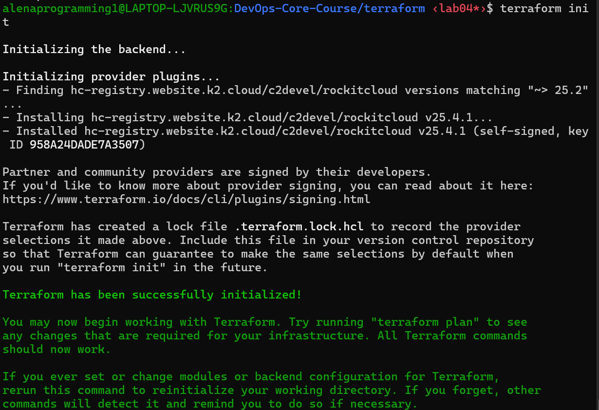
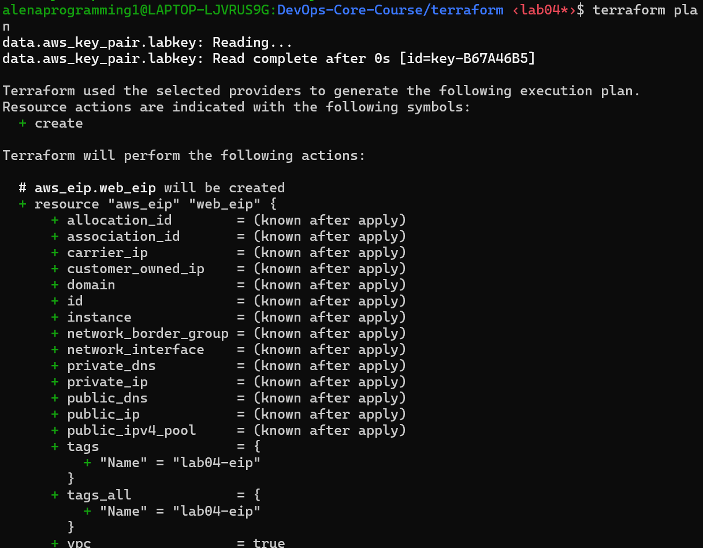
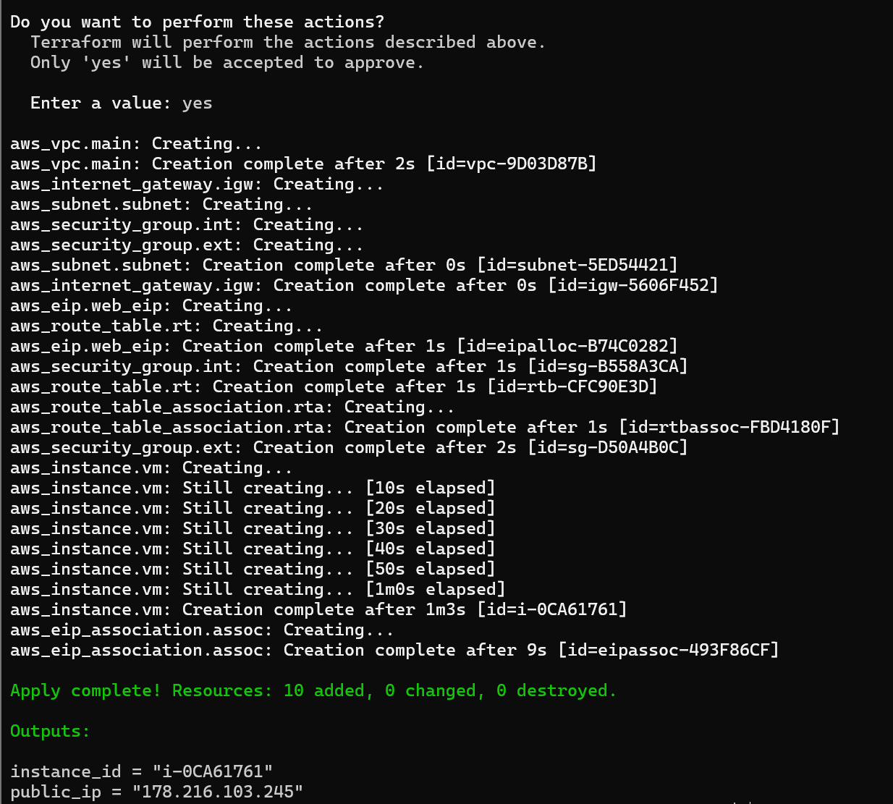
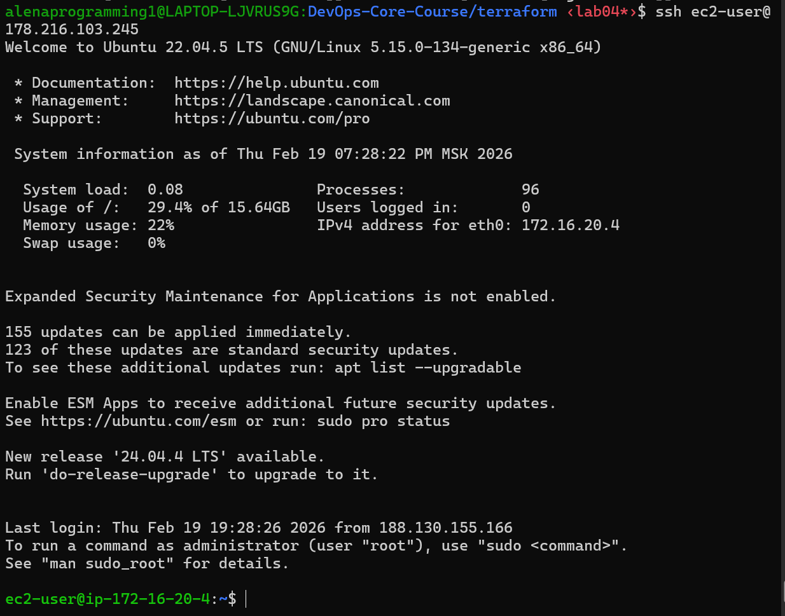
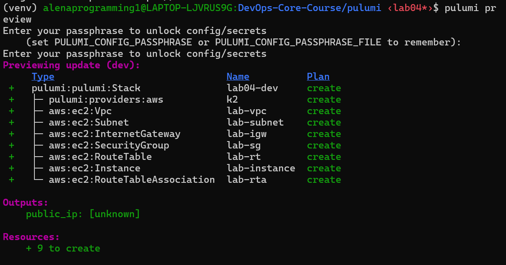
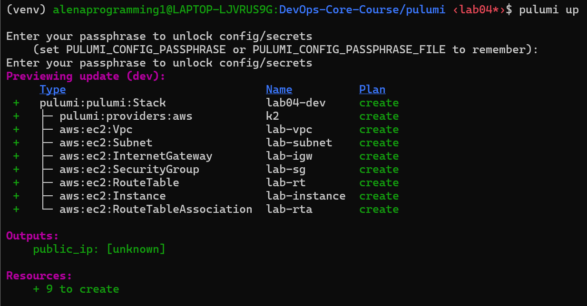
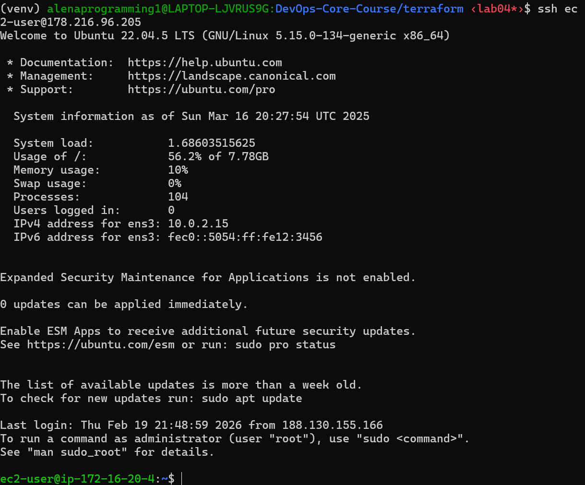

# Lab 4 — Infrastructure as Code (Terraform & Pulumi)

## 1. Cloud provider & rationale

- **Provider chosen:** K2 Cloud (rockitcloud provider). Rationale: I already have access to K2 Cloud resources and have worked with this cloud before, so I chose it for convenience and available quotas.
- **Provider plugin used by Terraform:** `hc-registry.website.k2.cloud/c2devel/rockitcloud v25.4.1` (installed during `terraform init`).
- **Reason for not keeping VM for Lab 5:** No — the VM consumes cloud resources and is easy to recreate from Terraform/Pulumi code when needed.
- **Total cost:** 0 RUB

## 2. Infrastructure summary

- **Instance type:** `m5gl20.small` (used in the example configuration)
- **AMI / Image:** `cmi-21D1D81D` (image identifier used in configuration)
- **VPC CIDR:** `172.16.20.0/24`
- **Subnet:** `172.16.20.0/24` in availability zone `ru-msk-comp1p`
- **Security group rules (summary):**
  - SSH (22) allowed from `188.130.155.166/32` (my IP)
  - HTTP (80) allowed from `0.0.0.0/0`
  - Custom app port (5000) allowed from `0.0.0.0/0`
- **Public IP assigned:** `178.216.103.245`
- **Instance ID (Terraform apply):** `i-0CA61761`

Notes: The security group restricts SSH to my public IP for safety and opens HTTP and port 5000 for testing/deployment of the sample app.

## 3. Terraform implementation (Task 1)

Project structure used for Terraform (example):

```
terraform/
├── main.tf
├── variables.tf
├── outputs.tf
├── terraform.tfvars    # gitignored
├── .gitignore
└── docs/LAB04.md       # this file (copy)
```

Key configuration decisions
- Use variables for region/zone, instance type, image, SSH key name/path
- Create a VPC, subnet, internet gateway, route table and association
- Create two security groups (external and internal) and restrict SSH to my IP
- Create Elastic IP and associate with instance for stable public access

Sanitized terminal outputs captured during my run (kept as examples):

`terraform init`:

```bash
Initializing provider plugins...
- Finding hc-registry.website.k2.cloud/c2devel/rockitcloud versions matching "~> 25.2"...
- Installing hc-registry.website.k2.cloud/c2devel/rockitcloud v25.4.1...
Terraform has been successfully initialized!
```


`terraform plan`:

```bash
terraform plan
data.aws_key_pair.labkey: Reading...
data.aws_key_pair.labkey: Read complete after 0s

Terraform used the selected providers to generate the following execution plan.
Resource actions are indicated with the following symbols:
  + create

Terraform will perform the following actions:

  # aws_eip.web_eip will be created
  + resource "aws_eip" "web_eip" {
      + allocation_id        = (known after apply)
      + association_id       = (known after apply)
      + carrier_ip           = (known after apply)
      + customer_owned_ip    = (known after apply)
      + domain               = (known after apply)
      + id                   = (known after apply)
      + instance             = (known after apply)
      + network_border_group = (known after apply)
      + network_interface    = (known after apply)
      + private_dns          = (known after apply)
      + private_ip           = (known after apply)
      + public_dns           = (known after apply)
      + public_ip            = (known after apply)
      + public_ipv4_pool     = (known after apply)
      + tags                 = {
          + "Name" = "lab04-eip"
        }
      + tags_all             = {
          + "Name" = "lab04-eip"
        }
      + vpc                  = true
    }

  # aws_eip_association.assoc will be created
  + resource "aws_eip_association" "assoc" {
      + allocation_id        = (known after apply)
      + id                   = (known after apply)
      + instance_id          = (known after apply)
      + network_interface_id = (known after apply)
      + private_ip_address   = (known after apply)
      + public_ip            = (known after apply)
    }

  # aws_instance.vm will be created
  + resource "aws_instance" "vm" {
      + affinity                             = (known after apply)
      + ami                                  = "cmi-21D1D81D"
      + arn                                  = (known after apply)
      + associate_public_ip_address          = (known after apply)
      + availability_zone                    = (known after apply)
      + cpu_core_count                       = (known after apply)
      + cpu_threads_per_core                 = (known after apply)
      + disable_api_termination              = (known after apply)
      + ebs_optimized                        = (known after apply)
      + get_password_data                    = false
      + host_id                              = (known after apply)
      + id                                   = (known after apply)
      + instance_initiated_shutdown_behavior = (known after apply)
      + instance_state                       = (known after apply)
      + instance_type                        = "m5gl20.small"
      + ipv6_address_count                   = (known after apply)
      + ipv6_addresses                       = (known after apply)
      + key_name                             = "id_rsa"
      + monitoring                           = (known after apply)
      + outpost_arn                          = (known after apply)
      + password_data                        = (known after apply)
      + placement_group                      = (known after apply)
      + placement_partition_number           = (known after apply)
      + primary_network_interface_id         = (known after apply)
      + private_dns                          = (known after apply)
      + private_ip                           = (known after apply)
      + public_dns                           = (known after apply)
      + public_ip                            = (known after apply)
      + secondary_private_ips                = (known after apply)
      + security_groups                      = (known after apply)
      + source_dest_check                    = true
      + subnet_id                            = (known after apply)
      + tags                                 = {
          + "Name" = "lab04-vm"
        }
      + tags_all                             = {
          + "Name" = "lab04-vm"
        }
      + tenancy                              = (known after apply)
      + user_data                            = (known after apply)
      + user_data_base64                     = (known after apply)
      + user_data_replace_on_change          = false
      + vpc_security_group_ids               = (known after apply)

      + root_block_device {
          + delete_on_termination = true
          + device_name           = (known after apply)
          + encrypted             = (known after apply)
          + iops                  = (known after apply)
          + kms_key_id            = (known after apply)
          + throughput            = (known after apply)
          + volume_id             = (known after apply)
          + volume_size           = 10
          + volume_type           = "gp2"
        }
    }

  # aws_internet_gateway.igw will be created
  + resource "aws_internet_gateway" "igw" {
      + arn      = (known after apply)
      + id       = (known after apply)
      + owner_id = (known after apply)
      + tags     = {
          + "Name" = "lab04-igw"
        }
      + tags_all = {
          + "Name" = "lab04-igw"
        }
      + vpc_id   = (known after apply)
    }

  # aws_route_table.rt will be created
  + resource "aws_route_table" "rt" {
      + arn              = (known after apply)
      + id               = (known after apply)
      + owner_id         = (known after apply)
      + propagating_vgws = (known after apply)
      + route            = [
          + {
              + carrier_gateway_id         = ""
              + cidr_block                 = "0.0.0.0/0"
              + core_network_arn           = ""
              + destination_prefix_list_id = ""
              + egress_only_gateway_id     = ""
              + gateway_id                 = (known after apply)
              + instance_id                = ""
              + ipv6_cidr_block            = ""
              + local_gateway_id           = ""
              + nat_gateway_id             = ""
              + network_interface_id       = ""
              + transit_gateway_id         = ""
              + vpc_endpoint_id            = ""
              + vpc_peering_connection_id  = ""
            },
        ]
      + tags             = {
          + "Name" = "lab04-rt"
        }
      + tags_all         = {
          + "Name" = "lab04-rt"
        }
      + vpc_id           = (known after apply)
    }

  # aws_route_table_association.rta will be created
  + resource "aws_route_table_association" "rta" {
      + id             = (known after apply)
      + route_table_id = (known after apply)
      + subnet_id      = (known after apply)
    }

  # aws_security_group.ext will be created
  + resource "aws_security_group" "ext" {
      + arn                    = (known after apply)
      + description            = "Allow SSH/HTTP/custom"
      + egress                 = [
          + {
              + cidr_blocks      = [
                  + "0.0.0.0/0",
                ]
              + description      = ""
              + from_port        = 0
              + ipv6_cidr_blocks = []
              + prefix_list_ids  = []
              + protocol         = "-1"
              + security_groups  = []
              + self             = false
              + to_port          = 0
            },
        ]
      + id                     = (known after apply)
      + ingress                = [
          + {
              + cidr_blocks      = [
                  + "0.0.0.0/0",
                ]
              + description      = ""
              + from_port        = 5000
              + ipv6_cidr_blocks = []
              + prefix_list_ids  = []
              + protocol         = "tcp"
              + security_groups  = []
              + self             = false
              + to_port          = 5000
            },
          + {
              + cidr_blocks      = [
                  + "0.0.0.0/0",
                ]
              + description      = ""
              + from_port        = 80
              + ipv6_cidr_blocks = []
              + prefix_list_ids  = []
              + protocol         = "tcp"
              + security_groups  = []
              + self             = false
              + to_port          = 80
            },
          + {
              + cidr_blocks      = [
                  + "188.130.155.166/32",
                ]
              + description      = ""
              + from_port        = 22
              + ipv6_cidr_blocks = []
              + prefix_list_ids  = []
              + protocol         = "tcp"
              + security_groups  = []
              + self             = false
              + to_port          = 22
            },
        ]
      + name                   = "lab04-ext"
      + name_prefix            = (known after apply)
      + owner_id               = (known after apply)
      + revoke_rules_on_delete = false
      + tags                   = {
          + "Name" = "lab04-ext-sg"
        }
      + tags_all               = {
          + "Name" = "lab04-ext-sg"
        }
      + vpc_id                 = (known after apply)
    }

  # aws_security_group.int will be created
  + resource "aws_security_group" "int" {
      + arn                    = (known after apply)
      + description            = "Managed by Terraform"
      + egress                 = [
          + {
              + cidr_blocks      = [
                  + "0.0.0.0/0",
                ]
              + description      = ""
              + from_port        = 0
              + ipv6_cidr_blocks = []
              + prefix_list_ids  = []
              + protocol         = "-1"
              + security_groups  = []
              + self             = false
              + to_port          = 0
            },
        ]
      + id                     = (known after apply)
      + ingress                = (known after apply)
      + name                   = "lab04-int"
      + name_prefix            = (known after apply)
      + owner_id               = (known after apply)
      + revoke_rules_on_delete = false
      + tags                   = {
          + "Name" = "lab04-int-sg"
        }
      + tags_all               = {
          + "Name" = "lab04-int-sg"
        }
      + vpc_id                 = (known after apply)
    }

  # aws_subnet.subnet will be created
  + resource "aws_subnet" "subnet" {
      + arn                                            = (known after apply)
      + assign_ipv6_address_on_creation                = false
      + availability_zone                              = "ru-msk-comp1p"
      + availability_zone_id                           = (known after apply)
      + cidr_block                                     = "172.16.20.0/24"
      + enable_dns64                                   = false
      + enable_resource_name_dns_a_record_on_launch    = false
      + enable_resource_name_dns_aaaa_record_on_launch = false
      + id                                             = (known after apply)
      + ipv6_cidr_block_association_id                 = (known after apply)
      + ipv6_native                                    = false
      + map_public_ip_on_launch                        = false
      + owner_id                                       = (known after apply)
      + private_dns_hostname_type_on_launch            = (known after apply)
      + tags                                           = {
          + "Name" = "lab04-subnet"
        }
      + tags_all                                       = {
          + "Name" = "lab04-subnet"
        }
      + vpc_id                                         = (known after apply)
    }

  # aws_vpc.main will be created
  + resource "aws_vpc" "main" {
      + arn                                  = (known after apply)
      + cidr_block                           = "172.16.20.0/24"
      + default_network_acl_id               = (known after apply)
      + default_route_table_id               = (known after apply)
      + default_security_group_id            = (known after apply)
      + dhcp_options_id                      = (known after apply)
      + enable_classiclink                   = (known after apply)
      + enable_classiclink_dns_support       = (known after apply)
      + enable_dns_hostnames                 = (known after apply)
      + enable_dns_support                   = true
      + id                                   = (known after apply)
      + instance_tenancy                     = "default"
      + ipv6_association_id                  = (known after apply)
      + ipv6_cidr_block                      = (known after apply)
      + ipv6_cidr_block_network_border_group = (known after apply)
      + main_route_table_id                  = (known after apply)
      + owner_id                             = (known after apply)
      + tags                                 = {
          + "Name" = "lab04-vpc"
        }
      + tags_all                             = {
          + "Name" = "lab04-vpc"
        }
    }

Plan: 10 to add, 0 to change, 0 to destroy.

Changes to Outputs:
  + instance_id = (known after apply)
  + public_ip   = (known after apply)
```


`terraform apply` (key parts, sanitized):

```bash
Do you want to perform these actions?
  Terraform will perform the actions described above.
  Only 'yes' will be accepted to approve.

  Enter a value: yes

aws_vpc.main: Creating...
aws_vpc.main: Creation complete after 2s [id=vpc-9D03D87B]
aws_internet_gateway.igw: Creating...
aws_subnet.subnet: Creating...
aws_security_group.int: Creating...
aws_security_group.ext: Creating...
aws_subnet.subnet: Creation complete after 0s [id=subnet-5ED54421]
aws_internet_gateway.igw: Creation complete after 0s [id=igw-5606F452]
aws_eip.web_eip: Creating...
aws_route_table.rt: Creating...
aws_eip.web_eip: Creation complete after 1s [id=eipalloc-B74C0282]
aws_security_group.int: Creation complete after 1s [id=sg-B558A3CA]
aws_route_table.rt: Creation complete after 1s [id=rtb-CFC90E3D]
aws_route_table_association.rta: Creating...
aws_route_table_association.rta: Creation complete after 1s [id=rtbassoc-FBD4180F]
aws_security_group.ext: Creation complete after 2s [id=sg-D50A4B0C]
aws_instance.vm: Creating...
aws_instance.vm: Still creating... [10s elapsed]
aws_instance.vm: Still creating... [20s elapsed]
aws_instance.vm: Still creating... [30s elapsed]
aws_instance.vm: Still creating... [40s elapsed]
aws_instance.vm: Still creating... [50s elapsed]
aws_instance.vm: Still creating... [1m0s elapsed]
aws_instance.vm: Creation complete after 1m3s [id=i-0CA61761]
aws_eip_association.assoc: Creating...
aws_eip_association.assoc: Creation complete after 9s [id=eipassoc-493F86CF]

Apply complete! Resources: 10 added, 0 changed, 0 destroyed.

Outputs:

instance_id = "i-0CA61761"
public_ip = "178.216.103.245"
```


SSH connection:


Challenges encountered:  
While working with Terraform, the main challenge was configuring the custom K2 Cloud provider (rockitcloud) correctly. Since it is not the official AWS provider, some parameters and endpoints required careful adjustment. Additionally, debugging provider-related issues was sometimes difficult due to limited documentation compared to standard AWS resources.

Destroying (key parts):
```bash
Enter a value: yes

aws_route_table_association.rta: Destroying... [id=rtbassoc-5BCCD6B9]
aws_eip_association.assoc: Destroying... [id=eipassoc-E02253D6]
aws_route_table_association.rta: Destruction complete after 0s
aws_route_table.rt: Destroying... [id=rtb-3848C7D8]
aws_route_table.rt: Destruction complete after 1s
aws_eip_association.assoc: Destruction complete after 10s
aws_eip.web_eip: Destroying... [id=eipalloc-535E689D]
aws_instance.vm: Destroying... [id=i-E0BFB7A1]
aws_eip.web_eip: Destruction complete after 0s
aws_internet_gateway.igw: Destroying... [id=igw-823B5EC5]
aws_internet_gateway.igw: Destruction complete after 1s
aws_instance.vm: Still destroying... [id=i-E0BFB7A1, 10s elapsed]
aws_instance.vm: Destruction complete after 10s
aws_security_group.int: Destroying... [id=sg-26C32415]
aws_subnet.subnet: Destroying... [id=subnet-9FC71801]
aws_security_group.ext: Destroying... [id=sg-37922CBD]
aws_security_group.ext: Destruction complete after 1s
aws_security_group.int: Destruction complete after 1s
aws_subnet.subnet: Destruction complete after 1s
aws_vpc.main: Destroying... [id=vpc-AAB62A00]
aws_vpc.main: Destruction complete after 1s

Destroy complete! Resources: 10 destroyed.
```

## 4. Pulumi implementation (Task 2)

I recreated the same infrastructure using Pulumi (Python). The Pulumi project created equivalent resources: VPC, subnet, IGW, route table, security groups, instance, Elastic IP and association.

Pulumi commands and outputs (captured):

`pulumi preview`:

```bash
pulumi preview
Enter your passphrase to unlock config/secrets
    (set PULUMI_CONFIG_PASSPHRASE or PULUMI_CONFIG_PASSPHRASE_FILE to remember):
Enter your passphrase to unlock config/secrets
Previewing update (dev):
     Type                              Name          Plan
 +   pulumi:pulumi:Stack               lab04-dev     create
 +   ├─ pulumi:providers:aws           k2            create
 +   ├─ aws:ec2:Vpc                    lab-vpc       create
 +   ├─ aws:ec2:Subnet                 lab-subnet    create
 +   ├─ aws:ec2:InternetGateway        lab-igw       create
 +   ├─ aws:ec2:SecurityGroup          lab-sg        create
 +   ├─ aws:ec2:RouteTable             lab-rt        create
 +   ├─ aws:ec2:Instance               lab-instance  create
 +   └─ aws:ec2:RouteTableAssociation  lab-rta       create

Outputs:
    public_ip: [unknown]

Resources:
    + 9 to create
```


`pulumi up` (key parts):

```bash
Do you want to perform this update? yes
Updating (dev):

Resources:
    + 9 created

Outputs:
  + public_ip: "178.216.96.205"

Duration: 1m12s
```


SSH connection:


Notes about Pulumi:  
- Pulumi uses an imperative language (Python) which allowed me to use normal programming constructs for configuration. The resulting infrastructure is functionally identical to the Terraform-managed one.
- Pulumi stores state in the Pulumi backend by default (local or Pulumi Cloud). Secrets are encrypted when stored with Pulumi's encryption.

How the code differs from Terraform:  
Pulumi uses a general-purpose programming language (Python in this case) instead of declarative HCL syntax. Infrastructure resources are defined as objects in code, allowing the use of variables, logic, loops, and functions. Unlike Terraform’s static configuration blocks, Pulumi provides more flexibility through imperative constructs.  

Advantages discovered:  
One major advantage of Pulumi is the ability to use full programming language features, such as conditional statements and reusable functions. IDE support, type hints, and autocomplete significantly improve developer experience. It also feels more natural for developers with a programming background.  

Challenges encountered:  
The main difficulty with Pulumi was provider compatibility. Since K2 Cloud uses a custom Terraform provider, ensuring compatibility with the official Pulumi AWS provider required additional troubleshooting. Version mismatches and API differences caused errors that needed careful debugging.  

Destroying (key parts):
```bash
Do you want to perform this destroy? yes
Destroying (dev):

     Type                                Name               Status

Resources:
    - 9 deleted

Duration: 58s
```

## 5. Terraform vs Pulumi — brief comparison

- **Ease of learning:** Terraform is straightforward for simple resource declarations with HCL; Pulumi requires some programming background but provides flexibility with a general-purpose language.
- **Code readability:** HCL (Terraform) is very readable for infrastructure authors; Pulumi code can be equally readable but depends on the language and style used.
- **Debugging:** Pulumi allows standard debugger and unit test workflows; Terraform debugging relies on plan outputs, logging, and external testing tools.
- **Documentation & examples:** Both have good docs; Terraform has more ecosystem examples, Pulumi has richer examples in language SDKs.
- **Use case:** Use Terraform for team-wide declarative infrastructure with wide community modules. Use Pulumi when you want programmatic logic, complex abstractions, or to reuse existing programming libraries. Since I got used to use Terraform, it was easier to me.

## 6. Lab 5 preparation & cleanup

- Keeping VM for Lab 5: No — I destroyed the cloud VM because it consumes resources and can be recreated with Terraform/Pulumi when needed.
- Lab5 plan: For Lab 5, I plan to re-deploy the infrastructure using Terraform/Pulumi immediately before doing the work, using the saved code.
