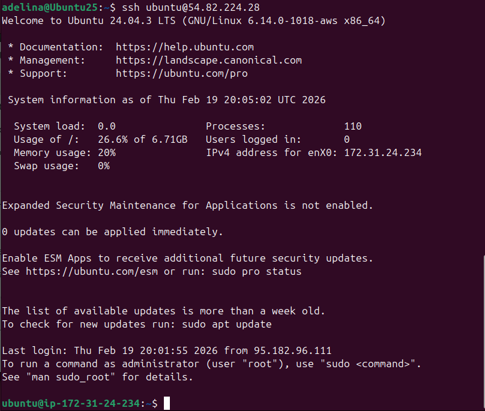

# Lab 04 — Infrastructure as Code (Terraform & Pulumi)

## 1. Cloud Provider & Infrastructure

| Item | Details |
|------|---------|
| **Cloud Provider** | AWS (Amazon Web Services) |
| **Rationale** | Global availability, extensive free tier (750 h/month t2.micro for 12 months), mature Terraform & Pulumi provider support, and rich documentation. |
| **Instance Type** | `t2.micro` (1 vCPU, 1 GiB RAM) — free-tier eligible |
| **Region / AZ** | `us-east-1` / `us-east-1a` |
| **OS Image** | Ubuntu 24.04 LTS (Noble) — latest AMI via data source |
| **Estimated Cost** | $0 (free tier) |

### Resources Created

- VPC (`10.0.0.0/16`) with DNS support
- Public subnet (`10.0.1.0/24`, auto-assign public IP)
- Internet Gateway
- Route Table (default route → IGW)
- Security Group (SSH 22, HTTP 80, app 5000, egress all)
- SSH Key Pair (from provided public key)
- EC2 Instance (`t2.micro`, Ubuntu 24.04)

---

## 2. Terraform Implementation

**Terraform version:** >= 1.9.0
**AWS provider:** ~> 5.0

### Project Structure

```
terraform/
├── main.tf          # Provider, networking, security group, AMI data source, key pair, EC2
├── variables.tf     # region, availability_zone, instance_type, ssh_public_key, allowed_ssh_cidr
├── outputs.tf       # public_ip, ssh_command
└── terraform.tfvars # (gitignored) actual variable values
```

### Key Configuration Decisions

- **Variables for all configurable values** — region, AZ, instance type, SSH key, and allowed CIDR are parameterised so the same configuration works across environments.
- **Data source for AMI** — `aws_ami` with `most_recent = true` ensures the latest Ubuntu 24.04 image is always selected without hard-coding an AMI ID.
- **SSH restricted by CIDR** — the `allowed_ssh_cidr` variable lets each user lock SSH down to their own IP.
- **Sensitive flag** on `ssh_public_key` prevents it from appearing in plan output.

### Commands & Workflow

```bash
# Initialise providers
terraform init

# Preview changes
terraform plan

# Apply infrastructure
terraform apply

# Verify SSH access
ssh ubuntu@54.82.224.28
```



### Challenges Encountered

- Finding the correct AMI owner ID (`099720109477` for Canonical) and name filter required consulting the AWS AMI documentation.
- Ensuring the subnet has `map_public_ip_on_launch = true` so the instance gets a public IP without an Elastic IP.

---

## 3. Pulumi Implementation

**Pulumi runtime:** Python 3
**Provider package:** `pulumi-aws >= 6.0`

### Project Structure

```
pulumi/
├── __main__.py        # All infrastructure resources
├── Pulumi.yaml        # Project metadata (name, runtime)
├── Pulumi.dev.yaml    # Stack config: region, SSH key, CIDR (gitignored)
├── requirements.txt   # Python dependencies
└── venv/              # Virtual environment (gitignored)
```

### How the Code Differs from Terraform

The Pulumi program (`__main__.py`) creates the exact same resources as Terraform but uses Python instead of HCL:

| Aspect | Terraform | Pulumi |
|--------|-----------|--------|
| **Resource declaration** | `resource "aws_instance" "this" { … }` | `aws.ec2.Instance("lab04-vm", …)` |
| **Variables** | `variable` block + `var.region` | `pulumi.Config().require("key")` |
| **Outputs** | `output "public_ip" { value = … }` | `pulumi.export("public_ip", …)` |
| **Data sources** | `data "aws_ami" "ubuntu" { … }` | `aws.ec2.get_ami(…)` |
| **Secrets** | `sensitive = true` on variable | `config.require_secret()` — encrypted in state |

### Commands & Workflow

```bash
# Create virtual environment & install deps
cd pulumi/
python3 -m venv venv
source venv/bin/activate
pip install -r requirements.txt

# Set stack configuration
pulumi config set aws:region us-east-1
pulumi config set allowedSshCidr "188.130.155.177/32"
pulumi config set --secret sshPublicKey "54.82.224.28"

# Preview changes (equivalent to terraform plan)
pulumi preview

# Deploy infrastructure
pulumi up

# Verify SSH access
ssh ubuntu@54.82.224.28
```

### Advantages Discovered

- Full IDE auto-complete and type checking for resource arguments.
- Secrets are encrypted in state by default — no extra configuration needed.
- String interpolation and `.apply()` make dynamic outputs natural.
- Standard Python tooling (linting, testing) works out of the box.

### Challenges Encountered

- Learning Pulumi's `Args` classes (`SecurityGroupIngressArgs`, `RouteTableRouteArgs`) takes some getting used to compared to HCL's inline blocks.
- The `get_ami` data source is a synchronous call (not a resource) — a minor conceptual difference from Terraform's `data` block.

---

## 4. Terraform vs Pulumi Comparison

**Ease of Learning:**
Terraform was easier to pick up initially because HCL is purpose-built for infrastructure and the syntax is very readable even without prior experience. Pulumi requires familiarity with the chosen programming language and its SDK conventions.

**Code Readability:**
For a small project like this, Terraform's declarative HCL is slightly more readable — each resource is self-contained. However, as complexity grows, Pulumi's Python code would scale better with functions, classes, and loops.

**Debugging:**
Pulumi was easier to debug because Python stack traces point directly to the offending line, and you can insert `print()` statements. Terraform errors sometimes require cross-referencing between resource blocks.

**Documentation:**
Terraform has a larger community and more examples available online. Pulumi's documentation is well-organised but there are fewer community blog posts and Stack Overflow answers.

**Use Case:**
I would use Terraform for straightforward infrastructure provisioning where the declarative model fits naturally. I would choose Pulumi when the infrastructure logic requires complex conditionals, loops, or reuse across many environments — situations where a real programming language shines.

---

## 5. Lab 5 Preparation & Cleanup

| Question | Answer |
|----------|--------|
| Keeping VM for Lab 5? | No |
| Plan for Lab 5 | Will recreate cloud VM using the existing Terraform / Pulumi code |

### Cleanup

```bash
# Destroy Terraform resources
terraform destroy

# Destroy Pulumi resources
pulumi destroy
```

Both tools' resources have been destroyed after testing. The Terraform and Pulumi code is committed so that infrastructure can be recreated at any time for Lab 5 with a single `terraform apply` or `pulumi up`.
